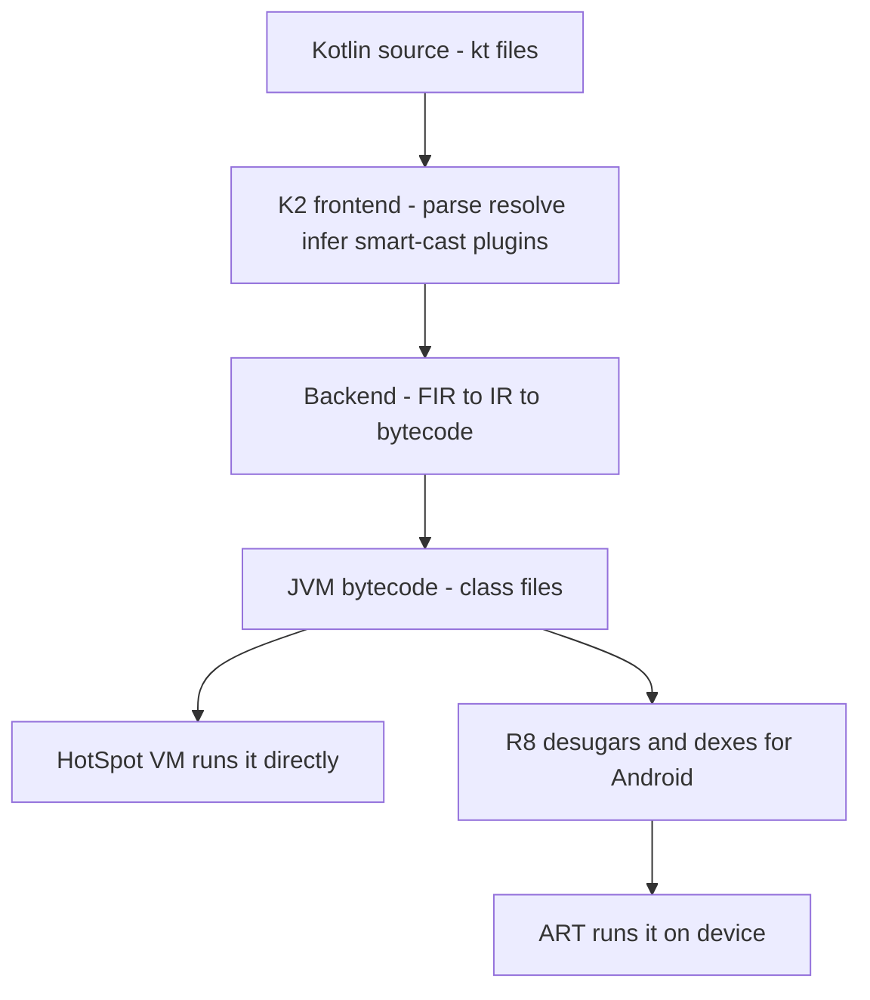
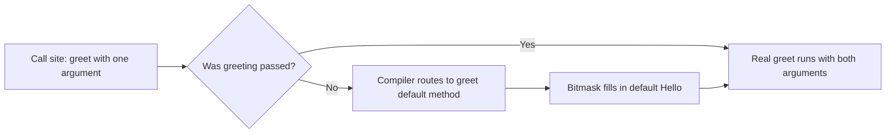

# Lecture 1 — Kotlin 2.x and the K2 compiler: what the language is, and what the bytecode proves

> "Kotlin is a language that compiles to bytecode. Everything it gives you — null safety, data classes, expressions — is a transformation the compiler applies on the way down to the JVM. If you can read the bytecode, you can never be fooled by the syntax."

This is the lecture that turns Kotlin from "a nicer Java" into "a language I understand from the source down to the `.class` file." We are going to build the mental model top-down: first what the compiler is (K2), then the language features you write (top-level functions, expressions, inference, `val`/`var`), and finally the bytecode each one produces. By the end you should be able to take a five-line Kotlin file, predict what `javap -c` will show, and be right.

Hold one framing for the whole week: **Kotlin is a JVM language with a smart compiler, not a runtime trick.** Almost everything that feels magical — a `data class` that "just has" `equals`, a top-level function with no class around it, a default argument — is the compiler generating ordinary JVM bytecode you could have written by hand. There is no Kotlin runtime interpreting your code; there is `kotlin-stdlib.jar` (a normal library) and bytecode the JVM runs directly. That fact is your superpower this week.

---

## 1. The stack, drawn once so we never argue about it again

Here is what happens to a `.kt` file, top to bottom:

```text
┌─────────────────────────────────────────────────────────────┐
│  Your Kotlin source (.kt files)                              │
│    fun main() { ... }   val x = 5   data class Note(...)     │
├─────────────────────────────────────────────────────────────┤
│  The Kotlin compiler — FRONTEND (this is K2)                 │
│    parse -> build FIR -> resolve names -> infer types ->     │
│    smart-cast analysis -> run compiler plugins (Compose!)    │
├─────────────────────────────────────────────────────────────┤
│  The Kotlin compiler — BACKEND                               │
│    FIR -> IR -> JVM bytecode generation                      │
├─────────────────────────────────────────────────────────────┤
│  JVM bytecode (.class files)                                 │
│    invokestatic, getstatic, if_acmpeq, ... + kotlin-stdlib   │
├─────────────────────────────────────────────────────────────┤
│  On the JVM: the HotSpot VM runs the .class files            │
│  On Android: R8 desugars + dexes .class -> .dex, ART runs it │
└─────────────────────────────────────────────────────────────┘
```

This week we stay on the plain-JVM path (the second-from-bottom row) because the bytecode is clean there. Week 6 adds the Android-specific bottom row — R8, dexing, ART — but the language and the bytecode above it are identical. The Kotlin you write compiles to the same `.class` files whether the final target is a server JAR or an APK.

**Why does this matter to you?** Because when something surprises you — a smart cast the compiler refuses, an equality result you didn't expect, a `data class` `copy` you didn't know existed — the answer is always "what bytecode did this generate?" And `javap` answers it in one command. You are not at the mercy of the syntax; you can always go look.


*The same bytecode either runs straight on the JVM or gets desugared and dexed for Android.*

---

## 2. K2 — the frontend, in conceptual terms

In 2024, Kotlin 2.0 shipped with **K2** as the default compiler. K2 is a from-scratch rewrite of the compiler's **frontend** — the half that *understands* your code (parsing, name resolution, type inference, smart-cast analysis, diagnostics) — as opposed to the **backend** that *emits* bytecode. The old frontend had grown organically since 2011 and shared logic awkwardly between the compiler and the IDE; K2 unifies that around a clean intermediate representation called **FIR** (Frontend Intermediate Representation).

You will never write "K2 code." K2 is machinery. But three of its consequences matter to you as an Android engineer in 2026:

1. **Faster compilation.** The frontend is where most of a clean build's analysis time goes, and K2 is substantially faster on large modules. On a multi-module Android app this is the difference between a build you wait through and a build you don't notice.

2. **More precise smart casts.** K2's data-flow analysis is sharper than the old frontend's. Some smart casts that the old compiler refused (because it couldn't prove they were safe) now work. We hit the exact boundaries in lecture 2; the point here is that "K2 is smarter about narrowing types" is a real, observable improvement.

3. **A stable plugin pipeline.** Compiler plugins hook into the frontend. The single most important one for you is the **Compose compiler plugin**, which rewrites your `@Composable` functions. As of Kotlin 2.0 the Compose compiler is versioned *together with* Kotlin and ships from the Kotlin repository — a direct consequence of K2 stabilizing the plugin API. When you reach Phase 2 and write Compose, that plugin is running in the frontend slot the diagram above shows. We introduce K2 in Week 1 precisely so that, when Compose's "magic" shows up in Week 7, you already know where the magic lives: it is a compiler plugin in the frontend, not a runtime.

The practical takeaway for this week: when you read a Kotlin 2.2 release note that says "improved smart casts" or "context parameters are now in preview," that work happened in K2/FIR. You don't configure it; you benefit from it. Know the word **FIR**, know that the **frontend** does analysis and the **backend** emits bytecode, and know that **plugins run in the frontend** — that is the whole conceptual model you need.

---

## 3. Top-level functions — and what they compile to

The first thing that looks alien coming from Java: a function that lives in a file with no class around it.

```kotlin
// File: Strings.kt, package com.crunch.util
package com.crunch.util

fun slugify(input: String): String =
    input.trim().lowercase().replace(Regex("\\s+"), "-")
```

There is no `class Strings`, no `static`, no enclosing anything. `slugify` is a **top-level function**. In Java you would have written a `final class StringUtils` with a `private` constructor and a `public static String slugify(...)`. Kotlin lets you skip the ceremony.

But the JVM has no concept of a function outside a class. So what does this compile to? The compiler generates a class named after the file with a `Kt` suffix — `StringsKt` — and makes `slugify` a `public static` method on it:

```bash
$ kotlinc Strings.kt -d out.jar
$ javap -c -p out/com/crunch/util/StringsKt.class
```

```text
public final class com.crunch.util.StringsKt {
  public static final java.lang.String slugify(java.lang.String);
    Code:
       // ... invokes trim, lowercase, replace ...
       areturn
}
```

So a top-level function is **a `static` method on a synthesized `FileNameKt` class.** This is why, from Java, you call it as `StringsKt.slugify("...")`. It is also why top-level functions are the idiomatic replacement for Java utility classes: they compile to *exactly* a utility class, but you didn't have to type the class, the `final`, the private constructor, or the `static`. Same bytecode, less ceremony. (You can rename the generated class with a `@file:JvmName("StringUtils")` annotation if Java callers need a nicer name — useful when you ship a library.)

Top-level **properties** work the same way: a `val MAX_RETRIES = 3` at file scope becomes a `static final` field (with a getter) on the `FileNameKt` class. A `const val` (a compile-time constant of a primitive or `String` type) is inlined at the call site, exactly like a Java `static final` constant — `javap` shows the literal baked into the bytecode, no field access at all.

---

## 4. Expressions over statements — the central idiom

The single biggest stylistic difference between Kotlin and Java is that in Kotlin, **control-flow constructs are expressions that return values.** An `if` returns a value. A `when` returns a value. A `try` returns a value. This changes how you structure code.

### `if` is an expression

```kotlin
// Java-in-Kotlin (a statement assigning to a pre-declared var):
fun gradeBad(score: Int): String {
    var grade: String
    if (score >= 90) {
        grade = "A"
    } else if (score >= 80) {
        grade = "B"
    } else {
        grade = "C"
    }
    return grade
}

// Idiomatic Kotlin (if as an expression):
fun grade(score: Int): String =
    if (score >= 90) "A"
    else if (score >= 80) "B"
    else "C"
```

The second version has no `var`, no reassignment, and no separate `return`. The `if` *is* the value the function returns. Because there is no mutable variable, there is no possibility of "I forgot to assign `grade` in one branch" — the compiler requires every branch to produce a value, and an `if` used as an expression must have an `else`.

### `when` is an expression (and the workhorse)

`when` is Kotlin's `switch`, but far more capable, and it is an expression:

```kotlin
fun describe(x: Any): String = when (x) {
    0 -> "zero"
    is Int -> "an int: $x"           // smart-cast to Int in this branch
    is String -> "a string of length ${x.length}"  // smart-cast to String
    in 1..9 -> "a small number"      // range check
    else -> "something else"
}
```

Several things are happening that we will return to:

- `when` matches on value (`0`), on type (`is Int`), and on range (`in 1..9`).
- Inside `is Int ->`, `x` is smart-cast to `Int` (lecture 2).
- Used as an expression, `when` must be **exhaustive** — every possible input must be covered, which is why this one has an `else`. Next week, `when` over a sealed type lets you *drop* the `else` and have the compiler enforce exhaustiveness for you. That is one of the most important guarantees in the language and the whole point of Week 2's sealed types.

### `try` is an expression

```kotlin
val port: Int = try {
    System.getenv("PORT").toInt()
} catch (e: NumberFormatException) {
    8080
}
```

The `try` block's value (or the `catch` block's, on failure) becomes the value of `port`. No pre-declared `var`, no assignment in two places.

### Single-expression function bodies

When a function body is a single expression, drop the braces and the `return` and use `=`:

```kotlin
fun square(n: Int) = n * n                       // return type inferred: Int
fun isAdult(age: Int): Boolean = age >= 18       // explicit return type (good for public API)
fun greeting(name: String) = "Hello, $name!"
```

This is not a cosmetic nicety; it is the dominant function shape in idiomatic Kotlin. When you scan a well-written Kotlin file, most functions are `fun name(args) = oneExpression`. A block body with a `return` is the exception, reserved for genuinely multi-step logic.

**The discipline:** reach for expressions. If you find yourself declaring a `var`, doing an `if`/`else` to assign it, and then returning it, you wrote a statement where an expression belongs. Refactor it. Exercise 3 is nothing but this refactor, repeated until it's reflexive.

---

## 5. Type inference — where Kotlin infers and where you annotate

Kotlin infers types aggressively. You rarely write a type on a local `val`:

```kotlin
val count = 5                    // Int
val name = "Ada"                 // String
val ratio = 3.0 / 4              // Double
val items = listOf(1, 2, 3)      // List<Int>
val pairs = mapOf("a" to 1)      // Map<String, Int>
```

The compiler reads the right-hand side and assigns the most specific type. This is **local type inference** — it works within a function body and for property initializers. It does *not* read your mind across function boundaries: a function's parameter types are always explicit (the compiler will not infer them from call sites), and a function's return type is inferred only when the body is a single expression or the compiler can determine it directly.

Three rules to internalize:

1. **Local `val`/`var`: infer freely.** `val x = compute()` is idiomatic; writing `val x: ResultType = compute()` is noise unless you specifically want to widen the type (e.g. declare it as a supertype).

2. **Public API: annotate return types on purpose.** For a function exposed from a library or module, write the return type explicitly even when it could be inferred:

   ```kotlin
   // Library API — explicit return type is a contract, not noise.
   fun parseConfig(raw: String): Config = Config.from(raw)
   ```

   The reason is binary compatibility and clarity: if you let the return type be inferred and later change the implementation in a way that changes the inferred type, you silently change your public signature. An explicit return type makes the contract a deliberate decision the compiler enforces. The Kotlin coding conventions and every serious library follow this.

3. **Inference flows through generics — and has limits.** `val list = mutableListOf<String>()` infers `MutableList<String>`. But `val empty = mutableListOf()` cannot infer the element type (nothing constrains it), so you must annotate: `val empty: MutableList<String> = mutableListOf()` or `mutableListOf<String>()`. Week 3 makes the generic-inference rules rigorous; for now, know that inference needs *something* to infer from.

A note for developers coming from dynamic languages: inference is **not** dynamic typing. `val x = 5` is statically, permanently an `Int` — you cannot later assign a `String` to it. The compiler simply spared you typing `: Int`. The type is fixed at compile time; it was just written by the compiler instead of by you.

---

## 6. `val` vs `var` — immutability as the default reach

Kotlin has two ways to declare a name:

- `val` — a **read-only** binding. Assigned once; cannot be reassigned.
- `var` — a **mutable** binding. Can be reassigned.

The idiom is **`val` first.** You reach for `val` by default and use `var` only when you can justify the mutation. This is not dogma; it is a real reduction in bug surface — a name that cannot be reassigned is a name you don't have to track the history of when reading the code.

Two precise points people get wrong:

**`val` makes the *binding* immutable, not the *object*.** A `val` means you can't point the name at a different object. It says nothing about whether that object is itself mutable:

```kotlin
val list = mutableListOf(1, 2, 3)
list.add(4)          // FINE — we're mutating the object, not reassigning the binding
// list = mutableListOf()   // ERROR — can't reassign a val
```

If you want an immutable *collection*, you use a read-only type (`List` instead of `MutableList`), which is a separate axis from `val`/`var`. `val list: List<Int>` gives you both a binding you can't reassign and a list you can't mutate. We lean on this distinction constantly in later weeks; internalize it now.

**`const val` is a compile-time constant; `val` is a runtime read-only.** A `const val` must be a top-level (or `object`/`companion`) property of a primitive or `String` type, known at compile time, and it gets *inlined* at every use site — there is no field read at runtime. A plain `val` can be any type and is computed at runtime; it compiles to a `final` field with a getter.

```kotlin
const val API_VERSION = 3            // inlined everywhere it's used
val startedAt = System.nanoTime()    // computed at runtime, stored in a final field
```

`javap` makes this visible: a `const val` reference shows the literal value (`bipush 3` or `ldc "..."`) directly in the bytecode at the call site, while a plain `val` reference shows an `invokestatic ...getStartedAt()` call to the generated getter.

---

## 7. Reading bytecode — the confidence skill

You have heard "this compiles to bytecode" three times now. Let's actually look. Take this file:

```kotlin
// File: Demo.kt
package com.crunch.demo

fun add(a: Int, b: Int): Int = a + b

data class Point(val x: Int, val y: Int)
```

Compile it and disassemble:

```bash
$ kotlinc Demo.kt -d demo-out
$ javap -c -p com/crunch/demo/DemoKt.class
$ javap -c -p com/crunch/demo/Point.class
```

### What `add` shows

```text
public static final int add(int, int);
  Code:
     0: iload_0        // load a
     1: iload_1        // load b
     2: iadd           // integer add
     3: ireturn        // return the int
```

A top-level function became a `public static final int` method on `DemoKt`. Note `int`, not `Integer` — Kotlin's `Int` is the JVM primitive `int` here, with no boxing. The body is three instructions: load, load, add, return. There is no Kotlin runtime involved; this is plain JVM arithmetic. If a colleague claims "Kotlin is slow because of all the abstraction," this is your counterexample: `add` is identical to the Java you'd write.

### What `data class Point` shows

This is the eye-opener. Five characters of `data` generate a lot:

```text
public final class com.crunch.demo.Point {
  public final int getX();
  public final int getY();
  public final int component1();          // for destructuring: val (x, y) = point
  public final int component2();
  public final com.crunch.demo.Point copy(int, int);   // copy(x = ..., y = ...)
  public java.lang.String toString();     // "Point(x=1, y=2)"
  public int hashCode();
  public boolean equals(java.lang.Object); // structural equality on x and y
  // ... plus the constructor and the synthetic copy$default ...
}
```

The `data` modifier told the compiler to generate `equals`, `hashCode`, `toString`, `componentN` (for destructuring), and `copy` from the primary-constructor properties. In Java you would hand-write every one of these (or generate them with the IDE and then maintain them by hand when you add a field). In Kotlin the compiler does it and keeps it correct. **This is the "idiomatic costs nothing" proof:** the five-line `data class` and the fifty-line hand-written Java class produce the same `equals`/`hashCode`/`toString` — `javap` shows the generated methods are exactly what you would have written. (We dig into the destructuring `componentN` methods and `copy` in Week 2, where data classes are a modelling tool.)

### What a default argument shows

Add a default and recompile:

```kotlin
fun greet(name: String, greeting: String = "Hello") = "$greeting, $name!"
```

```text
public static final java.lang.String greet(java.lang.String, java.lang.String);
public static java.lang.String greet$default(java.lang.String, java.lang.String, int, java.lang.Object);
```

The compiler generated **two** methods: the real `greet`, and a synthetic `greet$default` that takes an extra `int` bitmask saying which arguments were defaulted. When you call `greet("Ada")` and omit `greeting`, the compiler routes you through `greet$default`, which fills in `"Hello"` for the missing argument. This is how Kotlin implements default arguments on a JVM that has no native concept of them — and it is why, from Java, calling a Kotlin function with defaults is awkward (you either pass every argument or call the `$default` method with the bitmask). Knowing this explains the `@JvmOverloads` annotation you'll meet when you write Kotlin libraries consumed from Java.


*Omitting a default argument routes the call through a synthetic `$default` method that fills in the missing value.*

**The habit to build:** whenever a language feature feels like magic, compile a three-line example and run `javap -c -p` on it. The bytecode is always ordinary. The magic is always the compiler writing the boilerplate you didn't.

---

## 8. The IDE shortcut for the same thing

The command line is the honest way, but the fastest way is the IDE. In IntelliJ IDEA or Android Studio:

**Tools ▸ Kotlin ▸ Show Kotlin Bytecode**, then click **Decompile** in the tool window.

This shows you the bytecode *and*, with "Decompile," the equivalent Java. It is the single best way to answer "what is this Kotlin doing?" — write the Kotlin, decompile it, read the Java you would have written. Use it constantly this week. (The decompiled Java is not always pretty — synthetic names, the `$default` methods — but it is accurate, and reading it builds the intuition `javap` builds, faster.)

---

## 9. Recap — the one-layer-down habit, Kotlin edition

You will write Kotlin all week and every week after. The discipline that turns you from someone who *uses* Kotlin into someone who *understands* it is the reflex to ask, on every surprise, "what bytecode did this generate?"

- A top-level function → a `static` method on `FileNameKt`. (So it's a Java utility class without the ceremony.)
- An `if`/`when`/`try` used for a value → an expression; no `var`, no double-assignment.
- A `val` → a read-only binding compiling to a `final` field + getter; a `const val` → an inlined literal.
- A `data class` → generated `equals`/`hashCode`/`toString`/`componentN`/`copy`. (Idiomatic, and free — `javap` proves it.)
- A default argument → a synthetic `$default` method with a bitmask.

K2 is the frontend doing all the analysis above the bytecode line; the backend emits the bytecode; on Android, R8 and dexing turn it into `.dex` for ART. This week we stay on the clean JVM path so the bytecode reads clearly.

In lecture 2 we go into the two places Kotlin developers most often stumble — **equality** (`==` vs `===`, and the boxing footgun that bites everyone once) and **smart casts** (when the compiler narrows a type for you, and the precise conditions under which it refuses). Both are bytecode stories too, and both are the bedrock for next week's sealed types and exhaustive `when`. Bring `javap`; we are about to use it on equality.
