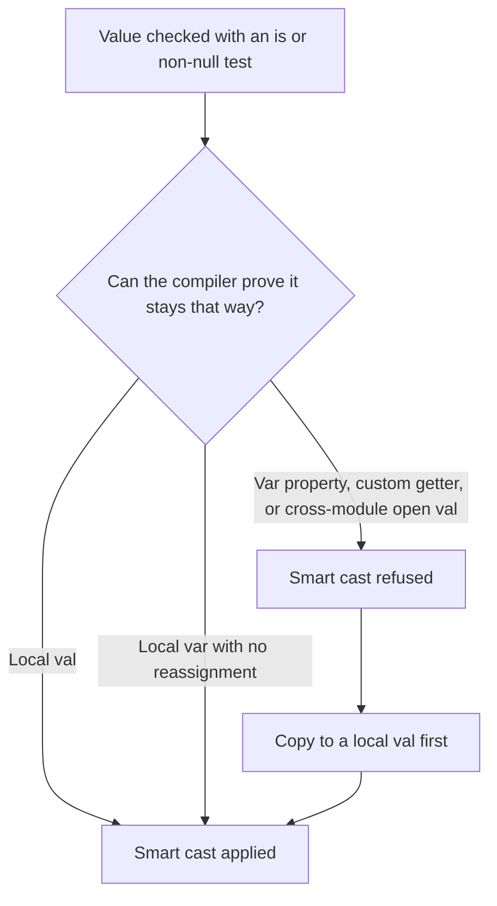
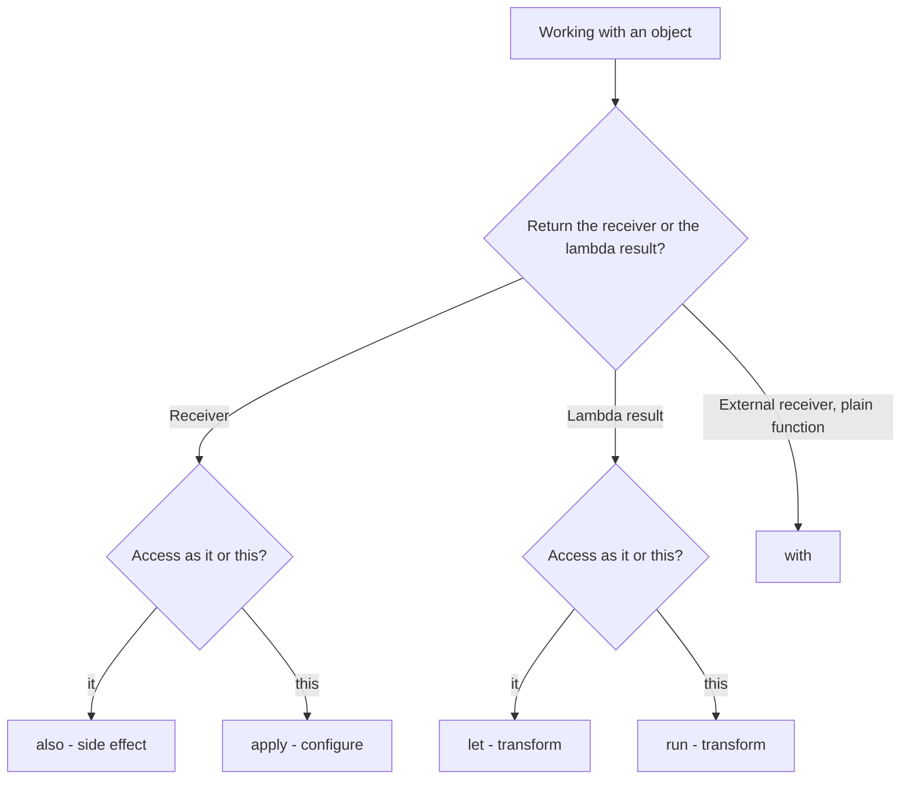

# Lecture 2 — Equality, smart casts, and the idioms that separate Kotlin from translated Java

Lecture 1 gave you the stack and the bytecode-reading habit. This lecture is about the two places Kotlin developers most reliably stumble — **equality** and **smart casts** — and the broader set of **idioms** that make code read like Kotlin instead of like Java run through a transpiler. Each of these is a bytecode story, so keep `javap` (or the IDE's bytecode window) open as you read. The ethos this week is the same as the persistence week in our sibling Swift course: *measure and verify, don't assert.* Here, "verify" means "decompile it and look."

We take them in the order they bite: equality first (because `==` does something subtly different from Java and the boxing footgun is a real production bug), then smart casts (because they are the feature you lean on most and the one whose limits surprise people), then the idiom catalog that turns the two into clean code.

---

## 1. Equality — `==` vs `===`, and what each compiles to

Kotlin has **two** equality operators, and the difference is not cosmetic.

- `==` is **structural** equality. It asks "are these two things *equal in value*?" and it lowers to a null-safe `equals` call.
- `===` is **referential** equality. It asks "are these two references the *same object* in memory?" and it lowers to a JVM reference comparison.

### What `==` compiles to

`a == b` in Kotlin is **not** a raw JVM `==`. The compiler lowers it to:

```kotlin
a?.equals(b) ?: (b === null)
```

In words: if `a` is non-null, call `a.equals(b)`; if `a` is null, the whole thing is `true` only when `b` is also null. This is the null-safe structural comparison, and it is why `==` in Kotlin is almost always what you want — it never throws a `NullPointerException` the way a naive `a.equals(b)` would when `a` is null.

This is a major correctness win over Java. In Java, `==` on two `String`s compares *references* (a notorious bug — `"a" == new String("a")` is `false`), and you must remember to write `.equals`. In Kotlin, `==` on two `String`s does the right thing because it lowers to `equals`:

```kotlin
val a = "hello"
val b = StringBuilder("hel").append("lo").toString()   // a different String object
println(a == b)    // true  — structural; calls equals
println(a === b)   // false — referential; different objects
```

`javap` on the `a == b` line shows an `invokestatic kotlin/jvm/internal/Intrinsics.areEqual` call (the stdlib helper that implements the null-safe `?.equals(...) ?: (... === null)` lowering), while the `a === b` line shows a raw `if_acmpne` reference comparison. Two operators, two completely different bytecode shapes.

### The boxing footgun — `==` on boxed `Int`

Here is the footgun that bites everyone exactly once. Kotlin's `Int` is the JVM primitive `int` *when it can be* — in a `val x: Int = 5`, that's a raw `int`. But the moment an `Int` goes into a nullable (`Int?`), a generic (`List<Int>`), or otherwise needs to be an object, it is **boxed** into `java.lang.Integer`. And boxed integers have a caching surprise.

```kotlin
val a: Int? = 127
val b: Int? = 127
println(a == b)    // true  — structural, calls equals: 127 == 127
println(a === b)   // true  — SURPRISE: same cached Integer object

val c: Int? = 128
val d: Int? = 128
println(c == d)    // true  — structural, still 128 == 128
println(c === d)   // false — SURPRISE: different Integer objects
```

What's going on: the JVM's `Integer` cache (the `Integer.valueOf` cache) keeps a shared, interned `Integer` object for every value in the range **−128 to 127**. So two boxed `127`s are the *same object* (`===` is `true`), but two boxed `128`s are *different objects* (`===` is `false`), because 128 is outside the cache and each gets a fresh box.

The lesson is not "memorize −128..127." The lesson is: **never use `===` to compare values; use it only to compare object identity.** If you reach for `===` on numbers, strings, or any value type, you have a bug waiting for a number outside the cache range. Use `==` for "are these equal," always. `===` is for the rare, deliberate "is this literally the same object" — checking whether two references point at the same singleton, or implementing identity-based caching. Exercise 2 makes you reproduce the 127/128 split yourself, because seeing it once cures the temptation forever.

### `equals`/`hashCode` and the data-class gift

Because `==` lowers to `equals`, the quality of `==` depends entirely on a correct `equals`/`hashCode`. For a `data class`, the compiler generates both from the primary-constructor properties (lecture 1, §7), so `==` "just works" structurally:

```kotlin
data class Coord(val lat: Double, val lon: Double)

val p1 = Coord(48.85, 2.35)
val p2 = Coord(48.85, 2.35)
println(p1 == p2)    // true  — generated equals compares lat and lon
println(p1 === p2)   // false — two distinct objects
```

For a non-data `class` with no `equals` override, `==` falls back to the default `Object.equals`, which is reference identity — so two "equal-looking" instances compare *unequal*. This is the single most common reason a `HashSet` or a `Map` key "doesn't work": a non-data class used as a key, with no `equals`/`hashCode`, so every instance is its own key. The fix is almost always "make it a `data class`" (Week 2) or "override `equals`/`hashCode`."

---

## 2. Smart casts — the compiler narrows the type for you

A **smart cast** is the compiler automatically treating a value as a more specific type after you've *proven* it has that type, with no explicit cast required.

```kotlin
fun lengthOrZero(x: Any): Int {
    if (x is String) {
        // Inside this block, x is smart-cast to String. No cast needed.
        return x.length      // x.length compiles; x is a String here
    }
    return 0
}
```

In Java you'd write `if (x instanceof String) { return ((String) x).length(); }` — the redundant cast after the check. Kotlin's compiler knows that inside the `if (x is String)` block, `x` *must* be a `String`, so it lets you use it as one directly. The bytecode still contains a `checkcast` (the JVM requires it), but you didn't type it, and you can't get it wrong.

Smart casts work after several kinds of checks:

```kotlin
fun describe(x: Any?): String {
    if (x == null) return "null"
    // After the early return, x is smart-cast from Any? to Any (non-null).

    return when (x) {
        is Int -> "int ${x + 1}"          // x: Int
        is String -> "string '${x.uppercase()}'"   // x: String
        is List<*> -> "list of ${x.size}"  // x: List<*>
        else -> "other"
    }
}
```

- After a `!= null` check (or an early `return`/`throw` on null), a nullable becomes non-null.
- After `is T`, the value is `T` in the true branch.
- After `!is T` with an early return, the value is `T` in the code that follows.
- Inside a `when (x) { is T -> ... }` branch, `x` is `T`.

This is the feature that makes Kotlin's null safety and sealed types (Week 2) ergonomic: you check, and then you just *use* the value at its narrowed type. K2 (lecture 1, §2) improved the data-flow analysis behind smart casts, so some narrowings the old compiler refused now succeed.

### When smart casts DON'T work — and why

This is the part that surprises people. The compiler will only smart-cast when it can *prove* the value hasn't changed between the check and the use. There are precise situations where it cannot prove that, and it refuses:

**1. A mutable `var` that could change between check and use.**

```kotlin
var x: Any = "hello"
if (x is String) {
    // ERROR (in general): x is a var; something could reassign it
    // between the check and here, so the compiler won't smart-cast.
    println(x.length)
}
```

For a *local* `var` with no intervening reassignment and no concurrency concern, K2 will often still smart-cast it. But the moment the `var` is a property that another thread or another function could change, the guarantee is gone and the smart cast is refused. The fix is to copy to a `val` first:

```kotlin
val captured = x          // a val; can't change
if (captured is String) {
    println(captured.length)   // smart-cast works: captured is a String, immutably
}
```

This `val captured = nullableThing` pattern — copy to a local `val`, then check and use — is everywhere in idiomatic Kotlin, precisely because a `val` is smart-castable where a mutable property is not.

**2. A property with a custom getter.**

```kotlin
class Box {
    val value: Any?
        get() = computeSomething()   // custom getter — could return a different value each call!
}

fun use(box: Box) {
    if (box.value is String) {
        // ERROR: box.value has a custom getter; calling it again here
        // could return something else. No smart cast.
        // println(box.value.length)  // won't compile
    }
}
```

Because the getter runs custom code, two reads of `box.value` might return different things, so the compiler cannot assume the second read is still a `String`. Copy to a `val` to fix it.

**3. An `open` `val` property across a module boundary**, and `var` properties of another class — same root cause: the compiler can't prove stability, so it won't smart-cast.

The mental model: **smart casts require provable stability.** A local `val` is stable. A local `var` with no reassignment is usually stable (K2 is good at this). A property someone else can change, or one with a custom getter, is not stable, and the compiler refuses rather than risk a wrong narrowing. When in doubt, the universal fix is "copy to a local `val` and check that."


*Smart casts hinge on provable stability between the check and the use, not on the check itself.*

### `as` and `as?` — explicit casts when you need them

When you genuinely need to assert a type the compiler can't infer, use an explicit cast:

```kotlin
val s = x as String        // unsafe cast: throws ClassCastException if x is not a String
val s2 = x as? String      // safe cast: returns null if x is not a String (no throw)
```

`as?` is the idiomatic one — it gives you a nullable result you can handle, rather than a crash. `x as? String ?: "default"` ("cast or default") is a common one-liner. Reach for smart casts first (an `is` check narrows without any cast at all); reach for `as?` when you need a value out of a narrowing in expression position; reach for the unsafe `as` rarely, when a failure genuinely *should* crash.

---

## 3. The idiom catalog — Kotlin, not translated Java

Equality and smart casts are two specific idioms. Here is the broader set that, taken together, make code read like Kotlin. Each one has a "Java-in-Kotlin" antipattern and the idiomatic form. This is the checklist a reviewer applies.

### Scope functions — `let`, `run`, `apply`, `also`, `with`

These five functions restructure how you work with an object. Week 2 hammers them; here is the orientation:

```kotlin
// let — transform a value, often for null handling. Returns the lambda result.
val length: Int? = nullableName?.let { it.trim().length }

// run — like let but with `this` instead of `it`. Returns the lambda result.
val area = rectangle.run { width * height }

// apply — configure an object, returns the object itself. Great for builders.
val request = Request().apply {
    method = "POST"
    header("Content-Type", "application/json")
}   // request is the configured Request

// also — do a side effect, returns the object itself. Great for logging in a chain.
val result = compute().also { println("computed $it") }

// with — run a block with an object as receiver (not an extension; a plain function).
val summary = with(report) { "$title: $total rows" }
```

The decision rule: **`apply`/`also` return the receiver** (use them to configure or peek at an object and keep the object); **`let`/`run`/`with` return the lambda result** (use them to transform an object into something else). `let` and `also` use `it`; `run`, `apply`, and `with` use `this`. You don't need to memorize the grid today — you'll build the reflex over Weeks 1–3 — but know the two axes (returns-receiver-vs-result, `it`-vs-`this`).


*The five scope functions split along two axes: what they return, and how they name the receiver.*

The most important single use is **`?.let` for null handling**, which replaces a Java-style null-check-then-block:

```kotlin
// Java-in-Kotlin:
val user = findUser(id)
if (user != null) {
    sendEmail(user.email)
}

// Idiomatic:
findUser(id)?.let { sendEmail(it.email) }
```

### String templates over concatenation

```kotlin
// Java-in-Kotlin:
val msg = "User " + name + " has " + count + " messages"

// Idiomatic:
val msg = "User $name has $count messages"
val detail = "Total: ${orders.sumOf { it.amount }}"   // ${...} for expressions
```

### Collection operators over manual loops

```kotlin
// Java-in-Kotlin:
val names = mutableListOf<String>()
for (user in users) {
    if (user.isActive) {
        names.add(user.name.uppercase())
    }
}

// Idiomatic — a pipeline of expressions:
val names = users
    .filter { it.isActive }
    .map { it.name.uppercase() }
```

`map`, `filter`, `filterNot`, `first`/`firstOrNull`, `any`/`all`/`none`, `sumOf`, `groupBy`, `associateBy`, `partition` — these replace the overwhelming majority of hand-written loops, and they read as a description of *what* you want rather than *how* to compute it. (They are not free in the way a raw loop is — each operator can allocate an intermediate list — but for the collection sizes in app code the clarity wins, and Week 3's `Sequence` and `inline` lectures cover the cases where it matters.)

### Data classes over manual value types

```kotlin
// Java-in-Kotlin: a class with a constructor, getters, equals, hashCode, toString
// hand-written or IDE-generated and then maintained by hand.

// Idiomatic:
data class User(val id: Long, val name: String, val email: String)
```

You met the generated members in lecture 1, §7. The idiom is: **if a class is a bag of values, make it a `data class`** and get `equals`/`hashCode`/`toString`/`copy`/destructuring for free. Reserve plain `class` for things with identity and behaviour, not data.

### Top-level and extension functions over utility classes

```kotlin
// Java-in-Kotlin: object StringUtils { fun slugify(s: String) = ... }; StringUtils.slugify(x)

// Idiomatic — an extension function reads like a method on the type:
fun String.slugify(): String =
    trim().lowercase().replace(Regex("\\s+"), "-")

val slug = "Hello World".slugify()   // reads like String has a slugify method
```

An **extension function** lets you add a method-call syntax to a type you don't own. Under the hood (lecture 1, §3) it's a `static` method taking the receiver as its first argument — `javap` shows `slugify(String)` on a `...Kt` class — but at the call site it reads as `value.slugify()`. This is one of the most-loved Kotlin features and the idiomatic replacement for utility classes. (It is *not* real subtyping — extensions are resolved statically and can't override members — but for adding convenience functions it is exactly right.)

### Named and default arguments over overloads

```kotlin
// Java-in-Kotlin: four overloads of connect() for the optional parameters.

// Idiomatic: one function with defaults, called with named arguments.
fun connect(host: String, port: Int = 443, useTls: Boolean = true, timeoutMs: Long = 5_000) { /* ... */ }

connect("example.com")                                  // all defaults
connect("example.com", port = 8080, useTls = false)     // named, skip the rest
```

Named arguments also make call sites self-documenting: `connect("x", useTls = false)` reads better than `connect("x", 443, false, 5000)` where the booleans and numbers are a mystery without checking the signature. (Recall from lecture 1, §7 that defaults compile to a `$default` method with a bitmask — the idiom is free at the use site.)

---

## 4. Putting it together — the code-review checklist

Before you call a Kotlin file "idiomatic," walk this list. It is what a senior reviewer applies, and it is the bar this week sets:

- **Expressions, not statements.** No `var` declared, assigned in an `if`/`else`, then returned. Use `if`/`when`/`try` as expressions. (Lecture 1, §4.)
- **`val` first.** Every `var` can be justified out loud. Collections are `List`/`Map` (read-only) unless mutation is needed.
- **`==` for value, `===` for identity.** No `===` on numbers or strings. (§1.)
- **Smart casts, not manual casts.** An `is` check narrows; no `(x as T)` after an `instanceof`-style check. Copy to a `val` when a `var`/property blocks the smart cast. (§2.)
- **Data classes for value types.** Bags of data are `data class`; you don't hand-write `equals`/`hashCode`. (§3.)
- **Extensions and top-level functions, not utility classes.** No `object Utils { fun ... }`. (§3.)
- **Scope functions for null handling and configuration.** `?.let` for "do this if non-null"; `apply` for building. (§3.)
- **Collection operators, not manual loops.** `filter`/`map`/`sumOf` over `for` + `mutableList`. (§3.)
- **String templates, not concatenation.** `"$x and $y"`, not `"" + x + " and " + y`. (§3.)
- **The bytecode is ordinary.** When in doubt, decompile and confirm the idiom cost nothing.

That last point is the through-line of the whole week: every idiom above compiles to bytecode you could have written by hand in Java, with more lines and more bugs. Idiomatic Kotlin is not slower; it is the same machine code with less of your time and fewer of your mistakes. `javap` proves it every time.

---

## 5. Recap

Two idioms bite hardest, and you now own both:

1. **Equality.** `==` is structural and null-safe (lowers to a null-safe `equals`); `===` is referential identity. Use `==` for "are these equal," always; reserve `===` for "is this the same object." The boxing footgun — two boxed `127`s are `===`-equal (cached) but two boxed `128`s are not — is the proof that `===` on values is a bug; reproduce it once and never reach for `===` on a number again.

2. **Smart casts.** After an `is` or `!= null` check, the compiler narrows the type and lets you use the value directly — no cast. It refuses when it can't prove stability: mutable properties, custom getters, cross-module `open` `val`s. The universal fix is "copy to a local `val` and check that."

Around those two sit the idiom catalog — expressions, `val`-first, scope functions, data classes, extensions, collection operators, string templates — that, together, make your code read like Kotlin and not like Java. Every one compiles to ordinary bytecode; none of them costs anything at runtime.

The exercises put `javap` in your hands (exercise 1), pin down equality and smart-cast boundaries with a test suite (exercise 2), and make the statement-to-expression refactor reflexive (exercise 3). The mini-project, `kt-stat`, puts all of it to work in a real Gradle Kotlin DSL build. Next week takes this type system and turns it into a modelling tool: nullable types, sealed classes, and the exhaustive `when` you now know is an expression that smart-casts in every branch. Go write some Kotlin and read what it compiled to.
