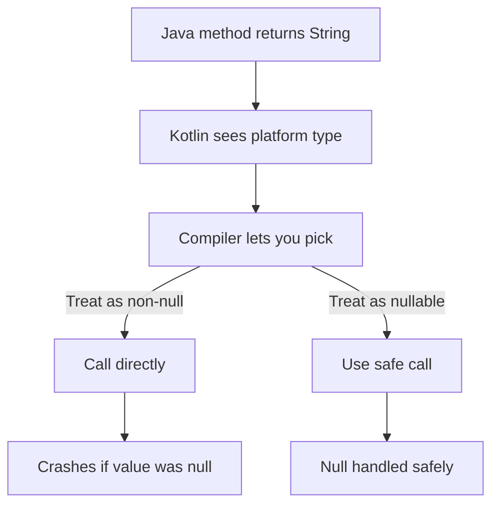

# Lecture 1 — Null safety and the platform-type boundary: where it holds, where it leaks

> "Kotlin doesn't abolish `null`. It makes `null` a value you can't ignore — and then it lets Java hand you a value it can't check. Both halves of that sentence matter."

This is the lecture that turns "Kotlin has null safety" from a slogan into a working model with a known boundary. The thesis: **nullability is part of the type, the compiler enforces it inside pure Kotlin, and it leaks at exactly one place — the Java interop boundary, via platform types.** Hold that, and you know both why your Kotlin code is null-safe and why it can still throw a `NullPointerException` when it talks to a Java library.

We build it up: first the type-level idea (`T` vs `T?`), then the operator family that works with it (`?.`, `?:`, `as?`, `!!`), then what each lowers to in bytecode (carrying last week's `javap` habit forward), and finally the platform-type leak and the discipline that contains it.

---

## 1. Nullability is a type, not a flag

In Java, every reference type is implicitly nullable. `String name` might be a string or might be `null`, and nothing in the type tells you which — you find out at runtime, usually as an NPE. In Kotlin, nullability is *part of the type*:

- `String` — a non-null string. It can **never** be `null`. The compiler guarantees it.
- `String?` — a nullable string. It might be a string, might be `null`. The compiler **forces** you to handle the `null` before you use it as a string.

```kotlin
val a: String = "hello"
val b: String? = null

println(a.length)    // fine — a is non-null, .length is safe
// println(b.length) // COMPILE ERROR — b might be null; you must handle it
```

That compile error is the whole feature. The most common runtime crash in Java becomes a compile-time error in Kotlin. You cannot call `.length` on a `String?` without first dealing with the possibility of `null` — and the operator family below is how you deal with it.

This also means nullability flows through your types. A function returning `User?` is announcing "I might not find a user." A property typed `String?` is announcing "this might be absent." Reading a signature tells you, at a glance, where absence is possible — information Java hides.

---

## 2. The `?` operator family

Four operators (plus a scope-function pattern) do all the work. Know each one's behaviour and its bytecode.

### Safe call: `?.`

`a?.b` means "if `a` is non-null, evaluate `a.b`; otherwise the whole expression is `null`." It short-circuits on `null`:

```kotlin
val name: String? = findName()
val length: Int? = name?.length     // Int? — null if name was null, else the length
val upper: String? = name?.trim()?.uppercase()   // chains: null if any link is null
```

The result type of `a?.b` is *nullable* — `name?.length` is `Int?`, not `Int`, because the call might have short-circuited. In bytecode, `?.` is a null check (`ifnull`) that jumps past the call and pushes `null` instead. No magic; a branch.

### Elvis: `?:`

`a ?: b` means "use `a` if it's non-null, otherwise `b`." It supplies a default for a nullable:

```kotlin
val name: String = findName() ?: "Anonymous"    // String (non-null!) — defaulted
val count: Int = config?.maxRetries ?: 3
```

Note the result type: `findName() ?: "Anonymous"` is `String`, **not** `String?` — the Elvis operator *removes* the nullability, because if the left side is `null` you get the (non-null) right side. This is how you turn a `T?` into a `T` with a fallback.

The killer pattern is **Elvis with `return`/`throw`** for early exit:

```kotlin
fun process(input: String?) {
    val value = input ?: return            // bail out early if null
    // after this line, `value` is non-null String for the rest of the function
    println(value.length)
}

fun require(user: User?): User =
    user ?: throw IllegalStateException("user required")   // narrow-or-throw
```

`?: return` and `?: throw` are everywhere in idiomatic Kotlin. They turn "handle the null" into a single line at the top of a function, after which the value is non-null and smart-cast for the whole body. (`return` and `throw` are expressions of type `Nothing`, which is why they fit on the right of `?:`.)

### Safe cast: `as?`

`a as? T` means "cast `a` to `T` if possible, otherwise `null`" — no exception on failure (Week 1, lecture 2):

```kotlin
val s: String? = anyValue as? String        // null if anyValue isn't a String
val n: Int = (raw as? Int) ?: 0              // cast-or-default
```

Combine with Elvis for "cast or default" / "cast or bail." Far safer than the unsafe `as`, which throws `ClassCastException`.

### The not-null assertion: `!!`

`a!!` means "I assert `a` is non-null; if I'm wrong, throw." It converts `T?` to `T`, crashing on `null`:

```kotlin
val name: String = findName()!!     // String — but throws NullPointerException if findName() was null
```

`!!` is the escape hatch, and it is a **code smell** in most places. It says "I know better than the compiler." Sometimes you do (you just checked it a different way, or a framework guarantees it), but every `!!` is a potential crash you're choosing to risk. The bytecode is an `Intrinsics.checkNotNull(...)` call that throws if the value is null. The discipline: **a `!!` should be rare and justifiable.** When you see five `!!`s in a function, the author lost the null-safety argument and is fighting the compiler. Reach for `?.`, `?:`, and `?: return` first; reserve `!!` for the genuine "this truly cannot be null and I can defend why" case.

### `?.let { }` — do something only if non-null

The scope-function pattern from Week 1, here doing its most important job:

```kotlin
// "If user is non-null, send the email." No explicit if, no !!.
findUser(id)?.let { user ->
    sendEmail(user.email)
}

// Transform-if-present:
val token: String? = header?.let { parseToken(it) }
```

Inside the `let` block, the receiver (`it`, or a named param) is the non-null value. This is the idiomatic "run a block on a value if it exists."

### A quick decision table

| You want | Reach for |
|----------|-----------|
| Call a method only if non-null, get nullable result | `a?.method()` |
| A default when null | `a ?: default` |
| Bail out of the function on null | `a ?: return` / `a ?: throw` |
| Cast safely, null on mismatch | `a as? T` |
| Run a block if non-null | `a?.let { }` |
| Assert non-null, crash if wrong | `a!!` (rarely) |

---

## 3. What the operators compile to — the bytecode

Carry the Week 1 habit: when in doubt, `javap`. Each operator is ordinary bytecode.

```kotlin
fun demo(name: String?): Int {
    return name?.length ?: 0
}
```

Decompiled, this is roughly:

```text
public static final int demo(java.lang.String name) {
    // if (name == null) goto L; else load name.length()
    // at L: push 0
    // return the int
}
```

In words: `?.` is an `ifnull` branch; `?:` is "if the safe-call produced null, substitute the default." There's no Kotlin runtime null-safety machine — just branches the compiler inserted. A `!!` compiles to a call to `kotlin.jvm.internal.Intrinsics.checkNotNull`, which throws a `NullPointerException` (with a helpful message naming the expression) if the value is null. Decompile a function with a `!!` and you'll see the `Intrinsics.checkNotNull` call sitting there — that's your crash, made explicit.

The payoff of looking: you understand that null safety costs almost nothing at runtime (a few branches) and that `!!` literally compiles to "throw if null." It's not a vibe; it's bytecode you can read.

---

## 4. Platform types — where null safety leaks

Here is the honest part the syllabus title promises. Kotlin runs on the JVM, surrounded by Java. Java has no concept of `String` vs `String?` — every Java reference is implicitly nullable, and Java doesn't tell Kotlin which ones can actually be null. So when a value crosses from Java into Kotlin, the compiler is stuck: it can't prove the value is non-null, and it can't assume it's nullable (that would make every Java call site a pain). Its compromise is the **platform type**, written `String!` (with an exclamation mark) in IDE hints — though you can't write that type yourself.

```kotlin
// Calling a Java method that returns String (no nullability annotation):
val name = javaObject.getName()   // type is String! — a platform type
// The compiler lets you treat it as EITHER String or String?:
println(name.length)              // allowed — but throws NPE at runtime if it was null!
val safe = name?.length           // also allowed — you chose to be cautious
```

A platform type is "the compiler trusts you." It will let you call `.length` directly (treating it as non-null) *or* use `?.` (treating it as nullable) — your choice. The danger: if you treat it as non-null and the Java method actually returned `null`, you get the exact `NullPointerException` Kotlin was supposed to prevent. **This is the one place Kotlin's null safety leaks, and it leaks at the Java boundary, through platform types.**


*How a platform type lets you choose non-null or nullable, and only one choice survives a real null.*

### Why it's designed this way

The alternative — forcing every Java return value to be `String?` — would make calling Java unbearable (`?.` on everything, `!!` everywhere). And the alternative of trusting every Java value as non-null would crash constantly. The platform type is the pragmatic middle: the compiler steps back and lets you decide, because *you* often know the Java method's contract even when the type doesn't encode it.

### The discipline that contains the leak

You don't get to wish platform types away, but you can keep them from reaching users:

1. **Prefer Java libraries with nullability annotations.** Modern Java libraries annotate with `@Nullable`/`@NonNull` (or the newer, vendor-neutral **JSpecify** `@Nullable`). When a Java method is annotated, Kotlin *respects* the annotation — `@Nullable String getName()` becomes `String?` in Kotlin, and the leak closes. The Android SDK is heavily annotated for exactly this reason, which is why most Android Java APIs give you proper `String?`/`String` instead of `String!`.

2. **Assign platform types to an explicit Kotlin type at the boundary.** When you must call an un-annotated Java method, immediately narrow it:

   ```kotlin
   val name: String = javaObject.getName()   // I assert non-null HERE, at the boundary
   // or
   val name: String? = javaObject.getName()  // I treat it as nullable HERE
   ```

   By writing the type, you make the decision *once*, at the entry point, instead of leaving a `String!` to float through your code where every use silently re-decides. If you write `: String` and the value is null, you crash *at the boundary* with a clear stack trace — far better than a crash three layers deeper.

3. **Validate at the edge — "parse, don't validate."** When data comes in from outside (JSON, a Java SDK, a database driver), check it once at the boundary and convert it into clean, non-null Kotlin types. Downstream code then works with `String`, not `String?`, because you already handled absence at the door. This is the same principle the JSON parser mini-project embodies: the parser is the boundary, and what comes *out* of it is a clean `JsonNode` tree with no platform types in sight. (The Alexis King essay in resources is the canonical write-up.)

The mental model: **platform types are a leak at the Java boundary; your job is to seal the leak at the boundary, not to let `String!` flow into your domain.**


*The discipline that seals a platform-type leak before it reaches domain code.*

---

## 5. Nullable vs "absent" vs "error" — a preview of the modelling choice

Nullable types model *absence* well: "there might not be a user" → `User?`. But `null` is a poor way to model *why* something is absent or *what went wrong*. A function returning `User?` tells you it failed but not whether the user didn't exist, the network was down, or the input was malformed. For that, you need a richer type — a sealed `Result` or the stdlib `Result<T>` — which is lecture 2's territory.

The rule of thumb, stated now and justified next lecture:

- **Use `T?`** when absence is the only outcome and the reason doesn't matter ("look up a key that might not be there").
- **Use a sealed `Result`** (or `Result<T>`) when there are multiple distinct outcomes or you need to carry error information ("a network call that can succeed, fail with a typed error, or still be loading").

`null` is one bit of information. When you need more than one bit, reach past nullable to a sum type. Lecture 2 builds the sum types.

---

## 6. The code-review checklist for nullability

Before you call a Kotlin file's null handling "clean," walk this list:

- **`!!` is rare and justified.** Every `!!` has a comment or an obvious reason it can't be null. Five `!!`s in a function is a redesign signal. (§2.)
- **Nullable narrows early.** A `?: return` / `?: throw` at the top of a function turns the rest of the body non-null, rather than threading `?.` through every line. (§2.)
- **Platform types are narrowed at the boundary.** Java return values are assigned to an explicit `String`/`String?` at the call site, not left as `String!` to float. (§4.)
- **Absence vs error is modelled deliberately.** `T?` for "might be absent"; a sealed `Result` for "might fail, and here's why." (§5; lecture 2.)
- **No platform types in the domain.** Data from outside is validated/parsed at the edge into clean non-null Kotlin types. (§4.)
- **`?.let` for "do if present," not an `if (x != null)` block.** (§2.)

---

## 7. Recap

Three facts carry the lecture:

1. **Nullability is a type.** `String` can never be null; `String?` might be, and the compiler forces you to handle it before use. The most common Java crash becomes a Kotlin compile error.

2. **The `?` family handles it ergonomically.** `?.` (safe call, result is nullable), `?:` (Elvis, removes nullability with a default, and `?: return`/`?: throw` for early exit), `as?` (safe cast), `?.let` (do-if-present), and `!!` (assert-or-crash, used rarely). Each is ordinary bytecode — a branch, or an `Intrinsics.checkNotNull`.

3. **It leaks at the Java boundary, through platform types.** A value from un-annotated Java is `String!`, which the compiler lets you treat as either nullable or not — and which can still NPE if you guess non-null wrongly. The discipline is to seal the leak at the boundary: prefer annotated libraries, assign to an explicit type at the call site, and validate-then-narrow at the edge.

Lecture 2 takes the "absence vs error" thread and builds the sum types that model it — sealed classes and interfaces, the exhaustive `when` the compiler enforces, data classes as product types, inline value classes for type-safe primitives, and `Result<T>`. Together they are algebraic data types, and they are how you make illegal states refuse to compile. The exercises put the `?` family in your hands and read its bytecode (exercise 1); the parser puts it all to work at a real boundary. Go make `null` something you can't ignore.
