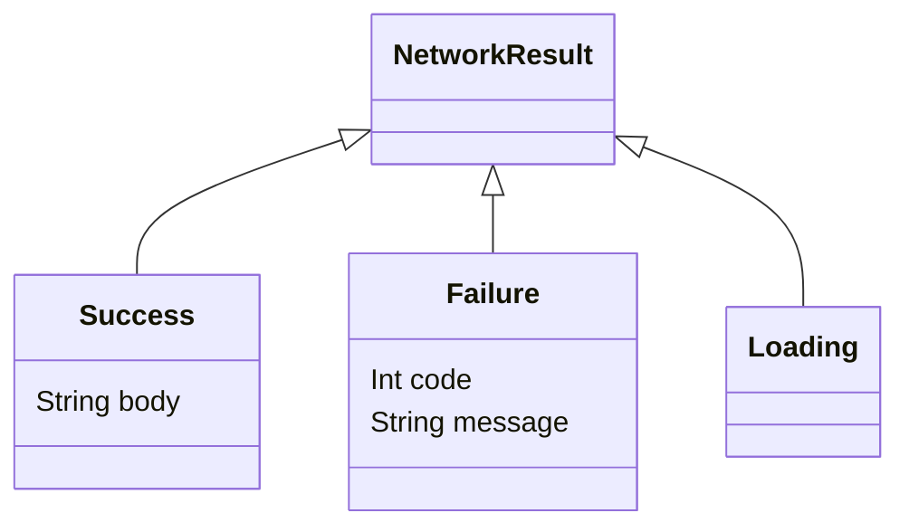
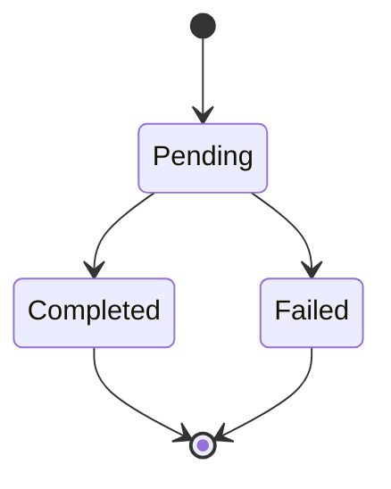

# Lecture 2 — Sealed types, data classes, inline classes, and the algebraic core

Lecture 1 gave you absence (nullable types) and the boundary where it leaks. This lecture gives you the rest of the algebraic toolkit: **sum types** (sealed classes and interfaces) for "this is one of a closed set of cases," **product types** (data classes) for "this is a bundle of fields," **inline value classes** for type-safe primitives, and **`Result<T>`** for outcomes. Put together, they let you build domain models where **illegal states don't compile** — the week's promise.

We take them in modelling order: sealed types and the exhaustive `when` that makes them pay off, then data classes as products, then how products and sums compose into algebraic data types, then inline value classes, then the three-way outcome choice. Keep the IDE's bytecode/decompile window open — the inline-class section is half a bytecode lesson.

---

## 1. Sealed types — a closed set the compiler knows completely

A **sealed** class or interface is a hierarchy whose subtypes are *all known at compile time* — the compiler can enumerate them. Contrast with an ordinary `open` class, which anyone in any module could subclass; the compiler can never be sure it has seen them all.

```kotlin
sealed interface NetworkResult {
    data class Success(val body: String) : NetworkResult
    data class Failure(val code: Int, val message: String) : NetworkResult
    data object Loading : NetworkResult
}
```

`NetworkResult` is *exactly* `Success`, `Failure`, or `Loading`. Nothing else can be a `NetworkResult` — the `sealed` modifier requires all direct subtypes to be declared in the same module and package (a rule loosened from "same file" in older Kotlin to "same package + module" today). That restriction is the whole point: by giving up "anyone can subclass this," you gain "the compiler knows every case."


*The closed set of cases the compiler knows completely for NetworkResult.*

### `sealed class` vs `sealed interface`

- **`sealed class`** — a single-inheritance hierarchy. A subtype can extend only one class. Use it when the cases share state or behaviour you want to put on the base.
- **`sealed interface`** — multiple inheritance. A type can implement several interfaces, including several sealed ones. Use it when you want a case to belong to more than one closed hierarchy, or when there's no shared state to hoist. In modern Kotlin, `sealed interface` is often the cleaner default; reach for `sealed class` when you genuinely need shared state on the base.

Note `data object Loading`: a singleton case with no data. `data object` gives it a sensible `toString`/`equals` (so `Loading == Loading` and it prints as `Loading`), which is what you want for a stateless case. Cases that carry data are `data class`; cases that don't are `data object`.

---

## 2. The exhaustive `when` — the single most valuable correctness property

Here is why sealed types are worth the restriction. A `when` over a sealed type, used as an expression, must be **exhaustive** — it must cover every case — and because the compiler knows every case, it can *enforce* that with **no `else` branch**:

```kotlin
fun describe(result: NetworkResult): String = when (result) {
    is NetworkResult.Success -> "Got ${result.body.length} bytes"   // result smart-cast to Success
    is NetworkResult.Failure -> "Error ${result.code}: ${result.message}"  // smart-cast to Failure
    NetworkResult.Loading    -> "Loading…"
    // NO else needed — the compiler knows these are ALL the cases.
}
```

Two things are happening, both load-bearing:

1. **Smart casts in every branch.** Inside `is NetworkResult.Success ->`, `result` is smart-cast to `Success`, so `result.body` is available with no cast (Week 1, lecture 2 — this is why smart casts were a prerequisite). Each branch gets the narrowed type for free.

2. **Exhaustiveness without `else`.** Because the hierarchy is closed, the compiler verifies you covered `Success`, `Failure`, and `Loading`. You don't write `else`, and you *shouldn't* — and here's the payoff:

### Why dropping `else` is the feature, not a nicety

Suppose next month you add a fourth case:

```kotlin
sealed interface NetworkResult {
    data class Success(val body: String) : NetworkResult
    data class Failure(val code: Int, val message: String) : NetworkResult
    data object Loading : NetworkResult
    data class Cancelled(val reason: String) : NetworkResult   // NEW
}
```

Every `when` over `NetworkResult` that lacks a `Cancelled` branch now **fails to compile** — "`when` expression must be exhaustive, add a `Cancelled` branch." The compiler walks you to every place in the codebase that needs updating. You cannot forget one.

Contrast with an `else` branch (or an enum with a `default`): if you'd written `else -> "unknown"`, adding `Cancelled` would silently fall into `else`, and you'd ship a bug where cancelled requests show "unknown" — no compile error, no warning, a production surprise. **The `else`-free exhaustive `when` over a sealed type is how the compiler becomes your refactoring assistant.** This is the most valuable thing sealed types give you, and the reason "model your states as a sealed hierarchy" is a senior-engineer reflex. You'll feel the full force of it in Phase 2, where every screen's `UiState` is a sealed type and every `when` over it is exhaustive.

(One caveat: a `when` used as a *statement* — for its side effects, not its value — is not forced to be exhaustive by default, though you can opt in. Always use `when` as an *expression* when modelling over a sealed type, even if it's just to a value you then act on, so you get the exhaustiveness check.)

---

## 3. Data classes — product types

A **data class** models a *product type*: a value that is field A *and* field B *and* field C, all at once.

```kotlin
data class User(val id: Long, val name: String, val email: String)
```

A `User` is an id *and* a name *and* an email — a product of three values. You met the generated members in Week 1 (`equals`, `hashCode`, `toString`, `componentN`, `copy`); here we use them as modelling tools.

### Destructuring via `componentN`

The generated `component1()`, `component2()`, ... let you destructure:

```kotlin
val user = User(1, "Ada", "ada@example.com")
val (id, name, email) = user        // id=1, name="Ada", email="ada@example.com"

// Destructuring in a loop over pairs/maps:
for ((key, value) in someMap) { /* ... */ }
```

Destructuring is positional — `(id, name, email)` binds in declaration order — so it's best on small, stable data classes. (Don't destructure a 9-field class; nobody remembers position 7.)

### Non-destructive update via `copy`

`copy` makes a new instance with some fields changed, leaving the original untouched — essential when your data is immutable (`val` properties):

```kotlin
val ada = User(1, "Ada", "ada@example.com")
val renamed = ada.copy(name = "Ada Lovelace")   // new User, same id and email, new name
// ada is unchanged
```

`copy` is how you "modify" immutable data: produce a new value with the change. This is the backbone of unidirectional data flow in Compose (Phase 2) — UI state is an immutable data class, and you `copy` it to produce the next state. Learn the reflex now.

### `data class` vs plain `class`: value vs identity

The rule: **if a type is a bundle of data with no identity of its own, make it a `data class`.** A `User`, a `Coord`, a `Money` — these are *values*; two with the same fields are equal. A `class` (non-data) is for things with identity and behaviour — a `Repository`, a `Connection`, a `ViewModel` — where two instances are different even with the same state, and structural equality would be wrong.

---

## 4. Algebraic data types — products and sums compose

"Algebraic data type" (ADT) is the umbrella for combining products and sums:

- A **product type** (`data class`) says "all of these fields, together." Its name comes from the fact that the number of possible values *multiplies*: a `Pair<Boolean, Boolean>` has 2 × 2 = 4 possible values.
- A **sum type** (`sealed`) says "exactly one of these cases." Its values *add*: a sealed type with three cases has the sum of the values of each case.

Real models combine them. The mini-project's `JsonNode` is the canonical example — a sum of six cases, several of which are products:

```kotlin
sealed interface JsonNode {
    data class JsonObject(val entries: Map<String, JsonNode>) : JsonNode   // product (a map)
    data class JsonArray(val elements: List<JsonNode>) : JsonNode          // product (a list)
    data class JsonString(val value: String) : JsonNode                    // product (one field)
    data class JsonNumber(val value: Double) : JsonNode                     // product
    data class JsonBool(val value: Boolean) : JsonNode                      // product
    data object JsonNull : JsonNode                                        // a case with no data
}
```

A JSON value is *one of* (sum) six shapes, and each shape bundles its data (product). Consuming it is an exhaustive `when` — and because it's sealed, the compiler ensures you handle all six:

```kotlin
fun render(node: JsonNode): String = when (node) {
    is JsonNode.JsonObject -> node.entries.entries.joinToString(", ", "{", "}") { (k, v) -> "\"$k\": ${render(v)}" }
    is JsonNode.JsonArray  -> node.elements.joinToString(", ", "[", "]") { render(it) }
    is JsonNode.JsonString -> "\"${node.value}\""
    is JsonNode.JsonNumber -> node.value.toString()
    is JsonNode.JsonBool   -> node.value.toString()
    JsonNode.JsonNull      -> "null"
}
```

This is the shape of correct domain modelling: **enumerate the cases as a sealed sum, bundle each case's data as a product, and consume with an exhaustive `when`.** The result is that an illegal state — a JSON value that is somehow both an object and a number — is *unrepresentable*; you literally cannot construct it. That's the week's thesis made concrete.

### Making illegal states unrepresentable

The general technique: when you find yourself writing a class with a flag and some fields that are only valid for certain flag values, you have an illegal state waiting to be constructed. Example of the *wrong* way:

```kotlin
// BAD: nullable fields that are only valid in certain combinations.
data class Payment(
    val status: String,            // "pending" | "completed" | "failed"
    val confirmationCode: String?, // only set when completed
    val failureReason: String?,    // only set when failed
)
// Nothing stops Payment(status = "pending", confirmationCode = "X", failureReason = "Y") —
// an illegal state the compiler happily constructs.
```

The *right* way models the cases as a sum, so each case carries exactly the data valid for it:

```kotlin
// GOOD: each case carries only its own data; illegal combinations can't be built.
sealed interface Payment {
    data object Pending : Payment
    data class Completed(val confirmationCode: String) : Payment   // code is non-null and required
    data class Failed(val reason: String) : Payment                // reason is non-null and required
}
```

Now `Completed` *always* has a `confirmationCode` (non-null, required), `Pending` carries nothing, and there is no way to build a "pending with a confirmation code" — it doesn't typecheck. The illegal states are gone, and every `when` over `Payment` is exhaustive. This refactor — "primitive-obsessed nullable bag → sealed sum of valid cases" — is the entire Wednesday challenge.


*Payment modelled as a sealed sum, each state carrying only its own valid data.*

---

## 5. Inline value classes — type-safe primitives with zero cost

A recurring bug class: every id in your system is a `Long`, every name a `String`, so the compiler happily lets you pass a `userId` where a `postId` was expected, or an `email` where a `name` belongs. They're all the same underlying type; the compiler can't help.

**Inline value classes** fix this. A `value class` wraps a single value and gives it a distinct type, but at runtime it *erases* to the wrapped value — no allocation, no wrapper object (most of the time):

```kotlin
@JvmInline value class UserId(val raw: Long)
@JvmInline value class PostId(val raw: Long)

fun loadUser(id: UserId): User = TODO()

val uid = UserId(42)
val pid = PostId(99)
loadUser(uid)        // fine
// loadUser(pid)     // COMPILE ERROR — PostId is not a UserId, even though both wrap Long
```

`UserId` and `PostId` are distinct types the compiler enforces, so you cannot swap them — the "longly-typed" bug is now a compile error. And the `@JvmInline` annotation means it costs nothing: at runtime, a `UserId` *is* a `long`.

### When it erases and when it boxes — the bytecode story

This is the part to *see*, not memorize. Decompile a function taking a value class:

```kotlin
@JvmInline value class Money(val cents: Long)

fun describe(m: Money): String = "${m.cents} cents"
```

The decompiled signature is `describe(long)` — the `Money` wrapper is gone; the parameter is a raw `long`. The value class erased completely. `javap` confirms it: `public static final java.lang.String describe(long)`. Zero allocation, full type safety. (Kotlin mangles the function name slightly — `describe-...` — to avoid JVM signature clashes; that's an interop detail, not a cost.)

But a value class **must box** (allocate a real wrapper object) in a few situations, because the JVM needs an actual object there:

- When it's **nullable**: `Money?` can't be a raw `long` (a `long` can't be null), so it boxes to a `Money` object.
- When used as a **generic type argument**: `List<Money>` stores boxed `Money`, because generics erase to `Object` and need real objects.
- When assigned to a **supertype/interface** it implements: it boxes to satisfy the interface reference.

The rule: **a value class erases to its underlying type in monomorphic, non-nullable, non-generic positions, and boxes otherwise.** For the common case — a function parameter, a non-null field, a local — it's free. Decompile to confirm; that's the Week 1 habit applied to the most "costs nothing or it doesn't?" feature in the language.

### When to reach for one

Use inline value classes to make primitive-typed domain concepts distinct: IDs (`UserId`, `OrderId`), units (`Meters`, `Seconds`, `Cents`), and validated wrappers (`EmailAddress` wrapping a `String` that was checked at construction). The payoff is the "parse, don't validate" boundary: a function taking `EmailAddress` knows the string was validated, because the only way to get one is through the validating constructor.

---

## 6. `Result<T>` and the three-way outcome choice

You now have three ways to model an outcome that might fail. The choice matters.

### Nullable — `T?`

For "might be absent, reason doesn't matter":

```kotlin
fun findUser(id: UserId): User? = users[id]   // null = not found, and that's all we need to know
```

Cheapest, clearest when absence is the only failure and you don't need to know why.

### The stdlib `Result<T>` — success or exception

Kotlin's `Result<T>` wraps "a value, or the exception that was thrown getting it." `runCatching` produces one:

```kotlin
val result: Result<Int> = runCatching { riskyParse(raw) }   // success or the thrown exception
val value: Int = result.getOrElse { 0 }                     // default on failure
result.fold(
    onSuccess = { println("got $it") },
    onFailure = { println("failed: ${it.message}") },
)
```

`Result<T>` is good for "this can throw, and I want to handle the throw functionally instead of with `try`/`catch`." Its limitation: the failure side is always a `Throwable` — you don't get a *typed* error, just an exception. Good for wrapping throwing code; less good when you want to enumerate specific failure cases.

### A hand-rolled sealed `Result`/`Either` — typed errors

When you want the failure to be a *typed, enumerated* thing (not just any exception), model it as a sealed type:

```kotlin
sealed interface ParseResult<out T> {
    data class Ok<T>(val value: T) : ParseResult<T>
    data class Err(val error: ParseError) : ParseResult<Nothing>
}

sealed interface ParseError {
    data class UnexpectedChar(val char: Char, val position: Int) : ParseError
    data object UnexpectedEnd : ParseError
    data class InvalidNumber(val text: String) : ParseError
}
```

Now a caller `when`s over `ParseResult` exhaustively, and on `Err` gets a *typed* `ParseError` it can `when` over exhaustively too — every failure mode is enumerated and handled at compile time. This is what the mini-project's parser returns, and it's the richest of the three: the compiler enforces that you handle success, every error case, and (via `out T`) the generics line up. (`out` is variance — Week 3 — but you'll use it here; for now read it as "a `ParseResult<Cat>` is usable as a `ParseResult<Animal>`.")

### The decision table

| Situation | Reach for |
|-----------|-----------|
| Absence is the only outcome, reason irrelevant | `T?` (nullable) |
| Code that throws; you want functional handling, error = any exception | `Result<T>` + `runCatching` |
| Multiple distinct, enumerable failure modes you want the compiler to force handling of | hand-rolled `sealed Result`/`Either` with a typed error |
| A UI state with loading/success/error (Phase 2) | sealed `UiState` (a sum type) |

The senior instinct: **don't reach for exceptions and `T?` when the failure modes are knowable and worth enumerating.** A typed sealed result turns "did you handle the timeout case?" from a code-review question into a compile error.

---

## 7. Enum classes — and where they stop being enough

An **enum** is a fixed set of named constants. With abstract members, each constant can carry behaviour:

```kotlin
enum class Planet(val massKg: Double, val radiusM: Double) {
    EARTH(5.976e24, 6.378e6) {
        override fun surfaceGravity() = 9.81
    },
    MARS(6.421e23, 3.397e6) {
        override fun surfaceGravity() = 3.71
    };

    abstract fun surfaceGravity(): Double
}
```

Enums are perfect when the set is **fixed and each constant is the same shape** (same properties, possibly different values). A `when` over an enum is exhaustive just like a sealed `when`.

**Where an enum stops being enough:** when different cases need to carry *different data*. An enum constant can't have its own fields beyond the shared constructor parameters — every `Planet` has a `massKg` and a `radiusM`. The moment you need "`Success` carries a body but `Failure` carries a code and a message," an enum can't express it (they'd need different fields), and you reach for a **sealed type**. The line:

- **Enum** — a closed set of *uniform* constants (days of the week, log levels, a fixed set of states with no payload). `data object` cases in a sealed type can replace these, but an enum is more concise when there's truly no per-case data variation.
- **Sealed** — a closed set of cases that *carry different data*. (`NetworkResult.Success(body)` vs `Failure(code, message)`.)

Both give exhaustive `when`. Choose enum for uniform, no-payload sets; choose sealed the moment cases differ in shape.

---

## 8. The code-review checklist for modelling

Before you call a domain model "done," walk this list — it's the week's promise as a checklist:

- **States are a sealed sum, not a flag + nullable fields.** No "status string + optional fields only valid for some statuses." (§4.)
- **`when` over sealed/enum is an expression with no `else`.** So adding a case breaks the build at every incomplete site. (§2.)
- **Each sealed case carries exactly its valid data.** No nullable field that's "only set sometimes." (§4.)
- **IDs and units are inline value classes**, so they can't be swapped. (§5.)
- **Outcomes use the right tool.** `T?` for plain absence; `Result<T>` for throwing code; a typed sealed result for enumerable failures. (§6.)
- **Data bags are `data class`; things with identity are `class`.** (§3.)
- **The illegal state doesn't compile.** Try to construct a bad value; if you can, the model is too loose. (§4.)

---

## 9. Recap

The algebraic core, in five instruments:

1. **Sealed types** — a closed set of cases the compiler knows completely. `sealed interface` (multiple inheritance, often cleaner) or `sealed class` (shared state).
2. **Exhaustive `when`** — over a sealed type, an `else`-free `when` the compiler forces to be complete; adding a case breaks every incomplete `when` at compile time. The most valuable correctness property for state modelling, and the reason to model states as sealed.
3. **Data classes** — product types ("a *and* b *and* c"), with destructuring (`componentN`), non-destructive update (`copy`), and generated equality.
4. **Inline value classes** — type-safe primitives that erase to the underlying type (decompile to confirm) but box when nullable/generic/interface-typed; they kill the "longly-typed"/"stringly-typed" bug class.
5. **`Result<T>` and friends** — `T?` for absence, stdlib `Result<T>` for throwing code, a typed sealed result for enumerable failures.

Compose products and sums and you get algebraic data types, and with them you make illegal states unrepresentable: the bad value doesn't typecheck, the missed case doesn't compile, the swapped id is a type error. The exercises drill exhaustive `when` and the build-breaks-on-new-case property (exercise 2), value-class erasure and the outcome choice (exercise 3); the challenge has you redesign a loose model so the illegal states stop compiling; and the mini-project builds a real parser whose `JsonNode` is a textbook ADT. Next week generalizes all of it with generics and variance — your `ParseResult<out T>` is already a preview. Go make the compiler your first reviewer.
