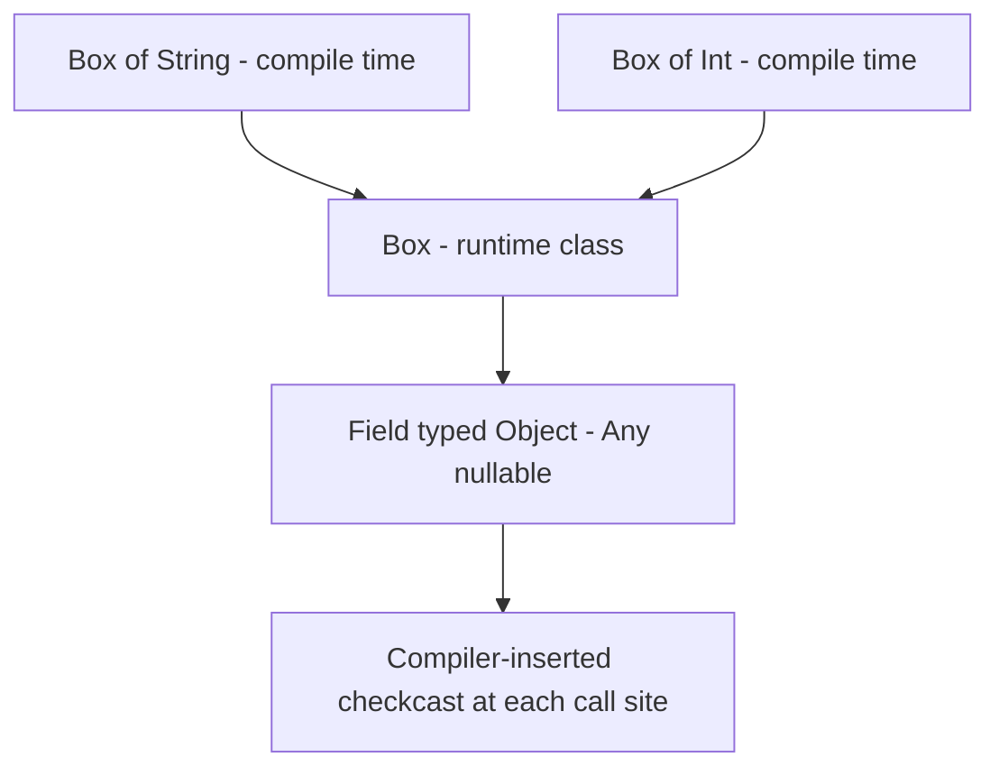
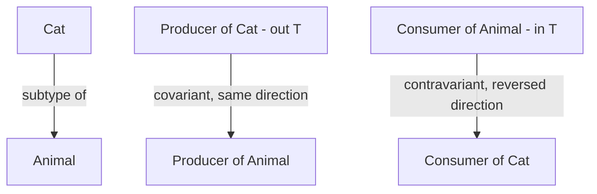

# Lecture 1 — Generics, variance, and type erasure

> "Generics are a promise to the compiler, not to the runtime. The runtime forgets `T`. Everything surprising about Kotlin generics follows from that one fact."

This lecture builds the half of the week that is about *types you parameterize*: what a generic actually is once compiled, why the runtime cannot see `T`, and the `in`/`out` annotations that decide which assignments type-check. We start at erasure because it is the foundation every other fact rests on, then climb to variance, then to use-site projections. By the end you should be able to look at a variance annotation and explain it out loud — the single most common thing a senior Android candidate fumbles.

---

## 1. What a generic is, and what the JVM keeps

A generic class parameterizes over a type:

```kotlin
class Box<T>(val value: T) {
    fun get(): T = value
}

val s: Box<String> = Box("hi")
val n: Box<Int> = Box(42)
```

At the *source* level, `Box<String>` and `Box<Int>` are different types: the compiler will reject `s.get().length` only if `T` is not a `String`, and it will reject passing a `Box<Int>` where a `Box<String>` is wanted. The type parameter buys you compile-time safety — no casts, no `Object`, no `ClassCastException` from your own code.

At the *runtime* level, here is the fact that runs the whole week: **`Box<String>` and `Box<Int>` are the same class.** The JVM erases the type argument. After compilation there is one `Box` class with a field of type `Object` (Kotlin `Any?`), and the `<String>`/`<Int>` exists only in the compiler's head and in some metadata it writes for *other Kotlin code* to read. Run this and see:

```kotlin
val a: Box<String> = Box("hi")
val b: Box<Int> = Box(42)
println(a::class == b::class)   // true — same runtime class, Box
println(a.javaClass == b.javaClass)  // true
```

This is **type erasure**, inherited straight from the JVM (Kotlin and Java share it because they share the bytecode). The compiler uses the type argument to check your code and insert casts *for* you, then throws the argument away. The casts it inserts are why you never *see* a `ClassCastException` from generic code that type-checked — the compiler proved it safe and the cast it generated can't fail.

### Seeing erasure in the bytecode

Don't take this on faith — `javap` it (the Week 01 instinct). Compile this:

```kotlin
fun firstString(box: Box<String>): String = box.get()
```

and disassemble with `javap -c`. The signature you'll see is, in essence:

```text
// The compiled signature — note: Box, not Box<String>. The <String> is gone.
public final java.lang.String firstString(Box);
   0: aload_1
   1: invokevirtual  Box.get:()Ljava/lang/Object;   // get() returns Object (Any?), erased
   4: checkcast      java/lang/String                // the compiler-INSERTED cast back to String
   7: areturn
```

Two facts jump out and pin the whole lecture:

1. **The parameter type is `Box`, not `Box<String>`.** The type argument is erased from the signature entirely. At the bytecode level there is only one `Box`.
2. **`get()` returns `Object`, and the compiler inserted a `checkcast` to `String`.** This is the "casts inserted for you" claim made visible: `Box.get()` genuinely returns `Object` (Kotlin `Any?`) at runtime, and the compiler adds the cast back to `String` *because it proved from the source types that the cast is safe*. That inserted, provably-safe cast is exactly why you never get a `ClassCastException` from generic code that compiled — and it's the same machinery `reified` will exploit at the call site next lecture. One `javap` and "erasure is real" stops being a slogan and becomes something you've *seen*.


*Two distinct compile-time generic types erase to one runtime class, so the compiler bakes the safety back in as inserted casts.*

---

## 2. The consequences of erasure you will actually hit

Erasure is not trivia; it shows up as compile errors and runtime surprises you must be able to explain.

**You cannot check a generic type at runtime.** This does not compile:

```kotlin
fun check(x: Any) {
    if (x is List<String>) { }   // ERROR: cannot check for instance of erased type
}
```

Why? At runtime there is no "`List<String>`" — there is only `List`. The compiler refuses because the check it would have to generate (`x is List`) does not mean what you wrote (`x is List<String>`); the `<String>` is gone. The two things you *can* write:

```kotlin
fun check(x: Any) {
    if (x is List<*>) { }        // OK: "is it some List?" — the star says "any type argument"
    @Suppress("UNCHECKED_CAST")
    val l = x as? List<String>   // compiles with an UNCHECKED_CAST warning — you're promising
}
```

`List<*>` (star-projection) asks "is it a `List` of *something*," which is checkable. The `as? List<String>` compiles but warns: the cast checks only `List`, not the element type, so it is an *unchecked* cast — a promise you are making that the compiler can't verify. This is the gap `reified` closes next lecture: by inlining, a `reified T` makes `is T` and `as T` checkable at the call site where the concrete type is known.

**Two functions that differ only in type argument clash.** This does not compile either:

```kotlin
fun handle(items: List<String>) { }
fun handle(items: List<Int>) { }   // ERROR: platform declaration clash — same JVM signature
```

After erasure both are `handle(List)` — identical JVM signatures. The fix is a different name, or `@JvmName` to disambiguate the bytecode:

```kotlin
fun handleStrings(items: List<String>) { }
@JvmName("handleInts")                       // distinct JVM name, so no clash
fun handle(items: List<Int>) { }
```

`@JvmName` renames the function *at the bytecode level* only — Kotlin callers still see the source name, but the JVM signature is now distinct, so the clash disappears. This is a recurring Java-interop tool: when erasure (or Kotlin's nullability metadata) makes two declarations collide on the JVM, `@JvmName` is the escape hatch that lets them coexist.

**Arrays are different — they keep their component type.** This is the one exception that trips people:

```kotlin
val strings: Array<String> = arrayOf("a", "b")
println(strings::class.java.componentType)   // class java.lang.String — NOT erased
```

Arrays *reify* their component type at runtime (a JVM property, not a Kotlin one), which is why `Array<T>` and `List<T>` behave differently and why you sometimes see APIs that take an `Array` precisely to recover the type. It is also why creating a generic array (`arrayOfNulls<T>()` needs a `reified T`) is awkward — the array needs the type the function doesn't have.

The mental model: **the runtime sees raw `List`, raw `Box`, raw `Map`; it sees real `String[]`.** Hold that, and every erasure error has a clean cause.

### Where erasure bites in Android specifically

You'll meet erasure as a practical Android annoyance more than once in Phase 2–3, and knowing it's *erasure* (not a bug) saves you. Two examples to bank:

```kotlin
// Pattern 1 — recovering a type the API erased, with a reified helper (the common fix):
inline fun <reified T> Bundle.getTyped(key: String): T? =
    when (T::class) {
        String::class -> getString(key) as T?
        Int::class    -> getInt(key) as T?
        else          -> get(key) as? T
    }

// Pattern 2 — a generic ViewModel factory can't read T at runtime, so APIs take a Class<T>:
class Factory<T : ViewModel>(private val clazz: Class<T>) {   // Class<T> passed BECAUSE T is erased
    fun create(): T = clazz.getDeclaredConstructor().newInstance()
}
```

Pattern 1 is the reified escape hatch (next lecture) applied to a real framework API. Pattern 2 is the *other* response to erasure: when you can't inline (a class, a long-lived factory), you pass a `Class<T>` token explicitly so the runtime has the type the language erased. You'll see `Class<T>` parameters all over older Android APIs (`ViewModelProvider`, `Gson.fromJson(json, Type)`, `Intent.getParcelableExtra(key, Clazz)`) for exactly this reason — they're working around erasure by carrying the type by hand. Modern Kotlin APIs replace those `Class<T>` parameters with `reified` (so the *caller* doesn't pass a token), which is precisely the "no `Class` in the public API" promise this week is about. Recognizing "this API takes a `Class<T>` because the type is erased" — and knowing reified is the cleaner alternative — is a senior-level reading of any generic Android signature.

---

## 3. Variance — the problem it solves

Here is the question variance answers. `Cat` is a subtype of `Animal`. Is `List<Cat>` a subtype of `List<Animal>`?

Intuition says yes — a list of cats *is* a list of animals. But intuition is only safe if the list is **read-only**. Watch the danger if it weren't:

```kotlin
// HYPOTHETICAL — if MutableList were covariant, this would compile and then explode:
val cats: MutableList<Cat> = mutableListOf(Cat())
val animals: MutableList<Animal> = cats   // pretend this is allowed...
animals.add(Dog())                         // ...we just put a Dog into a List<Cat>
val cat: Cat = cats[0]                     // ...and now cats[0] is a Dog. Boom.
```

So `MutableList<Cat>` must **not** be a subtype of `MutableList<Animal>` — because you can *write* to it, and writing is where the unsoundness lives. But `List<Cat>` (read-only) *can* safely be a subtype of `List<Animal>`, because you can only *read* out of it, and every `Cat` you read is a valid `Animal`.

That is the entire intuition of variance: **a generic type can be a subtype in the direction of its type parameter only if that parameter is used safely.** "Safely" has two cases, and Kotlin gives each a keyword.

---

## 4. Declaration-site variance: `out` and `in`

**`out T` — covariance.** Use `out` when the class only ever *produces* (returns) `T`, never consumes it as a parameter. Then `Producer<Cat>` is a subtype of `Producer<Animal>`.

```kotlin
interface Producer<out T> {       // T appears only in OUT positions (return types)
    fun produce(): T              // OK: T is returned
    // fun consume(t: T)          // would be a COMPILE ERROR: T in an `in` position
}

val catProducer: Producer<Cat> = object : Producer<Cat> { override fun produce() = Cat() }
val animalProducer: Producer<Animal> = catProducer   // OK — covariance, because read-only
val a: Animal = animalProducer.produce()             // safe: every Cat is an Animal
```

The compiler *enforces* the promise: if you declare `out T`, you may not use `T` as a parameter type anywhere in the class, because that would let someone consume — and consuming is where covariance breaks. Kotlin's `List<out E>` is declared exactly this way, which is *why* `List<Cat>` is a `List<Animal>` and `MutableList<E>` (which has `add(e: E)`) is invariant.

**`in T` — contravariance.** Use `in` when the class only ever *consumes* (takes as a parameter) `T`, never produces it. Then `Consumer<Animal>` is a subtype of `Consumer<Cat>` — note the *reversal*.

```kotlin
interface Consumer<in T> {        // T appears only in IN positions (parameters)
    fun consume(t: T)             // OK: T is consumed
    // fun produce(): T           // would be a COMPILE ERROR: T in an `out` position
}

val animalConsumer: Consumer<Animal> = object : Consumer<Animal> { override fun consume(t: Animal) {} }
val catConsumer: Consumer<Cat> = animalConsumer      // OK — contravariance
catConsumer.consume(Cat())                           // safe: a thing that eats any Animal can eat a Cat
```

This reads backwards until you say it out loud: *a consumer of any `Animal` can stand in wherever a consumer of `Cat` is needed*, because it can certainly handle a `Cat`. A `Comparator<in T>` is the textbook case — a `Comparator<Animal>` can compare `Cat`s, so it is usable as a `Comparator<Cat>`.

The mnemonic that survives interviews: **PECS, "Producer Extends, Consumer Super"** — Java's phrasing — becomes in Kotlin **"`out` for producers, `in` for consumers."** And the deeper memory hook: **`out` means the type comes *out* of the object (return position); `in` means it goes *in* (parameter position).** The keyword *is* the position.


*Covariant out T keeps the Cat-to-Animal direction; contravariant in T reverses it.*

---

## 5. Use-site variance and projections

Declaration-site variance is the clean case: you own `Producer` and you annotate it once. But often you do *not* own the declaration, or the class is genuinely invariant (`Array`, `MutableList`) yet you want covariance *at one call site*. That is **use-site variance**, written as a **type projection**.

```kotlin
// Array<T> is invariant. But this function only READS from `from` and only WRITES to `to`.
fun copy(from: Array<out Any>, to: Array<Any>) {     // `out Any` projects: read-only view
    for (i in from.indices) to[i] = from[i]
}

val ints: Array<Int> = arrayOf(1, 2, 3)
val anys: Array<Any> = arrayOfNulls<Any>(3) as Array<Any>
copy(ints, anys)   // OK — `from: Array<out Any>` accepts Array<Int> because we promised read-only
```

`Array<out Any>` is a **projection**: within `copy`, `from` is treated as if `Array` were covariant — you may read `Any` out of it, but the compiler *forbids* you from writing to it (`from[i] = x` would be a compile error), because writing is exactly what covariance can't allow. You projected the invariant `Array` into a read-only view *at this use site*, which is why a `Array<Int>` is accepted.

Symmetrically, `Array<in String>` projects a write-only view — you can put `String`s in, but reading gives you `Any?`.

**Star-projection `*`.** When you genuinely don't know or care about the type argument:

```kotlin
fun printSize(list: List<*>) {       // some List, element type unknown
    println(list.size)               // OK — size doesn't involve the element type
    val first: Any? = list.firstOrNull()  // reads come out as Any? (the safe upper bound)
    // list as MutableList ... add(...)    // you cannot safely WRITE — element type is unknown
}
```

`List<*>` means "`List` of some specific but unknown type." You can call members that don't depend on the element type, and reads give you the type's upper bound (`Any?` here). It is the checkable thing you reach for when erasure forbids `is List<String>` (§2). Star-projection is *not* `List<Any>` — `List<Any>` says "a list that genuinely holds `Any`"; `List<*>` says "a list of *some* type I'm choosing not to name."

### Variance you already use — the stdlib map

You've been *using* variance since Week 1 without naming it. Here's the stdlib decoded, so the annotations become familiar instead of abstract:

| Type | Variance | Why |
|---|---|---|
| `List<out E>` | covariant | read-only — you only get `E` out, never put it in. So `List<Cat>` is a `List<Animal>`. |
| `MutableList<E>` | invariant | `add(e: E)` consumes and `get(): E` produces — both, so neither direction is safe. |
| `Comparator<in T>` | contravariant | only consumes `T` (compares two of them). A `Comparator<Animal>` is usable as a `Comparator<Cat>`. |
| `Function1<in P, out R>` | mixed | a function `(P) -> R` consumes `P` (contravariant) and produces `R` (covariant). |
| `Iterable<out T>` / `Sequence<out T>` | covariant | read-only iteration; you only pull `T` out. |
| `Comparable<in T>` | contravariant | `compareTo(other: T)` only consumes `T`. |

The `Function1<in P, out R>` row is the one to stare at: it's why a `(Animal) -> Int` can be used where a `(Cat) -> Int` is wanted (it accepts any animal, so it accepts a cat — contravariant in the parameter) *and* a `(String) -> Cat` can be used where a `(String) -> Animal` is wanted (every cat it returns is an animal — covariant in the return). Function types are the cleanest real example of mixed variance, and you pass them constantly. Once you can read this table out loud, you can read any generic signature in the stdlib.

---

## 6. Generic functions and constraints

Functions get type parameters too, declared before the function name:

```kotlin
fun <T> firstOrNull(items: List<T>): T? = if (items.isEmpty()) null else items[0]
```

`<T>` here is inferred from the argument at each call site — `firstOrNull(listOf("a"))` infers `T = String`. Note this is still erased: inside the function body you cannot do `T::class` or `x is T`. That restriction is precisely what `reified` lifts next lecture — and the price of lifting it is `inline`.

**Upper bounds constrain `T`:**

```kotlin
fun <T : Comparable<T>> max(a: T, b: T): T = if (a > b) a else b   // T must be Comparable
```

`T : Comparable<T>` says "`T` must be a subtype of `Comparable<T>`," which lets you call `a > b` (which desugars to `a.compareTo(b)`). Without the bound, `T` is `Any?` and has no `compareTo`.

**Multiple bounds use `where`:**

```kotlin
fun <T> copyWhenReady(source: T): T
    where T : CharSequence,            // T is a CharSequence
          T : Comparable<T> {          // AND Comparable
    // can call both CharSequence and Comparable members on a T
    return source
}
```

The `where` clause is how you say "`T` must satisfy more than one bound" — the analog of Java's `<T extends A & B>`.

Bounds are how you write generic code that *does something* with `T` instead of just shuffling it around. A function over `<T>` with no bound can only treat `T` as `Any?` — pass it, store it, return it, nothing else. The moment you need to *call a method* on a `T`, you need a bound that promises that method exists. You'll feel this constantly in later weeks: a generic Compose helper bounded `<T : Any>`, a Room generic DAO base bounded by an entity interface, a generic networking function bounded `<T> where T : Response`. The bound is the contract that turns an opaque `T` into something you can work with — and reading "what can this function actually *do* with its `T`?" off the bounds is a core fluency.

One more erasure consequence that intersects bounds: because `T` is erased, **you cannot create an instance of `T`** inside a plain generic function (`T()` doesn't compile — the runtime doesn't know which constructor to call). The workarounds are passing a factory lambda (`crossinline factory: () -> T`), or — the better one — making `T` reified in an `inline` function so the concrete type is known at the call site (`T::class.java.newInstance()`, or just `T()` via a reified helper). That "I can't instantiate an erased `T`, so I reify it or pass a factory" is one of the most common places the two halves of this week — erasure and reification — meet in real code.

---

## 7. A worked example — a typed, variant container

Let's put erasure and variance together in one small design, the shape the mini-project's event bus generalizes.

```kotlin
// A read-only, covariant event source. `out E` means consumers can treat a
// Source<ClickEvent> as a Source<UiEvent> — safe, because you only READ events out.
interface Source<out E> {
    fun latest(): E?
}

// A write-only, contravariant sink. `in E` means a Sink<UiEvent> is usable as a
// Sink<ClickEvent> — safe, because a sink that accepts any UiEvent accepts a ClickEvent.
interface Sink<in E> {
    fun emit(event: E)
}

open class UiEvent
class ClickEvent : UiEvent()

fun wire(source: Source<ClickEvent>, sink: Sink<UiEvent>) {
    // source is covariant: a Source<ClickEvent> flows up to Source<UiEvent> wherever needed
    val anySource: Source<UiEvent> = source          // OK (out)
    // sink is contravariant: a Sink<UiEvent> flows down to Sink<ClickEvent>
    val clickSink: Sink<ClickEvent> = sink           // OK (in)
    source.latest()?.let { sink.emit(it) }           // ClickEvent is-a UiEvent — emits fine
}
```

Read the two assignments out loud, because that fluency is the deliverable: *"A source of clicks is a source of UI events, because you only read out of it." "A sink of UI events is a sink of clicks, because it can swallow any UI event, including a click."* If you can say those two sentences without hesitating, you have variance — and you will say a version of them in an interview within the year.

Notice what erasure means here too: at runtime `Source<ClickEvent>` and `Source<UiEvent>` are the same class `Source`; the variance is entirely a compile-time subtyping rule the compiler checks and then forgets. Variance costs nothing at runtime — it is purely about which assignments the compiler accepts.

And notice how the `out`/`in` declarations *constrain the API* in a useful way: the compiler won't let you add a `fun consume(e: E)` to `Source<out E>` (it would put `E` in an `in` position and break covariance), nor a `fun produce(): E` to `Sink<in E>`. That's not a limitation to fight — it's the compiler keeping your variance *honest*. If you find yourself wanting to both produce and consume `E`, that type is genuinely invariant, and trying to force variance on it is a design smell telling you to split it into a covariant reader and a contravariant writer (exactly the `Source`/`Sink` split here). Variance annotations don't just describe subtyping; they *enforce* a clean separation between the reading and writing halves of your API — which is good design independent of the subtyping it buys.

---

## 8. Recap — the one-question habit

The reflex that turns generics from a source of fear into a tool you reason about is to ask, on every generic surprise, **"what does the runtime actually have here?"**

- `is List<String>` won't compile → the runtime has only `List`; the `<String>` was erased. Use `List<*>` or reify.
- `List<Cat>` accepted where `List<Animal>` wanted → `List` is declared `out E`, so it's covariant; reading is safe.
- `MutableList<Cat>` *rejected* where `MutableList<Animal>` wanted → `MutableList` has `add(E)`, so it's invariant; writing would be unsafe.
- A function takes `Array<out Any>` → it projected the invariant array into a read-only view at that use site.
- Two overloads "clash" though they differ in type argument → after erasure they have the same JVM signature.
- An API takes a `Class<T>` parameter → it's working around erasure, carrying the type by hand because the runtime forgot it; a `reified` version wouldn't need it.
- `is T` or `T()` won't compile in a generic function → `T` is erased; reify it (inline) or pass a factory/`Class` token.

Each of those resolves the instant you ask the one question. Erasure isn't an obstacle to memorize around — it's a single fact ("the runtime forgot `T`") that *explains* every generic surprise once you internalize it.

The model: **generics are a compile-time promise the runtime forgets; variance (`out` for producers, `in` for consumers) decides which subtyping the compiler will accept; projections apply that variance at a single use site; and `reified` (next lecture) is how you buy back the type the runtime threw away — by paying for it with `inline`.**

In lecture 2 we cross from "types you parameterize" to "functions the compiler copies": what `inline` actually does to your bytecode, why that copying is exactly what makes `reified` possible, the `crossinline`/`noinline` knobs, and context receivers — the Kotlin 2.x way to pass ambient capabilities. Bring erasure with you; reification is the whole reason this week's two lectures are one week.
