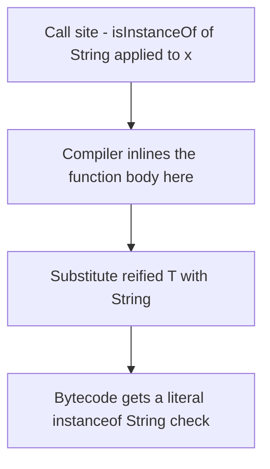
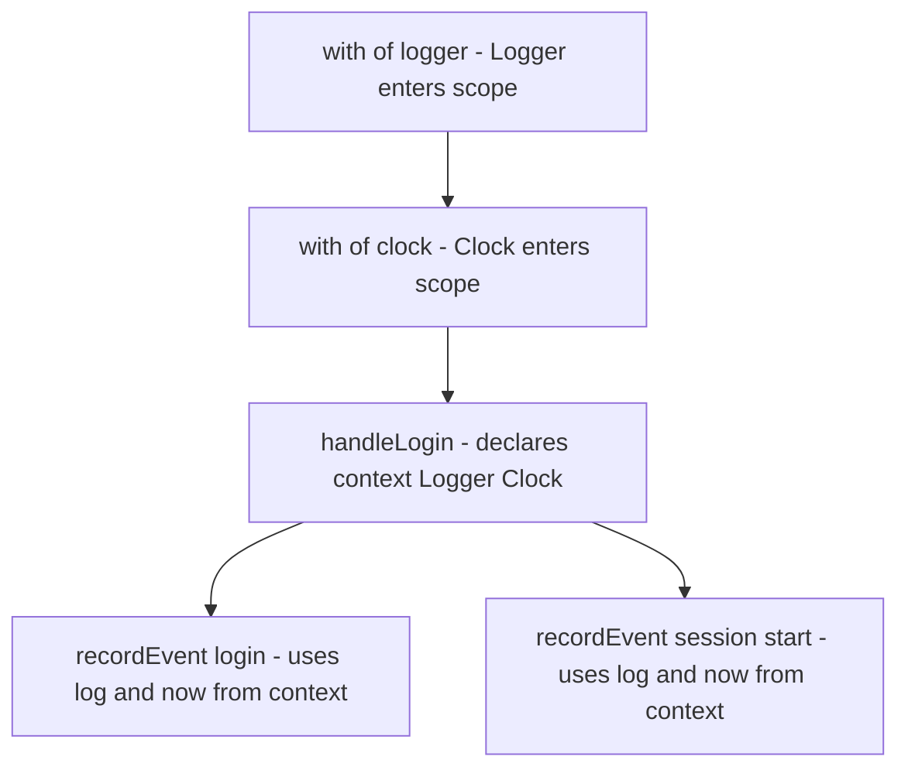

# Lecture 2 — Inline functions, reified types, and context receivers

> "`inline` is the compiler copying a function's body to the call site. Everything else this lecture — reified types, non-local returns, the cost you save — is a consequence of that one copy."

Lecture 1 gave you the types you parameterize and the erasure that forgets them. This lecture gives you the functions the compiler *copies*, and the way that copying buys back the type erasure threw away. We take it in the order the machinery builds: `inline` first (the copy), then `reified` (what the copy makes possible), then `crossinline`/`noinline` (the knobs on the copy), then SAM conversion (function types meeting Java interfaces), then context receivers (the Kotlin 2.x way to pass ambient capabilities). Keep `javap` open — every claim here is one disassembly away from proof.

---

## 1. The cost of a lambda, and what `inline` removes

Start with the problem `inline` solves. A higher-order function takes a function as a parameter:

```kotlin
fun repeatAction(times: Int, action: (Int) -> Unit) {
    for (i in 0 until times) action(i)
}

repeatAction(3) { println(it) }
```

What does the lambda `{ println(it) }` compile to? On the JVM, a function type like `(Int) -> Unit` is an *object* — an instance of a `Function1` class the compiler generates. So calling `repeatAction(3) { ... }` allocates a `Function1` object, and inside the loop `action(i)` is a virtual method call (`invoke`) on that object. For a hot path called thousands of times, that is allocation pressure and indirection you pay on every call. Confirm it with `javap`: the call site has a `new` and an `invokevirtual`.

Now mark it `inline`:

```kotlin
inline fun repeatAction(times: Int, action: (Int) -> Unit) {
    for (i in 0 until times) action(i)
}

repeatAction(3) { println(it) }
```

The `inline` keyword tells the compiler: **do not call this function — copy its body to the call site, and copy each lambda argument's body into the place it's invoked.** After inlining, `repeatAction(3) { println(it) }` compiles to *exactly* what you would have written by hand:

```kotlin
for (i in 0 until 3) println(i)   // morally what the inlined call site becomes
```

No `Function1` object is allocated. No `invoke` call. The lambda's body is spliced directly into the loop. `javap` on the call site now shows the `println` inline in the loop with no `new` and no `invokevirtual` for the lambda. That is the performance win, and it is why the entire Kotlin standard library's scope functions (`let`, `run`, `with`, `apply`, `also`, `repeat`, `forEach`) are `inline` — they take a lambda, and inlining makes them zero-cost over hand-written code.

**The cost of `inline`:** the body is copied to *every* call site, so the bytecode grows. Inlining a large function called from a hundred places bloats the binary. The rule of thumb:

- **Inline it** if it takes a lambda and is small — the allocation you remove is worth the copy.
- **Don't inline it** if it has no lambda parameters — there's nothing to gain, only size to lose (the compiler warns you).
- **Keep it small** — a big inline body multiplied across many call sites is real binary bloat.

The compiler will warn you when `inline` buys nothing, and that warning is worth heeding — reflexive `inline` on every function is a junior tell, not an optimization.

---

## 2. Non-local returns — the second thing inlining enables

Because an inline lambda's body is *literally copied into the calling function*, a `return` inside it returns from the *enclosing function*, not just the lambda. This is a **non-local return**, and it is impossible without inlining:

```kotlin
fun findFirstEven(numbers: List<Int>): Int? {
    numbers.forEach { n ->         // forEach is inline
        if (n % 2 == 0) return n   // returns from findFirstEven, not just the lambda
    }
    return null
}
```

Because `forEach` is inline, the lambda body is copied into `findFirstEven`, so `return n` is a plain `return` from `findFirstEven` — exactly as if you'd written a `for` loop with a `return`. This reads naturally precisely because inlining made it a real return.

If `forEach` were *not* inline, this would not compile — a lambda is a separate function object, and you cannot `return` from a function you're not lexically inside. (You could write `return@forEach`, a *local* return that just exits the lambda — but that is a different, weaker thing.) Non-local return is a gift of inlining, and it is the reason `crossinline` exists (§4).

---

## 3. Reified type parameters — buying back the erased type

Now the headline. Lecture 1 established that a normal generic function cannot see `T` — erasure forgot it:

```kotlin
fun <T> isInstanceOf(x: Any): Boolean {
    // return x is T          // COMPILE ERROR: cannot check erased type T
    TODO("can't be written")
}
```

But an **inline** function can mark a type parameter **`reified`**, and then `T` becomes usable as a real type — `is T`, `as T`, `T::class`, `T::class.java` all work:

```kotlin
inline fun <reified T> isInstanceOf(x: Any): Boolean = x is T   // compiles!

isInstanceOf<String>("hi")   // true
isInstanceOf<Int>("hi")      // false
```

**How is this possible if erasure is real?** It does not defeat erasure — it sidesteps it with inlining. Because the function is inlined, its body is copied to the call site, and *at the call site the concrete type is known*. So `isInstanceOf<String>("hi")` doesn't compile a generic `x is T`; it compiles, at that exact call site, to `x is String` — a literal, checkable type. The `<String>` you wrote at the call site is substituted into the copied body. `javap` proves it: the call site contains an `instanceof java/lang/String`, not a generic check. The type wasn't recovered at runtime; it was *baked in* at compile time, call site by call site.

This is the sentence to be able to say to a staff engineer: **reification is a call-site type substitution made possible by inlining; it does not change erasure, it routes around it by copying the body to where the type is still known.**


*Reification is not runtime type recovery — it is the compiler substituting the call site's concrete type into a copied body.*

The canonical uses you'll write all week:

```kotlin
inline fun <reified T> List<*>.filterIsInstance(): List<T> = filter { it is T }.map { it as T }

inline fun <reified T> Gson.fromJson(json: String): T = fromJson(json, T::class.java)

inline fun <reified T : Enum<T>> enumValueOfOrNull(name: String): T? =
    enumValues<T>().firstOrNull { it.name == name }
```

Each reads cleanly *because* the caller's `<T>` becomes a concrete type in the body.

**The restrictions, all consequences of "it only works at a call site":**

- **`reified` requires `inline`.** No inlining → no call site to substitute into → no way to know `T`. The compiler enforces it.
- **You cannot store a `reified T` or use it where there is no call site.** You can't have a `reified` type parameter on a *class* (a class isn't inlined), can't put `T::class` in a field initialized once, can't pass `T` to a non-reified generic and expect `::class` to survive. Reification lives and dies at the call site.
- **`T::class` works; a non-reified `T::class` does not.** The whole point.

Reification is how the mini-project's `subscribe<UserLoggedIn> { }` works: `reified` captures `UserLoggedIn` at the call site, the body computes `UserLoggedIn::class`, and the bus routes on that key — no `Class` parameter, no caller cast.

### Proving the substitution with `javap`

Don't believe it — disassemble it (the exercise-2 deliverable). This call site:

```kotlin
fun check(x: Any): Boolean = isInstanceOf<String>(x)   // inline fun <reified T> isInstanceOf(x): x is T
```

`javap -c` on `check`'s class shows, in essence:

```text
public final boolean check(java.lang.Object x);
   0: aload_1
   1: instanceof    java/lang/String    // <-- a LITERAL instanceof String, not a generic check
   4: ireturn
```

There is no generic `T` anywhere in the bytecode — the compiler inlined `isInstanceOf`'s body into `check` and substituted `String` for `T`, producing a plain `instanceof java/lang/String`. Call `isInstanceOf<Int>(x)` elsewhere and *that* call site gets `instanceof java/lang/Integer`. Each call site bakes in its own concrete type. This is the single most important thing to *see* this week: reification didn't recover a type at runtime (impossible — erasure), it *substituted* the type at compile time, call site by call site, made possible only because the body was inlined there. The `javap` output is the proof, and "I disassembled it and saw the concrete `instanceof`" is the answer that convinces a staff engineer you actually understand it.

---

## 4. `crossinline` and `noinline` — the knobs on the copy

Two modifiers refine *which* lambdas get inlined and how.

**`crossinline` — inlined, but no non-local return.** Sometimes you inline a function, but one of its lambdas is invoked from a *different execution context* — inside another lambda, a `Runnable`, an object you construct. In that case a non-local return would be unsound (you'd be returning from the enclosing function from inside, say, a thread's `run`), so the compiler forbids it. You signal this with `crossinline`:

```kotlin
inline fun runOnBackground(crossinline block: () -> Unit) {
    val runnable = Runnable { block() }   // block is invoked from INSIDE another object
    Thread(runnable).start()
}

fun caller() {
    runOnBackground {
        // return        // COMPILE ERROR: crossinline forbids non-local return — good,
                         // because returning from `caller` inside a Thread is nonsense
        println("on a thread")
    }
}
```

`crossinline` says: "still inline this lambda's body (no `Function` allocation), but it's called from another context, so you may not non-local-return out of it." It is the precise tool for "I want inlining's performance but the lambda escapes into a nested execution context." You will meet this exact situation in Week 04 — a coroutine builder inlines its block but runs it in a coroutine, so a non-local return would escape the coroutine; `crossinline` is why it's disallowed.

**`noinline` — opt one lambda out of inlining.** When an inline function has multiple lambda parameters and you need to *store* one, or *pass it on* to a non-inline function, that lambda can't be inlined (an inlined lambda has no object to store). Mark it `noinline`:

```kotlin
inline fun process(
    inlined: () -> Unit,          // inlined as usual
    noinline stored: () -> Unit   // NOT inlined — remains a real Function object
) {
    inlined()
    registerCallback(stored)      // can pass it on, because it's a real object
}
```

`noinline` keeps that one lambda as a genuine `Function` instance so you can store it in a field, put it in a list, or hand it to a non-inline API. The other lambdas still inline.

The summary table for the whiteboard:

| Modifier | Lambda allocated? | Non-local return allowed? | Use when |
|---|---|---|---|
| (default inline) | No | Yes | The normal case |
| `crossinline` | No | **No** | Lambda invoked from a nested execution context |
| `noinline` | **Yes** | n/a (it's a real object) | You must store or forward the lambda |

### When to inline — and when not to

`inline` is a tool with a cost, and using it reflexively is a junior tell. The cost is **bytecode size**: the body is copied to every call site, so an `inline` function called from a hundred places makes a hundred copies. Two rules keep you honest:

- **Inline functions that take lambdas.** That's where the win is — eliminating the `Function` allocation. The stdlib scope functions (`let`, `run`, `apply`, `also`, `with`, `repeat`, `forEach`) are all inline for exactly this reason: they take a lambda, and inlining makes them zero-cost.
- **Don't inline a big function with no lambda parameters.** There's nothing to gain — no lambda to eliminate — and only size to lose. The compiler will warn you (`Expected performance impact from inlining is insignificant`). If you reach for `inline` and there's no lambda, you probably wanted `reified` (which *requires* inline) — that's the one case inlining a lambda-less function is justified.

There's also `inline` on **properties** (a property with no backing field, whose getter is inlined) and on **value classes** (Week 02's inline value classes are a related-but-distinct feature — they inline the *value*, not a function body). And a subtle one: an `inline` function's body is copied to the caller, so it can only access things the caller can access — which is why an `inline` function that needs to touch a `private` or `internal` member must mark that member `@PublishedApi internal` (you'll use exactly this in the mini-project, where the inline `subscribe` calls an internal `register`). The rule of thumb: **reach for `inline` when there's a lambda to eliminate or a type to reify; otherwise leave it off and let the JIT do its job.**

---

## 5. SAM conversion and `fun interface`

A **Single Abstract Method (SAM) interface** is an interface with exactly one abstract method — Java's `Runnable`, `Comparator`, `OnClickListener`. Kotlin lets you pass a lambda where a Java SAM interface is expected, converting automatically:

```kotlin
// Runnable is a Java SAM interface. Kotlin converts the lambda to a Runnable instance.
Thread { println("running") }.start()         // lambda -> Runnable, SAM conversion

button.setOnClickListener { v -> /* ... */ }   // lambda -> View.OnClickListener
```

This is **SAM conversion**: the compiler wraps your lambda in an anonymous instance of the interface. It works automatically for **Java** interfaces.

For **Kotlin** interfaces, SAM conversion does *not* happen by default — a Kotlin interface is just an interface, and you'd have to write `object : MyInterface { override fun ... }`. Unless you mark it `fun interface`:

```kotlin
fun interface Validator {              // `fun interface` = a Kotlin SAM interface
    fun validate(input: String): Boolean
}

val notBlank = Validator { it.isNotBlank() }   // SAM conversion now works for this Kotlin type
notBlank.validate("hi")                        // true
```

`fun interface` declares a Kotlin functional interface so callers can pass a lambda. When do you reach for it over a plain function type `(String) -> Boolean`? Two reasons: when you want a **named type** with a meaningful name (`Validator` reads better than `(String) -> Boolean` in a public API), and when you want to add **other members** or want Java callers to get a clean interface. Otherwise, a plain function type is simpler — prefer `(String) -> Boolean` unless the name or interop earns the `fun interface`.

A subtlety worth knowing: a Kotlin function type and a `fun interface` are *not* interchangeable without the conversion. If an API takes `Validator`, you cannot pass a `(String) -> Boolean` variable directly — you'd wrap it as `Validator(myLambda)`. This is occasionally a surprise; the lambda *literal* converts, but a function-typed *value* needs the explicit wrap.

---

## 6. Context receivers — ambient capabilities (Kotlin 2.x)

The last piece is the newest. You already know **extension receivers** from Week 01: `fun String.shout() = uppercase() + "!"` declares a function callable as `"hi".shout()`, where `this` inside is the `String`. The extension receiver is an *implicit* parameter you call members on without qualification.

**Context receivers generalize this to multiple implicit receivers.** The motivation: some functions need ambient capabilities — a `Logger`, a `Clock`, a `TransactionScope`, a `CoroutineScope` — that are awkward to pass as parameters (they clutter every signature and they're not really "arguments," they're *context*). The old workarounds were extension receivers (but you only get one) or threading parameters everywhere (noisy). Context receivers let you declare: "this function can only be called where these receivers are in scope."

```kotlin
// Enable in build.gradle.kts:  freeCompilerArgs += "-Xcontext-receivers"

interface Logger { fun log(msg: String) }
interface Clock { fun now(): Long }

// This function REQUIRES a Logger and a Clock in scope. It can call their members
// without qualification — log(...) and now() resolve to the context receivers.
context(Logger, Clock)
fun recordEvent(name: String) {
    log("event '$name' at ${now()}")   // both log() and now() come from context receivers
}
```

To *call* `recordEvent`, you must provide both receivers in scope — `with` puts them there:

```kotlin
val logger = object : Logger { override fun log(msg: String) = println(msg) }
val clock = object : Clock { override fun now() = System.currentTimeMillis() }

with(logger) {
    with(clock) {
        recordEvent("login")   // both Logger and Clock are in scope -> call type-checks
    }
}
```

Inside `with(logger) { with(clock) { ... } }`, both a `Logger` and a `Clock` are receivers in scope, so `recordEvent`'s `context(Logger, Clock)` requirement is satisfied. Outside that scope, calling `recordEvent` is a **compile error** — you cannot call it without the capabilities it declares it needs. That compile-time guarantee is the point: the function *cannot run* without its context, and the type system enforces it.

The propagation property is where context receivers really pay off. A function that *itself* declares the same context can call the requiring function without re-providing anything:

```kotlin
context(Logger, Clock)
fun handleLogin(userId: String) {
    recordEvent("login:$userId")          // no with(...) here — the context is ALREADY in scope
    recordEvent("session-start:$userId")  // capabilities flow through implicitly
}

// The with(...) lives at the TOP of the call tree, once:
with(logger) { with(clock) { handleLogin("u-42") } }
```

`handleLogin` doesn't take or pass `logger`/`clock` — because it declares `context(Logger, Clock)`, the receivers are in scope inside it and propagate to every requiring call it makes. Contrast the parameter version, where `handleLogin(logger, clock, userId)` would thread both capabilities through and re-pass them to every call. The capability is declared once at the leaf functions, required up the chain by type, and provided once at the root with `with`. That "declare the need in the type, satisfy it once at the top" shape is exactly how ambient capabilities *should* flow, and it's why the Kotlin team and libraries like Arrow are building toward it.


*Capabilities are provided once at the root with `with`, then propagate implicitly to every call that declares the same context.*

**Why context receivers beat the alternatives:**

- **Versus extra parameters:** `recordEvent` doesn't take `logger` and `clock` as arguments, so its signature stays about *what it does* (`name: String`), not *what it needs* (the capabilities). Capabilities propagate implicitly through nested calls — a function that calls `recordEvent` and itself has `context(Logger, Clock)` doesn't need to re-pass them.
- **Versus extension receivers:** you get *more than one*. An extension function has exactly one receiver; context receivers compose any number.
- **Versus a global/singleton `Logger`:** the dependency is explicit in the type and swappable per call scope — testable, no hidden global, the compiler checks it's provided.

**The honest status.** Context receivers are **experimental** in Kotlin 2.x, gated behind `-Xcontext-receivers`, and the design is actively evolving toward a refined form called **context parameters** (the syntax and some semantics are changing in newer Kotlin releases). The *concept* — ambient capabilities the type system requires and checks — is stable and worth learning now, because it is where modern Kotlin DSLs and the next generation of Android architecture libraries are heading. But pin your code to the Kotlin version you're on, read the current release notes (resources.md), and expect the exact spelling to shift. We teach the concept and the current syntax, flag clearly that it's pre-stable, and you'll adapt the spelling when context parameters land.

---

## 7. A worked trace — reified routing meets context receivers

Let's connect the lecture's pieces in the shape the mini-project uses. Here is a tiny typed dispatcher that captures the event type with `reified` and logs through a context receiver:

```kotlin
class Dispatcher {
    val handlers = mutableMapOf<Class<*>, MutableList<(Any) -> Unit>>()

    // reified T captures the concrete event type at the CALL SITE, so the public API
    // takes no Class parameter and forces no caller cast.
    inline fun <reified T : Any> on(noinline handler: (T) -> Unit) {
        // noinline: we STORE the handler in the map, so it must remain a real object.
        @Suppress("UNCHECKED_CAST")
        handlers.getOrPut(T::class.java) { mutableListOf() }
            .add(handler as (Any) -> Unit)   // the single internal cast, guarded by T::class
    }

    fun post(event: Any) {
        handlers[event.javaClass]?.forEach { it(event) }
    }
}
```

Read what each modifier earns:

- **`inline` + `reified T`**: `on<UserLoggedIn> { }` substitutes `UserLoggedIn` into `T::class.java` at the call site, so the map is keyed by the real class with no `Class` parameter in the public signature.
- **`noinline handler`**: the handler is *stored* in the map, so it must stay a real `Function` object — it cannot be inlined. This is exactly footgun §4's `noinline` case.
- **The single cast** `handler as (Any) -> Unit`: the one unchecked cast in the whole design, and it's *safe* because `post` only ever invokes a handler with an event whose `javaClass` matches the key the handler was filed under — the `reified T` proved the relationship. The caller never sees a cast; the `ClassCastException` surface is zero.

Add a context receiver and the dispatcher gains ambient logging without a parameter:

```kotlin
context(Logger)
fun Dispatcher.postLogged(event: Any) {
    log("dispatching ${event.javaClass.simpleName}")   // log() from the context receiver
    post(event)
}
```

`postLogged` requires a `Logger` in scope to be called at all — the capability is in the type, checked by the compiler, invisible in the argument list. That is the whole week in one screen: **reified captures the type the runtime erased; inline makes that capture possible; noinline keeps the stored lambda real; the single guarded cast is safe because of what reified proved; and the context receiver carries an ambient capability the type system enforces.**

---

## 8. Recap

Lecture 1 was the types you parameterize and the erasure that forgets them. This lecture was the functions the compiler copies and the type that copying buys back. Three habits carry it:

1. **`inline` copies the body to the call site.** That's the whole feature — and it's why the lambda allocation disappears, why non-local returns work, and why reification is possible. Inline lambda-taking functions; keep them small.
2. **`reified` is call-site type substitution.** It doesn't beat erasure; it routes around it by baking the concrete type into the inlined body. It needs `inline`, can't be stored, and lives only at the call site — every restriction follows from that one fact.
3. **Context receivers are ambient capabilities the type system requires.** `context(Logger, Clock) fun ...` can only be called where those receivers are in scope; provide them with `with`. Experimental, evolving to context parameters — learn the concept now, pin the spelling to your Kotlin version.

And the thread tying all three together, the one to carry out of the week: **the ergonomic Kotlin API you love to *call* is effortful to *write*, and that effort is exactly this machinery.** `buildList { }` is an inline receiver lambda. `encodeToString<T>()` is reified. `with(scope) { }` is a context (the precursor to context receivers). Every API that "just works" without making you pass a `Class`, allocate a callback object, or thread a logger through ten signatures is paying that cost *for* you, in inline/reified/context. Once you can build it, you can read it — and you'll never again treat a clean Kotlin API as magic.

You now have both halves of the week: the generics and variance you can explain out loud, and the inline/reified/context machinery that powers every ergonomic Kotlin API you use. The exercises make you annotate variance until the assignments type-check, write reified helpers and prove the substitution with `javap`, and refactor parameter-threading into context receivers. The challenge builds a type-safe DSL; the mini-project builds `kt-bus`, whose entire public API is the "no casts in the caller" promise made real. Go write the API that feels effortless to call and is effortful to write — that asymmetry is the craft.
