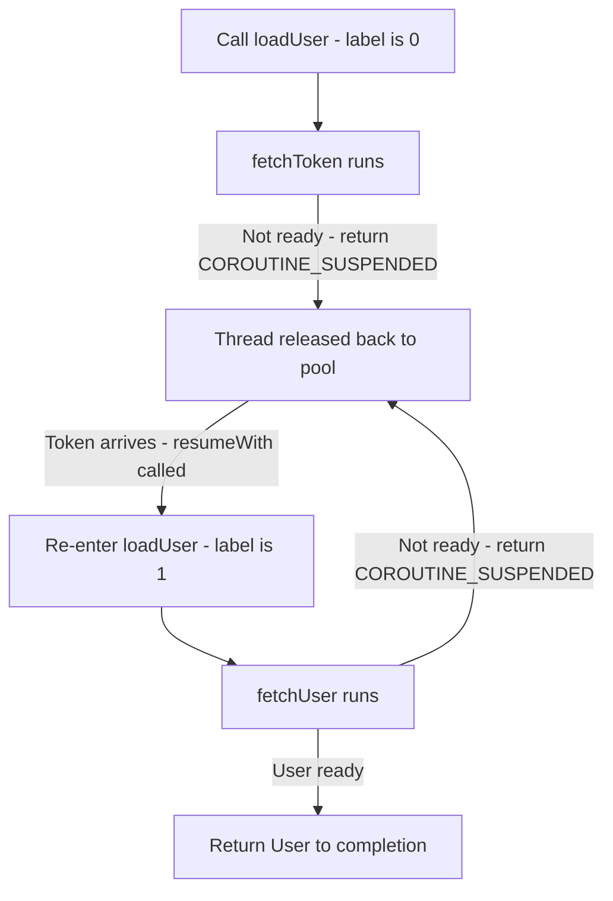
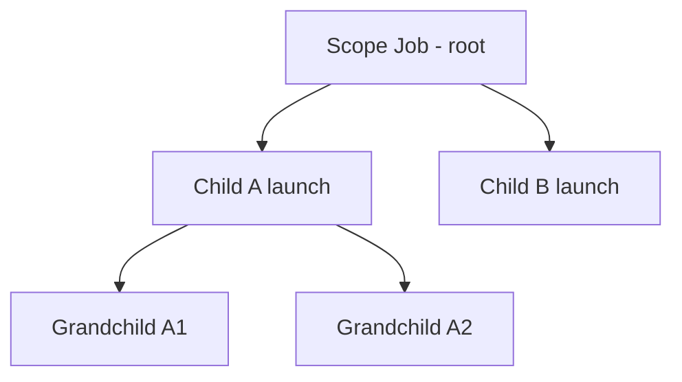

# Lecture 1 — Suspend, continuations, and the state machine: what a coroutine actually is

> "Coroutines are not lightweight threads. They are interruption points the compiler inserts for you."

This is the lecture that decides whether coroutines feel like magic or like something you can disassemble and reason about. The framing for the whole week is one sentence: **a `suspend` function is an ordinary function that the compiler has rewritten into a continuation-passing state machine.** Hold that, and every surprise this week — why `launch` returns immediately, why a coroutine can resume on a different thread, why cancellation is *cooperative* — has a concrete explanation in the generated code. Lose it, and you are sprinkling `suspend` on functions and hoping.

We build the model bottom-up: the transform (what `suspend` compiles to), then the runtime objects (`CoroutineScope`, `Job`, `CoroutineContext`), then the builders (`launch`, `async`), then the dispatchers (where the code actually runs). By the end you should be able to draw the parent-child `Job` tree on a whiteboard and point at which object owns cancellation.

---

## 1. The wrong mental model, and why it hurts you

Open any introductory article and you will read "coroutines are lightweight threads." This is wrong in a way that will cost you a debugging session.

A thread is an OS-scheduled execution context with its own stack, costing roughly 1 MB of memory and a kernel-managed context switch. You can have a few thousand on a phone before you run out of memory. A coroutine is *none of that*. A coroutine is a **suspendable computation** — a block of code that can pause itself at well-defined points, hand its thread back to a pool, and be resumed later. You can have a *million* coroutines on a phone, because a suspended coroutine costs only the memory of its captured state — a small object on the heap — and no thread at all while it waits.

The reason "lightweight thread" hurts you: it makes you think each coroutine *owns* a thread, so you reason about them as if `launch` spawned something. It did not. `launch` scheduled a computation onto a dispatcher, and that computation will be multiplexed — along with thousands of others — onto a handful of real threads. When the computation hits a `suspend` call that has to wait (a network read, a `delay`), it *releases the thread* so another coroutine can use it. That multiplexing is the entire performance story, and it is invisible if you think "thread."

The right model: **a coroutine is a value (a computation) scheduled onto a dispatcher's small thread pool, that can suspend and resume.** Threads are the workers; coroutines are the work.

---

## 2. What `suspend` means

A function marked `suspend` can do one thing a normal function cannot: it can **suspend** — pause without blocking the thread. Look at this:

```kotlin
suspend fun loadUser(id: String): User {
    val token = fetchToken()        // suspend point 1
    val user = fetchUser(id, token) // suspend point 2
    return user
}
```

`fetchToken()` and `fetchUser()` are themselves `suspend` functions. At each call, `loadUser` *might* suspend — release its thread and wait for the network — and then *resume* exactly where it left off, with all its local state (`token`) intact. To a normal function, "pause here and come back later with my locals preserved" is impossible; the stack frame is gone the moment you return. The compiler makes it possible by *not using the call stack* to hold that state. It hoists the locals and the "where was I" into a heap object and threads that object through every call.

That heap object is the **`Continuation`**.

---

## 3. The continuation-passing transform — read it, don't take it on faith

Here is the single most important fact about the implementation: **`suspend fun loadUser(id: String): User` does not have the signature you wrote.** After the K2 compiler is done, it has an extra parameter and a different return type. Conceptually:

```kotlin
// What you wrote:
suspend fun loadUser(id: String): User

// What the compiler generates (conceptually):
fun loadUser(id: String, completion: Continuation<User>): Any?
```

Two changes:

1. **An extra `Continuation<User>` parameter** — `completion`. This is "the thing to call when I'm done," carrying the rest of the computation. Continuation-passing style: instead of *returning* to the caller, the function will eventually *call* `completion.resumeWith(result)`.
2. **The return type becomes `Any?`** so the function can return one of two things: the actual `User`, *or* a special sentinel `COROUTINE_SUSPENDED` meaning "I'm not done, I suspended; I'll call the continuation later."

The body is rewritten into a **state machine**: a `when` over an integer `label`, where each `label` value is the code between two suspend points. Conceptually the generated body looks like this:

```kotlin
fun loadUser(id: String, completion: Continuation<User>): Any? {
    // The state object: holds the label and the locals across suspensions.
    class LoadUserStateMachine(completion: Continuation<Any?>) : ContinuationImpl(completion) {
        var label = 0
        var token: String? = null
        var result: Any? = null
        override fun invokeSuspend(r: Any?): Any? {
            result = r
            return loadUser(id, this)   // re-enter with this state machine as the continuation
        }
    }

    val sm = completion as? LoadUserStateMachine ?: LoadUserStateMachine(completion as Continuation<Any?>)

    when (sm.label) {
        0 -> {
            sm.label = 1
            val r = fetchToken(sm)              // pass the state machine as the continuation
            if (r == COROUTINE_SUSPENDED) return COROUTINE_SUSPENDED  // bail; resumed later
            sm.token = r as String
            // fall through to the next state
        }
        1 -> {
            val token = sm.token as String
            sm.label = 2
            val r = fetchUser(id, token, sm)
            if (r == COROUTINE_SUSPENDED) return COROUTINE_SUSPENDED
            return r                            // the final User
        }
        else -> error("unreachable")
    }
    // ...
}
```

The real generated code is denser and uses a single `when` with fall-through, but the shape is exactly this:

- **The locals you care about across a suspend point (`token`) are fields of the state machine**, not stack variables. That is why your locals survive a suspension — they were never on the stack to begin with.
- **`label` records which suspend point you are at.** Resuming means re-entering the function with the same state machine; the `when (label)` jumps to where you left off.
- **`COROUTINE_SUSPENDED` is the "I'm not done" signal.** If `fetchToken` actually has to wait (network), it returns the sentinel; `loadUser` returns the sentinel to *its* caller, all the way up, releasing the thread. When the network result arrives, something calls the saved continuation's `resumeWith`, which re-invokes `loadUser` with `label == 1`, and it continues.

This is **continuation-passing style (CPS)**, and it is the whole trick. No threads were harmed. The function "paused" by returning a sentinel and stashing its state in a heap object; it will "resume" when someone calls its continuation.


*The state machine bails with a sentinel on suspension and re-enters at the saved label on resume.*

You will read this for real in exercise 01. Compile a two-suspend-call function, run `javap -c -p` on the class, and you will see: an extra `Continuation` parameter, a synthetic inner class for the state machine, a field for each surviving local, an integer `label`, and a `tableswitch` (the `when`). The first time you see your own `suspend fun` disassembled into that shape, coroutines stop being magic.

### Why this matters beyond trivia

Three practical consequences fall straight out of the transform:

- **A `suspend` function can only be called from another `suspend` function or a coroutine builder.** Because the caller must supply a `Continuation`. A normal function has none to give. That is the compile error "Suspend function can only be called within a coroutine."
- **Suspension is free of thread-blocking, but not free.** Each suspend point is a potential heap allocation (the state object) and a `when` dispatch. Cheap, but not zero — which is why you do not mark a hot, never-suspending function `suspend` for no reason.
- **Resuming can happen on a different thread.** The continuation is just an object; whoever calls `resumeWith` decides the thread (via the dispatcher, §6). That is why your locals are on the heap, not a thread's stack — they have to survive a thread change.

---

## 4. `CoroutineScope` and `CoroutineContext` — the runtime around the transform

The transform explains *one* coroutine. Structured concurrency is about *many* coroutines and who owns them. That ownership lives in two objects people constantly confuse: the **context** and the **scope**.

A **`CoroutineContext`** is an immutable, indexed set of elements — think a typed map. The elements you care about:

- A **`Job`** — the handle to this coroutine's lifecycle (running, completing, cancelled).
- A **`CoroutineDispatcher`** — which thread pool runs it (`Main`, `IO`, `Default`).
- A **`CoroutineName`** — a label for debugging.
- A **`CoroutineExceptionHandler`** — the last-resort handler for uncaught exceptions.

You combine them with `+`:

```kotlin
val context = Dispatchers.IO + CoroutineName("loader") + SupervisorJob()
```

A **`CoroutineScope`** is, almost literally, *a holder of a `CoroutineContext` whose context contains a `Job`*. Its entire purpose is to be the **parent** of the coroutines you launch in it. When you write `scope.launch { ... }`, the new coroutine's `Job` becomes a *child* of the scope's `Job`. That parent-child link is structured concurrency.

```kotlin
val scope = CoroutineScope(Dispatchers.Default + SupervisorJob())
scope.launch { /* child 1 */ }
scope.launch { /* child 2 */ }
// scope.cancel() cancels the parent Job, which cancels every child.
```

The distinction to tattoo: **a context is a bag of configuration; a scope is a context that you launch coroutines *into*, establishing parentage.** You pass *context* to tune a coroutine; you hold a *scope* to own a tree of them.

---

## 5. `Job` and the parent-child tree — the heart of the discipline

Every coroutine is backed by a **`Job`**. A `Job` has a lifecycle — *New → Active → Completing → Completed*, or *→ Cancelling → Cancelled* — and, crucially, **a parent and a set of children**. The rules that make structured concurrency work:

1. **A parent does not complete until all its children complete.** `coroutineScope { launch { a() }; launch { b() } }` returns only after both `a()` and `b()` finish. The scope *waits*. This is why structured code reads top-to-bottom even though it is concurrent.
2. **Cancelling a parent cancels all children.** `scope.cancel()` propagates down the tree. This is the property that makes a cleared `ViewModel` take its in-flight work with it.
3. **A failing child (under a regular `Job`) cancels its parent and siblings.** If `a()` throws, the exception propagates *up* to the parent `Job`, which cancels itself and therefore `b()` too. One failure tears down the whole sub-tree. (Whether you *want* that is the `Job`-vs-`SupervisorJob` decision in lecture 02.)

Draw it as a tree. The scope's `Job` is the root. Each `launch`/`async` adds a child. Cancellation and failure flow *down* (parent cancels children) and failure flows *up* (child failure cancels parent under a regular `Job`). When you can sketch that tree and trace a cancellation through it, you understand structured concurrency.

```kotlin
val parent = CoroutineScope(Job())
parent.launch {                 // child A
    launch { /* grandchild A1 */ }
    launch { /* grandchild A2 */ }
}
parent.launch { /* child B */ }
// parent.cancel() -> A, A1, A2, B all cancelled. Nothing leaks.
```


*Cancellation and a parent's completion-wait flow down this tree; an unhandled child failure under a regular Job flows back up.*

---

## 6. `launch` vs `async`, and dispatchers — starting work and placing it

Two builders create children in a scope:

- **`launch`** — fire-and-forget. Returns a `Job`. Use it when you want the work to happen and you do not need a value back. An exception inside `launch` propagates to the parent immediately.
- **`async`** — returns a `Deferred<T>`, a `Job` that also carries a result. You `await()` it to get the value. An exception is *held* inside the `Deferred` and re-thrown when you `await()`.

```kotlin
coroutineScope {
    // Parallel decomposition: start both, then await both.
    val a = async { fetchProfile() }
    val b = async { fetchSettings() }
    val screen = ScreenData(profile = a.await(), settings = b.await())
    // coroutineScope returns only after both children complete.
}
```

Use `launch` for side effects, `async` for "I need this value." The exception difference (§ lecture 02) is the part people get wrong: an exception in `launch` surfaces immediately; an exception in `async` waits politely until `await()`, which means an `async` you never `await` can swallow a failure.

One more builder you will see and must *not* misuse: **`runBlocking`**. It bridges the blocking world (a `main` function, a JUnit `@Test`, a synchronous SDK callback) into the suspending world by *blocking* the calling thread until its body completes. It is the one builder that is allowed to block a thread, precisely because it is the boundary between the two worlds. Use it in `fun main`, in tests that are not on `runTest`, and nowhere else — never on the Android main thread, where it would freeze the UI exactly like any other blocking call. The mini-project's CLI entry point uses `runBlocking`; the rest of the code uses `coroutineScope`/`launch`/`async` and never blocks.

There is also **`CoroutineStart`**, the optional `start` parameter on `launch`/`async`. `CoroutineStart.DEFAULT` schedules the body immediately; `CoroutineStart.LAZY` defers it until you `start()` or `await()` it; `CoroutineStart.UNDISPATCHED` runs the body up to its first suspension *in the current thread* before dispatching. You will not need `LAZY` or `UNDISPATCHED` often, but knowing they exist explains why an `async(start = CoroutineStart.LAZY) { }` you never await never runs — its body was deferred and never triggered.

A **`CoroutineDispatcher`** decides *which thread* the coroutine runs on. Kotlin ships four, and picking the wrong one is a real bug:

| Dispatcher | Backed by | Use for | The bug if you misuse it |
|------------|-----------|---------|--------------------------|
| `Dispatchers.Main` | The UI thread (Android `Looper`) | Touching UI; quick orchestration | Doing CPU/I-O on it freezes the screen — an ANR on Android |
| `Dispatchers.IO` | A large elastic pool (64+ threads) | **Blocking** I/O: files, sockets, JDBC, blocking SDKs | None for I/O; using it for heavy CPU wastes threads |
| `Dispatchers.Default` | A pool sized to CPU cores | **CPU-bound** work: parsing, sorting, image math | Doing *blocking* I/O on it starves the few CPU threads and stalls all CPU work |
| `Dispatchers.Unconfined` | Whatever thread resumed it | Almost never; advanced/testing | Resuming on an unpredictable thread; never use in production |

The `IO`-vs-`Default` distinction is the one that matters. `IO` has *many* threads because blocking calls *park* a thread — you want lots of them so parking one doesn't stall everything. `Default` has *few* threads (one per core) because CPU work *uses* a thread fully — more threads than cores just thrashes. Run blocking I/O on `Default` and you can park all the CPU threads and freeze unrelated CPU work; run CPU work on `IO` and you waste 60 idle threads. Match the dispatcher to the *nature* of the work.

You switch dispatcher mid-coroutine with `withContext`:

```kotlin
suspend fun loadAndRender() {
    val bytes = withContext(Dispatchers.IO) { readFileBlocking() }     // park a thread on I/O
    val parsed = withContext(Dispatchers.Default) { parse(bytes) }      // CPU work on a core
    withContext(Dispatchers.Main) { render(parsed) }                    // back to the UI thread
}
```

`withContext` is *not* a new child coroutine; it is "run this block in a different context and come back." It is the idiomatic way to do "I-O off the main thread, then update the UI."

---

## 7. Putting it together — a structured fetch with no leaks

Here is everything in one place: a scope that owns the work, parallel decomposition with `async`, the right dispatchers, and structured completion.

```kotlin
import kotlinx.coroutines.*

data class Dashboard(val profile: Profile, val feed: List<Post>, val settings: Settings)

class DashboardLoader(private val api: Api) {

    // The scope this loader owns. SupervisorJob so one screen-section failure
    // doesn't nuke the others (lecture 02 explains the choice).
    private val scope = CoroutineScope(SupervisorJob() + Dispatchers.Default)

    suspend fun load(userId: String): Dashboard = coroutineScope {
        // coroutineScope: a child scope that WAITS for all three before returning,
        // and if one throws, cancels the other two (all-or-nothing — correct here,
        // because a half-built Dashboard is useless).
        val profile = async(Dispatchers.IO) { api.fetchProfile(userId) }
        val feed = async(Dispatchers.IO) { api.fetchFeed(userId) }
        val settings = async(Dispatchers.IO) { api.fetchSettings(userId) }

        Dashboard(
            profile = profile.await(),
            feed = feed.await(),
            settings = settings.await()
        )
        // We don't return until all three awaits complete. Structured.
    }

    fun cancelAll() = scope.cancel()   // tears down anything still running. No leaks.
}
```

Trace it against the model:

- `coroutineScope { }` creates a child scope whose `Job` is the parent of the three `async` children. It is a `suspend` function, so it has a continuation, so the `await()`s suspend without blocking.
- Each `async(Dispatchers.IO)` runs its fetch on the IO pool (blocking network), then resumes the parent.
- `coroutineScope` does not return until all three children complete — that is rule 1 from §5. The three fetches happen *concurrently* but the function still reads sequentially.
- If `fetchFeed` throws, the parent `Job` cancels, which cancels the other two `async`s, and `load` throws. No half-fetched leak. That is rule 3 — and here it is exactly what you want.

---

## 8. The leak you must never write

Against all of that, here is the anti-pattern the week exists to kill:

```kotlin
// WRONG. GlobalScope has no parent you can cancel. This coroutine outlives
// everything — the screen, the ViewModel, the request that started it.
fun onButtonClick() {
    GlobalScope.launch {
        val data = api.fetchExpensiveThing()
        updateUi(data)   // the screen may be GONE by now -> crash or stale write
    }
}
```

`GlobalScope` is a scope with no real parent and a lifecycle that lasts the whole process. A coroutine launched in it is *unstructured*: nothing owns it, nothing cancels it. The user backs out of the screen, but the fetch keeps going, and when it finishes it writes to a dead view. That is the orphaned-task bug structured concurrency abolishes. The fix is always the same: launch into a scope someone *owns* and *cancels* — in this week's exercises, a `CoroutineScope` you create and cancel in a test; in Phase 2, the `viewModelScope` that is cancelled when the `ViewModel` is cleared.

The reflex to build: **"what scope owns this coroutine, and who cancels that scope?"** If you cannot answer, you have a leak.

---

## 9. Recap — the one-layer-down habit

You will write coroutines all week. The discipline that turns you from someone who *uses* them into someone who can *debug* them is the reflex to ask, on every surprise, "what is the transform or the tree doing here?"

- `launch` returned immediately → it scheduled a child onto the dispatcher and handed you a `Job`; the body runs later.
- My locals survived a `delay` → they live in the state machine on the heap, not the stack.
- The coroutine resumed on a different thread → the continuation was resumed by a different dispatcher thread; locals were on the heap precisely so they could.
- Cancelling the scope stopped everything → cancellation flowed down the parent-child `Job` tree.
- A `GlobalScope.launch` kept running after the screen left → it had no parent to cancel it; that is the leak.

The transform explains one coroutine; the `Job` tree explains many. Learn both well enough to draw them, and you have the conceptual half of the skill this week earns: structured concurrency as a discipline you can reason about, not a buzzword.

In lecture 02 we go into the *failure* half — `coroutineScope` vs `supervisorScope`, the cooperative-cancellation contract and why `CancellationException` is special, the three cancellation bugs measured, and bounded parallelism for the downloader. Bring this `Job`-tree picture with you; we are about to cancel and break it on purpose.
