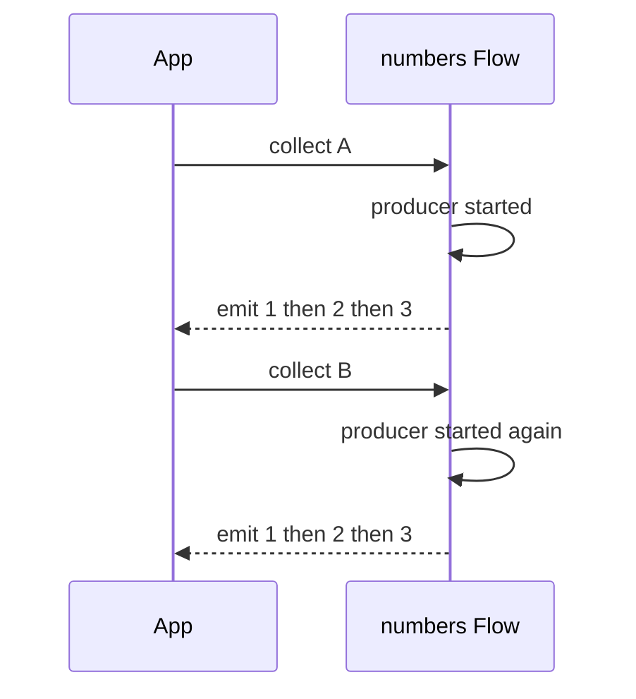
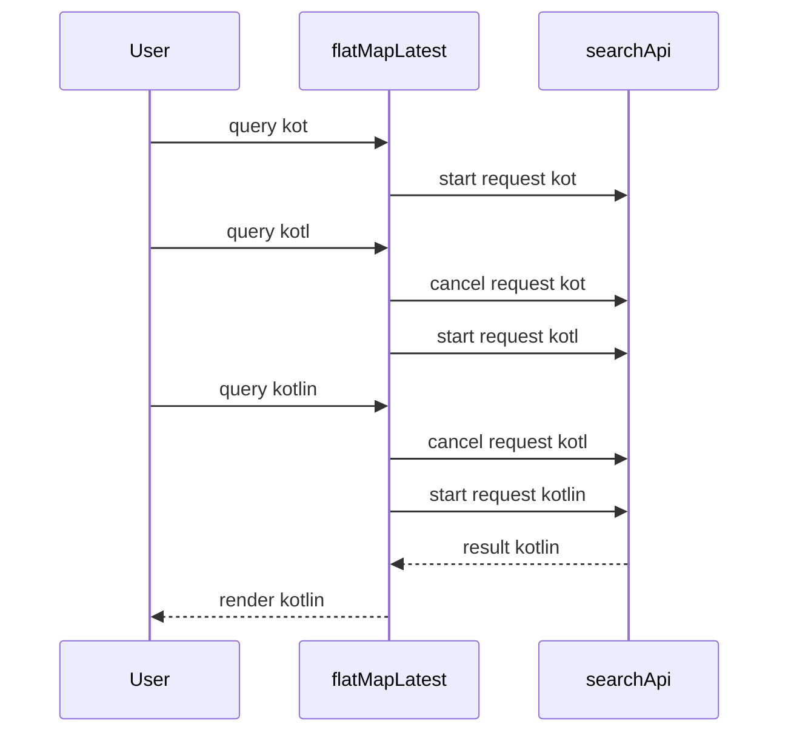

# Lecture 1 — Cold flows, the operator catalogue, and backpressure

> "A `Flow` is a recipe, not a meal. Nothing cooks until someone collects."

This is the lecture that builds the cold-flow half of the week. The framing for everything that follows is one sentence: **a cold `Flow<T>` is a suspending producer recipe that runs from scratch, every time, for each collector.** Hold that, and the operators, the threading, the backpressure, and next lecture's hot/cold distinction all fall out of it. Lose it, and you will be baffled the first time collecting a flow twice does the work twice.

We build the model bottom-up: what "cold" means and why, then the shaping operators, then the flat-mapping operators (the ones that actually take thought), then backpressure, then where the code runs (`flowOn`). By the end you should be able to look at any operator chain and say what it emits, in what order, on what thread.

---

## 1. What "cold" means, and why it is the whole story

Declaring a flow runs no code:

```kotlin
val numbers: Flow<Int> = flow {
    println("producer started")    // does NOT print here
    for (i in 1..3) {
        delay(100)
        emit(i)                    // hand a value to the collector
    }
}
// Nothing has run yet. `numbers` is a recipe.
```

The `flow { }` builder captures a *suspending producer block*. That block executes only when someone calls a **terminal operator** — `collect`, `toList`, `first`, `reduce`. Until then, `numbers` is inert. And crucially, the block runs **again, from the top, for each collector**:

```kotlin
numbers.collect { println("A: $it") }   // prints "producer started", A:1, A:2, A:3
numbers.collect { println("B: $it") }   // prints "producer started" AGAIN, B:1, B:2, B:3
```

Two collections, two independent runs of the producer, two "producer started" lines. This is **coldness**: a cold flow has no shared state, no current value, and no running process between collections. Each collector gets its own private execution. A cold flow is *lazy* (nothing until collected) and *per-collector* (re-runs each time).


*Each collector triggers its own from-scratch run of the producer block.*

Why does this matter so much? Because half the Flow bugs you will ever debug are someone forgetting it:

- "My API gets called twice." → You collected the same cold flow in two places; each collection re-ran the producer, which made the call.
- "My flow has no value when I ask for it." → A cold flow has no "current value"; there is nothing to ask. That is what `StateFlow` (next lecture) adds.
- "Two screens see different data from the same flow." → They each collected it cold and got independent runs.

The fix for "I want one shared, always-live execution" is to make the flow *hot* (`StateFlow`/`SharedFlow`, lecture 02). But the *default* and the right default for a data source — "go fetch this when someone actually wants it" — is cold. Cold is lazy, cheap, and composable. Reach for hot deliberately, not by accident.

### The builders

```kotlin
flowOf(1, 2, 3)                          // a fixed sequence
listOf("a", "b").asFlow()                // any Iterable/Sequence/Array -> Flow
flow { emit(compute()); emit(compute2()) } // the general suspending builder
(1..100).asFlow()                        // a range as a flow
channelFlow { send(x) }                  // concurrent emission (lecture 02)
callbackFlow { ... awaitClose { } }      // bridge a callback API (lecture 02)
```

`flow { }` is the workhorse. Inside it you may call suspend functions and `emit`. You may *not* `emit` from a different coroutine/context — that is the context-preservation rule (§5).

---

## 2. The shaping operators — transform without thinking too hard

These are the operators you reach for constantly. They are *intermediate* (they return a new `Flow` and run lazily) — none of them does anything until a terminal operator collects the chain.

```kotlin
flow
    .map { it.toUpperCase() }            // transform each value 1:1
    .filter { it.isNotBlank() }          // keep some values
    .onEach { log(it) }                  // side effect per value, passes it through
    .distinctUntilChanged()              // drop consecutive duplicates
    .take(10)                            // first 10 then complete (cancels upstream)
    .drop(2)                             // skip the first 2
    .runningReduce { acc, v -> acc + v } // emit the running accumulation
```

`transform` is the general one — `map` and `filter` are special cases of it. Use it when you need to emit *zero or many* values per input:

```kotlin
flow.transform { value ->
    if (value.isValid) {
        emit(value.header)               // emit two things for one input
        emit(value.body)
    }
    // emit nothing for invalid input
}
```

`scan`/`runningReduce` are underused and powerful: they turn a flow of *events* into a flow of *accumulated state* — exactly what you want when, say, a flow of "delta" events should become a flow of "running total." We use `scan` in the mini-project.

The **terminal** operators end the chain and trigger collection:

```kotlin
flow.collect { use(it) }                 // the fundamental terminal; suspends until done
val list = flow.toList()                 // collect everything into a List
val firstMatch = flow.first { it > 10 }  // first matching value, then cancel upstream
val sum = flow.reduce { a, b -> a + b }  // fold without a seed
val total = flow.fold(0) { a, b -> a + b } // fold with a seed
val count = flow.count()
```

`first`/`take` are how you *cancel* a flow early — they collect just enough, then cancel the upstream producer (which, per Week 4, stops it cooperatively at its next suspension).

A few more shaping operators you will reach for and should recognise:

- **`onStart { }` / `onCompletion { }`** — run a block before the first emission / after the flow finishes (or is cancelled). `onStart { emit(Loading) }` is the idiomatic way to prepend a loading state; `onCompletion { cause -> ... }` gives you the completion cause (`null` for normal, the exception for failure, a `CancellationException` for cancellation) — useful for "hide the spinner whatever happened."
- **`catch { }`** — catches exceptions from *upstream only* and lets you emit a fallback. Placement is load-bearing: `flow.map { }.catch { }` catches failures in the `map` and above, but **not** in the collector — a throw inside `collect { }` is not caught by an upstream `catch`. Put `catch` where the errors you mean to handle are, and handle collector errors with a plain `try`/`catch` around `collect`.
- **`retry(n) { predicate }` / `retryWhen`** — re-collect the upstream on failure, up to `n` times, optionally gated by a predicate (e.g. only retry `IOException`). This is the flow-level cousin of Week 4's retry helper, and it respects cancellation the same way.
- **`combine` / `zip`** — merge two flows. `combine` emits whenever *either* source emits, pairing the latest of each (use it for "current user × current settings → screen state"); `zip` pairs them in lock-step, one-to-one, waiting for both (use it when the pairing is positional, like request/response). `combine` is far more common in UI code, because you usually want "the latest of everything."

```kotlin
// combine: re-emit a screen state whenever EITHER the user or the theme changes.
combine(userFlow, themeFlow) { user, theme -> ScreenState(user, theme) }
    .onStart { emit(ScreenState.loading()) }   // prepend a loading state
    .catch { emit(ScreenState.error(it)) }      // upstream failures become a state
```

---

## 3. Flat-mapping — the operators that actually require a decision

Here is where Flow gets interesting and where the wrong choice ships a real bug. The flat-map operators take a flow whose values each *produce another flow*, and flatten the result. The three differ entirely in **what happens when a new upstream value arrives while the previous inner flow is still running.**

```kotlin
// Upstream: a flow of search queries. Inner: a flow (the network result for a query).
queries.flatMapXxx { query -> searchApi(query) }
```

- **`flatMapConcat`** — *sequential*. Wait for the previous inner flow to finish completely before starting the next. Order preserved, no concurrency. Use when each must complete and order matters (rare for UI; common for "process this queue one at a time").

- **`flatMapMerge`** — *concurrent, bounded*. Start the inner flow for each upstream value and merge all their emissions as they arrive, up to `concurrency` (default 16) in flight. Order *not* preserved. Use when you want all of them and don't care about order — e.g. fetch details for a list of IDs concurrently.

- **`flatMapLatest`** — *cancel-previous*. When a new upstream value arrives, **cancel the inner flow for the previous value** and start the new one. Only the latest matters. This is the Android workhorse:

```kotlin
// Search-as-you-type, done right. A new keystroke cancels the in-flight request
// for the now-stale query and starts the request for the new one.
val results: Flow<List<Hit>> = searchQuery
    .debounce(300.milliseconds)          // wait for typing to pause
    .distinctUntilChanged()              // ignore non-changes
    .flatMapLatest { query ->            // cancel the old request, start the new
        if (query.isBlank()) flowOf(emptyList())
        else searchApi.search(query)     // a suspend call wrapped as a flow
    }
```

The bug `flatMapLatest` prevents: with `flatMapMerge` (or no flat-map at all), the user types "kot", "kotl", "kotli", "kotlin" and you fire *five* requests; they return out of order; and the screen flickers between results for queries the user already deleted, sometimes settling on "kot" results because that request happened to return last. `flatMapLatest` cancels each stale request the instant the next query arrives, so only "kotlin" survives. You will build exactly this in exercise 02 and *prove with Turbine* that the stale result never appears.


*Only the request for the latest keystroke ever survives to render.*

`transformLatest` is `flatMapLatest`'s general cousin: it gives you a `transform`-style block (emit zero or many) that is cancelled and restarted when a new upstream value arrives. Reach for it when you need cancel-previous semantics but want to emit intermediate values (e.g. emit a "loading" then the result, cancelling both if a new query arrives).

The decision table to internalise:

| You want… | Operator |
|-----------|----------|
| Each inner flow to finish before the next; order matters | `flatMapConcat` |
| All inner flows concurrently, order doesn't matter | `flatMapMerge` (set `concurrency`) |
| Only the latest; cancel stale work (search, location, latest-wins) | `flatMapLatest` |
| Latest-wins but emitting intermediate values | `transformLatest` |

---

## 4. Backpressure — what happens when the collector is slower than the producer

A flow's producer and collector run *in the same coroutine* by default, in lock-step: `emit` suspends until the collector has finished processing the previous value. This is the **rendezvous** — no buffering, the producer waits for the collector. It is safe (no unbounded memory) but it means a slow collector throttles a fast producer.

When that lock-step is too slow, three operators change the buffering policy:

```kotlin
// buffer(): run producer and collector concurrently with a buffer between them.
// The producer can race ahead by `capacity` values without waiting for the collector.
flow.buffer(capacity = 64)
    .collect { slowProcess(it) }          // producer fills the buffer while this works

// conflate(): keep only the LATEST value; drop intermediates the collector missed.
// Perfect for UI: if you fell behind, you only care about the newest state.
fastSensorFlow.conflate()
    .collect { render(it) }               // render the latest, skip the ones you missed

// collectLatest(): cancel the collector's work-in-progress when a new value arrives.
// Like flatMapLatest but on the terminal side.
fastFlow.collectLatest { value ->
    slowRender(value)                     // cancelled and restarted if a newer value comes
}
```

The decision:

- **`buffer`** — "I don't want to lose values, but let the producer run ahead." Bounded memory; the producer suspends if the buffer fills (or you set an `onBufferOverflow` policy).
- **`conflate`** — "I only care about the latest; dropping intermediates is correct." This is `buffer(CONFLATED)`. Ideal for UI state where stale frames are useless.
- **`collectLatest`** — "When a newer value arrives, abandon processing the old one." Cancel-restart on the collector side.

The footgun: an *unbounded* buffer (`buffer(Channel.UNLIMITED)`) under a producer faster than the collector grows without limit until you run out of memory. Bound your buffers, or use `conflate`/`collectLatest` so you drop instead of accumulate. We'll come back to this as a footgun in lecture 02.

---

## 5. `flowOn` — where the upstream runs, and the rule that makes it safe

Collection runs in the collector's coroutine, on the collector's dispatcher. But the *producer* often does work that belongs on a different dispatcher — a blocking read, a CPU parse. `flowOn` changes the dispatcher of **everything upstream of it**:

```kotlin
flow {
    val raw = readFileBlocking()          // runs on IO, because of flowOn below
    emit(parse(raw))                      // the parse also runs on IO here
}
.map { heavyTransform(it) }               // ALSO upstream of flowOn -> runs on Default below
.flowOn(Dispatchers.Default)              // everything ABOVE runs on Default
.collect { render(it) }                   // collection runs on the collector's dispatcher (e.g. Main)
```

`flowOn` is *upstream-only* — it does not affect the collector or anything downstream of it. So you put I/O and CPU work in the flow and `flowOn` the right dispatcher, while the collector stays on `Main` to render. This is the clean separation: heavy work in the flow on a background dispatcher, lightweight rendering in the collector on the UI dispatcher.

The rule this enforces is **context preservation**: inside a `flow { }` builder, you may **not** `emit` from a different coroutine or `withContext` a different dispatcher around the `emit`. The flow's emission context must be the collection context (adjusted only by `flowOn`). This:

```kotlin
// ILLEGAL — emit from a different context. Throws at runtime.
flow {
    withContext(Dispatchers.IO) {
        emit(x)                           // IllegalStateException: Flow invariant is violated
    }
}
```

…is a runtime error, because emitting from a `withContext`-switched block breaks the sequential, context-preserving contract that makes flows composable and cancellable. The fix is `flowOn` (change the *whole upstream's* context declaratively) or `channelFlow` (the concurrent builder that *does* allow cross-context sends — lecture 02). If you ever see "Flow invariant is violated," you `withContext`-ed around an `emit`; replace it with `flowOn`.

---

## 6. Putting it together — a realistic cold pipeline

Here is everything in one place: a cold flow that does I/O on the right dispatcher, shapes the data, flat-maps with latest-wins, and buffers for a slow collector.

```kotlin
import kotlinx.coroutines.flow.*
import kotlinx.coroutines.Dispatchers
import kotlin.time.Duration.Companion.milliseconds

class FeedRepository(private val api: Api) {

    // A cold flow: nothing runs until collected; re-runs per collector. Good — each
    // screen that wants the feed for a query gets a fresh, cancellable fetch.
    fun feed(queries: Flow<String>): Flow<FeedState> =
        queries
            .debounce(250.milliseconds)               // wait for typing to settle
            .distinctUntilChanged()                   // ignore non-changes
            .flatMapLatest { query ->                 // cancel stale query's fetch
                flow {
                    emit(FeedState.Loading)           // optimistic loading state
                    val posts = api.search(query)     // suspend; the I/O
                    emit(FeedState.Loaded(posts))
                }
            }
            .catch { e ->                             // turn a failure into a state, don't crash the flow
                emit(FeedState.Error(e.message ?: "unknown"))
            }
            .flowOn(Dispatchers.IO)                    // the API call runs on IO
            .conflate()                               // UI only cares about the latest state
}

sealed interface FeedState {
    data object Loading : FeedState
    data class Loaded(val posts: List<Post>) : FeedState
    data class Error(val message: String) : FeedState
}
```

Trace it against the model:

- The flow is **cold**: `feed(queries)` builds a recipe. Nothing fetches until something collects it.
- `debounce` + `distinctUntilChanged` cut the noise of every keystroke down to settled, changed queries.
- `flatMapLatest` ensures a new query *cancels* the in-flight fetch for the old one (Week 4's cancellation, applied to flows) — no stale results.
- The inner `flow { emit(Loading); emit(Loaded) }` models the request as a *stream of states*, a sealed `FeedState` over time — Week 2's modelling discipline.
- `catch` keeps a failed fetch from killing the flow; it becomes an `Error` state instead. (`catch` only catches *upstream* exceptions — placement matters.)
- `flowOn(Dispatchers.IO)` puts the API call on IO; the collector stays wherever it is (Main, in Phase 2).
- `conflate` means a slow collector only ever sees the latest `FeedState`, never a backlog.

That is a production-shaped cold pipeline, and every piece of it is something you'll write in Phase 2 — except there the collector will be `collectAsStateWithLifecycle` in a Composable.

---

## 7. Recap — the cold-flow habits

You will write cold flows all week and for the rest of the track. The habits that make them correct:

- **Cold means lazy and per-collector.** Nothing runs until collected; it re-runs for each collector. If you see work happening twice, you collected twice.
- **Pick the flat-map by in-flight semantics.** `flatMapLatest` to cancel stale work (search, location), `flatMapMerge` for unordered concurrency, `flatMapConcat` for ordered sequential. The wrong choice ships the search-flicker bug.
- **Backpressure is a choice.** `buffer` to run ahead, `conflate` to keep only the latest, `collectLatest` to cancel-restart the collector. Never an unbounded buffer under a fast producer.
- **`flowOn` for upstream context; never `withContext` around `emit`.** "Flow invariant is violated" means you broke context preservation; `flowOn` is the fix.

In lecture 02 we cross into *hot* flows — `StateFlow` for the state of the world, `SharedFlow` for one-shot events — the `stateIn`/`shareIn` conversion from cold to hot, channels, the `callbackFlow` bridge that turns a listener into a flow without leaking it, and the cold-vs-hot footguns that this lecture's coldness model lets you finally see clearly. Bring the "recipe, not a meal" picture; we are about to build the always-running kitchen.
