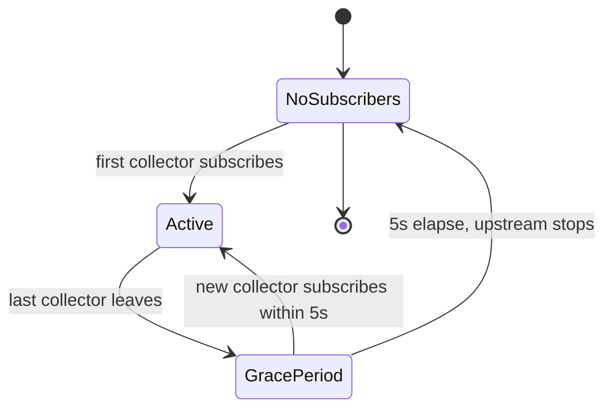
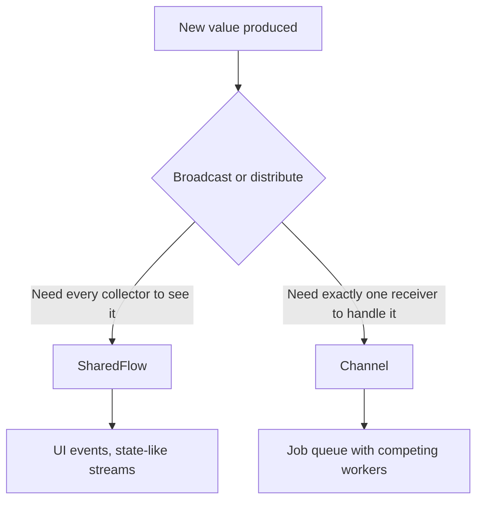

# Lecture 2 — Hot flows, channels, callback bridges, and the cold-vs-hot footguns

Lecture 1 gave you cold flows: lazy, per-collector recipes. This lecture is the *hot* half — flows that are always live, shared across collectors, and (for `StateFlow`) holding a current value. Hot flows are how a `Flow` becomes the data layer of a UI: a `StateFlow<UiState>` that a Compose screen collects, a `SharedFlow<Event>` that fires a snackbar once. They are also where the week's central bug class lives — confusing cold and hot — because the two look similar in code and behave completely differently under collection, rotation, and multiple subscribers.

We take it in the order you need it: `StateFlow` (state) first, then `SharedFlow` (events), then converting cold→hot (`stateIn`/`shareIn` and the `SharingStarted` choice), then channels (the other hot primitive), then the `callbackFlow` bridge, then the footguns. By the end you can say, for any stream, whether it should be cold, a `StateFlow`, a `SharedFlow`, or a `Channel`, and why.

---

## 1. `StateFlow` — the state of the world

A `StateFlow<T>` is a hot flow that **always has a current value** and emits it to every collector, immediately on subscription and on every change thereafter. It is the "state of the world" primitive:

```kotlin
class CounterViewModel {
    private val _count = MutableStateFlow(0)          // current value: 0, available NOW
    val count: StateFlow<Int> = _count.asStateFlow()  // read-only view exposed to the UI

    fun increment() {
        _count.update { it + 1 }                       // atomic update; emits to all collectors
    }
}

// A collector ALWAYS gets the current value first, then every change.
viewModel.count.collect { println("count = $it") }     // prints 0 immediately, then 1, 2, ...
```

The properties that make it the UI-state primitive:

- **It always has a `value`.** `_count.value` is readable synchronously, any time. There is no "the flow hasn't emitted yet" — a `StateFlow` is born with a value. (Contrast a cold flow: no current value at all.)
- **It is conflated and de-duplicated.** Fast updates are conflated to the latest; a new value equal (`==`) to the current one is *not* emitted. So `_count.value = 5` twice in a row emits once. This means your UI does not recompose for a no-op state change — a real performance property in Compose.
- **It is hot and shared.** One live instance; every collector sees the same value and the same updates. Two screens collecting the same `StateFlow` see identical state, unlike two collectors of a cold flow.
- **`update { }` is the safe mutator.** It applies the lambda atomically (compare-and-set under the hood), so concurrent updates from multiple coroutines don't lose writes. Prefer it over `_count.value = _count.value + 1`, which has a read-modify-write race.

In Phase 2 your `ViewModel` exposes `val uiState: StateFlow<UiState>`, the screen collects it with `collectAsStateWithLifecycle()`, and the whole UDF architecture is built on this one type. This week you build the `StateFlow` part of the ticker (a `StateFlow<PriceDelta>`), and you learn the type cold so that architecture week is about *structure*, not the primitive.

### `StateFlow` vs `LiveData` — the one-paragraph history

If you have seen older Android code or you are migrating a real app, you will meet `LiveData`, the pre-coroutines observable state holder. `StateFlow` is its successor and the 2026 default, and the differences are worth knowing so you can read both: `StateFlow` is a pure-Kotlin `kotlinx.coroutines` type (works in a KMP `commonMain` module — `LiveData` is Android-only), it *requires* an initial value (so there is never a "null because nothing emitted yet" surprise — `LiveData` starts null), and it is *not* lifecycle-aware on its own (you make it so at the collection site with `repeatOnLifecycle`/`collectAsStateWithLifecycle`, whereas `LiveData` bakes lifecycle-awareness in). The practical upshot: new code uses `StateFlow`; migration code bridges with `.asLiveData()`/`.asFlow()` during the transition. We mention `LiveData` exactly once, here, and never write it — but you will see it in legacy code and the Now-in-Android migration notes.

### Mutating state with `update`, `getAndUpdate`, `compareAndSet`

`MutableStateFlow` gives you three atomic mutators beyond the raw `value` setter. `update { current -> next }` is the everyday one — it loops a compare-and-set until it wins, so concurrent updates never lose a write. `getAndUpdate` / `updateAndGet` are the same but return the old / new value when you need it. `compareAndSet(expect, update)` is the building block when you need "set only if unchanged" semantics. The rule: **never write `_state.value = _state.value + 1`** from code that can run concurrently — that read-modify-write has a lost-update race. `update { it + 1 }` is the fix, and you prove the difference in this week's homework.

---

## 2. `SharedFlow` — events, not state

Some streams are not state — they are *events*: "show a snackbar," "navigate to checkout," "play a sound." Events are one-shot. Replaying the last event to a new subscriber is a *bug*: rotate the screen, a new collector subscribes, and the "checkout succeeded" snackbar fires again for a checkout that already happened. `StateFlow` is wrong for this (it always replays its current value). `SharedFlow` with `replay = 0` is right.

```kotlin
class CheckoutViewModel {
    // replay = 0: a new subscriber does NOT get past events. extraBufferCapacity = 1:
    // a non-suspending tryEmit can buffer one event if no one is collecting yet.
    private val _events = MutableSharedFlow<CheckoutEvent>(
        replay = 0,
        extraBufferCapacity = 1,
        onBufferOverflow = BufferOverflow.DROP_OLDEST,
    )
    val events: SharedFlow<CheckoutEvent> = _events.asSharedFlow()

    fun onPaid() {
        _events.tryEmit(CheckoutEvent.ShowReceipt)     // fire once; not replayed to late subscribers
    }
}

sealed interface CheckoutEvent {
    data object ShowReceipt : CheckoutEvent
    data class NavigateTo(val route: String) : CheckoutEvent
}
```

The three constructor parameters are the whole API, and you must set them deliberately:

- **`replay`** — how many past values a new subscriber receives on subscription. `0` for events (don't re-fire), `1` for "latest value cache" semantics (then you basically have a `StateFlow`).
- **`extraBufferCapacity`** — buffer slots beyond `replay`, so `tryEmit` can succeed without suspending when there is no active collector. `1` is common for events so a fire-and-forget `tryEmit` doesn't silently drop.
- **`onBufferOverflow`** — `SUSPEND` (default; `emit` waits), `DROP_OLDEST`, or `DROP_LATEST` when the buffer is full.

`emit` (suspends until there is buffer/collector) vs `tryEmit` (non-suspending; returns `false` if it couldn't buffer) is the other choice. In a `ViewModel` event you usually `tryEmit` with `extraBufferCapacity = 1` so the call site need not be suspending.

The rule to tattoo: **`StateFlow` for state (always has a value, replays it), `SharedFlow(replay = 0)` for events (fire once, never replay).** Get this backwards and you ship the double-snackbar-on-rotation bug, which is exactly the challenge this week.

---

## 3. Cold → hot: `stateIn`, `shareIn`, and `SharingStarted`

Most hot flows in real apps start life as a *cold* flow (a Room query, a `callbackFlow`, a computation) that you then *share* so multiple collectors don't each re-run it and so it survives between collectors. The operators are `stateIn` (→ `StateFlow`) and `shareIn` (→ `SharedFlow`):

```kotlin
class FeedViewModel(repo: FeedRepository) : ViewModel-equivalent {

    // repo.feed(...) is a COLD flow (lecture 1). We make it HOT and shared so:
    //   - the upstream runs once, not once per collector,
    //   - the latest value is cached for new subscribers,
    //   - it stops when nobody is watching (and restarts when someone returns).
    val uiState: StateFlow<FeedState> = repo
        .feed(queries)
        .stateIn(
            scope = scope,                                 // the lifecycle that owns it
            started = SharingStarted.WhileSubscribed(5_000), // stop 5s after last collector leaves
            initialValue = FeedState.Loading,             // the value before the cold flow emits
        )
}
```

The `SharingStarted` policy is the part people get wrong:

- **`Eagerly`** — start collecting the upstream immediately and never stop. Simple, but the upstream runs even when nothing is watching (wasted work, possibly wasted network/battery).
- **`Lazily`** — start on the first subscriber, then never stop. Better, but still runs forever after the first collector.
- **`WhileSubscribed(stopTimeoutMillis)`** — start on the first subscriber, **stop `stopTimeoutMillis` after the last subscriber leaves**, restart on a new subscriber. This is the Android default, and the magic number is **`WhileSubscribed(5000)`**.

Why 5000? Configuration change. When the screen rotates, the old collector unsubscribes and the new one subscribes a fraction of a second later. With `WhileSubscribed(5000)`, the 5-second grace window means the upstream is *not* torn down and re-run across the rotation — the cached value is still there, the network call doesn't re-fire — but if the user actually *leaves* the screen for more than 5 seconds, the upstream stops and stops wasting resources. It is the sweet spot between "restart on every rotation" (`WhileSubscribed(0)`) and "never stop" (`Lazily`). Memorise `WhileSubscribed(5000)`; you will type it in every `ViewModel` in Phase 2.


*The WhileSubscribed grace window survives a rotation but stops the upstream once the user truly leaves.*

The difference between `stateIn` and `shareIn`: `stateIn` gives a `StateFlow` (requires an `initialValue`, always has a current value); `shareIn` gives a `SharedFlow` (you pass `replay`, no forced initial value). Use `stateIn` for state, `shareIn` for a shared event/multicast stream.

---

## 4. Channels — the other hot primitive

A `Channel<T>` is a hot, coroutine-safe queue: one or more coroutines `send`, one or more `receive`. Unlike a `SharedFlow`, a channel is **not broadcast** — each value goes to *exactly one* receiver (fan-out distributes work; it does not duplicate it). That distinction decides when you reach for it.

```kotlin
val channel = Channel<Job>(capacity = Channel.BUFFERED)

// Producer
launch { for (job in jobs) channel.send(job) ; channel.close() }

// Several workers fan-out: each job handled by exactly ONE worker.
repeat(4) { worker ->
    launch { for (job in channel) process(job) }    // competing receivers
}
```

Capacities:

- **`RENDEZVOUS`** (default, 0) — `send` suspends until a `receive` is ready. Hand-off, no buffer.
- **`BUFFERED`/`n`** — a fixed buffer; `send` suspends when full.
- **`CONFLATED`** — keep only the latest; old unreceived values are dropped.
- **`UNLIMITED`** — never suspends `send` (the footgun: unbounded growth).

**Channel vs `SharedFlow` for events** is a question learners ask constantly. The honest answer for 2026: for *UI events from a `ViewModel`*, prefer `SharedFlow(replay = 0)` (or, increasingly, a `StateFlow` holding a list of pending events you consume) — it composes with the rest of your flows. Reach for a `Channel` when you genuinely need **single-delivery work distribution** (a job queue with competing workers) or a strict hand-off, where "exactly one receiver gets each value" is the point. A `SharedFlow` *broadcasts* (every collector gets every value); a `Channel` *distributes* (each value to one receiver). Pick by whether you want broadcast or distribution.


*SharedFlow broadcasts to every collector; a Channel hands each value to exactly one receiver.*

Under the hood, `callbackFlow`/`channelFlow` (next section) are built on channels — that is why they can emit from multiple coroutines, which a plain `flow { }` cannot.

---

## 5. `callbackFlow` — bridging a callback API without leaking it

A huge amount of Android is *callback*-based: `LocationManager` calls you back with locations, a `BroadcastReceiver` is invoked on an event, a third-party SDK takes a listener. To compose these with Flow you *bridge* them with `callbackFlow` (or `channelFlow`). The pattern is fixed, and the critical part is the cleanup:

```kotlin
import kotlinx.coroutines.channels.awaitClose
import kotlinx.coroutines.flow.callbackFlow

fun locationUpdates(manager: LocationManager): Flow<Location> = callbackFlow {
    // 1. Create the listener; each callback becomes a flow emission.
    val listener = LocationListener { location ->
        trySend(location)                 // non-suspending send into the flow's channel
    }

    // 2. Register it with the callback API.
    manager.requestUpdates(listener)

    // 3. CRITICAL: awaitClose runs when the flow is cancelled (the collector left).
    //    UNREGISTER the listener here, or you leak it — the SDK keeps calling a
    //    listener for a flow nobody collects, holding a reference to your screen.
    awaitClose {
        manager.removeUpdates(listener)   // the line that prevents the leak
    }
}
```

The anatomy:

- **`callbackFlow { }`** gives you a `ProducerScope` (a channel underneath), so you may `trySend`/`send` from inside the callback — which runs on whatever thread the SDK uses. (A plain `flow { }` could not do this; it requires context preservation. This is why callbacks need `callbackFlow`.)
- **`trySend`** is the non-suspending send used inside a synchronous callback. `send` (suspending) is used when you can suspend and want backpressure.
- **`awaitClose { }`** is *mandatory* and is the whole point. It suspends the builder until the flow is cancelled (the collector's scope is cancelled, per Week 4), then runs the cleanup. **This is where you unregister the listener.** Omit it and the `callbackFlow` builder will actually throw at runtime telling you it's required — because a callback bridge without cleanup is always a leak.

The footgun this prevents: you bridge a `LocationManager` into a flow, the user leaves the screen, the collector is cancelled — but if you forgot `awaitClose`, the `LocationManager` still holds your listener, still calls it, and still holds a reference to the (now-dead) screen through it. That is a classic Android memory leak, and `awaitClose` is the one line that prevents it. You build and *prove* this in exercise 03: assert that after the collector is cancelled, the fake SDK has zero registered listeners.

---

## 6. The cold-vs-hot footguns — measured, not asserted

The week's bugs all come from confusing cold and hot. Know each cold:

### Footgun 1 — re-collecting a cold flow and re-doing work

```kotlin
val users: Flow<List<User>> = flow { emit(api.fetchUsers()) }   // COLD: fetches per collect

// Two screens collect it -> TWO network calls for the same data.
screenA.launch { users.collect { renderA(it) } }   // fetch #1
screenB.launch { users.collect { renderB(it) } }   // fetch #2 -- redundant!
```

*The fix:* make it hot and shared with `shareIn`/`stateIn` so the upstream runs once and both collectors share the result. Cold is right for "fetch on demand"; hot is right for "one shared live value."

### Footgun 2 — a `SharedFlow`/`StateFlow` event replayed on rotation

```kotlin
// BUG: events as a StateFlow (or SharedFlow with replay > 0). On rotation, the new
// collector receives the cached last event and re-fires the snackbar/navigation.
val events = MutableStateFlow<Event?>(null)         // wrong: replays the last event
```

*The fix:* `MutableSharedFlow<Event>(replay = 0)`. A new subscriber after rotation gets *no* past events; the snackbar fires exactly once. This is the challenge.

### Footgun 3 — a leaked `callbackFlow` listener

Covered in §5: a `callbackFlow` without `awaitClose` leaks the listener and the screen it references. *The fix:* always unregister in `awaitClose`.

### Footgun 4 — an unbounded buffer or channel

```kotlin
fastProducer.buffer(Channel.UNLIMITED)              // grows without limit if collector is slow
Channel<T>(Channel.UNLIMITED)                        // same problem
```

*The fix:* bound the buffer, or use `conflate`/`collectLatest` (lecture 1, §4) so you drop instead of accumulate. An unbounded buffer under a faster-than-collector producer is an out-of-memory crash waiting for enough load.

---

## 7. A production checklist

Before you call streaming code "done," walk this list — it is the code-review checklist a senior reviewer applies:

- **State is a `StateFlow`; events are a `SharedFlow(replay = 0)`.** No event modelled as state (no replay-on-rotation), no state modelled as a replay-0 shared flow (no current value).
- **Cold flows that multiple collectors share are made hot** with `stateIn`/`shareIn`, not collected cold in N places (no redundant work).
- **`SharingStarted.WhileSubscribed(5000)`** for screen-scoped state, so rotation doesn't re-run the upstream but leaving does stop it.
- **`update { }`** for `MutableStateFlow` mutations, never an unguarded read-modify-write.
- **Every `callbackFlow`/`channelFlow` unregisters in `awaitClose`.** No leaked listeners.
- **Buffers and channels are bounded** (or `conflate`/`collectLatest`), never `UNLIMITED` under a fast producer.
- **Flow tests assert exact emissions with Turbine + `runTest`**, never `Thread.sleep`. (The week's promise.)
- **`catch` is placed to catch only the upstream you mean**, and turns errors into states rather than killing the flow.

---

## 8. Recap

Lecture 1 gave you cold flows: lazy, per-collector recipes. This lecture was the hot half — the always-live, shared streams that become a UI's data layer. Three habits carry it:

1. **State vs events.** `StateFlow` always has a value and replays it (state); `SharedFlow(replay = 0)` fires once and never replays (events). Choosing wrong ships the double-snackbar bug.
2. **Share cold flows deliberately.** `stateIn`/`shareIn` with `WhileSubscribed(5000)` turns a cold producer into one shared, lifecycle-aware hot flow — run once, cached, stopped when nobody watches.
3. **Bridge callbacks without leaking.** `callbackFlow` + `trySend` + `awaitClose` (to unregister) is the fixed pattern; omit `awaitClose` and you leak the listener and the screen.

You now have both halves of Flow: the cold recipes you compose and the hot streams you share. The exercises prove laziness and per-collector re-execution, build `flatMapLatest` search, and bridge a callback without leaking; the challenge reproduces and fixes the event-replay bug; the mini-project builds a cold ticker, a hot delta `StateFlow`, and a threshold-alert `SharedFlow`, all asserted emission-by-emission with Turbine. Go make streams a discipline, with the cold/hot line drawn on purpose every time.
