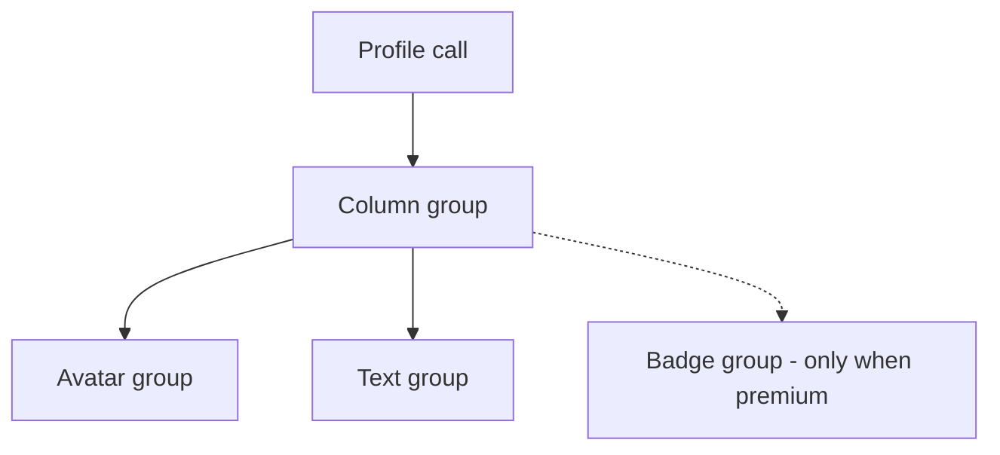
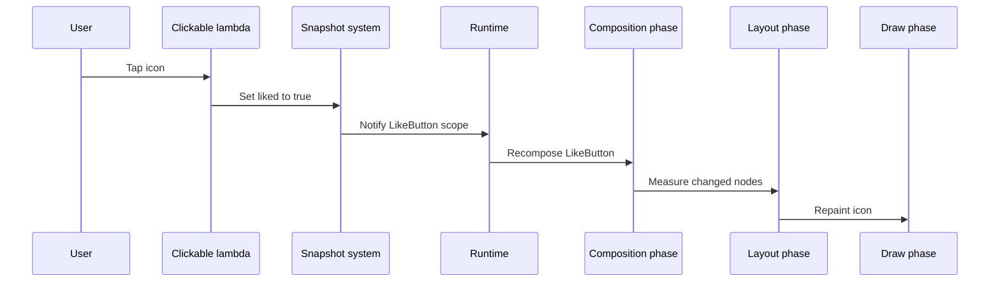

# Lecture 1 — Declarative UI: composition, recomposition, and the three phases

> "A composable is not a thing you build once and mutate. It is a description the runtime re-evaluates every time the state it reads changes."

This is the lecture that decides whether Compose feels like magic or like a runtime you can reason about. The framing for the whole week is one sentence: **your composable function is a description of UI for the current state, and the Compose runtime re-invokes it — intelligently, partially — when that state changes.** Hold that, and every surprise this week (why does this recompose, why does that *not* recompose, why is my animation janky, why is this function not skippable) has a clean explanation. Lose it, and you are sprinkling `remember` and `derivedStateOf` like salt and hoping.

We build the mental model bottom-up: the declarative idea, then the composition tree the runtime actually maintains, then recomposition and its scope, then the three phases. By the end you should be able to draw the runtime on a whiteboard and point to which mechanism is responsible for any given behaviour.

---

## 1. The shift: from mutating views to describing UI

Here is the Android UI you are leaving behind:

```kotlin
// The old View world. You hold a long-lived mutable widget and poke it.
val titleView = findViewById<TextView>(R.id.title)
titleView.text = "Loading…"
// …later, on a callback…
titleView.text = state.title          // mutate the same object, forever
```

The `TextView` is an object you own. It lives as long as the screen does. Updating the UI means finding the right widget and calling a setter. The bug class this produces is famous: the view and your data drift out of sync, because there are two sources of truth — the field in your model and the text inside the widget — and nothing forces them to agree. Every `notifyDataSetChanged`, every "why is the old value still showing," every `RecyclerView` that scrolls to the wrong row is this drift.

Here is the Compose version:

```kotlin
@Composable
fun Title(state: ScreenState) {
    Text(state.title)        // describe: "the title is state.title". That's all.
}
```

There is no `titleView`. You never hold a reference to a `Text`. You wrote a function that says *what the UI should look like for this state*, and you are done. When `state.title` changes, the runtime calls `Title` again, gets the new description, compares it to the old one, and updates exactly the bytes on screen that changed. There is **one source of truth** — `state` — and the UI is a pure function of it. Drift is impossible because the UI is *derived*, not *stored*.

That is the entire promise of declarative UI: **UI = f(state)**. Your job is to write `f`. The runtime's job is to call it efficiently and diff the result. This week is about understanding the runtime's job well enough to write an `f` it can run fast.

---

## 2. What `@Composable` actually is

A `@Composable` function looks like an ordinary Kotlin function, but the **Compose compiler plugin rewrites it**. It is not sugar; it is a real transform. The plugin adds a hidden parameter — the `Composer` — to every composable, and it inserts calls that let the function participate in the *composition*: register itself at a call site, remember values across invocations, and tell the runtime which parts changed.

You can see this if you expand the transform conceptually. This:

```kotlin
@Composable
fun Greeting(name: String) {
    Text("Hello, $name")
}
```

becomes something morally like:

```kotlin
fun Greeting(name: String, $composer: Composer, $changed: Int) {
    $composer.startRestartGroup(/* a stable key for this call site */)
    // if name is unchanged since last time, the runtime can skip the body
    if ($changed and 0b0001 != 0 || $composer.changed(name)) {
        Text("Hello, $name", $composer, ...)
    } else {
        $composer.skipToGroupEnd()
    }
    $composer.endRestartGroup()?.updateScope { c, _ -> Greeting(name, c, ...) }
}
```

You will never write this — but two facts from it run the whole week:

1. **Every composable has a hidden `Composer`.** That is why a `@Composable` function can only be called from another `@Composable` function: the `Composer` has to be threaded through. It is also why you cannot call a composable from a regular lambda or a coroutine — there is no `Composer` there.
2. **The runtime can skip the body.** The `if ($changed … || $composer.changed(name))` is the skippability machinery. If the parameters are equal to last time, the body does not run. This is the single most important performance lever in Compose, and lecture 2 is entirely about it. The compiler can only generate that `$composer.changed(name)` check usefully if it knows `name`'s type is **stable** — which is the cliffhanger we pay off next lecture.

The takeaway: a composable is a function the compiler instrumented so the runtime can call it again, partially, and skip it when nothing changed.

---

## 3. The composition tree and the slot table

When you write nested composables, you are not building a tree of widgets — you are building a tree of **groups** in a data structure called the **slot table**. Consider:

```kotlin
@Composable
fun Profile(user: User) {
    Column {
        Avatar(user.imageUrl)
        Text(user.name)
        if (user.isPremium) {
            Badge()
        }
    }
}
```

The runtime records this as a tree:

```text
Profile (group)
└─ Column (group)
   ├─ Avatar (group)          <- remembers its position
   ├─ Text (group)
   └─ if user.isPremium:
      └─ Badge (group)        <- present only when the branch ran
```

The crucial mechanism is **positional memoization**. Each composable call is identified by *where it appears in the source* — its call-site position — not by any key you pass. The runtime uses that position to remember state across recompositions: "the `Avatar` at this position last time had these inputs and produced this output." When `Profile` recomposes, the runtime walks the same positions and reuses or updates each group.


*Each composable call becomes a positional group in the slot table, and Badge exists only when its branch runs.*

This is why two famous footguns exist:

**Footgun A — composables in a loop without a `key`.** When you emit a list:

```kotlin
Column {
    for (item in items) {
        ItemRow(item)        // all these share nearby positions
    }
}
```

If `items` reorders or an item is inserted in the middle, positional memoization gets confused — the runtime matches by *position in the loop*, so inserting at index 0 makes it think every row's content changed, throwing away remembered state (scroll position, animation progress) for rows that merely shifted down. The fix is to give each item a stable identity:

```kotlin
Column {
    for (item in items) {
        key(item.id) {       // identity by item.id, not by loop position
            ItemRow(item)
        }
    }
}
```

Now the runtime tracks each row by `item.id`, so a reorder moves the remembered group instead of recreating it. (In `LazyColumn` you do this with the `key = { it.id }` parameter on `items` — same idea, list-API shape.)

**Footgun B — conditional composables.** The `if (user.isPremium) { Badge() }` adds or removes a group. That is fine and expected; the runtime handles structural changes. The thing to know is that when the branch flips, `Badge` *enters* or *leaves* the composition — and anything it `remember`ed is created on enter and discarded on leave. That entry/exit is the hook the side-effect APIs key into next week.

The slot table is the runtime's memory. Composition writes to it; recomposition reads and updates it; positional memoization is how it matches old to new.

---

## 4. Recomposition: what triggers it, and what scope recomposes

**Recomposition is the runtime re-invoking composables because state they read changed.** Two halves of that sentence each carry weight.

**"State they read."** Compose tracks reads. When a composable reads a `State<T>` (the thing `mutableStateOf` produces — full treatment Week 8), the runtime records "this composable depends on this state." When the state's value changes, the runtime knows exactly which composables to re-invoke. You do not tell it; the read *is* the subscription. This is why a state change does not "redraw the screen" — it re-invokes only the composables that read that specific state.

**"Re-invoking composables."** The unit of recomposition is the **restartable scope** — the nearest enclosing composable that the compiler made restartable (most composables that return `Unit`). When state read inside a scope changes, *that scope* recomposes, not its parent and not necessarily its children.

Watch this concrete example:

```kotlin
@Composable
fun Counter() {
    var count by remember { mutableStateOf(0) }      // state lives here
    Column {
        Text("Count: $count")                         // reads count -> recomposes on change
        StaticHeader()                                // reads nothing -> never recomposes
        Button(onClick = { count++ }) { Text("+") }   // reads nothing in its body
    }
}
```

When you tap the button and `count` goes from 0 to 1:

- `Text("Count: $count")` **read** `count`, so its enclosing restartable scope recomposes and the text updates.
- `StaticHeader()` read nothing that changed, so it is **skipped** — assuming it is skippable (lecture 2). The runtime does not re-invoke it.
- The `Button`'s lambda `{ count++ }` is an event, not a read; the button itself does not recompose.

The discipline this installs: **state changes recompose the smallest scope that read the state.** If you find your whole screen recomposing on one small change, you read the state too high in the tree, or a parameter is unstable so a child can't be skipped. Both are diagnosable, and lecture 2 plus the exercises show you how.

A second, subtler rule: **reading state as late as possible keeps the recomposing scope small.** If you read `count` only inside `Text`, only `Text`'s scope recomposes. If you read it in `Counter` and pass it down as a parameter, `Counter`'s scope recomposes and re-evaluates everything. Push reads down. We sharpen this into the *phases* rule in §6.

---

## 5. `remember` — keeping a value across recompositions (a first taste)

Here is a trap that the declarative model creates and `remember` solves. Your composable runs *again* on every recomposition. So this is a bug:

```kotlin
@Composable
fun Timer() {
    val start = System.currentTimeMillis()   // BUG: recomputed every recomposition
    // …start is "now" again on every recompose, so it never reflects the real start
}
```

Every recomposition re-runs the function body, so `start` is reassigned to the current time each time — it is not a "start" at all. You need a value that is computed **once** and survives recomposition. That is `remember`:

```kotlin
@Composable
fun Timer() {
    val start = remember { System.currentTimeMillis() }   // computed once, kept in the slot table
    // …start now holds the real start time across recompositions
}
```

`remember { }` stores its result in the slot table at this call site and returns the stored value on every subsequent recomposition instead of recomputing it. It is the runtime's "don't redo this." Two forms you will use immediately:

```kotlin
val expensive = remember { buildExpensiveThing() }       // compute once, keep forever (until leave)
val derived  = remember(input) { transform(input) }      // recompute only when `input` changes
```

`remember(key)` recomputes when the key changes — it is `remember` with an invalidation. Use it to keep a value derived from a parameter without recomputing on unrelated recompositions.

The thing to internalise: **`remember` is about identity across recompositions, not about state.** It keeps a value stable; it does not make a value observable. To make a value that, when changed, *triggers* recomposition, you need `mutableStateOf` — which we use as a black box this week (`remember { mutableStateOf(0) }`) and open up fully in Week 8. For now: `remember` keeps; `mutableStateOf` notifies; you almost always pair them.

When a composable *leaves* the composition (a conditional branch flips off, a list item scrolls away and is removed), its `remember`ed values are discarded. That entry/exit lifecycle is exactly what `DisposableEffect` hooks next week.

---

## 6. The three phases — composition, layout, draw

This is the heart of the week and the idea that separates people who *use* Compose from people who can make it *fast*. A frame in Compose runs in three phases, in order:

```text
┌──────────────┐   ┌──────────────┐   ┌──────────────┐
│ COMPOSITION  │ → │   LAYOUT     │ → │    DRAW      │
│ what to show │   │ where it goes│   │  paint it    │
│ builds the   │   │ measure +    │   │ issue draw   │
│ UI tree      │   │ place nodes  │   │ commands     │
└──────────────┘   └──────────────┘   └──────────────┘
```

1. **Composition** — runs your `@Composable` functions to produce/update the tree of UI nodes. This is the phase everything above was about. Output: *the tree of what to show.*
2. **Layout** — for each node, a **measure** pass (how big am I, given constraints from my parent) and a **placement** pass (where do I put my children). Output: *a size and position for every node.*
3. **Draw** — each node issues drawing commands onto the canvas. Output: *pixels.*

The phases run in that order, but — and this is the lever — **a state change does not always run all three.** Which phases run depends on *where you read the state*:

- State read during **composition** → composition re-runs (then layout, then draw, because the tree changed).
- State read only during **layout** → composition is **skipped**; only layout and draw run.
- State read only during **draw** → composition and layout are **skipped**; only draw runs.

This is the single most important performance technique in Compose: **read state in the latest phase that needs it.** An animation that changes a position 60 times a second should read its value in *layout* (so composition never re-runs) or, for a pure visual effect, in *draw* (so layout never re-runs either). Reading it in composition makes the runtime rebuild the tree 60 times a second — the canonical jank bug.

Concretely, compare three ways to move a box by an animating `offsetX`:

```kotlin
// (1) READ IN COMPOSITION — worst. The offset is read here in the composable body,
//     so every frame of the animation recomposes this whole function.
@Composable
fun Bad(offsetX: Float) {
    Box(Modifier.offset(x = offsetX.dp))     // value-parameter form reads in composition
}

// (2) READ IN LAYOUT — good. The lambda form of offset defers the read to the layout
//     phase, so composition is skipped; only layout + draw run per frame.
@Composable
fun Better(offsetX: State<Float>) {
    Box(Modifier.offset { IntOffset(offsetX.value.roundToInt(), 0) })   // lambda -> read in layout
}

// (3) READ IN DRAW — best for pure visuals. drawBehind reads in the draw phase,
//     so composition AND layout are skipped; only draw runs per frame.
@Composable
fun Best(progress: State<Float>) {
    Box(
        Modifier
            .size(100.dp)
            .drawBehind {
                drawArc(
                    color = Color.Blue,
                    startAngle = -90f,
                    sweepAngle = 360f * progress.value,   // read in draw
                    useCenter = false
                )
            }
    )
}
```

All three move/animate. The first recomposes every frame; the second never recomposes but re-lays-out every frame; the third only redraws. For the Pomodoro ring in the mini-project, version (3) is the target — the ring sweeps smoothly while the composition counter stays frozen at the count it had when the screen first appeared.

The rule, stated for the whiteboard: **defer reads. Composition is the most expensive phase to re-run; draw is the cheapest. Read animating values in draw, layout-affecting values in layout, and only structure-affecting values in composition.**

### How `Modifier` order interacts with phases (a preview of Week 09)

The `Modifier` chain participates in layout and draw. Order matters because each modifier wraps the next. `Modifier.padding(8.dp).background(Blue)` paints the background *inside* the padding; `Modifier.background(Blue).padding(8.dp)` paints it *outside*. Same two modifiers, different pixels — because the chain is applied outside-in for layout and the draw order follows. We go deep on this in Week 09; this week just notice that the chain is not a bag of independent flags, it is an ordered pipeline that runs in the layout and draw phases.

---

## 7. Putting the runtime together — a worked trace

Let's trace one state change through the whole runtime, so the mechanisms connect.

```kotlin
@Composable
fun LikeButton(article: Article) {
    var liked by remember { mutableStateOf(false) }
    Row {
        Icon(
            imageVector = if (liked) Icons.Filled.Favorite else Icons.Outlined.FavoriteBorder,
            contentDescription = if (liked) "Unlike" else "Like",
            modifier = Modifier.clickable { liked = !liked }
        )
        Text(article.title)
    }
}
```

User taps the icon. Step by step:

1. The `clickable` lambda runs (an event, not a phase) and sets `liked = !liked`. Writing to a `MutableState` records the change in the current snapshot.
2. The snapshot system notifies the runtime: "state `liked` changed, and the scope that read it was `LikeButton`." (`Icon`'s `imageVector` and `contentDescription` both read `liked`.)
3. The runtime schedules `LikeButton`'s restartable scope for recomposition on the next frame.
4. **Composition** re-runs `LikeButton`. It reaches the `remember { mutableStateOf(false) }` and gets the *same* `MutableState` back (positional memoization — `remember` returned the stored object, not a new `false`). It reads `liked` (now `true`), so `Icon` gets the filled vector and the "Unlike" description. `Text(article.title)` is re-invoked too — but if `Article` is stable and `article` is equal to last time, `Text`'s call is **skippable** and the runtime skips it. (Whether `Article` is stable is lecture 2's whole point.)
5. **Layout** runs only for nodes whose size/position could have changed. The filled and outlined icons are the same size, so layout is cheap.
6. **Draw** repaints the icon with the new vector.


*Tapping the icon flows from event to snapshot write to scoped recomposition to layout to draw.*

Notice what did *not* happen: the *whole screen* did not recompose, `Text(article.title)` did not re-run its body (if `Article` is stable), and nothing outside `LikeButton`'s scope was touched. That is the runtime being intelligent — and "intelligent" is entirely contingent on stability, which decides whether the runtime is *allowed* to skip. If `Article` were unstable, the runtime could not prove `article` was unchanged, so it would re-invoke `Text` every time — a tiny, pointless cost that multiplies across a list of a thousand rows into a real one.

---

## 7b. A common confusion: recomposition is not redraw

Beginners conflate three things that the phases keep separate, and the confusion causes both over-optimization ("I must stop recomposition at all costs") and under-optimization ("it looks fine, ship it"). Pin the distinction:

- **Recomposition** is the *composition* phase re-running a composable. It rebuilds part of the UI tree. It is the most expensive of the three, and the one you most want to avoid doing needlessly.
- **Relayout** is the *layout* phase re-measuring and re-placing nodes. Cheaper than recomposition, but still real work.
- **Redraw** is the *draw* phase re-issuing paint commands. The cheapest, and completely normal to do every frame for an animation.

A smoothly animating ring that *redraws* 60 times a second but *recomposes* zero times is exactly what you want — and a beginner watching the screen can't tell the difference from one that recomposes 60 times a second, because both *look* smooth. The cost difference is in CPU, battery, and headroom-under-load, and it's invisible until the device is busy. This is why the mini-project's recomposition counter exists: it makes the invisible distinction visible. "It looks smooth" tells you nothing about which phases ran; the counter tells you exactly.

So the goal is never "stop the screen from updating." The goal is "let each phase run only as often as it must" — draw every frame for the animation, recompose only when the structure actually changes. Reading state in the right phase (§6) is how you achieve that, and the counter is how you prove it.

## 8. Recap — the one-question habit

You will write Compose all week. The reflex that turns you from someone who *uses* Compose into someone who can *reason about* it is to ask, on every behaviour, **"which mechanism is responsible?"**

- Something updated when I changed state → a composable *read* that state; its scope recomposed.
- Something *didn't* update → nothing in that subtree read the changed state, or the read happened in a scope that got skipped.
- My animation is janky → I'm reading the animating value in composition; defer it to layout or draw.
- A list reorder threw away scroll/animation state → positional memoization matched by loop position; add a `key`.
- A child re-runs even though its data didn't change → its parameter is unstable, so the runtime can't prove it's safe to skip. (Lecture 2.)

The runtime gives you three phases, a slot table with positional memoization, and recomposition scoped to state reads. Compose is `UI = f(state)`, and your job is to write an `f` the runtime can run cheaply: read state late, key your lists, keep values with `remember`, and — the thing lecture 2 makes mechanical — keep your parameters stable so the runtime is *allowed* to skip.

In lecture 2 we go down into stability and skippability: what makes a type stable, why `List` is not, how to read the Compose Compiler report to see exactly which of your functions are skippable, and how to drag a non-skippable function back into skippable territory by fixing the one parameter that broke it. Bring this phases diagram with you — we are about to make "the runtime skipped it" something you can *prove* from a generated report instead of hope for.
