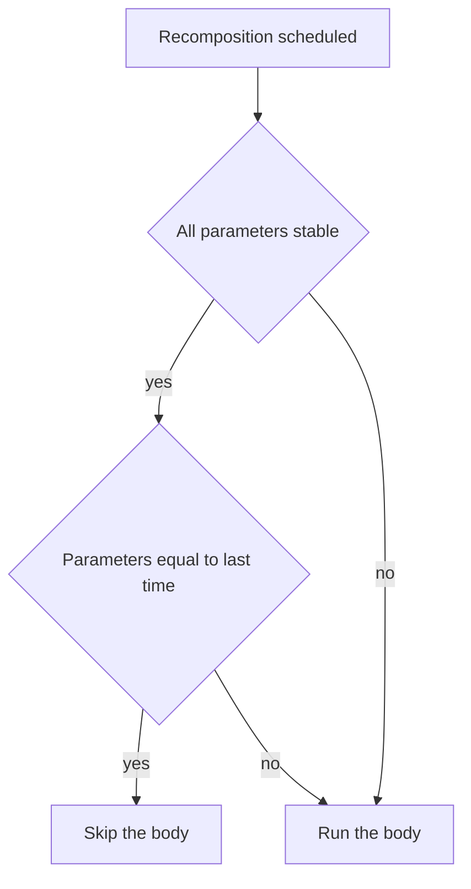
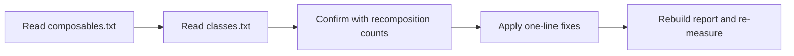

# Lecture 2 — Stability, skippability, and the Compose Compiler report

Lecture 1 gave you the runtime and the happy path: `UI = f(state)`, recomposition scoped to reads, three phases. This lecture is about the one thing that decides whether the runtime is *allowed* to be smart — **stability** — and the tool that tells you, function by function, whether you got it right: the **Compose Compiler report**. These are not academic. The difference between a list that recomposes one row on a change and a list that recomposes all thousand rows on every change is exactly the difference between a stable parameter and an unstable one. And the difference between guessing about it and knowing is the report.

We take them in the order you hit them on a real project: skippability first (the lever), then stability (what controls the lever), then the report (how you read the lever's position), then the footguns (the four ways you accidentally flip the lever off), then the fixes.

---

## 1. Skippable and restartable — the two properties that matter

Two properties the compiler can give a composable:

- **Restartable.** The runtime can re-invoke this composable *on its own*, without re-invoking its parent. Almost every `Unit`-returning composable is restartable; this is what makes "recompose the smallest scope that read the state" possible.
- **Skippable.** When the runtime is about to recompose this composable, if **all its parameters compare equal to last time**, it can skip the body entirely. This is the performance win — a skippable composable whose inputs didn't change costs nothing.

The compiler decides these for you, and it tells you in the report. The condition for skippable is the one to memorise:

> A composable is **skippable** when the compiler can prove that, for every parameter, it can cheaply and correctly decide whether the parameter is *equal to last time*. It can prove that only when **every parameter type is stable.**

So skippability hinges entirely on **stability**. One unstable parameter and the whole function drops out of skippable — the runtime can no longer prove "nothing changed," so it re-invokes the body every recomposition, even when nothing did change. That cost is invisible with one row and brutal with a thousand.


*Skippability collapses to one question: are all parameters stable, and if so, are they unchanged.*

The mechanical version of what the compiler generates (from lecture 1) is the `$composer.changed(param)` check. For a stable type, `changed` is a cheap, correct `equals` comparison the runtime can trust. For an unstable type, the compiler *cannot* generate a trustworthy `changed` check — because the type might mutate without telling anyone — so it conservatively assumes the parameter *might* have changed and runs the body.

---

## 2. Stability — what it means and what the compiler infers

A type is **stable**, in Compose's sense, when it makes two promises:

1. **`equals` is consistent with the runtime's notion of change.** If `a.equals(b)` is `true`, the runtime can treat `a` and `b` as the same input and skip.
2. **Its public properties do not change without notifying composition.** A stable type does not silently mutate behind the runtime's back. Either it is immutable, or every mutable property is a `MutableState` that notifies on change.

The compiler **infers** stability for many types automatically:

- **Primitives and `String`** — `Int`, `Long`, `Float`, `Boolean`, `String`, etc. — are stable. Immutable, value-comparable.
- **Function types (lambdas)** are stable *if they don't capture unstable values*. A lambda that captures nothing, or captures only stable values, is stable.
- **`@Stable`/`@Immutable`-annotated types** are stable by your promise.
- **A `data class` whose every property is of a stable type** is inferred stable. This is the common case and it Just Works — if all your fields are `val`s of stable types, your class is stable for free.
- **Enums** are stable.

And it infers **instability** for:

- **A class with a `var` property** — even one `var` of a stable type makes the class unstable, because the property can change without notifying composition. `data class User(var name: String)` is **unstable**; `data class User(val name: String)` is **stable**.
- **`List`, `Set`, `Map`, and other collection interfaces** — the canonical surprise. `List<T>` is an *interface*; the compiler cannot prove the underlying implementation is immutable (it could be a `MutableList` upcast to `List`). So `List<T>` is **unstable**, full stop, even though you "know" it never changes. This is the single most common stability bug in real codebases.
- **Types from modules the compiler can't see** — a class from another module compiled without the Compose compiler is treated as unstable, because the compiler can't inspect it. (The exception: stable types it's told about via a stability-configuration file.)

The two annotations are promises you make when the compiler can't infer it:

```kotlin
// @Immutable: a strong promise — once constructed, NOTHING about this object,
// including anything its properties transitively reach, will ever change.
@Immutable
data class UiState(
    val title: String,
    val items: List<Item>,        // note: this List is now treated as stable BY YOUR PROMISE
    val isLoading: Boolean
)

// @Stable: a weaker promise — the object may change, but when a public property
// changes it does so through a MutableState (so composition is notified), and
// equals is well-behaved. Used for observable holders.
@Stable
class FormController {
    var text by mutableStateOf("")     // mutable, but via MutableState -> notifies -> allowed
}
```

Use `@Immutable` for value-like UI-state holders where nothing ever mutates. Use `@Stable` for objects that *do* mutate, but only through `MutableState`. Misusing them — marking a type `@Immutable` and then mutating it — is a *correctness* bug, not just a performance one: the runtime will skip recompositions it should have run, and your UI will show stale data. The annotations are load-bearing promises, not decorations.

---

## 3. Reading the Compose Compiler report

Stop guessing. The Compose compiler will emit, on request, two files that tell you exactly which composables are skippable and which of your classes are stable.

Turn it on in your `app/build.gradle.kts` (Kotlin 2.0+ uses the `composeCompiler` block from the Compose Compiler Gradle plugin):

```kotlin
plugins {
    alias(libs.plugins.android.application)
    alias(libs.plugins.kotlin.android)
    alias(libs.plugins.compose.compiler)        // org.jetbrains.kotlin.plugin.compose
}

composeCompiler {
    // emit composables.txt, classes.txt, and the metrics CSVs here
    reportsDestination = layout.buildDirectory.dir("compose_compiler")
    metricsDestination = layout.buildDirectory.dir("compose_compiler")
}
```

Build (`./gradlew :app:assembleRelease`, or a release-ish build — the report is most meaningful in release mode where the strong-skipping defaults apply), then open `app/build/compose_compiler/`. Two files matter.

**`app_release-composables.txt`** lists every composable and its properties:

```text
restartable skippable scheme("[androidx.compose.ui.UiComposable]") fun ArticleRow(
  stable article: ArticleUi
)
restartable scheme("[androidx.compose.ui.UiComposable]") fun FeedList(
  unstable articles: List<ArticleUi>
)
```

Read it like this:

- `ArticleRow` is `restartable skippable` — good. Its one parameter, `article: ArticleUi`, is `stable`. The runtime can skip it when `article` is unchanged.
- `FeedList` is `restartable` but **not** `skippable`. Why? Its parameter `articles: List<ArticleUi>` is `unstable`. That one `List` parameter dragged the whole function out of skippable. Every recomposition of a parent re-invokes `FeedList`'s body, even when `articles` is identical.

**`app_release-classes.txt`** lists your classes and their stability:

```text
stable class ArticleUi {
  stable val id: String
  stable val title: String
  stable val author: String
  <runtime stability> = Stable
}
unstable class FilterState {
  stable val query: String
  unstable var selectedTopic: String        <- the var is the problem
  <runtime stability> = Unstable
}
```

`ArticleUi` is `stable` (all `val`s of stable types). `FilterState` is `unstable` because of the one `var selectedTopic`. The report points at the exact field.

The workflow is: build the report, search `composables.txt` for the function you suspect, see whether it's `skippable`, and if not, read which parameter is `unstable`. Then go to `classes.txt`, find that type, and read which *field* made it unstable. You now know the one thing to fix. **This replaces an afternoon of guessing with a two-minute lookup.**

---

## 4. The four footguns that flip skippable off

Almost every "why does my list recompose so much" reduces to one of these four.

### Footgun 1 — a `List` (or other collection interface) parameter

```kotlin
// NOT skippable: List<T> is unstable.
@Composable
fun FeedList(articles: List<ArticleUi>) { /* … */ }
```

The fix is an **immutable collection type** the compiler trusts, from `kotlinx.collections.immutable`:

```kotlin
import kotlinx.collections.immutable.ImmutableList

// Skippable: ImmutableList is annotated stable.
@Composable
fun FeedList(articles: ImmutableList<ArticleUi>) { /* … */ }
```

`ImmutableList<T>` (and `PersistentList<T>`) carry the stability promise in their type. Build them with `persistentListOf(...)` or `someList.toImmutableList()`. Alternatively, wrap the list in an `@Immutable` holder class, or — project-wide — list the collection types in a *stability configuration file* so the compiler treats them as stable. For a course-sized app, `ImmutableList` is the cleanest.

### Footgun 2 — a `var` in a data class

```kotlin
data class ArticleUi(val id: String, var title: String)   // var -> unstable
```

One `var` and the whole class is unstable, contaminating every composable that takes it. Fix: make it `val`. UI state should be immutable; if the title changes, produce a *new* `ArticleUi` with the new title (cheap, `copy()`), don't mutate the old one. Immutable UI state is both more stable and easier to reason about.

```kotlin
data class ArticleUi(val id: String, val title: String)   // val -> stable
```

### Footgun 3 — an unstable lambda (a captured unstable receiver)

A lambda is stable if it captures only stable things. This is subtle: an event lambda that captures an unstable object becomes unstable itself and de-skippifies the composable it's passed to.

```kotlin
// onClick captures `viewModel` (possibly unstable) -> the lambda is unstable
@Composable
fun Row(onClick: () -> Unit) { /* … */ }
```

In practice, lambdas are usually fine because the compiler's *strong skipping* mode (default since Compose Compiler 1.5.4 / Kotlin 2.0) **remembers lambdas automatically** and treats them as stable. But if you see a function de-skipped by a lambda parameter, hoist the captured object to be stable, or pull the lambda into a `remember`.

### Footgun 4 — a type from a module the compiler can't inspect

A model class from a `:core` module, or a third-party type, is treated as unstable if its module wasn't compiled with the Compose compiler. Fix: don't pass domain models straight into composables. Map them to **UI-state types defined in the UI module** (`ArticleUi`, not the network `Article`), which the compiler can inspect and infer stable. This is the Now-In-Android pattern and it's good architecture anyway — your composables depend on UI types, not network types.

---

### Strong skipping — what changed with Kotlin 2.0

Since Compose Compiler 1.5.4, and on by default in Kotlin 2.0+, the compiler runs in **strong skipping mode**, and it changes the rules above in two important ways you must know, because the report's wording reflects it.

First, **strong skipping makes composables skippable even when they have unstable parameters** — but it does so by comparing those parameters with *instance* equality (`===`) rather than *structural* equality (`equals`). So a `FeedList(articles: List<ArticleUi>)` can now be skipped *if the exact same list instance is passed again*. The catch: if you build a fresh `listOf(...)` on every parent recomposition, it's a new instance every time, instance-equality fails, and the body runs anyway. Strong skipping helps when you hold a stable reference; it does nothing when you allocate a new collection each frame. The report still annotates the parameter `unstable` — that annotation describes the *type*, and you should still fix it, because relying on "I happened to pass the same instance" is fragile.

Second, **strong skipping auto-remembers lambdas.** Before, an event lambda that captured an unstable value could de-skip the composable it was passed to (footgun 3). With strong skipping, the compiler wraps such lambdas in an implicit `remember`, so they're stable across recompositions by default. This is why footgun 3 is mostly historical now — but it's worth understanding, because you'll read older code and older blog posts that work hard to hoist lambdas, and you should know the compiler now does that for you.

The practical upshot: strong skipping raises the floor, but it doesn't make stability irrelevant. The cleanest, most predictable path is still **stable types and immutable collections passed by a stable reference** — then skipping works by value equality, which is what you actually want, instead of by the accident of instance identity.

### A preview of the snapshot system (Week 08)

One more thing the report can't show you, but which explains *why* a state read triggers recomposition at all: the **snapshot system**. When you read a `MutableState` inside a composable, Compose's snapshot machinery records that read against the current `RecomposeScope`. When you later write that state, the snapshot system compares old and new values and, if they differ, notifies every scope that read it. That read-tracking is how "recomposition is scoped to reads" (lecture 1, §4) actually works under the hood — there is a real subscription created by the read and fired by the write.

You don't need the snapshot internals this week; Week 08 opens them fully (and `snapshotFlow`, which bridges snapshot state to Kotlin `Flow`). But hold the one-sentence version: **a read subscribes, a write notifies, and stability decides whether the notified scope can be skipped.** Stability and the snapshot system are the two halves of "intelligent recomposition" — one decides *who* gets notified (the snapshot system, via reads), the other decides *whether the notified composable must actually re-run* (stability, via skippability).

## 5. Diagnosing recomposition at runtime — the counter

The report tells you what's *skippable*; the Layout Inspector and a counter tell you what *actually recomposed*. Both matter: a function can be skippable and still recompose legitimately (its input genuinely changed), and you want to see the live behaviour.

**Layout Inspector recomposition counts.** Run the app, open `View ▸ Tool Windows ▸ Layout Inspector`, enable "Show Recomposition Counts." Each composable shows a count that ticks up every time it recomposes (and a "skipped" count). Interact with the app and watch which counts climb. A count climbing on a part of the screen that *shouldn't* be changing is your bug.

**A debug recomposition counter.** For a quick, code-level view (and the one the mini-project uses), a small modifier that flashes or counts on each recomposition:

```kotlin
/** A debug helper: increments a counter every time the composable it modifies recomposes,
 *  and tints a border so you can SEE recomposition happen. Use only in debug builds. */
fun Modifier.recompositionCounter(): Modifier = composed {
    // A plain holder (NOT state) so mutating it does not itself trigger recomposition.
    val count = remember { Ref(0) }
    count.value++                                   // runs on every recomposition of this scope
    val color = remember { listOf(Color.Red, Color.Green, Color.Blue, Color.Magenta) }
    this.drawBehind {
        // draw the recomposition count's color as a border in the draw phase
        drawRect(
            color = color[count.value % color.size],
            style = Stroke(width = 4.dp.toPx())
        )
    }
}

class Ref<T>(var value: T)
```

Wrap a region in `Modifier.recompositionCounter()` and its border cycles color every time it recomposes. In the mini-project you'll put this on the timer text and on the ring; the naive version cycles the ring's border every second (it recomposes), and the fixed version freezes the ring's border (it only redraws) while the text border still ticks. You *see* the phases.

The discipline: **measure recomposition, don't assert it.** "It feels smooth" is not an engineering statement. The report says skippable; the counter says recomposed N times; together they tell you the truth.

---

## 5b. A worked diagnosis — from "it's janky" to a one-line fix

Let's run the whole loop once, end to end, the way you would on a real ticket: "the feed stutters when I scroll." No guessing — report, then counts, then fix, then re-measure.


*The senior-engineer loop for a janky screen: report, confirm, fix, re-measure.*

Start with the suspect screen:

```kotlin
data class FeedItem(val id: String, val headline: String, var unread: Boolean)   // var!

@Composable
fun Feed(items: List<FeedItem>, onOpen: (String) -> Unit) {            // List!
    LazyColumn {
        items(items) { item ->                                        // no key!
            FeedRow(item, onOpen)
        }
    }
}

@Composable
fun FeedRow(item: FeedItem, onOpen: (String) -> Unit) {
    Row(Modifier.clickable { onOpen(item.id) }) {
        Text(item.headline, fontWeight = if (item.unread) FontWeight.Bold else FontWeight.Normal)
    }
}
```

**Step 1 — read the report.** `composables.txt` shows:

```text
restartable scheme(...) fun Feed(
  unstable items: List<FeedItem>
  stable onOpen: Function1<String, Unit>
)
restartable scheme(...) fun FeedRow(
  unstable item: FeedItem
  stable onOpen: Function1<String, Unit>
)
```

Neither is `skippable`. `classes.txt` explains why:

```text
unstable class FeedItem {
  stable val id: String
  stable val headline: String
  unstable var unread: Boolean        <- here it is
  <runtime stability> = Unstable
}
```

`FeedItem` is unstable because of `var unread`, which makes the `item: FeedItem` parameter unstable, which de-skips `FeedRow`. The `List<FeedItem>` parameter independently de-skips `Feed`.

**Step 2 — confirm with the counts.** Run, open the Layout Inspector with recomposition counts, scroll. Every `FeedRow` count climbs as you scroll, because as the list scrolls and re-emits, the un-skippable rows re-run their bodies. You've reproduced the stutter and you can *see* it.

**Step 3 — the one-line-per-cause fix.**

```kotlin
import kotlinx.collections.immutable.ImmutableList

data class FeedItem(val id: String, val headline: String, val unread: Boolean)   // val

@Composable
fun Feed(items: ImmutableList<FeedItem>, onOpen: (String) -> Unit) {             // ImmutableList
    LazyColumn {
        items(items, key = { it.id }) { item ->                                  // keyed
            FeedRow(item, onOpen)
        }
    }
}
```

`var` → `val` makes `FeedItem` stable; `List` → `ImmutableList` makes the parameter stable; the `key` makes reorders move remembered state instead of discarding it.

**Step 4 — re-measure.** Rebuild the report: both functions now read `restartable skippable`, `FeedItem` is `stable`. Scroll again with the inspector: row counts hold steady. The stutter is gone, and you have a before/after you can paste into the PR. That is the entire senior-engineer loop, and it took minutes because you measured instead of guessed.

## 6. The fixes, gathered — a stability checklist

When a composable recomposes more than it should, walk this list. It's the code-review checklist a senior reviewer applies to a Compose PR:

- **UI state is immutable.** Every UI-state `data class` uses `val`, not `var`. Mutations produce a new object via `copy()`. (Footgun 2.)
- **Collections in parameters are `ImmutableList`/`PersistentList`**, or wrapped in an `@Immutable` holder, or whitelisted via a stability config. No bare `List`/`Map`/`Set` parameters on hot composables. (Footgun 1.)
- **Composables take UI types, not domain/network types.** Map `Article` → `ArticleUi` at the UI boundary so the compiler can inspect and infer stability. (Footgun 4.)
- **`@Immutable` and `@Stable` are honest.** Anything marked `@Immutable` truly never mutates; anything marked `@Stable` mutates only through `MutableState`. A lying annotation is a stale-UI correctness bug, not just a perf miss.
- **The Compiler report is green for hot composables.** `composables.txt` shows `skippable` for every list row and every frequently-recomposed function. If a hot one isn't skippable, the report names the unstable parameter — fix that one.
- **Animating values are read in layout or draw**, not composition. (Lecture 1, §6.) Skippability is moot if you're recomposing every frame on purpose.
- **Lists are keyed.** `LazyColumn { items(list, key = { it.id }) { … } }` and `key(id) { }` in manual loops, so reorders move remembered state instead of discarding it. (Lecture 1, §3.)
- **Recomposition is measured.** You ran the Layout Inspector counts (or a debug counter) and confirmed the hot path recomposes the number of times you expect, not more.

---

## 7. Recap

Lecture 1 sold you the runtime: `UI = f(state)`, three phases, recomposition scoped to reads. This lecture was the half that decides whether the runtime gets to be *smart*. Three habits carry it:

1. **Stability is the lever.** Skippable composables cost nothing when their inputs don't change — but only if every parameter type is stable. One `var`, one bare `List`, one cross-module domain type, and the function recomposes every time for nothing.
2. **The report is the truth.** Turn on `reportsDestination`, read `composables.txt` for skippability and `classes.txt` for which field broke stability. Two-minute lookup instead of an afternoon of guessing.
3. **Measure recomposition, don't assert it.** The Layout Inspector counts and a debug counter show you what actually recomposed. "Feels smooth" is not an engineering statement; a color-cycling border is.

You now have both halves of the runtime: the model you write every day, and the stability machinery that decides what it skips. The exercises put a recomposition counter on a screen and make you drag a non-skippable function back to skippable; the challenge plants the footgun on purpose and measures the fix; the mini-project builds a timer whose ring animates at *zero* recomposition cost. Go make the runtime skip everything it's allowed to.
