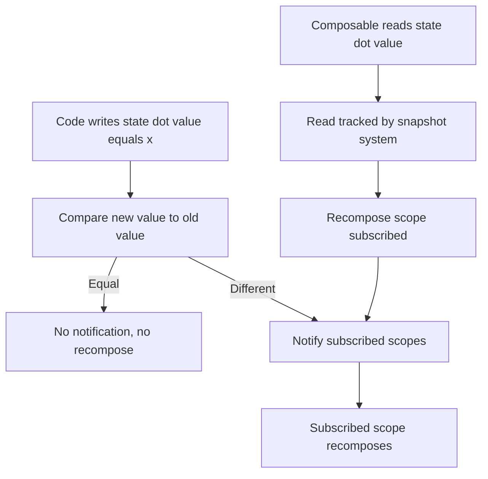
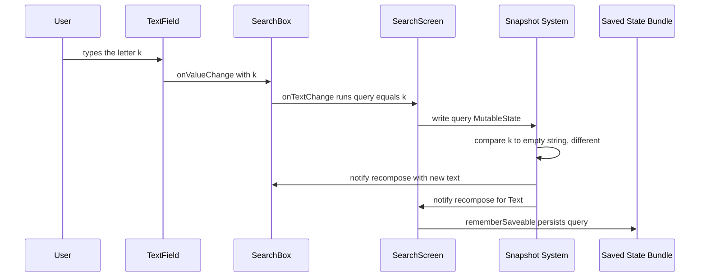

# Lecture 1 — Snapshot state, `remember`, and surviving the lifecycle

> "A `MutableState` is not a variable. It is a cell in a transactional memory system that tracks who reads it and notifies them when it changes."

Last week you used `remember { mutableStateOf(0) }` as a black box that "makes the UI update when I change it." This lecture opens the box. The framing for the week is one sentence: **Compose state is managed by the snapshot system — reads are tracked, writes are transactional, and that read-tracking is exactly what scopes recomposition to the composables that read the state.** Hold that, and the whole confusing family of "why did this update / not update / survive rotation / not survive rotation" resolves into a model you can reason about. Lose it, and you are memorizing which incantation fixes which symptom.

We build bottom-up: what a `MutableState` actually is, how `remember` keeps it, the three retention boundaries (`remember`, `rememberSaveable`, `ViewModel`), and the hoisting pattern that decides *where* state should live.

---

## 1. `mutableStateOf` — a cell, not a variable

Here is the line you wrote last week:

```kotlin
var count by remember { mutableStateOf(0) }
```

Three things are happening, and they are separate:

1. **`mutableStateOf(0)`** creates a `MutableState<Int>` — an object with a `value` property, holding `0`. This object is *observable*: when you read `.value` inside a composable, the read is recorded; when you write `.value`, the snapshot system notifies every reader.
2. **`remember { ... }`** stores that `MutableState` object in the slot table so the *same* object is returned on every recomposition (Week 7, §5). Without `remember`, you'd get a fresh `MutableState(0)` every recomposition and never see a change.
3. **`by`** is Kotlin's property delegation. `var count by state` makes `count` read through `state.getValue()` and write through `state.setValue()`, so you write `count++` instead of `state.value++`. Pure syntax sugar over the `MutableState`.

Unpack the delegation and the same code is:

```kotlin
val state = remember { mutableStateOf(0) }
// read:  state.value
// write: state.value = state.value + 1
```

The crucial fact: **`state.value` is not a field.** Reading it does more than return an `Int` — it registers "the current recompose scope depends on this state." Writing it does more than store an `Int` — it schedules every dependent scope for recomposition. The `MutableState` is a tiny reactive cell, and the reactivity is the whole point. A plain `var count = 0` would store the int fine and never update any UI, because nothing tracks the read or the write.

There are **primitive-specialized** variants you should prefer for primitives, to avoid autoboxing:

```kotlin
var count by remember { mutableIntStateOf(0) }       // Int, no boxing
var progress by remember { mutableFloatStateOf(0f) } // Float, no boxing
var enabled by remember { mutableStateOf(true) }     // Boolean is fine; objects use mutableStateOf
```

`mutableStateOf<Int>` boxes every value into an `Integer`; `mutableIntStateOf` keeps it primitive. For a value that changes 60 times a second (last week's ring progress), that boxing is real garbage. Use the specialized variants for `Int`/`Long`/`Float`/`Double`.

---

## 2. The snapshot system — reads subscribe, writes notify

Why "snapshot"? Because Compose's state lives in a **snapshot** — a consistent view of all state at a moment in time, modeled on database MVCC (multi-version concurrency control). You don't manage snapshots; the runtime takes one for each frame and for each thread that needs isolation. Three properties fall out of this design, and each explains a behavior you'd otherwise find mysterious:

**Reads are tracked.** When code runs inside a snapshot with an *observer* (a recompose scope, a `derivedStateOf`, a `snapshotFlow`), every `state.value` read is recorded against that observer. That recorded read is the subscription. This is *the* mechanism behind "recomposition is scoped to reads" (Week 7, §4): the composable that read the state is the one the runtime knows to re-invoke. You never wrote a listener; the read *is* the listener.

**Writes are transactional and atomic.** When you mutate state inside a snapshot, the changes are staged and applied as a unit. Two state values that must change together (say, a list and its selected index) can be made consistent — readers never see a half-applied update. This is also why you can write state from a background thread safely: the background thread works in its own snapshot, and when it `apply()`s, the changes merge atomically and notify observers on the main thread. Compose state is the rare "mutable shared state" that is actually safe to touch off the main thread.

**Equality decides notification.** When you write `state.value = x`, the snapshot system compares the new value to the old using the state's *mutation policy* (by default `structuralEqualityPolicy`, i.e. `equals`). If they're equal, **no notification fires** — readers aren't recomposed for a no-op write. This is why setting a `MutableState<String>` to the same string it already holds doesn't recompose anything, and it's the foundation `derivedStateOf` builds on (lecture 2).

You will never type `Snapshot.takeMutableSnapshot()` in app code. But the model is the answer to nearly every "wait, why…" this week: a read subscribed, a write notified, equality gated the notification, and a background write was safe because snapshots isolate.


*A read subscribes a scope; a write's equality check decides whether that scope recomposes.*

---

## 3. `remember` — keeping state across recomposition, and the leave hook

`remember` (Week 7, §5) stores a value in the slot table at a call site and returns it on every recomposition. The lifecycle precision matters this week:

- **On enter** (the composable runs for the first time at this position): the `remember` block runs, the value is computed and stored.
- **On recomposition**: the stored value is returned; the block does *not* run again (unless a key changed).
- **On leave** (the composable is removed — a conditional flips off, a list item scrolls away): the stored value is **forgotten**. If the value is a `RememberObserver`, its `onForgotten()` runs — this is the cleanup hook `DisposableEffect` is built on (lecture 2).

So `remember` survives recomposition but **not** the composable leaving. And critically, it does **not** survive a configuration change (rotation) or process death, because those destroy and recreate the whole composition. That's the boundary `rememberSaveable` crosses.

```kotlin
@Composable
fun Counter() {
    // survives recomposition; LOST on rotation and process death
    var count by remember { mutableIntStateOf(0) }
    Button(onClick = { count++ }) { Text("Count: $count") }
}
```

Rotate the device with this code and `count` resets to 0. The Activity is destroyed and recreated on a configuration change; the composition is rebuilt from scratch; `remember` had nothing to restore from. For UI state the user would be annoyed to lose, that's a bug — and the fix is one word longer.

---

## 4. `rememberSaveable` — surviving configuration change and process death

`rememberSaveable` does everything `remember` does, *plus* it writes its value into the **saved instance state** `Bundle` — the same `Bundle` the Android framework persists across configuration changes and (for a backgrounded app) process death. On the way back, it restores from the `Bundle`.

```kotlin
@Composable
fun Counter() {
    // survives recomposition AND rotation AND process death
    var count by rememberSaveable { mutableIntStateOf(0) }
    Button(onClick = { count++ }) { Text("Count: $count") }
}
```

Now rotate: `count` is preserved. Background the app, let the OS kill the process, relaunch: `count` is *still* preserved (within the saved-state size limits). The only code change was `remember` → `rememberSaveable`.

The catch is **what it can store.** The saved-state `Bundle` holds a limited set of types: primitives, `String`, `Parcelable`, `Serializable`, and arrays/lists of those. For anything else you provide a **`Saver`** — a pair of functions that convert your type to and from a saveable representation:

```kotlin
data class SearchFilter(val query: String, val onlyUnread: Boolean)

// A Saver converts SearchFilter <-> a saveable form (here a list of its fields).
val SearchFilterSaver = listSaver<SearchFilter, Any>(
    save = { listOf(it.query, it.onlyUnread) },
    restore = { SearchFilter(query = it[0] as String, onlyUnread = it[1] as Boolean) }
)

@Composable
fun SearchBar() {
    var filter by rememberSaveable(stateSaver = SearchFilterSaver) {
        mutableStateOf(SearchFilter("", onlyUnread = false))
    }
    // filter now survives rotation and process death
}
```

`listSaver` and `mapSaver` cover most cases; for a `Parcelable` (e.g. a `@Parcelize data class`) you need no `Saver` at all. The rule: **keep essential, small UI state in `rememberSaveable`** — text input, scroll position, selected tab, expansion flags. Don't put large data (a list of a thousand items, a bitmap) in saved state; the `Bundle` is size-limited and oversizing it throws `TransactionTooLargeException`. Large data belongs in a repository or a `ViewModel` (re-fetched on restore), not the saved-state bundle.

---

## 5. The three retention boundaries — a map

There are three places state can live, each crossing a different lifecycle boundary. Knowing which boundary each crosses is the whole decision:

| Holder | Survives recomposition | Survives config change (rotation) | Survives process death | Use for |
|--------|:---:|:---:|:---:|---------|
| `remember { mutableStateOf(...) }` | ✅ | ❌ | ❌ | Transient UI state that's fine to recompute (animation progress, a transient ripple) |
| `rememberSaveable { mutableStateOf(...) }` | ✅ | ✅ | ✅ (small data) | Essential UI state the user would hate to lose (text input, scroll/selection), kept small |
| `ViewModel` (`StateFlow<UiState>`) | ✅ | ✅ | ❌ without `SavedStateHandle` | Screen-level state, business logic, data that outlives a single composable — **Week 12** |

The honest nuance: a `ViewModel` survives configuration change (it's scoped to the Activity/nav entry, not the composition) but is destroyed on process death — so for the *small key* needed to restore a screen after process death, even a `ViewModel` uses `SavedStateHandle`, which writes to the same saved-state bundle `rememberSaveable` uses. So the bundle is the floor for process-death survival no matter which holder you use; `rememberSaveable` is just the composable-local door to it.

This week we deliberately stop at `rememberSaveable` and survive rotation *without* a `ViewModel`, to prove how far the snapshot primitives go on their own. Week 12 introduces the `ViewModel` for the things `rememberSaveable` is wrong for: business logic, data loading, and state that should outlive the screen's composition.

---

## 5b. Observable collections — `mutableStateListOf` and the read-only state trap

A subtle trap: putting a regular `List` inside a `MutableState` does *not* make mutations of the list observable. Consider:

```kotlin
var items by remember { mutableStateOf(listOf<String>()) }
// This DOES notify: you assign a NEW list, so the MutableState's value changed.
items = items + "new"
```

Reassigning the whole list works because you write a new value to the `MutableState`. But you cannot mutate *in place* — `(items as MutableList).add(...)` would not notify anyone, because the `MutableState`'s `value` (the list *reference*) didn't change. For a collection you mutate frequently, Compose offers **snapshot-aware collection types** whose individual mutations are tracked:

```kotlin
// A SnapshotStateList: add/remove/set are observable individually.
val items = remember { mutableStateListOf<String>() }
items.add("new")          // notifies readers; no reassignment needed
items.removeAt(0)         // also observable
```

`mutableStateListOf` (and `mutableStateMapOf`) return snapshot-backed collections — they *are* the reactive cell, and each structural mutation is a tracked write. Use them for frequently-mutated lists (a to-do list, a selection set). For a list you replace wholesale on each update (the common UI-state case, where you produce a new immutable list), a plain `mutableStateOf(immutableList)` with reassignment is cleaner and plays better with the stability rules from Week 7 — an `ImmutableList` reassigned is both observable and stable. The rule: **mutate-in-place collections → `mutableStateListOf`; replace-wholesale collections → `mutableStateOf(immutableList)`.**

The deeper point is the same snapshot principle: observability lives in the `MutableState`/snapshot-collection wrapper, not in the data. A `List` is just data; wrapping it in `mutableStateOf` makes the *reference* observable; using `mutableStateListOf` makes the *elements* observable. Know which one you need.

## 6. State hoisting — deciding *where* state lives

The most consequential design decision in Compose is not *what* API holds your state but *where* you put it. **State hoisting** is the pattern: move state up out of a composable to the lowest common ancestor that needs it, making the composable **stateless** — it receives the current value as a parameter and emits change *events* as lambdas back up.

A **stateful** composable owns its state:

```kotlin
// Stateful: owns `text`. Hard to test, hard to preview with a given value, hard to reuse.
@Composable
fun SearchBox() {
    var text by rememberSaveable { mutableStateOf("") }
    TextField(value = text, onValueChange = { text = it })
}
```

The **stateless** version hoists the state out:

```kotlin
// Stateless: takes the value and an event. Pure function of its inputs.
@Composable
fun SearchBox(
    text: String,
    onTextChange: (String) -> Unit
) {
    TextField(value = text, onValueChange = onTextChange)
}

// The OWNER holds the state and passes value down, event up.
@Composable
fun SearchScreen() {
    var text by rememberSaveable { mutableStateOf("") }
    SearchBox(text = text, onTextChange = { text = it })
}
```

This is **unidirectional data flow (UDF)**: state flows *down* (as parameters), events flow *up* (as lambdas). The contract is the `value` / `onValueChange` pair, and you'll see it on every Compose component (`TextField`, `Switch`, `Slider`, `Checkbox`).

Why hoist? Four concrete payoffs:

1. **Single source of truth.** The state lives in exactly one place — the owner. No duplicate copies to drift out of sync.
2. **Testable.** A stateless `SearchBox(text, onTextChange)` is a pure function of its inputs; you can render it with any `text` in a test or `@Preview` without standing up its state.
3. **Reusable.** The same stateless component can be driven by `remember`, `rememberSaveable`, or a `ViewModel` — the component doesn't care where its state comes from.
4. **Controllable.** The owner can intercept, transform, or validate every change (trim whitespace, enforce a max length) in the `onTextChange` lambda, because every change passes through it.

The rule of thumb: **hoist state to the lowest common ancestor that needs it, and no higher.** If only one composable uses a piece of state, keep it there. The moment two siblings need to agree on it, lift it to their shared parent. Hoisting too high (everything in one top-level state object) makes the whole screen recompose on every change (Week 7); hoisting too low (duplicated in two places) causes drift. The lowest common owner is the sweet spot.

### Hoisting and stability (the Week 7 connection)

Hoisting interacts with last week's stability lesson. When you hoist state up and pass it down as a parameter, that parameter's *type* must be stable or the child won't be skippable. This is why you map to immutable UI-state types (`@Immutable data class`, `ImmutableList`) at the hoisting boundary — so the stateless child is skippable and only recomposes when its specific inputs change. Hoisting and stability are two halves of the same discipline: hoist to put state in one place, and keep the hoisted type stable so passing it down is cheap.

---

## 6b. `mutableStateOf` vs `MutableStateFlow` — a preview of Week 12

You already know `StateFlow` from Week 5. So which holds your state — `mutableStateOf` or `MutableStateFlow`? The short answer for this week: **`mutableStateOf` for state that lives in the composition; `MutableStateFlow` for state that lives in a holder/`ViewModel` and must exist independent of any UI.** The longer answer is the boundary between this week and Week 12.

`mutableStateOf` is a *Compose* primitive: it only makes sense where there's a composition to read it, and its reactivity is the snapshot system. `MutableStateFlow` is a *coroutines* primitive: it's UI-agnostic, lives anywhere a coroutine can, and you can collect it from anywhere. When you do have a `StateFlow` (say, exposed by a `ViewModel`), you bring it into Compose with `collectAsStateWithLifecycle`, which turns the `StateFlow<T>` into a Compose `State<T>` and collects it in a lifecycle-aware way (stopping collection when the screen is in the background):

```kotlin
@Composable
fun ProfileScreen(viewModel: ProfileViewModel) {
    // bridge a StateFlow into Compose State, collected only while STARTED
    val uiState by viewModel.uiState.collectAsStateWithLifecycle()
    ProfileContent(uiState)
}
```

The trade-off, in one line each: `mutableStateOf` is simpler and snapshot-native but tied to the composition lifecycle; `MutableStateFlow` outlives any single composable, is testable without a Compose runtime, and is where business logic state belongs. This week we use `mutableStateOf` exclusively, because we're deliberately staying composition-local (no `ViewModel`). Week 12 moves screen state into a `ViewModel`'s `StateFlow<UiState>` and uses `collectAsStateWithLifecycle` to read it — at which point the rule becomes "Compose-local ephemeral state stays in `mutableStateOf`/`rememberSaveable`; screen/business state moves to the `ViewModel`'s `StateFlow`." Hold the distinction now; apply it in Week 12.

## 6c. The hoisting anti-patterns — too high and too low

Two ways hoisting goes wrong, both worth recognizing on sight.

**Hoisted too high.** A junior, told "hoist your state," lifts *everything* into one giant state object at the top of the screen. Now every keystroke, toggle, and scroll mutates that one object, and — because every child reads some slice of it — the whole screen recomposes on every interaction (Week 7's broad-scope problem). The fix is to hoist each piece of state only as high as the lowest composable that actually needs it shared. A ripple animation's progress belongs *in* the button, not in the screen's state object. Hoisting is "lift to the lowest common owner," not "lift to the top."

**Hoisted too low (duplicated).** The opposite mistake: two sibling composables each keep their own copy of what should be one shared value (a selected tab held in both the tab bar and the content pane). They drift — the bar shows tab 2, the content shows tab 1 — because there are two sources of truth. The fix is to lift the shared state to their common parent and pass it down to both. The symptom (two views disagreeing) is the classic "you duplicated state that should have been hoisted" tell.

The sweet spot between them is the **lowest common ancestor** of everything that needs the state. Below it, you'd duplicate; above it, you'd over-recompose. Finding that node for each piece of state is the core skill of structuring a Compose screen, and it's why the hoisting question — *who needs this, and where's their lowest shared owner?* — is the one to ask for every `mutableStateOf` you write.

## 7. A worked trace — typing into a hoisted, saveable field

Let's trace one keystroke through everything above, so the pieces connect.

```kotlin
@Composable
fun SearchScreen() {
    var query by rememberSaveable { mutableStateOf("") }
    Column {
        SearchBox(text = query, onTextChange = { query = it })
        Text("You searched: $query")
    }
}

@Composable
fun SearchBox(text: String, onTextChange: (String) -> Unit) {
    TextField(value = text, onValueChange = onTextChange)
}
```

User types "k" into the empty field. Step by step:

1. `TextField` fires `onValueChange("k")`, which calls `onTextChange("k")`, which runs `query = "k"`.
2. `query = "k"` writes the `MutableState`. The snapshot system compares `"k"` to `""` — different — so it notifies the scopes that *read* `query`. Two read it: `SearchScreen` (passing it to `SearchBox` and `Text`) and, transitively, the children.
3. Recomposition runs. `SearchBox(text = "k", ...)` is re-invoked with the new `text`; because its parameters are stable (`String` and a remembered lambda), it's skippable, but its input changed, so it legitimately recomposes and updates the field. `Text("You searched: k")` recomposes too.
4. `rememberSaveable` quietly registers `query`'s new value with the saved-state registry, so if the OS now rotates or kills the process, "k" is restored.


*One keystroke traced through the write, the equality check, the notified recomposes, and the saved-state persist.*

Now rotate the device. The Activity is destroyed and recreated; the composition rebuilds; `rememberSaveable` restores `query` to `"k"` from the bundle; the field shows "k" and the focus/keyboard state is handled by the framework. **No data lost.** Swap `rememberSaveable` back to `remember` and the same rotation clears the field — the single-word difference this week's promise is built on.

Trace it once more, slowly, because the *non-events* are as instructive as the events. When the user typed "k", `Text("You searched: k")` recomposed (it read `query`) but `SearchBox` only recomposed because its `text` parameter changed — both legitimate. The `Column` itself did *not* re-run its own logic beyond re-invoking its children, because nothing in `Column`'s direct body read `query`; the reads live in the children. That is the Week-7 scoping rule and the Week-8 state model working together: the snapshot write notified exactly the scopes that read `query`, and each recomposed only because its specific input changed. There is no broadcast, no "the screen updated," no manual diffing — just a tracked read, a notifying write, and a minimal, targeted recomposition. When you internalize that this is *all* that happened, Compose stops being magic and becomes a system you predict.

---

## 7b. The mutation policy — why some writes don't recompose

We said writes notify "if the value actually changed." *Changed by what measure?* That's the **mutation policy**, the third argument to `mutableStateOf` (defaulted), and it occasionally matters.

```kotlin
// default: structuralEqualityPolicy — compares with `equals` (==).
val a = mutableStateOf(listOf(1, 2, 3))

// referentialEqualityPolicy — compares with `===` (identity).
val b = mutableStateOf(someObject, policy = referentialEqualityPolicy())

// neverEqualPolicy — every write notifies, even if equal.
val c = mutableStateOf(payload, policy = neverEqualPolicy())
```

The default, `structuralEqualityPolicy`, uses `equals`. So writing `state.value = listOf(1,2,3)` when it already holds an equal list does **not** notify — same contents, `equals` is true, no recomposition. Usually that's what you want (no recompose for a no-op). But it explains a head-scratcher: if you mutate a list in place and then reassign an `equals`-equal reference, nothing updates. (Use `mutableStateListOf` for in-place mutation, §5b.)

`referentialEqualityPolicy` (`===`) is for cases where two distinct-but-equal objects should still count as a change — rare. `neverEqualPolicy` forces a notification on every write regardless of equality — useful for "fire an event" semantics where you re-emit the same value to re-trigger something. You'll reach for non-default policies maybe twice a year, but knowing the default is `equals`-based explains "I set the state and nothing happened" when the new value equals the old.

## 7c. The full lifecycle picture — one diagram

Tie the retention boundaries to the actual Android lifecycle events that cross them:

```text
                       remember   rememberSaveable   ViewModel
recomposition            keep          keep            keep
config change (rotate)   LOSE          keep            keep      (VM scoped to Activity/navEntry)
process death (bg kill)  LOSE          keep*           LOSE**    (*small data; **without SavedStateHandle)
```

The single most common state bug a junior ships is using `remember` for something that must cross the config-change line — and it's invisible until a reviewer rotates the device. The single most common *over*-engineering is reaching for a `ViewModel` for a transient ripple or an expand/collapse flag that `remember` handles fine. The discipline is to ask, for each piece of state, *which line must it cross?* — and pick the cheapest holder that crosses it. Transient and recomputable → `remember`. Essential, small, must survive rotation/death → `rememberSaveable`. Business logic, data loading, outlives the screen → `ViewModel` (Week 12). The table is the whole decision.

## 7d. Background writes — the part the snapshot system quietly enables

Here is a property of the snapshot system that feels impossible if you came from the `View` world: **you can write Compose state from a background thread, and it's safe.** In the old world, touching a UI widget off the main thread was an instant `CalledFromWrongThreadException`. In Compose, a background coroutine can write a `MutableState`, and the snapshot system merges the change atomically and notifies the main-thread observers correctly.

```kotlin
// Safe: the background coroutine writes state; the snapshot system handles the merge.
LaunchedEffect(Unit) {
    withContext(Dispatchers.IO) {
        val data = repo.loadFromDisk()       // off the main thread
        items = data                          // writing MutableState off-main is SAFE
    }
}
```

This works because each thread operates in its own snapshot (the MVCC isolation from §2), and when the background snapshot `apply()`s, its writes are merged into the global state and observers are notified — the framework handles the thread hop. You don't need `withContext(Dispatchers.Main)` around the state write itself (though writing on Main is also fine and is what most code does for clarity).

The caveat is *correctness under concurrency*, not *crashing*: if two threads write the same state concurrently, the snapshot system applies them in order and the last apply wins (or, for advanced merge policies, merges) — it won't corrupt, but you still need to reason about which write you want to win. For the everyday case — a background load writing a result into state — it Just Works, and it's one of the quietly remarkable things about the model. State that is mutable, shared, *and* safe to touch from any thread is genuinely rare in programming; the snapshot system gives it to you for free.

## 8. Recap — the model that explains the symptoms

You will write state and effects all week. The reflex that turns you from someone who *uses* `remember` into someone who can *reason about* state is to ask, on every behavior, **"what did the snapshot system do, and which boundary did this holder cross?"** Two questions, asked on every symptom, resolve nearly every state bug you'll meet — not just this week, but for the rest of your Android career. The model is small; the leverage is enormous.

- The UI updated when I changed state → a read subscribed that scope; the write notified it.
- The UI *didn't* update → the value was held in a plain `var` (no tracking), or the new value was `equals` to the old (no notification), or nothing in that scope read the state.
- Rotation wiped my input → it was in `remember`, which doesn't cross the config-change boundary; use `rememberSaveable`.
- `rememberSaveable` crashed with `TransactionTooLargeException` → you put too much in the bundle; keep saved state small, load big data from a repository.
- A child recomposes too much after hoisting → the hoisted parameter's type is unstable; map it to an immutable UI type (Week 7).
- A `mutableStateListOf` mutation didn't update the UI → you read the list through a plain `List` reference that didn't change identity; for in-place mutation use the snapshot collection's own methods. (§5b.)
- A background coroutine's state write "didn't happen" → it did, but the coroutine was cancelled (key change, leave) before the write; that's structured concurrency working, not a state bug.

One more reflex worth installing before you go: **when you write a piece of state, ask "who reads this, and where does it live?"** — and when you read it, ask "am I subscribing the right scope?" Those two questions, asked habitually, prevent the entire class of state bugs. A write to state nothing reads is dead code; a write read by too broad a scope recomposes too much (Week 7); a read of a plain `var` instead of a `MutableState` silently doesn't react; a state in `remember` that the user expects to survive rotation is the bug this week's promise exists to catch. The snapshot model makes all four diagnosable instead of mysterious.

The snapshot system gives you reactive cells whose reads subscribe and whose writes notify; `remember` keeps them across recomposition; `rememberSaveable` keeps them across configuration change and process death; and hoisting decides where they live so data flows down and events flow up. In lecture 2 we turn to *side effects* — the controlled escape hatches for doing imperative work (network calls, listeners, logging) from a declarative UI — and we key each one to the exact lifecycle hook it belongs to, so you stop guessing which `*Effect` to reach for. Bring the snapshot model with you; the effects are all built on the same enter/recompose/leave lifecycle you just learned `remember` and `rememberSaveable` ride on.
