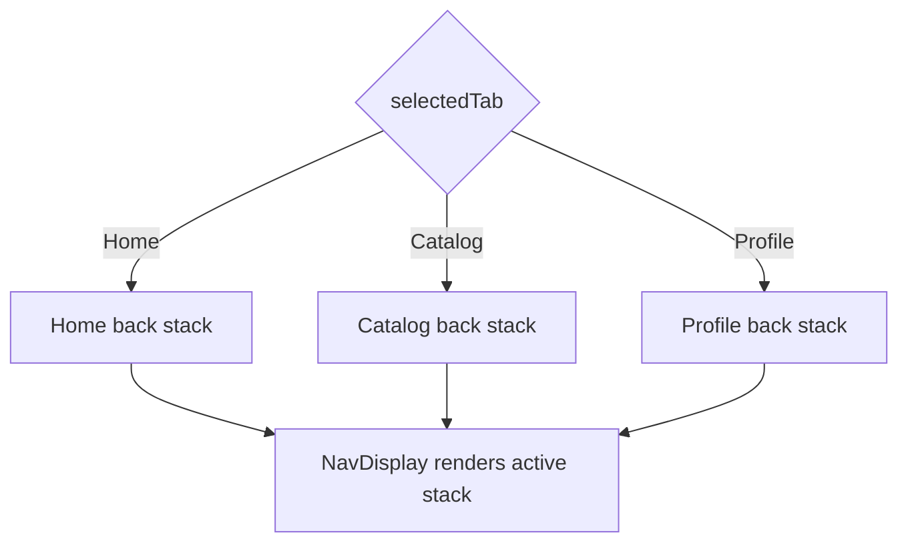
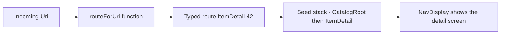

# Lecture 2 — Nested graphs, per-tab back stacks, deep links, and predictive back

Lecture 1 gave you the primitive: an app-owned back stack of `@Serializable` route types, rendered by `NavDisplay`. This lecture is about the four patterns a real app needs on top of that primitive, in the order you hit them building one: **bottom-bar navigation with independent per-tab history**, **nested graphs** for a flow-within-a-flow, **deep links** that seed the stack from a `Uri`, and **predictive back** so the system gesture animates the cross-screen transition live. Each is something you *compose* out of the primitive — Nav3 does not impose any of them, which is exactly why understanding the primitive first was non-negotiable. We finish with how to **test every transition**, because a navigation graph you cannot test is a navigation graph you cannot refactor.

We take them in build order: tabs first (the app's skeleton), then nested graphs (a sub-flow inside a tab), then deep links (entering from outside), then predictive back (leaving with a gesture), then tests (proving it all).

---

## 1. Bottom-bar navigation — one back stack per tab

The naive bottom bar shares a single back stack across all tabs: tap Catalog, drill into a detail, tap Profile, then press back — and you are surprised to find yourself back in the Catalog detail instead of where you expect. Users hate this. The correct model, the one every polished app uses, is **independent history per tab**: each tab remembers its own drill-down, and switching tabs preserves it.

In Nav3 you build this by holding **one back stack per tab** and rendering the active tab's stack:

```kotlin
import androidx.navigation3.runtime.NavBackStack
import androidx.navigation3.runtime.rememberNavBackStack
import kotlinx.serialization.Serializable

enum class Tab(val label: String, val icon: ImageVector) {
    Home("Home", Icons.Default.Home),
    Catalog("Catalog", Icons.Default.GridView),
    Profile("Profile", Icons.Default.Person)
}

// Per-tab route graphs (each tab has its own sealed sub-graph in a real app;
// shown flat here for clarity).
@Serializable data object HomeRoot : NavKey
@Serializable data object CatalogRoot : NavKey
@Serializable data class ItemDetail(val itemId: Int) : NavKey
@Serializable data object ProfileRoot : NavKey

@Composable
fun CatalogCompanionApp() {
    var selectedTab by rememberSaveable { mutableStateOf(Tab.Home) }

    // One back stack per tab. Each remembers its own drill-down.
    val homeStack = rememberNavBackStack(HomeRoot)
    val catalogStack = rememberNavBackStack(CatalogRoot)
    val profileStack = rememberNavBackStack(ProfileRoot)

    val activeStack: NavBackStack = when (selectedTab) {
        Tab.Home -> homeStack
        Tab.Catalog -> catalogStack
        Tab.Profile -> profileStack
    }

    Scaffold(
        bottomBar = {
            NavigationBar {
                Tab.entries.forEach { tab ->
                    NavigationBarItem(
                        selected = selectedTab == tab,
                        onClick = { selectedTab = tab },
                        icon = { Icon(tab.icon, contentDescription = tab.label) },
                        label = { Text(tab.label) }
                    )
                }
            }
        }
    ) { padding ->
        NavDisplay(
            modifier = Modifier.padding(padding),
            backStack = activeStack,
            onBack = { activeStack.removeLastOrNull() },
            entryProvider = entryProvider {
                entry<HomeRoot> { HomeScreen() }
                entry<CatalogRoot> {
                    CatalogScreen(onItem = { id -> catalogStack.add(ItemDetail(id)) })
                }
                entry<ItemDetail> { route -> DetailScreen(route.itemId) }
                entry<ProfileRoot> { ProfileScreen() }
            }
        )
    }
}
```

Why this works and what to notice:

- **`selectedTab` is `rememberSaveable`** so the chosen tab survives rotation and process death, and so are the three back stacks (`rememberNavBackStack` saves itself). The whole tabbed state — which tab, and each tab's drill-down — restores on return.
- **Switching tabs is `selectedTab = tab`**, not a navigation. You are not pushing onto a stack; you are choosing *which* stack `NavDisplay` renders. Each tab's history sits untouched while you are away from it, and re-renders exactly where you left it when you come back. That is the "independent per-tab history" users expect.
- **Back operates on the active tab's stack.** `onBack` pops `activeStack`. On a tab's root (e.g. `CatalogRoot` with nothing above it), `removeLastOrNull()` would empty the stack — so in a real app you guard the root: if the active stack is at its root, either switch to the Home tab or let the system handle back (exit the app). That guard is a design decision you own (lecture 1, §8: you own back behaviour).


*Switching tabs picks which back stack NavDisplay renders - each tab keeps its own drill-down untouched.*

A common refinement is "back from any tab's root returns to Home before exiting":

```kotlin
onBack = {
    if (activeStack.size > 1) {
        activeStack.removeLastOrNull()        // drill back within the tab
    } else if (selectedTab != Tab.Home) {
        selectedTab = Tab.Home                 // at a non-Home root -> go to Home tab
    } else {
        // at Home root -> let the system exit the app (don't consume back)
    }
}
```

This is the kind of explicit history logic Nav3 hands you. In the old model it was a fight; here it is a `when`.

---

## 2. Nested graphs — a flow inside a flow

A "nested graph" is a self-contained sub-flow: onboarding (welcome → permissions → done), a checkout (cart → address → payment → confirm), an auth flow. It has its own internal back stack behaviour and a single exit. In Nav3 you model a nested graph as **its own set of routes**, optionally rendered into **its own `NavDisplay`** or pushed as a contiguous run of entries onto the main stack.

The simplest, most common version: the nested flow's routes live in the same back stack, grouped by a shared sealed sub-interface, and "finishing the flow" pops the whole run at once.

```kotlin
// The onboarding sub-graph — its own sealed family.
sealed interface Onboarding : NavKey
@Serializable data object Welcome : Onboarding
@Serializable data object Permissions : Onboarding
@Serializable data object OnboardingDone : Onboarding

// Entering onboarding from anywhere:
fun NavBackStack.startOnboarding() {
    add(Welcome)
}

// Finishing onboarding: pop every Onboarding entry off in one shot,
// so back from the screen after onboarding doesn't walk back INTO it.
fun NavBackStack.finishOnboarding() {
    removeAll { it is Onboarding }
}

// In the entryProvider:
entry<Welcome>     { WelcomeScreen(onNext = { backStack.add(Permissions) }) }
entry<Permissions> { PermissionsScreen(onNext = { backStack.add(OnboardingDone) }) }
entry<OnboardingDone> {
    DoneScreen(onFinish = {
        backStack.finishOnboarding()   // drop the whole flow
        backStack.add(HomeRoot)        // land on Home, with onboarding gone from history
    })
}
```

Why model it as a sealed family? Because `removeAll { it is Onboarding }` becomes a one-liner that pops the *entire* sub-flow regardless of how deep the user got, with the compiler guaranteeing you matched the whole family. That is the exhaustiveness payoff from lecture 1, §3, doing real work: a nested graph is a sub-sealed-interface, and "exit the flow" is a type-test removal.

For a flow that needs to be *fully isolated* — its own background, its own back behaviour, its own transitions, with the main stack frozen underneath — you can give it its own `NavDisplay` driven by its own back stack, and host that display as a single entry on the main stack. That is heavier; reach for it only when the flow genuinely should not share the main chrome (a full-screen modal wizard). For most nested flows, the shared-stack-grouped-by-sealed-family approach above is cleaner.

---

## 3. Deep links — from a `Uri` to a typed route

A deep link is the app being opened *from outside* — a notification, a web link, another app — directly to an inner screen. The contract has two halves: the **manifest** declares which URLs your app handles, and your **code** maps an incoming `Uri` to a typed route and seeds the back stack so back from the deep-linked screen lands somewhere sensible.

### The manifest half

Declare an `<intent-filter>` on the launch activity for the schemes/hosts you handle. Two kinds: a **custom scheme** (`catalog://`) which is simple but unverified, and an **`https://` App Link** which is verified against your domain so it opens your app without a chooser dialog.

```xml
<activity android:name=".MainActivity" android:exported="true">
    <intent-filter>
        <action android:name="android.intent.action.MAIN" />
        <category android:name="android.intent.category.LAUNCHER" />
    </intent-filter>

    <!-- Custom scheme: catalog://item/42 -->
    <intent-filter>
        <action android:name="android.intent.action.VIEW" />
        <category android:name="android.intent.category.DEFAULT" />
        <category android:name="android.intent.category.BROWSABLE" />
        <data android:scheme="catalog" android:host="item" />
    </intent-filter>

    <!-- App Link: https://catalog.crunch.dev/item/42 (autoVerify against assetlinks.json) -->
    <intent-filter android:autoVerify="true">
        <action android:name="android.intent.action.VIEW" />
        <category android:name="android.intent.category.DEFAULT" />
        <category android:name="android.intent.category.BROWSABLE" />
        <data android:scheme="https" android:host="catalog.crunch.dev" />
    </intent-filter>
</activity>
```

`android:autoVerify="true"` plus a hosted `.well-known/assetlinks.json` is what makes an `https://` link open your app directly instead of the browser. The App Links Assistant in Android Studio generates both. (Verification is a deployment concern; for local testing the custom scheme is enough.)

### The code half — map the `Uri` to a typed route

The activity receives the launching `Intent`; you read its `data` `Uri`, translate it to one of your route types, and seed the back stack. The translation is *yours* — a small, testable, total function from `Uri` to `Route?`:

```kotlin
// A pure function: Uri in, typed route out (or null if we don't handle it).
// Testable without an Activity — exercise 03 unit-tests exactly this.
fun routeForUri(uri: Uri): NavKey? = when {
    // catalog://item/42  OR  https://catalog.crunch.dev/item/42
    uri.pathSegments.firstOrNull() == "item" || uri.host == "item" -> {
        val id = uri.lastPathSegment?.toIntOrNull() ?: return null
        ItemDetail(itemId = id)
    }
    uri.pathSegments.firstOrNull() == "profile" || uri.host == "profile" -> {
        val userId = uri.lastPathSegment ?: return null
        UserProfile(userId = userId)
    }
    else -> null
}

@Composable
fun CatalogCompanionApp(deepLinkRoute: NavKey?) {
    // Seed the back stack so back from the deep-linked screen lands on a root,
    // not on a blank stack. A deep link into a detail = [CatalogRoot, ItemDetail(42)].
    val catalogStack = rememberNavBackStack(CatalogRoot)
    LaunchedEffect(deepLinkRoute) {
        if (deepLinkRoute is ItemDetail && catalogStack.lastOrNull() != deepLinkRoute) {
            catalogStack.add(deepLinkRoute)
        }
    }
    // …render as in §1…
}
```

The crucial design decision: **a deep link builds a back stack, it does not just show a screen.** If `catalog://item/42` only rendered the detail with an empty stack underneath, pressing back would exit the app jarringly. Seeding `[CatalogRoot, ItemDetail(42)]` means back walks up to the catalog root — which is what a user who tapped a link expects. Because the back stack is *your* list (lecture 1, §4), seeding it is just `add`; the old model made this a fight with `NavController` synthetic back stacks.


*A deep link is a pure Uri-to-route mapping that seeds a real back stack, so back lands on the catalog root instead of exiting the app.*

Read the `Uri` from the activity intent and pass the route in:

```kotlin
class MainActivity : ComponentActivity() {
    override fun onCreate(savedInstanceState: Bundle?) {
        super.onCreate(savedInstanceState)
        val route = intent?.data?.let(::routeForUri)
        setContent { CatalogCompanionApp(deepLinkRoute = route) }
    }
}
```

Test it from the command line without leaving your desk:

```bash
adb shell am start -W -a android.intent.action.VIEW -d "catalog://item/42" dev.crunch.catalog
adb shell am start -W -a android.intent.action.VIEW -d "https://catalog.crunch.dev/item/42" dev.crunch.catalog
```

Because `routeForUri` is a pure function, you unit-test the hard part (parsing) with no device at all — exercise 03 does exactly that.

---

## 4. Predictive back — making "leave" feel native

Predictive back is the Android 13/14 system gesture where dragging from the screen edge shows a *preview* of where back will take you — the current screen shrinking and sliding, the destination peeking in behind it — before you commit by lifting your finger, or cancel by releasing at the edge. It is the difference between a back that snaps and a back that *animates*, and in 2026 a polished app is expected to support it.

Three things have to be true:

1. **Opt in at the manifest level.** `android:enableOnBackInvokedCallback="true"` on `<application>` (the default in new projects targeting modern SDKs). This switches the app from the legacy `onBackPressed` to the new `OnBackInvokedCallback` ahead-of-time API that predictive back needs.

2. **`NavDisplay` participates by default.** Nav3's `NavDisplay` is built to drive the predictive-back animation: as the user drags, it animates the top entry out and the one beneath it in, scrubbed by the gesture progress, and commits the pop (your `onBack`) only if the user completes the gesture. You get the live preview for free *if* your transitions are defined.

3. **You define the transitions.** The preview animates *your* transition specs. `NavDisplay` takes `transitionSpec` (forward navigation) and `popTransitionSpec` (back), and the predictive-back preview scrubs the pop transition. Define them so the gesture has something to show:

```kotlin
NavDisplay(
    backStack = backStack,
    onBack = { backStack.removeLastOrNull() },
    transitionSpec = {
        // Forward: new screen slides in from the right, old slides out left.
        slideInHorizontally { it } togetherWith slideOutHorizontally { -it / 4 }
    },
    popTransitionSpec = {
        // Back: current slides out right, previous slides back in from the left.
        // This is the animation the predictive-back gesture scrubs.
        slideInHorizontally { -it / 4 } togetherWith slideOutHorizontally { it }
    },
    entryProvider = entryProvider { /* … */ }
)
```

What to verify, and where people get it wrong:

- **Test on a gesture-navigation device/emulator.** With three-button navigation, the predictive *preview* does not render — back still works, but you will not see the scrub. Turn on gesture navigation in the emulator (Settings ▸ System ▸ Gestures) or the whole feature looks broken when it is fine.
- **Don't consume back yourself and skip the animation.** If you wrap the screen in a raw `BackHandler { backStack.removeLastOrNull() }`, you intercept back *before* `NavDisplay` can animate it — the screen vanishes with no preview. Let `NavDisplay`'s `onBack` own the pop; only use `BackHandler`/`PredictiveBackHandler` for *custom* in-screen back (e.g. "collapse the search bar before leaving"), and even then route to the navigation pop when there is nothing to collapse.
- **Root back is a design decision.** On a tab root, completing a back gesture should exit the app (or go to Home first, §1). Predictive back will preview "exit to launcher" on the root if you let the system handle it — which is usually correct. Decide it deliberately.

Predictive back is where the app-owned-back-stack model pays a visible dividend: because `NavDisplay` knows the whole stack and your transition specs, it can render the *next* screen behind the current one during the drag. A library that hid the stack could not do that as cleanly.

---

## 5. Testing every transition

A navigation graph you cannot test is a navigation graph you are afraid to refactor. Nav3 is unusually testable precisely because the back stack is plain state. Two levels:

### Level 1 — test the back stack directly (fast, no UI)

The navigation *logic* — what does this lambda do to the stack — is testable with no Compose at all, because the stack is an ordinary list:

```kotlin
@Test
fun tappingItem_pushesDetail() {
    val stack: SnapshotStateList<NavKey> = mutableStateListOf(CatalogRoot)
    // simulate the onItem callback
    stack.add(ItemDetail(itemId = 7))
    assertEquals(ItemDetail(itemId = 7), stack.last())
    assertEquals(2, stack.size)
}

@Test
fun finishOnboarding_popsTheWholeFlow() {
    val stack: SnapshotStateList<NavKey> = mutableStateListOf(HomeRoot, Welcome, Permissions)
    stack.removeAll { it is Onboarding }
    assertEquals(listOf(HomeRoot), stack.toList())
}

@Test
fun deepLink_mapsUriToTypedRoute() {
    assertEquals(ItemDetail(42), routeForUri(Uri.parse("catalog://item/42")))
    assertNull(routeForUri(Uri.parse("catalog://unknown/x")))
}
```

These run on the JVM (with Robolectric for `Uri`) in milliseconds and cover the parts most likely to break: the navigation lambdas and the deep-link parser.

### Level 2 — test the rendered screen after navigation (Compose UI test)

To prove that navigating actually *shows* the right screen, drive the UI with `createAndroidComposeRule` and assert on content after each transition:

```kotlin
@get:Rule val rule = createAndroidComposeRule<ComponentActivity>()

@Test
fun catalogToDetail_andBack() {
    rule.setContent { CatalogCompanionApp(deepLinkRoute = null) }

    // Start on Home; switch to Catalog tab.
    rule.onNodeWithText("Catalog").performClick()
    rule.waitForIdle()
    rule.onNodeWithText("Catalog").assertIsDisplayed()

    // Drill into an item.
    rule.onNodeWithText("Item 7").performClick()
    rule.waitForIdle()
    rule.onNodeWithText("Detail: 7").assertIsDisplayed()

    // System back returns to the catalog list, not Home.
    rule.activityRule.scenario.onActivity { it.onBackPressedDispatcher.onBackPressed() }
    rule.waitForIdle()
    rule.onNodeWithText("Detail: 7").assertDoesNotExist()
    rule.onNodeWithText("Catalog").assertIsDisplayed()
}
```

The flakiness traps, all of which this week's exercises make you feel once:

- **No `waitForIdle()` after a navigation.** A typed `backStack.add` triggers recomposition and a transition animation; asserting before it settles fails intermittently. Call `rule.waitForIdle()` (and disable transition animations in test, or `mainClock.advanceTimeBy`, when the animation itself slows the assert).
- **Asserting on a node that is mid-transition.** During the slide animation both screens are briefly present. Assert on the *destination* and on the *absence* of the source, after idle, so a half-animated frame can't pass or fail you spuriously.
- **Testing back via the rule's back instead of the real dispatcher.** Driving `onBackPressedDispatcher.onBackPressed()` exercises the *same* path the system gesture uses, including your `onBack` and predictive-back wiring. A test that pops the stack directly skips the integration you actually want to verify.

---

## 6. Putting it together — a navigation code-review checklist

Before you call a Nav3 graph "done," walk this list. It is the checklist a senior reviewer applies:

- **No string routes, no `Bundle` reads.** Grep for `navigate("` and `arguments?.get` — there should be zero. Every destination is a `@Serializable` type; every argument is a property.
- **The graph is a sealed hierarchy.** Routes implement a `sealed interface … : NavKey`, so a `when` over them is exhaustive and the graph is reviewable in one place.
- **Routes are small and identity-shaped.** Ids and enums in the route; objects loaded from a ViewModel/repository, not carried in the route.
- **Per-tab history is independent.** A bottom-bar app holds one back stack per tab; switching tabs preserves each tab's drill-down.
- **Back behaviour is deliberate.** `onBack` is written, not defaulted by accident; tab-root back is decided (exit vs. go-Home); deep links seed a real back stack.
- **Deep links map through a pure function.** `routeForUri(uri): NavKey?` is total, unit-tested, and seeds the stack rather than just showing a screen.
- **Predictive back is wired.** `enableOnBackInvokedCallback` is on, `NavDisplay` owns the pop, `transitionSpec`/`popTransitionSpec` are defined, and it's been seen on a gesture-nav device.
- **Every transition is tested.** Back-stack logic and the deep-link parser have JVM tests; key user paths have a Compose UI test that asserts the rendered screen after each navigation, with `waitForIdle`.
- **Routes survive process death.** Every route is `@Serializable`; the back stack is `rememberNavBackStack`/`rememberSaveable`; backgrounding-and-killing then returning restores the stack.

---

## 7. Recap

Lecture 1 sold you the primitive; this lecture composed it into the patterns a real app needs. Four habits carry it:

1. **Tabs are multiple back stacks, not one.** Hold a stack per tab, render the active one, preserve each tab's history. Switching tabs is choosing a stack, not navigating.
2. **A nested graph is a sealed sub-family.** Group the flow's routes under a sub-interface so "exit the flow" is a one-line `removeAll { it is Onboarding }`, exhaustively typed.
3. **A deep link builds a back stack.** Map the `Uri` to a typed route through a pure, tested function, then seed the stack so back lands somewhere sane — never just show a screen over an empty history.
4. **Predictive back is `NavDisplay` plus your transitions.** Opt in at the manifest, let `NavDisplay` own the pop, define `transitionSpec`/`popTransitionSpec`, and verify on a gesture device.

And under all four: **test the stack as state.** The deepest payoff of the app-owned back stack is that navigation logic is plain Kotlin you can assert on without a device, and the rendered result is a Compose UI test away. A navigation layer you can test is a navigation layer you can change with confidence.

The exercises put these to work — a migration off string routes, a back-stack-and-entry-provider test, and a deep-link parser — and the mini-project assembles all of it into Catalog Companion: three tabs, a nested onboarding flow, deep links, predictive back, and an end-to-end UI test of every transition. Go build the graph as a data model, and prove you cannot type a route wrong.
