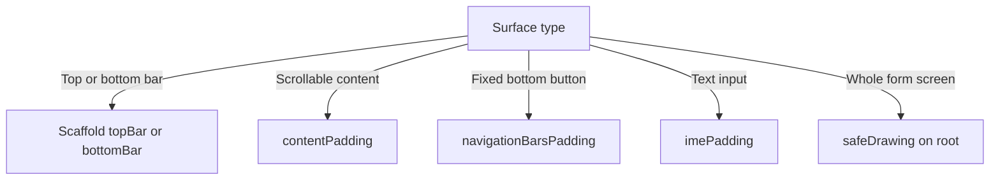

# Lecture 2 — Edge-to-edge, window insets, dark theme, and a contrast audit you can defend

Lecture 1 gave you color as a role and dynamic color with a fallback. This lecture is the other half of a shipped-looking app: the *layout chrome*. Three things that separate a tutorial app from a real one — **edge-to-edge** drawing (content extending behind the status and navigation bars), **window insets** (padding so nothing is occluded), and a **dark theme audited for contrast** (measured against WCAG, not eyeballed). These are the details a senior reviewer checks after the colors look nice, and the ones that produce one-star reviews when they're wrong: "the keyboard covers the text field," "the last list item hides behind the nav bar," "I can't read the dark theme."

We take them in build order: edge-to-edge first (turn it on), then insets (deal with the consequences), then the IME inset (the keyboard special case), then dark theme (a peer configuration), then the contrast audit (prove it's legible).

---

## 1. Edge-to-edge — drawing behind the system bars

For years Android apps drew in a box: the status bar at the top and the navigation bar at the bottom were opaque system chrome, and your app got the rectangle in between. Modern Android is **edge-to-edge**: your app draws the *entire* screen, including behind the (now transparent) status and navigation bars, and the system bars float over your content. This is the default look in 2026 — and on Android 15+ it's effectively enforced for apps targeting the latest SDK.

You opt in with one call, in the activity, *before* `setContent`:

```kotlin
import androidx.activity.enableEdgeToEdge

class MainActivity : ComponentActivity() {
    override fun onCreate(savedInstanceState: Bundle?) {
        enableEdgeToEdge()       // content now draws behind the transparent system bars
        super.onCreate(savedInstanceState)
        setContent { PocketReaderTheme { PocketReaderApp() } }
    }
}
```

`enableEdgeToEdge()` makes the system bars transparent and tells the system your app handles the full window. Immediately you have a new problem: your top app bar is now *under* the status bar (its title overlapping the clock), and your bottom content is *under* the navigation bar (the last list row hidden behind the gesture pill). Edge-to-edge gives you the whole screen; insets are how you give the system bars their space back where it matters.

What edge-to-edge looks like, and why test both nav modes:

- **Gesture navigation** — a thin pill at the bottom; edge-to-edge looks great, content flows under a translucent pill.
- **Three-button navigation** — a taller opaque-ish bar; content behind it needs padding or buttons sit on top of your UI. Test both; a layout that's fine under the gesture pill can hide a button under the three-button bar.

---

## 2. Window insets — giving the bars their space back, exactly where needed

A **window inset** is "how much space a system element wants at this edge." `WindowInsets.systemBars` is the status bar (top) plus navigation bar (bottom); `WindowInsets.ime` is the keyboard (bottom, when shown); `WindowInsets.safeDrawing` is the union of everything you must avoid drawing important content under. You apply an inset as **padding** so your content sits in the safe region while the *background* still extends edge-to-edge behind the bars.

The cleanest path is `Scaffold`, which consumes the system-bar insets and hands you a padded `innerPadding`:

```kotlin
Scaffold(
    topBar = { TopAppBar(title = { Text("Pocket Reader") }) },   // Scaffold insets the app bar correctly
    bottomBar = { NavigationBar { /* … */ } }
) { innerPadding ->
    // innerPadding already accounts for the app bars AND the system bars.
    LazyColumn(
        contentPadding = innerPadding,           // pad the SCROLLING CONTENT, not the LazyColumn box
        modifier = Modifier.fillMaxSize()
    ) {
        items(articles) { ArticleRow(it) }
    }
}
```

Two precise points that separate "works" from "subtly broken":

- **Pad the content, not the container, for scrollables.** A `LazyColumn` should receive the inset as `contentPadding`, not as a `Modifier.padding` on the column. With `contentPadding`, the list *background* (and the scrollbar track) extends edge-to-edge behind the nav bar, but the *items* are padded so the last one clears the bar and the first clears the app bar — and items scroll *under* the translucent bar, which is the intended edge-to-edge feel. A `Modifier.padding` on the column instead clips the whole list into the safe area, leaving a dead band of background color behind the bar. Use `contentPadding` for scrollables.
- **Consume insets once.** If `Scaffold` already applied the system-bar inset via `innerPadding`, and *then* an inner composable also applies `Modifier.windowInsetsPadding(WindowInsets.systemBars)`, you get **double padding** — a visible gap twice the bar height. The fix is `consumeWindowInsets(innerPadding)` (or just not re-applying): once an inset is consumed by an ancestor, descendants shouldn't pad for it again.

When you're not using `Scaffold`, apply insets directly with the modifier:

```kotlin
Box(Modifier.fillMaxSize()) {
    BackgroundImage(Modifier.fillMaxSize())                        // draws edge-to-edge, behind the bars
    Content(
        Modifier
            .fillMaxSize()
            .windowInsetsPadding(WindowInsets.safeDrawing)         // content avoids the bars
    )
}
```

The inset types you'll reach for:

| Inset | When |
|-------|------|
| `WindowInsets.systemBars` | Status + nav bar; the common case |
| `WindowInsets.safeDrawing` | systemBars + IME + cutouts; "don't draw important content here" |
| `WindowInsets.safeContent` | safeDrawing + system gestures; for content the user shouldn't have to fight gesture areas to touch |
| `WindowInsets.ime` | The keyboard, animated (next section) |
| `WindowInsets.statusBars` / `.navigationBars` | One bar only, when you want asymmetric handling |

---

## 3. The IME inset — the keyboard special case

The keyboard (IME — input method editor) is a window inset like the bars, but animated: it slides up over your content. The bug everyone ships once is a text field at the bottom of the screen that the keyboard *covers*, so the user can't see what they're typing. The fix is to pad for the IME inset, which makes the field rise above the keyboard as it animates in:

```kotlin
Column(
    Modifier
        .fillMaxSize()
        .imePadding()                 // bottom padding tracks the keyboard, animated
        .padding(16.dp)
) {
    // …content…
    TextField(value = note, onValueChange = { note = it }, modifier = Modifier.fillMaxWidth())
    // As the keyboard slides up, imePadding lifts this field above it.
}
```

`imePadding()` is `windowInsetsPadding(WindowInsets.ime)` with the animation wired. For a scrollable that should *scroll* to keep the focused field visible (a chat list, a long form), combine it with `Modifier.imeNestedScroll()` so the list scrolls in sync with the keyboard animation. The point: the keyboard is an inset; treat it like one, and the "keyboard covers my field" bug disappears.

### Where the IME inset bites, and the modifier-order trap

Two refinements separate "I added `imePadding()`" from "I handle the keyboard correctly":

- **Apply `imePadding()` at the right level of the tree.** It pads whatever it wraps. If you put it on the `TextField` alone, only the field is lifted and its surrounding chrome (a send button beside it, a label below it) can still be covered. If you put it on the *column that should rise as a unit*, the whole input region lifts together. Choose the smallest subtree that must stay above the keyboard, and apply it there. As with all modifiers (Week 9), order matters: `Modifier.imePadding().padding(16.dp)` pads *inside* the IME-adjusted region (your 16dp gap rides above the keyboard), whereas `Modifier.padding(16.dp).imePadding()` adds the IME inset *outside* your gap — usually you want the former.
- **Don't double-count the IME against `safeDrawing`.** `WindowInsets.safeDrawing` *already includes* the IME inset (it's systemBars + IME + cutouts). If a parent pads with `safeDrawing` and a child *also* applies `imePadding()`, the keyboard inset is counted twice and the field jumps too far up. Pick one: either pad with `safeDrawing` (which handles the keyboard for you) or pad system bars separately and add `imePadding()` only where the keyboard matters. Mixing them is the IME equivalent of the double-padding bug from §2.

A quick decision: for a *form screen* where the whole content should avoid the keyboard, `safeDrawing` on the content root is the one-liner. For a *list-with-a-bottom-input* (chat), pad the list with system bars and give the *input bar* `imePadding()` so only it tracks the keyboard while the list scrolls behind. Match the inset tool to the layout's shape.

---

## 4. Dark theme as a peer configuration — not an inversion

Dark theme is not "the light theme with the colors flipped." It's a *peer* configuration with its own role values (lecture 1, §4: dark re-picks tones, e.g. `primary` at tone-80 instead of tone-40). Treating it as first-class means three things:

```kotlin
@Composable
fun PocketReaderTheme(
    darkTheme: Boolean = isSystemInDarkTheme(),     // follow the system setting by default
    dynamicColor: Boolean = true,
    content: @Composable () -> Unit
) {
    val colorScheme = chooseColorScheme(darkTheme, dynamicColor)   // returns dark roles when darkTheme
    MaterialTheme(colorScheme = colorScheme, typography = PocketReaderTypography, content = content)
}
```

- **Follow `isSystemInDarkTheme()` by default**, and let a user override it (an in-app light/dark/system setting). Don't hardcode one mode.
- **Surfaces in dark mode use elevation tints.** In M3 dark theme, a raised surface (a card, a menu) is *lighter* than the background — a subtle tonal overlay communicates elevation where a shadow would be invisible on near-black. Material 3 components handle this when you use `surface`/`surfaceContainer*` roles; if you hardcode a dark background, you lose it. Another reason to use roles.
- **Both dynamic-dark and fallback-dark must be tested.** `dynamicDarkColorScheme(context)` on 12+, `DarkColors` below. Flip dark mode with `adb shell cmd uimode night yes` and walk every screen in *both* the dynamic and fallback paths.

The common dark-mode bugs, all from not treating it as a peer config: pure-black backgrounds that crush surface elevation; a hardcoded near-white text that glares; an accent that was fine on white and vibrates on black; a `surface` that's indistinguishable from `background`. Every one is fixed by reading roles and auditing contrast — which is the next section.

Letting the user override the system setting is a three-state toggle, not a boolean — light / dark / follow-system — and it threads cleanly through the theme:

```kotlin
enum class ThemeChoice { System, Light, Dark }

@Composable
fun resolveDarkTheme(choice: ThemeChoice): Boolean = when (choice) {
    ThemeChoice.System -> isSystemInDarkTheme()   // follow the OS
    ThemeChoice.Light -> false
    ThemeChoice.Dark -> true
}

// In the app root:
val choice by settings.themeChoice.collectAsStateWithLifecycle()
PocketReaderTheme(darkTheme = resolveDarkTheme(choice)) { /* … */ }
```

The default is `System` — most users want the app to follow their device, and a forced light theme on a user who runs their phone dark all day is its own kind of bug. Offering all three is the polished choice; defaulting to `System` is the correct one.

---

## 5. The contrast audit — measured, not eyeballed

"The dark theme looks a bit washed out" is a real bug report, and "it looks fine to me" is not an engineering response. **WCAG 1.4.3** sets the bar: a contrast ratio of at least **4.5:1** for normal body text against its background, and **3:1** for large text (≈18pt+, or 14pt+ bold) and for UI components and graphical objects. The audit is: for each important role pair, compute the ratio and check it against the threshold.

The contrast ratio between two colors is `(L1 + 0.05) / (L2 + 0.05)`, where `L1`/`L2` are the relative luminances (lighter and darker) computed from the sRGB channels. You can read it off the WebAIM Contrast Checker (resources page), or compute it so a test can assert it:

```kotlin
import androidx.compose.ui.graphics.Color
import kotlin.math.pow

/** WCAG relative luminance of an sRGB color. */
fun Color.relativeLuminance(): Double {
    fun channel(c: Float): Double {
        val s = c.toDouble()
        return if (s <= 0.03928) s / 12.92 else ((s + 0.055) / 1.055).pow(2.4)
    }
    return 0.2126 * channel(red) + 0.7152 * channel(green) + 0.0722 * channel(blue)
}

/** WCAG contrast ratio between two colors, always >= 1.0. */
fun contrastRatio(a: Color, b: Color): Double {
    val la = a.relativeLuminance()
    val lb = b.relativeLuminance()
    val lighter = maxOf(la, lb)
    val darker = minOf(la, lb)
    return (lighter + 0.05) / (darker + 0.05)
}
```

Now you can audit a `ColorScheme` as a test, not a vibe:

```kotlin
fun ColorScheme.auditBodyTextPairs(): Map<String, Double> = mapOf(
    "onSurface / surface" to contrastRatio(onSurface, surface),
    "onSurfaceVariant / surfaceVariant" to contrastRatio(onSurfaceVariant, surfaceVariant),
    "onPrimary / primary" to contrastRatio(onPrimary, primary),
    "onPrimaryContainer / primaryContainer" to contrastRatio(onPrimaryContainer, primaryContainer),
    "onError / error" to contrastRatio(onError, error)
)

@Test
fun darkThemeBodyTextMeetsWcagAA() {
    DarkColors.auditBodyTextPairs().forEach { (pair, ratio) ->
        assertTrue("$pair is $ratio, below 4.5:1", ratio >= 4.5)
    }
}
```

When a pair fails — say `onSurfaceVariant`-on-`surfaceVariant` comes in at 3.9:1 in dark mode — the fix is to **move a tonal value**, not to abandon roles: make `onSurfaceVariant` a lighter tone (in dark) or `surfaceVariant` a darker one until the ratio clears 4.5:1, regenerating from Material Theme Builder with that adjustment or nudging the specific role. You keep the role model; you tune the tone. Record the before/after ratios — that's the challenge this week, and it's the kind of measured, defensible accessibility work that lands in a code review.

Two notes on doing it honestly:

- **`on*`-on-base pairs usually pass** because M3 maintains them, but the *non-standard* pairs you create (secondary text in `onSurfaceVariant` on a `surface`, a disabled state, a custom accent) are where failures hide. Audit those.
- **Large text and UI get 3:1, not 4.5:1.** A headline or an icon doesn't need 4.5; holding it to the body-text bar over-darkens your palette. Use the right threshold per use.

### The five edge-to-edge bugs, and their one-line fixes

These recur often enough to memorize as a gallery — symptom, cause, fix:

```kotlin
// BUG 1 — content under the status bar. Title overlaps the clock.
// Cause: app bar not inset for the status bar.
// Fix: put it in Scaffold's topBar (which insets it), or:
TopAppBar(/* … */, modifier = Modifier.windowInsetsPadding(WindowInsets.statusBars))

// BUG 2 — last list item under the nav bar / gesture pill.
// Cause: a scrollable with no bottom inset.
// Fix: contentPadding from the nav-bar inset (NOT Modifier.padding):
LazyColumn(contentPadding = WindowInsets.navigationBars.asPaddingValues()) { /* … */ }

// BUG 3 — a doubled gap twice the bar height.
// Cause: an ancestor (Scaffold innerPadding) AND a descendant both pad system bars.
// Fix: consume the inset once; don't re-apply below where it's already consumed:
Box(Modifier.consumeWindowInsets(innerPadding)) { /* children don't re-pad system bars */ }

// BUG 4 — keyboard covers a bottom field.
// Cause: no IME inset on the input region.
// Fix:
Column(Modifier.imePadding()) { TextField(/* … */) }

// BUG 5 — a fixed bottom button (not in a scrollable) sits under the nav bar.
// Cause: a non-scrollable bottom element with no nav-bar inset.
// Fix:
Button(modifier = Modifier.navigationBarsPadding(), onClick = {}) { Text("Continue") }
```

Memorize the *mapping* — which inset for which surface — and the bugs stop being mysterious. The cheat sheet, one line per surface:

- **Top bar** → status-bar inset, usually via `Scaffold`'s `topBar`.
- **Bottom bar** → navigation-bar inset, usually via `Scaffold`'s `bottomBar`.
- **Scrollable content** → the inset as `contentPadding` (so the surface stays edge-to-edge).
- **Fixed bottom element** (a CTA button) → `navigationBarsPadding()`.
- **Text input** → `imePadding()` on the input region.
- **A whole form screen** → `safeDrawing` on the content root (covers bars + IME + cutout in one).
- **Already-consumed inset** → do not re-apply downstream (`consumeWindowInsets`).


*Matching each surface type to the inset tool that keeps it clear of the system bars and keyboard.*

That's the whole inset model on one screen — match the surface to its inset, consume each inset exactly once, and nothing is occluded in any nav mode.

---

## 5b. Walking the configuration matrix — making "looks fine" into "verified"

The reason this week has a "correct across the configuration matrix" promise is that every bug above hides in a *specific* cell. A hardcoded color is invisible until dark mode. A missing inset is invisible until three-button nav. A weak contrast pair is invisible until you measure dark. So the discipline is to enumerate the cells and walk each one — and to automate the parts you can.

The matrix has four axes:

| Axis | Values | What it catches |
|------|--------|-----------------|
| Theme | light, dark | hardcoded colors, weak dark contrast, lost elevation |
| Dynamic color | on, off (opted out) | the fallback path nobody tests; brand-vs-wallpaper |
| OS version | API 35 (dynamic), API 30 (no dynamic) | the fallback rendering; the SDK gate |
| Navigation | gesture, three-button | content occluded by the taller three-button bar |

That's `2 × 2 × 2 × 2 = 16` cells, but they collapse: API 30 forces dynamic-off (no dynamic below 12), so the realistic walk is closer to **light/dark × {API35-dynamic, API35-fallback, API30-fallback} × {gesture, three-button}** — about twelve meaningful cells. Walk them deliberately.

**Automate what you can with previews.** A `@Preview` per theme is free regression coverage that lives next to the code:

```kotlin
@Preview(name = "Light", uiMode = Configuration.UI_MODE_NIGHT_NO)
@Preview(name = "Dark", uiMode = Configuration.UI_MODE_NIGHT_YES)
annotation class ThemePreviews   // a multi-preview annotation — one tag, both modes

@ThemePreviews
@Composable
fun ArticleRowPreview() {
    PocketReaderTheme(dynamicColor = false) {     // previews use the FALLBACK (no wallpaper in preview)
        Surface { ArticleRow(SampleArticle) }
    }
}
```

A custom multi-preview annotation (`@ThemePreviews`) renders both modes from one tag — so every screen gets light *and* dark coverage in the IDE preview pane, and you catch a dark-mode regression the moment you write it. (Phase 3's testing week turns these into Paparazzi *screenshot tests* that fail CI on a pixel diff; this week they're eyeball coverage, but the structure is the same.)

**Flip the device axes from the command line** so you don't fumble through settings:

```bash
adb shell cmd uimode night yes      # force dark
adb shell cmd uimode night no       # force light
adb shell cmd uimode night auto     # back to following the system
# change the emulator wallpaper (Settings ▸ Wallpaper) to re-extract dynamic color
# Settings ▸ System ▸ Gestures to switch gesture / three-button navigation
```

**The honest walk**, per cell, is three checks: (1) is every text legible — no hardcoded color showing through, contrast holding; (2) is nothing occluded — content clears both bars in this nav mode; (3) does it feel coherent — dynamic cells tinted to the wallpaper, fallback cells on-brand. Capture a screenshot of each cell into the repo README. The screenshots are the deliverable: "correct in every cell," evidenced, replaces "looks fine on my phone."

---

## 6. Putting it together — a theming-and-chrome code-review checklist

Before you call a themed screen "done," walk this list. It's the checklist a senior reviewer applies after the colors look nice:

- **No literal colors on components.** Grep for `Color(0xFF` in screen code — it belongs only in the `ColorScheme` definition, not on a `Button` or `Text`.
- **Edge-to-edge is on.** `enableEdgeToEdge()` before `setContent`; content draws behind transparent system bars.
- **Insets are applied, once.** Content clears the status bar, nav bar, and (where relevant) cutout; scrollables use `contentPadding`; no double padding (`consumeWindowInsets` where an ancestor already consumed).
- **The IME is handled.** Any bottom-anchored text field uses `imePadding()` (or the list `imeNestedScroll`s) so the keyboard never covers input.
- **Dark theme is a peer.** Follows `isSystemInDarkTheme()` with an override; surfaces use elevation-tinted roles; both dynamic-dark and fallback-dark tested.
- **Contrast is measured.** The key role pairs are audited against 4.5:1 (body) / 3:1 (large/UI), ideally as a test; failing pairs fixed by moving a tone, not by abandoning the role.
- **The configuration matrix passes.** Light/dark × dynamic-on/off × API 35/API 30 × gesture/three-button — walked, not assumed.

---

## 7. Recap

Lecture 1 made the colors right; this lecture made the *layout* right. Four habits carry it:

1. **Turn on edge-to-edge, then deal with insets.** `enableEdgeToEdge()` gives you the whole screen; `Scaffold`'s `innerPadding` and `WindowInsets`/`windowInsetsPadding` give the bars their space back exactly where content would be occluded. Pad scrollables with `contentPadding`; consume insets once.
2. **The keyboard is an inset.** `imePadding()` lifts a field above the keyboard; `imeNestedScroll()` scrolls a list with it.
3. **Dark theme is a peer configuration.** Distinct tonal values, elevation-tinted surfaces, dynamic-dark and fallback-dark both tested — not the light theme inverted.
4. **Audit contrast; don't eyeball it.** Compute the WCAG ratio for your role pairs, hold body text to 4.5:1 and large/UI to 3:1, and fix failures by moving a tone. A number, not a vibe.

And under all four: **test the configuration matrix.** The deepest payoff of the role model plus measured insets and contrast is that "looks fine on my phone" stops being the bar — the bar is "correct in every cell," and you can prove it. A themed app you've audited across the matrix is one you can ship.

The exercises put these to work — theming with roles, dynamic-with-fallback selection, and edge-to-edge insets — and the mini-project assembles all of it into Pocket Reader: full M3 theme, dynamic color on 12+, a hand-tuned fallback below, edge-to-edge with correct insets, and a dark theme you've audited to 4.5:1. Go make it look shipped — and prove it across the matrix.
