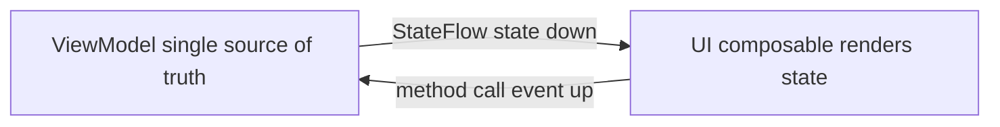
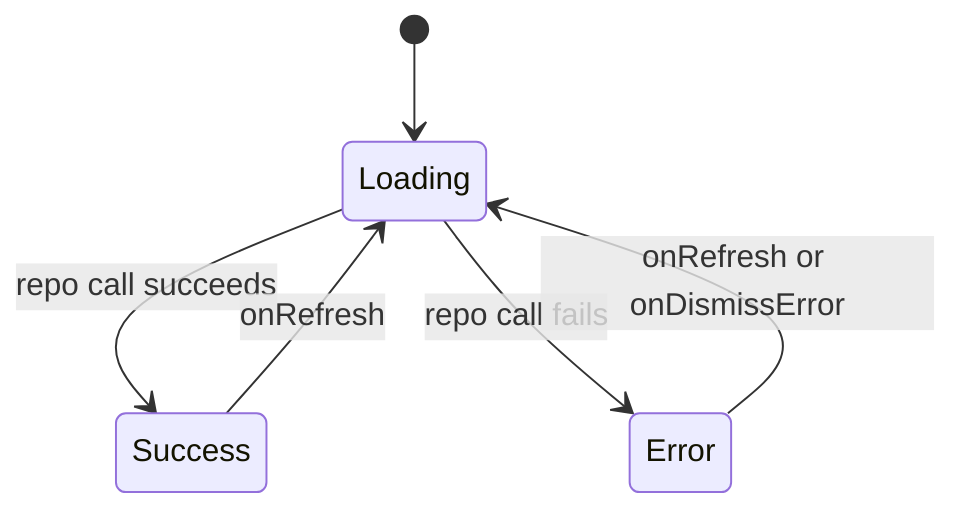

# Lecture 1 — MVVM with UDF: state down, events up, one source of truth

> "Architectures are spelling, not grammar. The grammar — state down, events up, one source of truth — is fixed. MVI, MVVM, and pure-state are just three spellings of it."

This is the lecture that decides whether app architecture feels like ceremony you cargo-cult or like a small set of rules that make everything downstream easier. The framing for the whole week is one sentence: **state flows down, events flow up, and there is exactly one source of truth for each piece of screen state.** Hold that, and every surprise this week — why the UI shouldn't mutate its own state, why `UiState` is a sealed type, why the `ViewModel` exposes `StateFlow` and not `MutableStateFlow`, why state vanishes on process death — has a one-idea explanation. Lose it, and you are copying `ViewModel` boilerplate and hoping.

We build the model top-down: the three architectures and why we pick one, then unidirectional data flow (the grammar), then `UiState` as a sealed type (the shape of the state), then the `ViewModel` (the owner of the state), then lifecycle-aware collection (how the UI reads it). By the end you should be able to point at any piece of state in an app and name its single owner and which direction it flows.

---

## 1. Three architectures, and why we pick MVVM-with-UDF

You will hear three names. They are not rival religions; they are three spellings of the same grammar, trading off differently.

**Pure Compose state.** State lives in composables (`remember { mutableStateOf(...) }`), hoisted as needed. For a single screen with no async work and nothing to survive, this is correct and you should not reach further. It falls down when state must outlive the composition (rotation, process death), when async work needs a scope that survives the screen, or when the same state drives multiple screens.

**MVVM with UDF.** A `ViewModel` owns the screen's state and exposes it as an observable `StateFlow<UiState>`; the UI observes and renders it; user actions go back up as plain method calls (`viewModel.onSearch(query)`). State flows down (the `StateFlow`), events flow up (the methods). This is Google's recommendation and Now-In-Android's choice.

**MVI (Model-View-Intent).** A stricter spelling: every user action is an explicit `Intent` object pushed into a single channel; a pure `reduce(state, intent) -> state` function produces the next state; the UI renders state and emits intents. It buys you a single, serializable action stream (great for logging and time-travel) at the cost of more ceremony per action.

Why does NiA pick MVVM-with-UDF? Because it gets the *whole* benefit of UDF — one source of truth, UI as a function of state, testable state production — with the *least* ceremony for a typical app. MVI's explicit intent channel and reducer are powerful for very state-heavy screens, but for most screens "a method per action and a `StateFlow` of state" is the same discipline with less plumbing. We compare them so you can choose; we build MVVM-with-UDF because it's the pragmatic default.

The thing to be able to say out loud: **all three obey "state down, events up, one source of truth." They differ in how strictly they spell the event stream** — scattered method calls (MVVM), an explicit intent channel through a reducer (MVI), or nothing because the state never leaves the composable (pure-state). Pick the simplest spelling that survives what your screen must survive.

---

## 2. Unidirectional data flow — the grammar

UDF is two rules and a consequence:

1. **State flows down.** The single source of truth (a `ViewModel`) holds the state and exposes it as a read-only stream. The UI reads it. The UI does *not* hold the real state — it holds a *snapshot* the framework hands it on each emission.
2. **Events flow up.** When the user does something, the UI calls a method on the owner (`viewModel.onToggleBookmark(id)`). The UI does *not* mutate state directly; it *reports* an event and lets the owner decide the next state.
3. **Consequence: the UI is a pure function of state.** `UI = f(state)`. Given the same `UiState`, the UI renders the same thing, every time. No hidden state in the views, no "it depends what happened before."


*State flows one way down to the UI, events flow one way back up to the owner.*

Here's the shape, end to end:

```kotlin
// STATE DOWN: the ViewModel owns state and exposes it read-only.
class FeedViewModel(private val repo: NewsRepository) : ViewModel() {
    private val _uiState = MutableStateFlow<FeedUiState>(FeedUiState.Loading)
    val uiState: StateFlow<FeedUiState> = _uiState.asStateFlow()   // read-only to the UI

    // EVENTS UP: a user action is a method. The ViewModel decides the next state.
    fun onRefresh() {
        viewModelScope.launch {
            _uiState.value = FeedUiState.Loading
            _uiState.value = try {
                FeedUiState.Success(repo.latest())
            } catch (e: IOException) {
                FeedUiState.Error(e.message ?: "Failed to load")
            }
        }
    }
}

// UI = f(state): render the snapshot, report events.
@Composable
fun FeedScreen(viewModel: FeedViewModel) {
    val state by viewModel.uiState.collectAsStateWithLifecycle()    // observe state (down)
    when (state) {
        FeedUiState.Loading -> LoadingSpinner()
        is FeedUiState.Error -> ErrorView(message = (state as FeedUiState.Error).message,
                                          onRetry = viewModel::onRefresh)   // event (up)
        is FeedUiState.Success -> FeedList(items = (state as FeedUiState.Success).items)
    }
}
```

The bugs UDF prevents, each one a real production incident:

- **Lost state on rotation.** If the UI held the state in a `remember`, rotation (which recreates the composition) would lose it. The `ViewModel` survives rotation, so state held there doesn't.
- **Two sources of truth.** If both the UI and the `ViewModel` held "the current query," they would drift — the UI shows one thing, the logic uses another. One owner means no drift.
- **Untestable UI.** If the UI mutated its own state in response to events, you'd need to drive the UI to test the logic. With UDF, the logic is in the `ViewModel`, testable as a `StateFlow` with no UI at all (lecture 2, §5).

The discipline, as a code-review rule: **the UI never mutates the state it renders, and never owns it.** It reads a `StateFlow` and calls methods. If you see a composable changing the data it also displays, the UDF is broken.

---

## 3. `UiState` as a sealed type — make contradictions unrepresentable

What *shape* is the state the `ViewModel` exposes? The naive answer is a flat data class with flags:

```kotlin
// THE ANTI-PATTERN: flat flags. Many of these combinations are nonsense.
data class FeedUiState(
    val isLoading: Boolean = false,
    val items: List<Article> = emptyList(),
    val error: String? = null
)
// What does isLoading = true, error = "boom", items = [3 articles] mean?
// Loading AND errored AND has data? The type permits a state that can't exist.
```

This data class can represent contradictions: loading *and* errored *and* showing data, all at once. Every screen that renders it has to defensively decide which flag wins, and different screens decide differently, and that's where the inconsistent-UI bugs live.

The fix is a **sealed type**, which makes the illegal states *unrepresentable*:

```kotlin
// THE PATTERN: a sealed hierarchy. Exactly one state at a time, by construction.
sealed interface FeedUiState {
    data object Loading : FeedUiState
    data class Error(val message: String) : FeedUiState
    data class Success(val items: List<Article>) : FeedUiState
}
```

Now the state is *exactly one* of `Loading`, `Error`, or `Success` — never two at once, because a value is one variant of the sealed type. And rendering it is an **exhaustive `when`** the compiler checks:

```kotlin
when (state) {
    FeedUiState.Loading -> LoadingSpinner()
    is FeedUiState.Error -> ErrorView(state.message)   // smart-cast: state.message is available
    is FeedUiState.Success -> FeedList(state.items)    // smart-cast: state.items is available
}   // no `else` needed; add a 4th state and this when fails to compile until you handle it
```

This is the exact "make illegal states unrepresentable" move you met with typed routes in Week 10 — there, a route was a type so a bad route couldn't compile; here, the UI state is a sealed type so a contradictory state can't be constructed. The payoffs:

- **No contradictions.** You cannot be `Loading` and `Success` simultaneously; the type forbids it.
- **Exhaustive rendering.** The `when` must handle every state; add `Empty` later and the compiler lists every screen that needs to handle it.
- **Smart casts give you the data.** Inside `is FeedUiState.Success`, `state.items` is available and typed — no nullable `items` to null-check, because `items` only exists *in* the `Success` state where it makes sense.


*The sealed type means the screen is in exactly one of these states at a time, never a blend.*

When a screen genuinely has independent sub-states (a list that's loaded while a *separate* "bookmarking in progress" flag toggles), you can nest: a `Success(val items: ..., val isRefreshing: Boolean)` is fine — the point isn't "never use a boolean," it's "don't let the *top-level* state be a soup of flags that contradict each other." Model the screen's *primary* state as sealed; put genuinely-orthogonal sub-state inside the relevant variant.

---

## 4. The `ViewModel` — the owner of the state

The Jetpack `ViewModel` is the state owner. Three properties make it the right home for screen state:

- **It survives configuration change.** Rotate the device, and the same `ViewModel` instance is handed to the recreated UI — the state, the in-flight load, everything continues. (It does *not* survive process death; that's `SavedStateHandle`, lecture 2.)
- **It has a coroutine scope tied to its lifetime.** `viewModelScope` is cancelled automatically when the `ViewModel` is cleared (the screen is gone for good), so the work it launches can't leak past the screen.
- **It is testable in isolation.** A `ViewModel` is plain Kotlin with no Android UI dependency (just `androidx.lifecycle.ViewModel`), so you construct it with a fake repository and assert on its `StateFlow` on the JVM.

The non-negotiable encapsulation rule: **expose `StateFlow`, never `MutableStateFlow`.** Hold the mutable flow privately; expose the read-only view:

```kotlin
class FeedViewModel(private val repo: NewsRepository) : ViewModel() {
    private val _uiState = MutableStateFlow<FeedUiState>(FeedUiState.Loading)  // private, mutable
    val uiState: StateFlow<FeedUiState> = _uiState.asStateFlow()               // public, read-only

    fun onRefresh() { /* mutates _uiState; the only path that can */ }
}
```

If you exposed the `MutableStateFlow`, the UI could set the state directly — reintroducing the "two sources of truth" and "UI mutates its own state" bugs UDF exists to prevent. The private-mutable / public-read-only pattern is how you enforce "events up": the *only* way the state changes is through a method on the `ViewModel`, which is the single place the next state is decided.

Obtaining the `ViewModel` in Compose:

```kotlin
@Composable
fun FeedScreen(viewModel: FeedViewModel = viewModel(factory = FeedViewModel.Factory(repo))) {
    // viewModel() returns the ViewModel scoped to the nearest ViewModelStoreOwner —
    // the Activity, the nav back-stack entry (Week 10), etc. Same instance across recompositions.
    val state by viewModel.uiState.collectAsStateWithLifecycle()
    // …
}
```

`viewModel()` returns the same instance across recompositions and across configuration change, scoped to its `ViewModelStoreOwner`. In a Nav3 app that owner is the back-stack entry (Week 10, §7), so the `ViewModel` lives exactly as long as its screen is on the stack — created on navigate-in, cleared on pop. This week we pass the factory by hand so the dependency is visible; Week 13's Hilt supplies it for you.

### The factory — wiring dependencies by hand (so you see them)

A `ViewModel` with constructor dependencies (a repository) needs a **factory** so the framework knows how to build it. We write it by hand this week precisely so the dependency graph is visible — Hilt hides this next week, and you should understand what it's hiding:

```kotlin
class FeedViewModel(private val repo: NewsRepository) : ViewModel() {
    // …state and methods…

    // A factory the framework uses to construct the ViewModel with its dependency.
    class Factory(private val repo: NewsRepository) : ViewModelProvider.Factory {
        override fun <T : ViewModel> create(modelClass: Class<T>): T {
            @Suppress("UNCHECKED_CAST")
            return FeedViewModel(repo) as T
        }
    }
}
```

The cast is the one ugly spot, and it's exactly the boilerplate Hilt's `@HiltViewModel` removes — Hilt generates the factory and supplies the repository from the dependency graph, so next week the call site becomes a bare `hiltViewModel()` with no factory in sight. For now, the hand-written factory makes the wiring explicit: *something* has to supply the repository, and right now that something is you.

### Events up — every user action is a method

The "events up" half of UDF is concrete: each thing the user can do is a *method* on the `ViewModel`, and the method is the single place the next state is decided. The UI calls the method; it does not change state itself.

```kotlin
class FeedViewModel(private val repo: NewsRepository) : ViewModel() {
    private val _uiState = MutableStateFlow<FeedUiState>(FeedUiState.Loading)
    val uiState: StateFlow<FeedUiState> = _uiState.asStateFlow()

    // One method per user action. Each decides the next state.
    fun onRefresh() {
        viewModelScope.launch {
            _uiState.value = FeedUiState.Loading
            _uiState.value = runCatching { repo.latest() }
                .fold(
                    onSuccess = { FeedUiState.Success(it) },
                    onFailure = { FeedUiState.Error(it.message ?: "Failed to load") }
                )
        }
    }

    fun onToggleBookmark(id: Int) { viewModelScope.launch { repo.toggleBookmark(id) } }
    fun onDismissError() { _uiState.value = FeedUiState.Loading }
}
```

The UI wires these as plain callbacks, the same way it has hoisted state since Week 8 — except now the hoist target is a `ViewModel`, not a parent composable:

```kotlin
FeedList(
    state = state,
    onRefresh = viewModel::onRefresh,            // event up
    onBookmark = viewModel::onToggleBookmark,    // event up, with an argument
)
```

This is why UDF is sometimes called "state hoisting taken to its conclusion": in Week 8 you hoisted a `mutableStateOf` up to a parent composable; here you hoist *all* the durable state up to a `ViewModel` that survives the composition entirely. The pattern — render state, report events via method references — is identical; only the owner moved up a level.

---

## 5. Lifecycle-aware collection — `collectAsStateWithLifecycle`

The UI reads the `StateFlow` to get the current state. *How* it collects matters:

```kotlin
// CORRECT: collection is tied to the screen's lifecycle.
val state by viewModel.uiState.collectAsStateWithLifecycle()

// SUBTLY WRONG for screen state: collects regardless of lifecycle.
val state by viewModel.uiState.collectAsState()
```

`collectAsStateWithLifecycle()` collects the flow only while the composable's lifecycle is at least `STARTED` — i.e. while the screen is actually visible. When the screen is backgrounded, collection *stops*; when it returns to the foreground, collection resumes. `collectAsState()` keeps collecting even when the screen is not visible.

Why does this matter? Because the `StateFlow` is often the *tail* of an upstream pipeline — `repository.flow.map { … }.stateIn(...)` (lecture 2, §1). With `SharingStarted.WhileSubscribed(5000)`, that upstream work *stops* shortly after the last collector goes away. `collectAsStateWithLifecycle` makes the screen stop being a collector when backgrounded, which lets the upstream — a database query, a network poll — stop doing work the user can't see. Use `collectAsState()` and the upstream keeps running while the app is in the background, burning battery on state nobody is looking at.

The rule: **for screen state from a `ViewModel`, use `collectAsStateWithLifecycle()`.** It ties the cost of producing state to the screen being visible, which is exactly what you want. (`collectAsState` is fine for flows that aren't lifecycle-sensitive — a purely in-memory transform with no upstream cost — but defaulting to the lifecycle-aware one is the safe habit.)

### The five UDF mistakes, and their fixes

These recur often enough to memorize as a gallery — the anti-pattern, why it's wrong, and the fix:

```kotlin
// MISTAKE 1 — exposing the mutable flow. The UI can now set state directly.
val uiState = MutableStateFlow<UiState>(Loading)          // WRONG: public mutable
// FIX:
private val _uiState = MutableStateFlow<UiState>(Loading)
val uiState: StateFlow<UiState> = _uiState.asStateFlow()  // public read-only

// MISTAKE 2 — durable state in a remember. Lost on rotation / process death.
var query by remember { mutableStateOf("") }              // WRONG for durable state
// FIX: hoist it to the ViewModel (or SavedStateHandle for process-death, lecture 2).

// MISTAKE 3 — the UI mutating the data it renders. Two sources of truth.
articles.add(newArticle)                                  // WRONG: UI changes state
// FIX: report an event; the ViewModel decides the next state.
viewModel.onAddArticle(newArticle)

// MISTAKE 4 — flat-flags UiState that can contradict itself.
data class UiState(val isLoading: Boolean, val data: List<X>, val error: String?)  // WRONG
// FIX: a sealed type — exactly one state at a time.
sealed interface UiState { data object Loading; data class Error(…); data class Success(…) }

// MISTAKE 5 — launching the wrong scope. Work leaks past the screen.
GlobalScope.launch { … }                                 // WRONG: outlives the ViewModel
// FIX: viewModelScope — cancelled automatically when the ViewModel is cleared.
viewModelScope.launch { … }
```

Each is a violation of one rule from this lecture: one source of truth (1, 3), state in its right owner (2), make-illegal-states-unrepresentable (4), and scope tied to lifetime (5). When something behaves surprisingly, check this list before anything else — the bug is almost always one of these five.

---

## 6. The full loop, drawn once

Put it together and the loop is small and closed:

```text
┌──────────────────────────────────────────────────────────────┐
│  UI (composable)                                              │
│    state = viewModel.uiState.collectAsStateWithLifecycle()   │  <- STATE DOWN
│    when (state) { Loading -> …; Error -> …; Success -> … }    │  (UI = f(state))
│    Button(onClick = { viewModel.onRefresh() })               │  -> EVENT UP
├──────────────────────────────────────────────────────────────┤
│  ViewModel (the single source of truth)                      │
│    private _uiState: MutableStateFlow<UiState>               │
│    val uiState: StateFlow<UiState>  (read-only)              │
│    fun onRefresh() { viewModelScope.launch { … } }          │  decides the next state
├──────────────────────────────────────────────────────────────┤
│  Repository (data layer — lecture 2)                         │
│    suspend fun latest(): List<Article>                       │
│    val stream: Flow<List<Article>>                           │
└──────────────────────────────────────────────────────────────┘
```

State comes *down* from the repository, through the `ViewModel` (which shapes it into `UiState`), to the UI (which renders it). Events go *up* from the UI, through `ViewModel` methods, to the repository. One direction each. One owner per piece of state. The UI is a pure function of the state it's handed. That's the whole grammar.

---

## 7. What the architecture asks of you — the sharp edges

UDF is a good discipline, which means it asks for rigor in predictable places:

1. **Decide what's `ViewModel` state vs. Compose state.** Not *everything* belongs in the `ViewModel`. Transient UI-only state — whether a dropdown is expanded, an animation's progress — can stay in `remember` in the composable; it's cheap and doesn't need to survive. Durable, business-relevant state (the query, the selected item, the loaded data) belongs in the `ViewModel`. Drawing this line wrong (query in `remember`) is the process-death bug of lecture 2, §3.
2. **Don't leak `MutableStateFlow`.** Expose read-only. Every time you expose the mutable flow "just for now," you punch a hole in the single-source-of-truth.
3. **`UiState` is the *screen's* state, not the *domain* model.** `FeedUiState.Success(items)` holds *UI-ready* data, possibly transformed from the domain model (formatted dates, computed flags). Don't expose raw domain entities the UI then has to massage; do the massaging in the `ViewModel`.
4. **One `ViewModel` per screen (roughly).** A `ViewModel` owns *a* screen's state. Sharing one across unrelated screens, or splitting one screen across several `ViewModel`s, both blur ownership. Scope it to the screen (the nav entry).
5. **The `StateFlow` always has a value.** Unlike a cold `Flow`, a `StateFlow` has a current value (its initial, then each update). That's why `UiState` starts at `Loading` — there's always *something* to render, never "no state yet."

None of these are reasons to avoid the architecture — they're the rigor that makes it pay off. When state behaves surprisingly, ask: who owns this, and is it flowing down while events flow up?

---

## 8. Recap — the one-question habit

You will write `ViewModel`s and `UiState`s all week. The discipline that turns you from someone who *copies the pattern* into someone who *reasons about state* is to ask, of every piece of state: **who owns this, and which way does it flow?**

- State lost on rotation → it was in the UI, not the `ViewModel`. Move it up.
- UI shows stale/contradictory data → two sources of truth, or a flat-flags `UiState`. One owner; sealed state.
- Can't test the logic without driving the UI → the logic is in the UI, not the `ViewModel`. Hoist it.
- Background work keeps running when backgrounded → `collectAsState` instead of `collectAsStateWithLifecycle`, or no `WhileSubscribed`.
- The UI can set its own state → you exposed `MutableStateFlow`. Expose read-only.
- A `when (state)` demands an `else` → your `UiState` isn't sealed; make it a `sealed interface` so rendering is exhaustive.
- Work outlives the screen / leaks → you launched on the wrong scope; use `viewModelScope`.
- Two screens fight over the same data → no single source of truth; hoist it to a shared owner (a repository), not a duplicated `ViewModel` field.

MVVM-with-UDF didn't invent a clever pattern; it applied one grammar — state down, events up, one source of truth — and modelled the state as a sealed type so contradictions can't be spelled. The `ViewModel` owns it, exposes it read-only, survives rotation, and the UI renders it as a pure function. Learn the grammar well enough to place any state in its single owner, and you have half this week's skill: drawing the line between Compose state and `ViewModel` state.

In lecture 2 we go down a layer: the Now-In-Android data/domain/UI split and the dependency rule, deriving the `StateFlow<UiState>` from a repository `Flow` with `stateIn` and `combine`, `SavedStateHandle` for the slice that must survive *process death* (not just rotation), and testing the whole thing with Turbine and a fake repository — no device. Bring this loop diagram with you; we're about to put a real data layer under it and make it survive the process dying.
