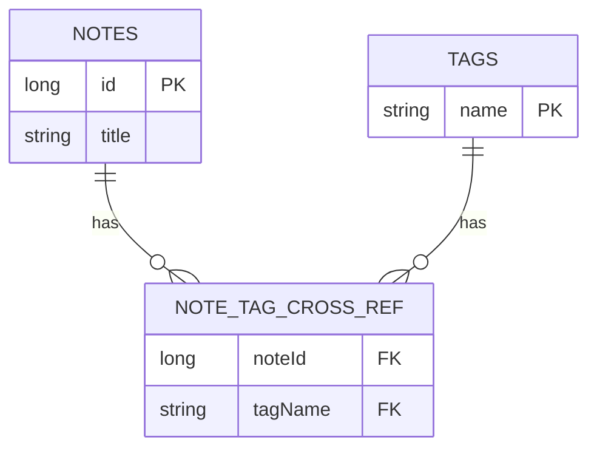
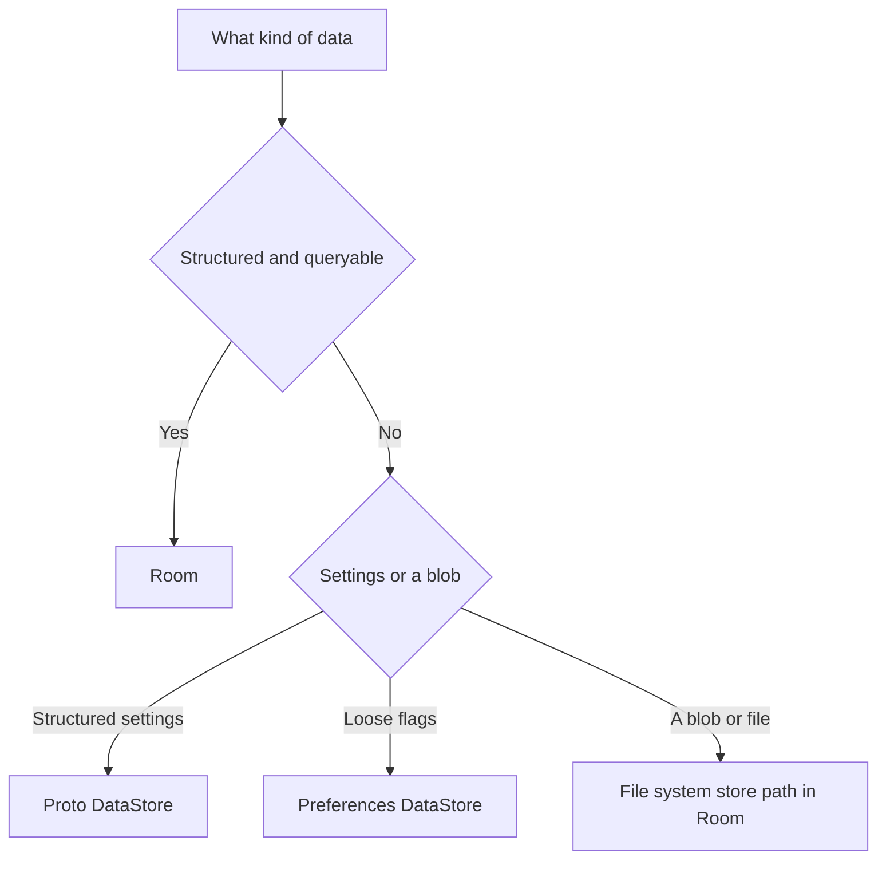

# Lecture 1 — Room and the SQLite lineage: what it solves, and what it still hides

> "Room isn't a new database. It's a typed, compile-time-checked way to talk to a database that's been on every Android phone since 2009."

This is the lecture that decides whether Room feels like magic or like a leaky abstraction you can reason about. The framing for the whole week is one sentence: **Room is a compile-time-verified, annotation-driven front end over SQLite.** Hold that, and every surprise this week — why a query is slow, why a `Flow` query re-emits, why a `@Relation` runs a second query, why a migration crashes on launch — has a one-layer-down explanation. Lose it, and you are cargo-culting `@Entity` annotations and praying the data is still there after a relaunch.

We are going to build the mental model bottom-up: the engine (SQLite), then the front end (the annotations), then the runtime objects (`@Database`, the DAO), then the reactive read path (`Flow` queries). By the end you should be able to draw the stack on a whiteboard and point to which layer is responsible for any given behaviour.

---

## 1. The stack, drawn once so we never have to argue about it again

Here is the full stack under a Room app, top to bottom:

```text
┌─────────────────────────────────────────────────────────────┐
│  Your code                                                   │
│    val notes: Flow<List<Note>> = dao.observeNotes()          │
│    suspend fun add(note: Note) = dao.insert(note)            │
├─────────────────────────────────────────────────────────────┤
│  Room (the annotations + generated, verified runtime)        │
│    @Entity / @Dao / @Database  -> verified schema + SQL      │
│    NotesDao_Impl (generated)   -> binds rows <-> objects     │
│    InvalidationTracker         -> re-emits Flow on change    │
├─────────────────────────────────────────────────────────────┤
│  SupportSQLite (the thin AndroidX wrapper over the engine)   │
│    SupportSQLiteDatabase / SupportSQLiteStatement            │
├─────────────────────────────────────────────────────────────┤
│  SQLite (the engine — present, just not spelled out)         │
│    a notes.db file on disk: tables, indices, the WAL journal │
│    the query planner, B-tree indices, transactions           │
└─────────────────────────────────────────────────────────────┘
```

You never write raw SQLite C in a Room app. But every one of those layers is *there*, running your query, planning it, journaling the write. When you open `notes.db` with `sqlite3` (do this — it is on the resources page) you will see ordinary SQLite tables named `notes` and `tags` with the columns your `@Entity` declared, plus a `room_master_table` holding the schema hash and an `android_metadata` table. That file is portable SQLite — you can copy it off the device and open it in DB Browser. Room wrote those tables through SQLite.

**Why does this matter for you, the engineer?** Because the moment a query is slow or a migration fails, the Room docs are good but the SQLite docs and twenty-five years of writing about SQLite query plans, indices, and the WAL journal are deep. "Room query slow" returns a few blog posts; "SQLite query planner no index" returns the entire history of database performance. `EXPLAIN QUERY PLAN` works on the file Room wrote. Knowing the lineage doubles the surface area of help available to you.

---

## 2. What Room actually solves

Raw SQLite on Android (via `SQLiteOpenHelper`) is powerful and *miserable* to use. The pre-Room ritual was:

- `db.rawQuery("SELECT * FROM notes WHERE title = ?", arrayOf(query))` — a stringly-typed SQL mini-language with no compiler checking. A typo in a column name crashed at runtime, in front of a user.
- Manually reading a `Cursor` column by column index: `cursor.getString(cursor.getColumnIndexOrThrow("title"))` — repeated for every field, easy to get wrong, miserable to maintain.
- Hand-written `onUpgrade(db, old, new)` with a `switch` on version, full of `ALTER TABLE` strings nobody could review.
- No reactive reads — you queried, you got a snapshot, and you re-queried by hand when something changed.

Room replaces all of it with Kotlin the compiler checks:

```kotlin
@Entity(tableName = "notes")
data class Note(
    @PrimaryKey(autoGenerate = true) val id: Long = 0,
    val title: String,
    val body: String,
    val createdAt: Long          // epoch millis; we'll convert Instant later
)

@Dao
interface NotesDao {
    @Query("SELECT * FROM notes WHERE title LIKE '%' || :query || '%' ORDER BY createdAt DESC")
    fun search(query: String): Flow<List<Note>>     // verified SQL, reactive read

    @Insert
    suspend fun insert(note: Note): Long
}
```

The headline win: that `@Query` SQL is **verified at compile time** against the schema. Misspell `title` and the build fails with the exact column and the available alternatives — not a runtime `Cursor` crash. Room generates `NotesDao_Impl` that runs the query, reads the `Cursor` into `Note` objects, and (for the `Flow` version) re-runs it when the `notes` table changes. The schema is code, the SQL is checked, the row→object binding is generated, and the reactive read is free. This is the correct default for on-device structured data in 2026.

The second thing Room solves is **coroutines and Flow integration.** A `suspend` DAO method runs the query off the main thread on Room's executor and resumes you with the result. A `Flow`-returning method gives you a cold stream that re-emits whenever the underlying table changes — driven by Room's `InvalidationTracker`, which watches the tables your query touched. That is the reactive read path that lets a Compose screen `collectAsStateWithLifecycle()` a query and re-render automatically when the data changes, with zero manual refresh. We will see in §6 exactly how the invalidation works and why it sometimes re-emits more than you expect.

---

## 3. `@Entity` — the table

An `@Entity` is a data class that maps to a SQLite table. The class is the table; each property is a column. Room reads the annotations to build the `CREATE TABLE` statement.

```kotlin
@Entity(
    tableName = "notes",
    indices = [Index(value = ["title"]), Index(value = ["createdAt"])]
)
data class Note(
    @PrimaryKey(autoGenerate = true) val id: Long = 0,
    @ColumnInfo(name = "title") val title: String,
    @ColumnInfo(name = "body") val body: String,
    val createdAt: Long,
    @Embedded val audit: Audit = Audit()      // flattened into columns
) {
    @Ignore var transientFlag: Boolean = false  // not persisted
}

data class Audit(val createdBy: String = "system", val version: Int = 1)
```

The decisions to internalise:

- **`@PrimaryKey`.** Every table needs one. `autoGenerate = true` gives you a SQLite `ROWID`-backed auto-incrementing key — the default for synthetic ids. Use a *natural* key (a server id, a UUID) when the row's identity comes from outside; use auto-generate when it doesn't.
- **`@Index`.** An index is a B-tree SQLite maintains so a `WHERE` or `ORDER BY` on that column doesn't scan the whole table. Index the columns you filter and sort on — and *only* those, because every index costs write time and disk. Indexing `title` and `createdAt` here is deliberate: we search by `title` and sort by `createdAt`. (We measure the difference an index makes in the challenge.)
- **`@Embedded`.** Flatten a value object into the parent's columns — `Audit` becomes `createdBy` and `version` columns on `notes`, no separate table. Use it to group related fields without a join.
- **`@Ignore`.** A property Room should *not* persist — a transient UI flag. Without `@Ignore`, Room tries to make a column for it and may fail (no constructor mapping).

---

## 4. `@Dao` — the typed query interface

A `@Dao` is an interface of methods Room implements. This is where the compile-time SQL verification lives, and it is Room's biggest single win.

```kotlin
@Dao
interface NotesDao {

    @Query("SELECT * FROM notes ORDER BY createdAt DESC")
    fun observeAll(): Flow<List<Note>>            // reactive: re-emits on change

    @Query("SELECT * FROM notes WHERE id = :id")
    suspend fun byId(id: Long): Note?             // one-shot suspend read

    @Query("SELECT COUNT(*) FROM notes")
    suspend fun count(): Int                      // SELECT COUNT(*), builds zero objects

    @Insert(onConflict = OnConflictStrategy.ABORT)
    suspend fun insert(note: Note): Long

    @Upsert
    suspend fun upsert(note: Note)                // insert or update on PK collision

    @Update
    suspend fun update(note: Note)

    @Delete
    suspend fun delete(note: Note)

    @Query("DELETE FROM notes WHERE createdAt < :cutoff")
    suspend fun deleteOlderThan(cutoff: Long): Int  // bulk delete in SQL, no objects loaded
}
```

Things to know:

- **The SQL is verified.** `SELECT * FROM notes` is checked against the `notes` table; a typo, a wrong column, a parameter mismatch — all build errors. This is the property that eliminates the entire "stringly-typed query crashed in production" bug class.
- **`suspend` vs. `Flow`.** A `suspend` method is a one-shot read off the main thread. A `Flow` method is a reactive subscription. Use `suspend` for "give me the current value once" (a detail screen load) and `Flow` for "keep this list in sync" (the list screen).
- **Conflict strategies.** `@Insert(onConflict = ...)` chooses what happens on a primary-key/unique collision: `ABORT` (throw), `REPLACE` (delete-and-insert), `IGNORE` (skip). `@Upsert` is the cleaner "insert or update" that you usually want for sync.
- **Bulk operations stay in SQL.** `deleteOlderThan` runs a single `DELETE ... WHERE` in SQLite — it does **not** load a million `Note` objects to delete them one by one. Same for `count()`: `SELECT COUNT(*)` builds zero objects. Pushing work into SQL is the performance discipline this week, exactly as predicates-in-SQLite were last term's.
- **Return only the columns you need.** A `@Query` does not have to return the whole entity. If a list screen shows only the title and date, return a small projection POJO with just those columns — `SELECT id, title, createdAt` into a `data class NoteListItem(...)`. Room maps the result columns to the POJO's properties by name, and you avoid materialising the `body` column for rows you only show a title for. On a table with large `body` text, projecting is a real saving; the verifier checks the projection's columns against the query just as it checks the entity's.

### `@Transaction` for multi-step atomic reads and writes

A single DAO method that does several operations — read, then conditionally write — should be atomic so a concurrent change can't interleave. Wrap it with `@Transaction`:

```kotlin
@Transaction
suspend fun upsertNoteWithTags(note: Note, tagNames: List<String>) {
    val id = upsert(note)                       // insert or update the note
    tagNames.forEach { name ->
        upsertTag(Tag(name))                    // ensure each tag row exists
        link(NoteTagCrossRef(id, name))         // link note <-> tag
    }
}
```

Room runs the whole `@Transaction` function inside a single SQLite transaction: either every step commits or none does. Without it, a crash (or a concurrent reader) between the note insert and the tag link could leave a note with missing tags. `@Transaction` on a `suspend` default method is the idiomatic way to express "these writes are one logical operation."

### `@TypeConverter` — storing types SQLite doesn't know

SQLite has five storage classes: NULL, INTEGER, REAL, TEXT, BLOB. To store an `Instant`, an enum, or a `List<String>`, you convert to and from one of those:

```kotlin
class Converters {
    @TypeConverter fun instantToLong(value: Instant?): Long? = value?.toEpochMilli()
    @TypeConverter fun longToInstant(value: Long?): Instant? = value?.let(Instant::ofEpochMilli)

    @TypeConverter fun statusToString(s: NoteStatus): String = s.name
    @TypeConverter fun stringToStatus(s: String): NoteStatus = NoteStatus.valueOf(s)
}

@Database(entities = [Note::class], version = 1)
@TypeConverters(Converters::class)
abstract class CrunchDatabase : RoomDatabase() {
    abstract fun notesDao(): NotesDao
}
```

A converted column is stored as its primitive form (an `Instant` as an `INTEGER` of epoch millis). The catch you must remember: a converter stores a value as an *opaque* primitive from SQLite's perspective for anything non-trivial — if you store a `List<String>` as a JSON `TEXT` blob, you *cannot* query inside it with SQL (`WHERE tags CONTAINS ...` won't work). Store something you need to filter on as a real column or a related table, not a converted blob.

---

## 5. `@Relation` and `@Junction` — the object graph

Room models one-to-many and many-to-many with `@Relation`, returning a class that holds the parent and its children. For many-to-many you add a `@Junction` describing the join table.

```kotlin
@Entity(tableName = "tags")
data class Tag(@PrimaryKey val name: String)

// The join table for the many-to-many.
@Entity(primaryKeys = ["noteId", "tagName"])
data class NoteTagCrossRef(val noteId: Long, val tagName: String)

// A note WITH its tags — a relation query result.
data class NoteWithTags(
    @Embedded val note: Note,
    @Relation(
        parentColumn = "id",
        entityColumn = "name",
        associateBy = Junction(
            value = NoteTagCrossRef::class,
            parentColumn = "noteId",
            entityColumn = "tagName"
        )
    )
    val tags: List<Tag>
)

@Dao
interface NotesDao {
    @Transaction                                   // REQUIRED for relation queries
    @Query("SELECT * FROM notes ORDER BY createdAt DESC")
    fun observeNotesWithTags(): Flow<List<NoteWithTags>>
}
```

Two rules to internalise:

1. **Relation queries need `@Transaction`.** Room satisfies a `@Relation` with *more than one query*: one for the parent rows, then one (or more) for the children. Without `@Transaction` those queries aren't atomic and you can read a torn state if the data changes mid-query. Room will warn you; add `@Transaction`.

2. **The relation is an N+1 in disguise — but a batched one.** Room runs the parent query, collects the parent keys, then runs a *single* `WHERE ... IN (keys)` for the children and stitches them in memory. That is far better than one query per parent, but it is still a *second* query, and for a list of 10,000 notes each with tags, that second query and the in-memory stitching are real cost. For very large relation queries you page (Paging 3) or denormalise. The N+1 is batched, not eliminated.


*NoteTagCrossRef is the join table Room uses to model the many-to-many between notes and tags.*

---

## 6. `Flow` queries — the reactive read path

Return a `Flow<T>` from a DAO method and Room gives you a cold flow that emits the current result and re-emits whenever the tables the query reads are modified. The machinery is the **`InvalidationTracker`**: Room installs SQLite triggers (or an observer) on the tables your query touches; when a write hits one of those tables, the tracker invalidates the query and the `Flow` re-runs and emits a fresh result.

```kotlin
@Query("SELECT * FROM notes WHERE title LIKE '%' || :q || '%' ORDER BY createdAt DESC")
fun search(q: String): Flow<List<Note>>

// In a ViewModel:
val results: StateFlow<List<Note>> =
    queryFlow                                  // a Flow<String> of the search box text
        .flatMapLatest { dao.search(it) }       // switch to the new query, cancel the old
        .stateIn(viewModelScope, SharingStarted.WhileSubscribed(5_000), emptyList())
```

The consequences to know:

- **Re-emission is at table granularity, not row granularity.** If your `Flow` query reads the `notes` table, *any* write to `notes` re-emits it — even a write to a row your query doesn't match. Room's invalidation is per-table. Usually fine; occasionally a reason a `Flow` re-emits "for no reason" (the reason is a sibling write to the same table).
- **`distinctUntilChanged()` is your friend.** Because of table-granular invalidation, a `Flow` can emit an *equal* list twice. Adding `.distinctUntilChanged()` (or relying on `StateFlow`'s built-in equality) suppresses the redundant emission and the redundant recomposition.
- **The flow is cold and lifecycle-bound.** Collected via `collectAsStateWithLifecycle()` in Compose, the query is active only while the screen is on-screen. `SharingStarted.WhileSubscribed(5_000)` keeps it warm for 5s across config changes, then stops. This is the Week 5 cold/hot-flow discipline meeting Room.

---

## 7. What Room still hides — the leaks to know about

Room is a good abstraction, which means it leaks in predictable places. Senior engineers know where:

1. **The query plan.** You write a `@Query`; you don't see whether SQLite used an index or scanned the table. The fix is to look — `EXPLAIN QUERY PLAN` on the actual `.db`, or the Database Inspector. If a query is slow, profile it; don't guess. A missing index is the usual culprit.
2. **The relation N+1.** A `@Relation` runs a second query; a list of relation results pays for it. For large lists, page or denormalise (§5).
3. **`Flow` re-emission granularity.** Table-level invalidation means a `Flow` can re-emit on an unrelated write to the same table. `distinctUntilChanged` smooths it.
4. **Main-thread enforcement.** Room **throws** if you run a blocking query on the main thread (`allowMainThreadQueries()` exists but is a footgun — don't). `suspend`/`Flow` methods are off-main by construction; that's why you use them.
5. **Migrations.** Additive changes can be `AutoMigration`s; anything that transforms data needs a hand-written `Migration` with SQL. Room hides migration entirely until you bump the version, at which point a missing or wrong migration crashes on launch. Lecture 2 is largely about this.

None of these are reasons to avoid Room. They are the things you keep in your peripheral vision so that when the abstraction leaks, you recognise the puddle instead of staring at it.

---

## 8. The decision table

When do you use Room, and when do you reach for something else? Memorise the shape:

| Situation | Reach for |
|-----------|-----------|
| Structured, queryable, related on-device data | **Room** — the default in 2026 |
| A handful of typed settings / preferences | **Proto DataStore** (lecture 2) |
| Loose key-value flags | **Preferences DataStore** (lecture 2) |
| A blob / file / image attachment | **The file system** (lecture 2) — store the *path* in Room |
| A huge list you scroll | **Room + Paging 3** |
| Bulk delete/update of many rows | A `@Query("DELETE ... WHERE")` — stays in SQL |
| Fine-grained raw SQL Room can't express | Drop to `supportSQLiteDatabase` / a raw query |
| Encryption at rest | **SQLCipher** over Room (Week 22) |
| Data that lives on a server | **Networking** (Week 15) → cache into Room |

That last row matters for this track specifically: Room is the *local* store. The data the user sees usually comes from a server (Week 15), gets cached into Room, and the UI reads Room as the single source of truth — the offline-first pattern. Room is the cache and the source of truth; the network fills it. Don't conflate "where the data is stored" (Room) with "where the data comes from" (the network).


*Which store to reach for, following the decision table above.*

### Where Room fits in the Now-In-Android data layer

To make the "single source of truth" concrete, here is the shape the rest of Phase 3 builds toward — the data-layer pattern Now-In-Android uses and the capstone requires:

```text
   Network (Week 15)                 Room (this week)              UI (Compose)
   ────────────────                  ──────────────────           ──────────────
   WeatherApi.forecast()  ──fetch──▶  upsert(entity)
                                       │
   (DTO -> domain -> entity)          observe(): Flow<Entity>  ──map──▶  StateFlow<UiState>
                                       ▲                                     │
                                       └── the UI NEVER reads the network ───┘
                                            directly; it reads Room.
```

The repository fetches over the network, writes the result into Room, and exposes a `Flow` *from Room* to the ViewModel. The UI observes that `Flow`, so it always renders the last-known data instantly — even offline — and a network refresh is just a write into Room that the `Flow` picks up automatically (the `InvalidationTracker` again). This is why Week 14 (Room) comes *before* Week 15 (networking): the store is the foundation, and the network is a fill on top of it. When you build the weather client next week, it will write into the exact database you build this week, and the UI will read Room, not the API. Internalising "the UI reads the cache, the network fills the cache" now is what makes next week's offline-first wiring feel obvious instead of surprising.

---

## 9. Recap — the one-layer-down habit

You will write Room all week. The discipline that turns you from someone who *uses* Room into someone who can *debug* it is the reflex to ask, on every surprise, "what is SQLite doing one layer down?"

- Query is slow → is there an index on the filtered/sorted column? (`EXPLAIN QUERY PLAN`.)
- Relation is slow → it's the batched N+1 second query; page or denormalise.
- `Flow` re-emits "for no reason" → table-granular invalidation from a sibling write; `distinctUntilChanged`.
- App crashes on launch after a version bump → a missing or wrong migration. (Lecture 2.)
- Room threw on the main thread → use a `suspend`/`Flow` DAO method; never `allowMainThreadQueries`.

Room solved the stringly-typed SQL and the `Cursor` misery and gave you reactive reads for free. It did not repeal the laws of the engine underneath. Learn the engine well enough to read its query plan, write the front end every day, and you have the skill this week earns: model a schema with relations and query it efficiently — *and know why it's efficient.*

In lecture 2 we go to the other two persistence tools (Preferences and Proto DataStore, the scoped-storage file system), the migration machinery (`AutoMigration`, manual `Migration`, the schema export, the `MigrationTestHelper` upgrade-path test), and the performance footguns with measured before/after. Bring this stack diagram with you; we are about to use every layer of it.

---

## 10. Appendix — what an index actually is, and why "index everything" is wrong

Because indexing is the lever most people reach for when a query is slow, it is worth understanding what an index *is* one layer down so you use it deliberately rather than scattering `@Index` everywhere. An index in SQLite is a separate **B-tree** data structure, sorted by the indexed column, that maps each value to the rows that have it. When you query `WHERE topic = 'kotlin'` and `topic` is indexed, SQLite walks the B-tree — a logarithmic lookup — to find the matching rows directly, instead of reading every row in the table and checking each (a linear "full scan"). On a 50,000-row table, that is the difference between examining a few tree nodes and examining all 50,000 rows. The same B-tree, being already sorted, also accelerates `ORDER BY` on the indexed column, because the rows can be read out in index order without a separate sort step. This is why you index the columns you filter and sort on: those are the operations a B-tree accelerates.

There is a related payoff worth noting: because Room verifies your SQL against the schema at compile time, it also *knows* which columns exist and can warn you about some inefficiencies, but it will **not** warn you about a missing index — that is a runtime performance property, not a schema correctness property. The compiler ensures your query is *valid*; only `EXPLAIN QUERY PLAN` or profiling tells you whether it is *fast*. Keep those two checks separate in your head: the build proves correctness, the query plan proves performance, and a query can be perfectly correct and catastrophically slow at the same time.

But an index is not free, and "index every column to be safe" is a real anti-pattern with a concrete cost. Every index is a second data structure that SQLite must **keep in sync on every write** — every insert, update, and delete to the table has to also update each of the table's indexes, so a table with five indexes pays five times the index-maintenance cost on every write. Indexes also consume disk space, sometimes a significant fraction of the table's own size. So a table that is written heavily and queried rarely wants *few* indexes, and a column that is never filtered or sorted on should *never* be indexed — the index would be pure write-time and disk overhead with no read benefit. The discipline is to index exactly the columns that appear in your `WHERE` and `ORDER BY` clauses, confirm with `EXPLAIN QUERY PLAN` that the index is actually used (it will say `SEARCH ... USING INDEX` rather than `SCAN`), and remove indexes that profiling shows aren't pulling their weight. One more subtlety worth knowing: a leading-wildcard substring search, `LIKE '%foo%'`, *cannot* use a B-tree index — the wildcard at the front means the value's prefix is unknown, and a B-tree is sorted by prefix — so that query is always a scan regardless of indexing. An exact `=` or a prefix `LIKE 'foo%'` can use the index; a `'%foo%'` cannot. Knowing that one fact saves you from "adding an index" to a substring search and being baffled when it doesn't get faster.
