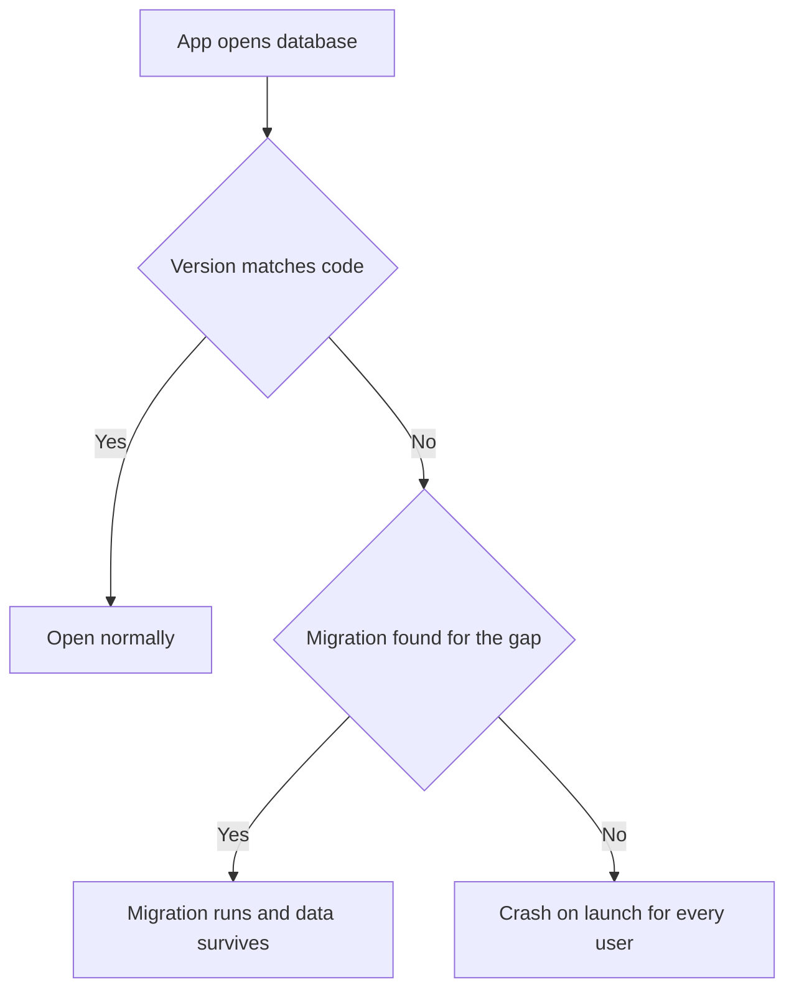
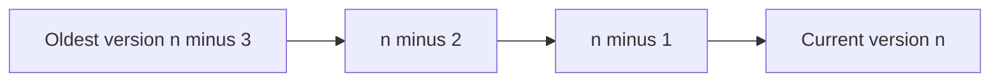

# Lecture 2 — DataStore, the file system, migrations, and the footguns that ship to users

Lecture 1 gave you Room and the SQLite lineage. This lecture is about the three things that round out on-device persistence and the one thing that takes apps down in production. First, the two other stores every app needs: **DataStore** for settings (Preferences and Proto) and the **file system** for blobs and attachments. Then **migrations** — because the second release is where every Android app eventually breaks: ship v2 with a schema change and no migration, and the app crashes on launch for every existing user. And finally the **footguns** — code that works fine with ten rows and falls over with ten thousand. Everything here is in service of "ship v2 without a one-star review that says *the update deleted all my notes.*"

---

## 1. DataStore — settings without the SharedPreferences footguns

`SharedPreferences` is deprecated for good reasons: its `apply()` does disk I/O on a background thread you can't observe, its `commit()` blocks the main thread, it has no reactive read, and its `getString` returning the wrong type at runtime is a class of bug. **DataStore** replaces it, and it comes in two flavours.

### Preferences DataStore — loose key-value, reactive

```kotlin
private val Context.dataStore: DataStore<Preferences> by preferencesDataStore(name = "settings")

object SettingsKeys {
    val DARK_THEME = booleanPreferencesKey("dark_theme")
    val FONT_SCALE = floatPreferencesKey("font_scale")
}

class SettingsRepository(private val dataStore: DataStore<Preferences>) {
    // Reading is a Flow — re-emits whenever the value changes.
    val darkTheme: Flow<Boolean> =
        dataStore.data.map { prefs -> prefs[SettingsKeys.DARK_THEME] ?: false }

    // Writing is a suspend function — coroutine-safe, atomic, off the main thread.
    suspend fun setDarkTheme(enabled: Boolean) {
        dataStore.edit { prefs -> prefs[SettingsKeys.DARK_THEME] = enabled }
    }
}
```

Preferences DataStore is `SharedPreferences` done right: reads are a `Flow<Preferences>`, writes are `suspend`, the whole thing is coroutine-safe, and there is no main-thread I/O. But it is still **untyped** — `prefs[KEY]` can be the wrong type if you key it wrong, and there's no schema. Use it for a handful of loose flags.

### Proto DataStore — a typed settings object

When your settings are more than a few flags — a structured object with several typed fields — use **Proto DataStore**: you define the settings shape in a `.proto` file, protobuf generates a typed class, and DataStore stores it with a serializer you provide. The whole settings object is type-checked, has defaults, and reads/writes as a `Flow`.

```proto
// user_prefs.proto
syntax = "proto3";
message UserPreferences {
  bool dark_theme = 1;
  float font_scale = 2;
  string sort_order = 3;       // "date" | "title"
}
```

```kotlin
object UserPreferencesSerializer : Serializer<UserPreferences> {
    override val defaultValue: UserPreferences =
        UserPreferences.getDefaultInstance().toBuilder().setFontScale(1.0f).build()
    override suspend fun readFrom(input: InputStream): UserPreferences =
        UserPreferences.parseFrom(input)
    override suspend fun writeTo(t: UserPreferences, output: OutputStream) = t.writeTo(output)
}

private val Context.userPrefs: DataStore<UserPreferences> by dataStore(
    fileName = "user_prefs.pb",
    serializer = UserPreferencesSerializer
)
```

**The choice — Preferences vs. Proto:**

| Criterion | Preferences DataStore | Proto DataStore |
|---|---|---|
| Type safety | No — keys can mismatch | Yes — a typed schema |
| Schema / defaults | Ad-hoc per key | Defined once in `.proto` |
| Setup cost | Trivial | Moderate (a `.proto` + serializer) |
| Best for | A few loose flags | A structured settings object |

The rule: **a handful of unrelated flags → Preferences; a structured, evolving settings object → Proto.** Proto's typing pays off the moment settings grow beyond a few keys and you want defaults and schema discipline. Neither is for *bulk* data — that's Room. DataStore is for settings, measured in kilobytes, not for your notes.

### Migrating off SharedPreferences

Both DataStores support `SharedPreferencesMigration`, which reads the old `SharedPreferences` once on first access and copies the values in, then you delete the old prefs. This is the one-time bridge for an existing app; new apps skip it.

```kotlin
private val Context.dataStore: DataStore<Preferences> by preferencesDataStore(
    name = "settings",
    produceMigrations = { context ->
        // Reads the old "legacy_prefs" SharedPreferences ONCE on first access and
        // copies its keys into DataStore, then leaves the old file to be deleted.
        listOf(SharedPreferencesMigration(context, "legacy_prefs"))
    }
)
```

The migration runs lazily on the first `dataStore.data` read, is idempotent (it won't re-run once the keys are copied), and is the supported path off the deprecated `SharedPreferences` API without a risky manual copy. Run it for a release or two, then drop the migration and delete the legacy file.

---

## 2. The file system — internal, external, and scoped storage

Not everything is a row or a setting. An image, a PDF, an exported backup — those are *files*. Android's file system has a model you must get right or your app crashes on a modern device.

### Internal storage — your app's private sandbox

```kotlin
// filesDir: private, persistent, deleted when the app is uninstalled. No permission needed.
val file = File(context.filesDir, "backup.json")
file.writeText(jsonString)

// cacheDir: private, but the OS can delete it under storage pressure. For derived/temp data.
val temp = File(context.cacheDir, "thumb-$id.jpg")
```

`filesDir` and `cacheDir` are your app's private directories. **No permission is required** to read or write them, no other app can see them, and they're wiped on uninstall. This is where 90% of your file I/O belongs: a backup file, a downloaded attachment, a generated export. The Room database itself lives in this private area too (`databases/`).

### External storage and scoped storage (post-Android-11)

"External storage" no longer means "the SD card you can write anywhere." Since Android 10/11, **scoped storage** is enforced: your app can freely write its *own* app-specific external directory (`context.getExternalFilesDir(...)`, also no permission, also wiped on uninstall), but to touch *shared* media (the user's Photos, Downloads) you go through **MediaStore** (for images/audio/video) or the **Storage Access Framework** (SAF, for arbitrary user-chosen files via a system file picker). The broad `WRITE_EXTERNAL_STORAGE` permission is gone on modern Android — you almost never need it.

```kotlin
// Saving an attachment the USER picked, via SAF — no storage permission needed.
val picker = registerForActivityResult(ActivityResultContracts.CreateDocument("application/json")) { uri ->
    uri?.let {
        context.contentResolver.openOutputStream(it)?.use { out -> out.write(bytes) }
    }
}
// launch with picker.launch("notes-backup.json")
```

**The rule for this week's mini-project:** store attachments in your app's private storage (`filesDir`), keep only the *path* (or a relative key) in the Room row, and use SAF when the user explicitly exports a backup to a location they choose. Don't ask for `WRITE_EXTERNAL_STORAGE`; don't write to arbitrary external paths; don't store the blob inline in SQLite (it bloats every query that touches the row — store the file, reference the path).

---

## 3. Migrations — the part that loses data if you get it wrong

Your app shipped. Users have data. You add a column. What happens on their next launch?

Room stamps every database with a **version number** and a schema hash. When the app opens a database whose version is lower than the `@Database(version = ...)` in the code, Room looks for a `Migration` (or `AutoMigration`) from the old version to the new. If it finds one, it runs it and the data survives. If it finds **none**, Room throws `IllegalStateException: A migration from N to M was required but not found` — the app crashes on launch, for every existing user. The job of this section is to make you do migrations *on purpose* so "what happens on launch" is never a surprise.


*What Room does the moment a database's version trails the code's declared version.*

### The schema export — the source of truth

First, turn on schema export so Room writes the schema to JSON you commit to Git:

```kotlin
// build.gradle.kts — the androidx.room plugin manages the location.
room { schemaDirectory("$projectDir/schemas") }
// @Database(..., exportSchema = true)  // the default; keep it on
```

After a build, `schemas/<dbname>/1.json` exists. **Commit it.** Room uses these exported schemas to *generate* auto-migrations and to power the migration test (§ below). A schema export not in source control means Room can't auto-migrate and your migration test can't seed an old version. This is the ten-minute discipline that prevents the data-loss incident.

### AutoMigration — additive changes, declarative

For changes Room can infer — adding a column with a default, adding a table, dropping a column, renaming a column with a spec — declare an `AutoMigration` and let Room generate the SQL:

```kotlin
@Database(
    entities = [Note::class, Tag::class, NoteTagCrossRef::class],
    version = 2,
    exportSchema = true,
    autoMigrations = [
        AutoMigration(from = 1, to = 2)   // Room reads the exported 1.json and 2.json, diffs them
    ]
)
abstract class CrunchDatabase : RoomDatabase() { /* ... */ }
```

Adding `val isPinned: Boolean = false` to `Note` is a one-line entity change plus this `AutoMigration` — Room generates the `ALTER TABLE notes ADD COLUMN isPinned INTEGER NOT NULL DEFAULT 0`. For a *rename* you add a spec so Room doesn't read it as drop-and-add (data loss):

```kotlin
@RenameColumn(tableName = "notes", fromColumnName = "body", toColumnName = "content")
class Migration1to2Spec : AutoMigrationSpec
// referenced as AutoMigration(from = 1, to = 2, spec = Migration1to2Spec::class)
```

### Manual Migration — transformations Room can't infer

When the new value is *computed* from old data (backfilling a column, splitting a table, changing a type), Room can't infer it — you write the SQL yourself in a `Migration`:

```kotlin
val MIGRATION_2_3 = object : Migration(2, 3) {
    override fun migrate(db: SupportSQLiteDatabase) {
        // Add the column...
        db.execSQL("ALTER TABLE notes ADD COLUMN wordCount INTEGER NOT NULL DEFAULT 0")
        // ...then backfill it from existing data (a transformation Room can't infer).
        db.execSQL("""
            UPDATE notes
            SET wordCount = (LENGTH(content) - LENGTH(REPLACE(content, ' ', '')) + 1)
            WHERE content != ''
        """.trimIndent())
    }
}

// Register both migrations on the builder:
Room.databaseBuilder(context, CrunchDatabase::class.java, "crunch.db")
    .addMigrations(MIGRATION_2_3)        // manual
    .build()                             // auto-migrations are picked up from the annotation
```

### The discipline that prevents the incident

1. **`exportSchema = true` and commit the JSON.** Every version's schema is a historical fact about what users have on disk.
2. **Test the upgrade path, not just a fresh install.** This is the mistake everyone makes: you test by uninstalling and reinstalling, which creates the database *fresh at the latest version* and never runs a migration. A broken migration stays green on a fresh install. You must seed an old version and open it with the new schema.
3. **`@RenameColumn` / a spec for every rename.** A bare rename is drop-and-add — data loss.
4. **Manual `Migration` for every transformation.** If the new value is computed from old values, auto-migration can't do it.
5. **Never ship `fallbackToDestructiveMigration()` in production.** It "fixes" a missing migration by *deleting the database and rebuilding empty* — i.e. by losing all user data. It's a convenience for early development; it is a data-loss bug in production. If you see it in a release build, that's a review blocker.

### The `MigrationTestHelper` upgrade-path test

This is the test most people skip. It seeds an old-version database (using the exported schema), then opens it with the new schema and migrations, and asserts the data survived:

```kotlin
@get:Rule
val helper = MigrationTestHelper(
    InstrumentationRegistry.getInstrumentation(),
    CrunchDatabase::class.java
)

@Test
fun migrate1To2_preservesNotes() {
    // Seed a v1 database directly via SQL (the schema Room exported as 1.json).
    helper.createDatabase(TEST_DB, 1).apply {
        execSQL("INSERT INTO notes (id, title, body, createdAt) VALUES (1, 'Groceries', 'milk', 0)")
        close()
    }
    // Open it at v2 with the migration — Room runs the upgrade.
    val db = helper.runMigrationsAndValidate(TEST_DB, 2, true, MIGRATION_1_2)
    // The v1 row is STILL HERE, and the new column has its default.
    db.query("SELECT title, isPinned FROM notes WHERE id = 1").use { c ->
        c.moveToFirst()
        assertEquals("Groceries", c.getString(0))
        assertEquals(0, c.getInt(1))   // isPinned defaulted
    }
}
```

`createDatabase(TEST_DB, 1)` makes a real v1 database; `runMigrationsAndValidate(TEST_DB, 2, ...)` runs your migration and *validates the result schema against the exported 2.json*. If the migration is wrong, this test fails — where a fresh-install test would pass. Exercise 03 walks this exact shape.

---

## 4. The footguns — measured, not asserted

A footgun is code that works in a demo with ten rows and falls over with ten thousand. We'll state each, show the bite, show the fix, and — the week's ethos — measure it. "It feels fast" is not an engineering statement.

### Footgun 1 — load everything, then filter in Kotlin

```kotlin
// THE BITE: load every Note across the Cursor into objects, keep 1%.
@Query("SELECT * FROM notes") suspend fun all(): List<Note>
val matches = dao.all().filter { it.title.contains("kotlin") }   // 50,000 objects to keep 500

// THE FIX: filter in SQLite with a WHERE clause; only matching rows materialise.
@Query("SELECT * FROM notes WHERE title LIKE '%' || :q || '%'")
suspend fun search(q: String): List<Note>
```

On a 50,000-row store the load-everything version materialises the whole table and is routinely 50–200× slower; the `WHERE`-clause version touches an index (if `title` is indexed) and returns the few matches. Same answer, completely different cost. This is the footgun you plant on purpose in the challenge.

### Footgun 2 — the relation N+1 you didn't page

A `Flow<List<NoteWithTags>>` over 10,000 notes runs the parent query plus the batched child query and stitches 10,000 results in memory on every emission. For large relation lists, **page** (Paging 3) so only the visible window is loaded, or denormalise the tag names onto the note if you only display them.

### Footgun 3 — `fetch().size` instead of `COUNT(*)`

```kotlin
val bad = dao.all().size                              // builds N objects to count them
@Query("SELECT COUNT(*) FROM notes") suspend fun count(): Int   // SELECT COUNT(*); zero objects
```

If all you need is a number, never materialise the objects.

### Footgun 4 — an unbounded `Flow` query backing a list

A `Flow<List<Note>>` with no `LIMIT` re-runs the *entire* query on every table write and hands a list of every row to the UI. With 100,000 notes that's a memory spike and a slow emission on every insert. Bound it: `LIMIT`/`OFFSET` paging, or Paging 3's `PagingSource`. The unbounded `Flow` is fine for hundreds of rows; it's a footgun the day someone's store has a hundred thousand.

### Footgun 5 — the main-thread write that janks a scroll

A bulk insert on the main thread janks the UI. Room *enforces* this for queries (it throws), but you can still block by `runBlocking` on the main thread or by doing a huge transaction synchronously. Do bulk writes in a `suspend` function on `Dispatchers.IO` (injected, Week 13), inside a single `@Transaction`, and let the `Flow` query pick up the change. Saving per-row in a loop instead of one transaction is its own footgun — wrap the batch.

---

## 5. Putting it together — a production checklist

Before you call a persistence layer "done," walk this list. It is the code-review checklist a senior reviewer applies:

- **Schema export is on and committed.** `exportSchema = true`, the `schemas/` JSON is in Git.
- **The upgrade path is tested**, not just a fresh install — a `MigrationTestHelper` test seeds an old version and opens it with the new schema.
- **Every rename has a spec; every transformation has a manual `Migration`.** No bare renames, no `fallbackToDestructiveMigration()` in a release build.
- **Filters are WHERE clauses, not in-Kotlin `.filter`.** Grep for `dao.all()` immediately followed by `.filter`.
- **Counts use `COUNT(*)`.** Grep for `.size` on a full query result.
- **Indexed the filtered/sorted columns**, and *only* those (`EXPLAIN QUERY PLAN` to confirm the index is used).
- **Large relation lists are paged**, not loaded whole.
- **Settings are in DataStore**, not `SharedPreferences`; structured settings are Proto, loose flags are Preferences.
- **Blobs are files**, referenced by path in Room — not stored inline in a column.
- **The relaunch test passes.** Create data, `adb shell am force-stop`, relaunch cold, data intact.

---

## 6. Recap

Lecture 1 sold you on Room's happy path for good reason. This lecture was the rest of the persistence story and the half that decides whether your *second* release goes well. Four habits carry it:

1. **Right tool per data shape.** Room for structured queryable data, Proto/Preferences DataStore for settings, the private file system for blobs (path in Room). Don't store a blob in a column or your notes in DataStore.
2. **Scoped-storage compliance.** Stay in your app's private storage; reach shared media through MediaStore/SAF; don't ask for `WRITE_EXTERNAL_STORAGE`.
3. **Version every schema and test the upgrade.** `exportSchema`, commit the JSON, `AutoMigration` for additive, manual `Migration` for transformations, and a `MigrationTestHelper` test that seeds an old version. Never `fallbackToDestructiveMigration()` in production.
4. **Measure the footguns.** Filter in SQLite, count with `COUNT(*)`, page large lists, write on IO in a transaction. Prove each with a number, not a vibe.

You now have the whole on-device persistence story: the SQLite-backed Room store you write every day, the DataStore beside it, the file system below it, and the migration discipline that keeps it alive across versions. The exercises put numbers on the footguns and walk a real migration; the mini-project builds the local-first notes app and proves it survives a cold launch *and* a v1→v3 migration. Go make the data stop disappearing — and keep it alive across the version bump.

---

## 7. Appendix — why "test the upgrade path" is the one rule that matters most

Of all the disciplines in this lecture, one deserves to be underlined until it is reflexive, because it is the rule whose violation causes the most production data-loss incidents: **you must test the migration upgrade path, not the fresh install.** The reason this trips up so many teams is that the obvious way to test a database is to run the app, and the obvious way to "reset" between test runs is to uninstall and reinstall. But uninstalling deletes the database, and a fresh install creates the database directly at the *latest* schema version — which means no migration code ever runs. Your migration could be catastrophically broken — a rename done as drop-and-add, a transformation that computes garbage, a missing stage that crashes on launch — and the fresh-install test would be a cheerful green, because it never exercises the broken code path at all. Every existing user, meanwhile, has a database at the *old* version, and *they* are the ones who hit the migration on their next launch. The fresh-install test validates the experience of the one population that is never at risk (new users) and ignores the population that is (everyone who already has the app).

The fix is mechanical and it is the entire reason `MigrationTestHelper` exists: you **seed an old-version database with known data, then open it at the new version and assert the data survived.** `createDatabase(name, oldVersion)` writes a real database at the old schema (using the schema you exported and committed); you insert rows whose post-migration values you can predict; then `runMigrationsAndValidate(name, newVersion, ...)` runs your actual migrations against that old database and validates that the resulting schema matches what your `@Entity` classes declare. If the migration drops a column it should have renamed, the data assertion fails. If the migration produces a schema that doesn't match the entity, the validation fails. Either way, the bug is caught in CI, on your machine, before a single user updates — which is the only place catching it is cheap. This is why the schema export must be committed (the helper needs the old schema to seed from) and why every shipped version's schema is a permanent historical artifact. Internalise this as a single sentence you repeat at every database PR: *"Did you test the upgrade path, or just a fresh install?"* — because that one question, asked reliably, prevents the single most expensive class of persistence incident there is.

A quick reference for the migration-discipline checklist, distilled to bullets you can scan before any database PR:

- **`exportSchema = true`** and the `schemas/` JSON is committed for every version.
- **Never edit a released schema** in place — add a new version and a migration to it.
- **Additive change?** An `AutoMigration` (Room generates the SQL by diffing JSONs).
- **Rename?** A `@RenameColumn` / `@RenameTable` spec, or the data is lost.
- **Transformation (computed value)?** A manual `Migration` with `UPDATE ... SET` SQL.
- **Test the upgrade path** with `MigrationTestHelper`, seeding the old version — never a fresh install.
- **Walk every version gap**, including multi-version skips, not just the latest single step.
- **No `fallbackToDestructiveMigration()`** in a release build — it deletes all user data.

There is a corollary worth stating: the migration test should walk *every* version gap a real user might cross, not just the most recent one. A user who skipped three releases launches the new build with a database three versions behind, and Room runs your migrations in sequence (v(n-3)→v(n-2)→v(n-1)→v(n)) to catch them up. If any one of those intermediate stages is broken, that user's launch crashes — even though the latest single-step migration is fine. So a thorough migration suite seeds the oldest still-in-the-wild version and validates all the way to current, exercising the full chain. In practice you keep one test per consecutive pair plus one "oldest-to-newest" end-to-end test, and you keep them green forever, because the oldest database version some user is still running does not go away just because you'd like it to.


*Room walks every intermediate migration in sequence to catch up a database that skipped releases.*

## 8. Appendix — the migration debugging playbook

When a migration goes wrong in the field (or in a test), the symptom is usually one of a small set, and each has a precise cause. Keep this table within reach; it is the on-call reference for a persistence incident:

| Symptom | Likely cause | Fix |
|---|---|---|
| `IllegalStateException: A migration from N to M was required but not found` | You bumped `version` but didn't register a `Migration`/`AutoMigration` from the user's version | Add the missing migration covering every shipped version gap |
| `IllegalStateException: ... Migration didn't properly handle ...` | A manual `Migration` ran but left the schema different from what the `@Entity` declares | Make the migration's resulting schema match the entity exactly; `runMigrationsAndValidate` catches this in a test |
| A renamed column comes back empty after upgrade | A rename done without `@RenameColumn`/`originalName` — Room dropped the old column and added a new empty one | Add the rename spec so Room carries the data under the new name |
| Migration test green, production crashes on launch | You tested a fresh install, not the upgrade path | Seed an old version with `createDatabase(db, oldVersion)` and run `runMigrationsAndValidate` |
| All user data gone after an update | A `fallbackToDestructiveMigration()` shipped, or a destructive change marked as "lightweight" | Remove the fallback from release builds; write a proper migration |
| `Room cannot verify the data integrity` | The schema hash in `room_master_table` doesn't match the compiled schema — usually an entity changed without a version bump | Bump the version and add the migration; never edit a shipped schema in place |

The throughline of every row: **the store on disk is a historical artifact of every version you ever shipped, and a migration is the only thing that carries a user's data across a version boundary.** Treat each shipped schema as immutable, version every change, write the migration that bridges it, and *test the upgrade path* — and a version bump becomes a non-event instead of a one-star-review incident. That discipline is the single most valuable thing you take from this week into production.
