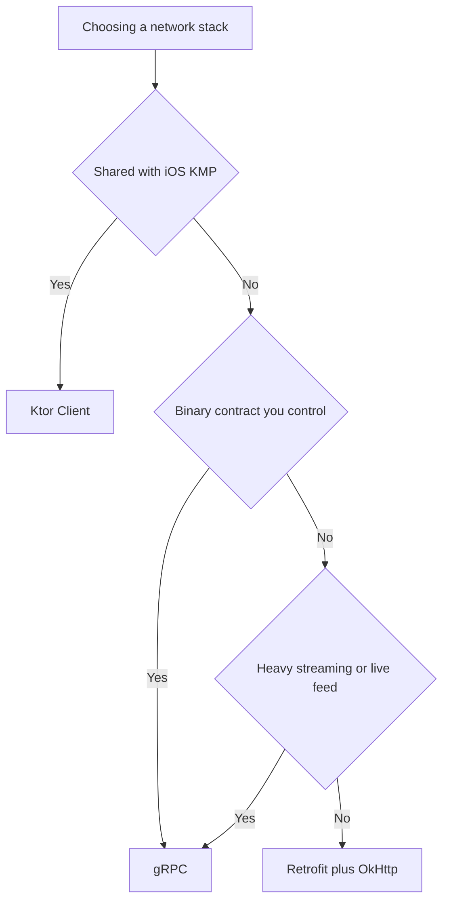
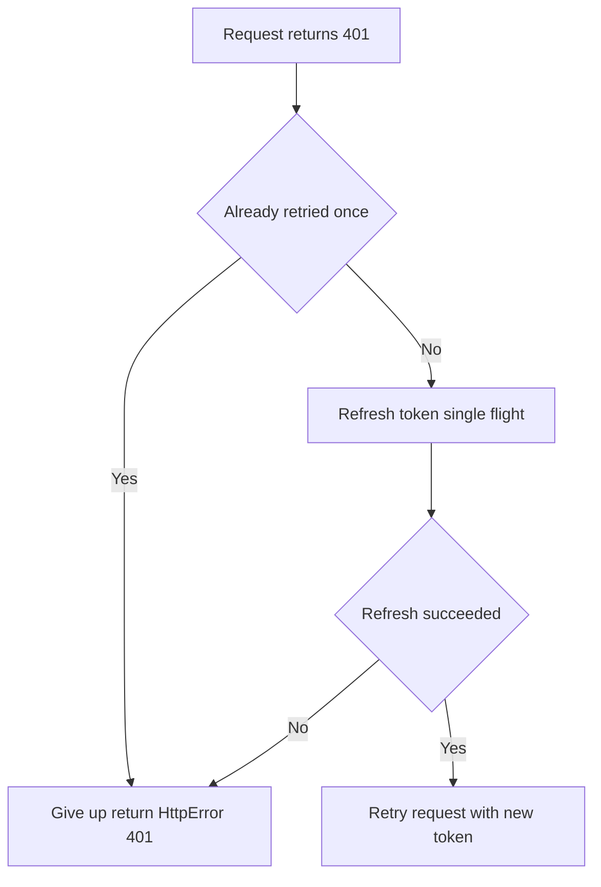

# Lecture 2 — Certificate pinning, Ktor, gRPC, and choosing a stack

Lecture 1 gave you the typed client and the failure model. This lecture is about hardening it and knowing your alternatives: **certificate pinning** (and the rotation trap that bricks apps in production), the **Ktor Client** (the multiplatform path), **gRPC** (binary contracts and streaming), the **decision table** for choosing among the three, and the **footguns** that take networking apps down. These are not academic. Pinning done wrong is the single most common way a routine cert rotation turns into an all-users outage. Choosing Retrofit when you needed Ktor means rewriting your client when the capstone reaches iOS. Everything here is in service of "ship a network layer that's secure, portable where it needs to be, and doesn't fall over at the next cert rotation or the next platform."

---

## 1. Certificate pinning — and the rotation trap that bricks apps

TLS already verifies that the server's certificate chains to a trusted CA. **Certificate pinning** goes further: you hardcode (pin) a specific public key, so even a *valid* certificate from a *different* key is rejected. This defeats a malicious or compromised CA, and a corporate MITM proxy. OkHttp makes the mechanism trivial:

```kotlin
val pinner = CertificatePinner.Builder()
    .add("api.crunch.example",
        "sha256/AAAAAAAAAAAAAAAAAAAAAAAAAAAAAAAAAAAAAAAAAAA=",   // current leaf key pin
        "sha256/BBBBBBBBBBBBBBBBBBBBBBBBBBBBBBBBBBBBBBBBBBB=")   // BACKUP pin (next key)
    .build()

val client = OkHttpClient.Builder()
    .certificatePinner(pinner)
    .build()
```

The mechanism is easy. The **operations** are where teams get hurt, because a certificate is not forever — it expires and gets rotated, typically annually or more often. And here is the trap:

> **If you pin a single leaf certificate's key and the server rotates to a new key, every installed app instantly fails every request — until users update.** You have bricked your own app for everyone who hasn't taken the new build. This is a real, recurring outage class.

The disciplines that make pinning safe:

1. **Always pin a backup.** Pin the *current* key and the *next* key (the one the server will rotate to). When rotation happens, the backup pin already matches, no outage. You generate the next key pair ahead of time and pin its hash now. A pin set with only one pin is a time bomb.
2. **Consider pinning the intermediate CA, not just the leaf.** The leaf rotates often; the intermediate CA's key is more stable. Pinning the intermediate means a leaf rotation under the same intermediate doesn't break you. The trade-off: a wider trust surface (anything that intermediate signs). Many teams pin both leaf and intermediate.
3. **Have a kill switch.** Ship the ability to disable pinning via a remote config flag, so if a pinning misconfiguration *does* ship, you can turn it off without a store release (which takes days). Pinning that you can't disable remotely is pinning you can't safely operate.
4. **Coordinate with the backend team's rotation calendar.** Pinning is a *joint* operational commitment between client and server. The backend cannot rotate keys without the client having pinned the new one first. If you pin, you own a recurring coordination cost — go in knowing it.

A pinning go/no-go checklist, distilled to bullets you can apply before adding a `CertificatePinner`:

- **Is the threat model worth it?** Pin for finance, health, or high-value targets; skip it for a low-stakes app where TLS already suffices.
- **Did you pin a backup?** The next key, pre-generated and pinned now, so rotation day is a non-event.
- **Did you pin the intermediate too?** It's more stable than the leaf and survives a leaf rotation under the same CA.
- **Is there a remote kill switch?** A config flag to disable pinning without a store release, in case a misconfiguration ships.
- **Is rotation coordinated with the backend team?** Pinning is a joint client/server commitment; the server can't rotate to a key you haven't pinned.
- **Do you have monitoring?** A spike in pinning-failure errors is your early warning that something rotated unexpectedly.

If you can't tick all of these, the honest answer is usually "don't pin yet" — a single un-backed-up pin is worse than no pinning at all.

The honest senior take: **pinning is a real defense, but it is operationally expensive and the failure mode is catastrophic (all-users outage).** Pin when the threat model justifies it (finance, health, high-value targets), pin with backups and a kill switch, and coordinate rotation. Don't pin a single leaf and forget about it — that's how you make the news. (This topic returns in Week 22, security, where pinning sits alongside Keystore and Play Integrity.)

---

## 2. Ktor Client — the multiplatform path

Ktor Client is JetBrains' pure-Kotlin HTTP client. It does the same job as Retrofit but with three differences that decide when you pick it: **no codegen** (it's a fluent API, not an annotated interface), **pluggable engines** (OkHttp on Android, Darwin on iOS, CIO anywhere), and — the headline — **it runs in `commonMain`**, so the *same client code* compiles for Android and iOS in a Kotlin Multiplatform module.

```kotlin
val client = HttpClient(OkHttp) {                    // OkHttp engine on Android; Darwin on iOS
    install(ContentNegotiation) {
        json(Json { ignoreUnknownKeys = true })       // kotlinx-serialization, same DTOs as Retrofit
    }
    install(HttpRequestRetry) {
        retryOnServerErrors(maxRetries = 3)            // built-in backoff
        exponentialDelay()
    }
    install(HttpTimeout) {
        requestTimeoutMillis = 20_000
        connectTimeoutMillis = 15_000
    }
}

suspend fun forecast(city: String): NetworkResult<Forecast> = safeKtorCall {
    client.get("https://api.weather.example/forecast") {
        parameter("city", city)
    }.body<ForecastDto>().toDomain()
}
```

Notice three things. The DTOs (`@Serializable ForecastDto`) are *identical* to the Retrofit path — kotlinx-serialization is the shared serializer. The `NetworkResult` failure model is the same; you write a `safeKtorCall` that maps Ktor's exceptions (`ResponseException` for HTTP errors, `IOException` for network, `SerializationException` for parsing) to the same sealed cases. And the retry/timeout are *plugins* configured once on the client, not per-call code.

**When Ktor over Retrofit?**

- **You need the client in a KMP shared module** (the capstone's `:shared-core`, consumed by both Android and iOS). This is the decisive reason — Retrofit is Android/JVM-only; Ktor is multiplatform. The capstone shares its data layer, so the capstone uses Ktor.
- **You want no annotation-processing/codegen step** and prefer a fluent API.
- **You're already in a Ktor-heavy stack** (a Ktor *server* backend, shared serialization).

**When Retrofit over Ktor?**

- **Android-only app**, no multiplatform ambition — Retrofit's ecosystem (mature, huge community, Now-In-Android) and its terse typed interfaces win.
- **You value the declarative interface** where the API surface is visible at a glance as annotated methods.

They are not rivals so much as the same discipline with different reach. The *shape* — typed client, kotlinx-serialization, `NetworkResult`, bounded retry — is identical. Ktor just compiles for more platforms.

---

## 3. gRPC on Android — binary contracts and streaming

gRPC is a different animal: instead of REST/JSON, you define a **service contract** in a `.proto` file, and `protoc` + `grpc-kotlin` generate typed client and server stubs. The wire format is binary protobuf (compact, fast to parse), and **streaming is first-class** (server-streaming, client-streaming, bidirectional) in a way REST has to fake.

```proto
// weather.proto
syntax = "proto3";
service WeatherService {
  rpc GetForecast(ForecastRequest) returns (ForecastResponse);          // unary
  rpc StreamUpdates(ForecastRequest) returns (stream ForecastResponse); // server-streaming
}
message ForecastRequest { string city = 1; int32 days = 2; }
message ForecastResponse { string city = 1; double temp_c = 2; string condition = 3; }
```

```kotlin
// The generated coroutine stub gives you suspend (unary) and Flow (streaming) APIs.
class WeatherGrpcClient(channel: ManagedChannel) {
    private val stub = WeatherServiceGrpcKt.WeatherServiceCoroutineStub(channel)

    suspend fun forecast(city: String): NetworkResult<Forecast> = safeGrpcCall {
        stub.getForecast(forecastRequest { this.city = city }).toDomain()  // unary suspend call
    }

    fun streamUpdates(city: String): Flow<Forecast> =                       // server-streaming
        stub.streamUpdates(forecastRequest { this.city = city })
            .map { it.toDomain() }
}

// The channel is the gRPC equivalent of OkHttpClient — expensive, @Singleton, pinnable.
val channel: ManagedChannel = ManagedChannelBuilder
    .forAddress("api.crunch.example", 443)
    .useTransportSecurity()        // TLS; pinning is configured on the channel credentials
    .build()
```

What's worth knowing:

- **The contract is the source of truth.** The `.proto` generates both client and server stubs, so the client and server *cannot* disagree about the shape — a class of integration bug REST has to test for. This is gRPC's biggest win: a typed, versioned, shared contract.
- **Streaming is native.** A server-streaming RPC is a `Flow` in `grpc-kotlin` — the coroutine integration is excellent. For a sync feed or live updates, this is far cleaner than polling REST or wrangling WebSockets.
- **The wire is compact.** Binary protobuf is smaller and faster to parse than JSON — meaningful on a metered mobile connection at scale.
- **The costs.** gRPC needs codegen (a `.proto` and a build step), it's harder to debug (binary, not curl-able), browser support needs gRPC-Web, and the ecosystem is smaller on the client. You also still need the same `NetworkResult` discipline — `safeGrpcCall` maps `StatusException` (gRPC's error type) to your sealed cases.

**When gRPC?** A binary contract with a backend you control (the capstone syncs over gRPC), heavy streaming, performance-critical payloads at scale, or a polyglot backend where the `.proto` is the shared contract. **When not?** A public REST API you don't control, a browser client, or a small app where JSON's debuggability and ubiquity win.

The trade-offs of gRPC, laid out as a balance sheet so the choice is deliberate:

- **Win — a shared contract.** The `.proto` generates both client and server stubs, so they cannot disagree about the shape; a whole class of REST integration bug disappears.
- **Win — native streaming.** Server-, client-, and bidirectional streaming are first-class, and in `grpc-kotlin` a server stream is a `Flow` — far cleaner than polling REST or wrangling WebSockets.
- **Win — compact, fast wire.** Binary protobuf is smaller and faster to parse than JSON, which matters on metered mobile connections at scale.
- **Win — versioned evolution.** protobuf's field-numbering rules give you forward/backward compatibility by construction.
- **Cost — codegen.** You need a `.proto` and a build step; the contract is not human-readable on the wire.
- **Cost — debuggability.** Binary frames are not `curl`-able; you need gRPC-aware tooling to inspect traffic.
- **Cost — reach.** Browsers need gRPC-Web; the client ecosystem is smaller than REST's.
- **Cost — you still need the discipline.** The same `NetworkResult`, the same retry, the same timeouts — gRPC doesn't exempt you from any of it.

Read the balance sheet and the rule falls out: gRPC for a backend you control with streaming or scale needs; REST for everything else.

### gRPC error handling — the same discipline, a different exception

gRPC doesn't have HTTP status codes; it has **status codes of its own** (`UNAVAILABLE`, `DEADLINE_EXCEEDED`, `UNAUTHENTICATED`, `INVALID_ARGUMENT`, ...), surfaced as a `StatusException`. The `NetworkResult` discipline is identical — you map the gRPC status to your sealed cases, and the retryable/non-retryable split maps cleanly: `UNAVAILABLE` and `DEADLINE_EXCEEDED` are the retryable transients (the gRPC analogues of 503/timeout), while `INVALID_ARGUMENT`, `NOT_FOUND`, and `UNAUTHENTICATED` are the non-retryable client errors (the analogues of 400/404/401):

```kotlin
suspend fun <T> safeGrpcCall(block: suspend () -> T): NetworkResult<T> =
    try {
        NetworkResult.Success(block())
    } catch (e: StatusException) {
        when (e.status.code) {
            Status.Code.UNAVAILABLE, Status.Code.DEADLINE_EXCEEDED ->
                NetworkResult.NetworkError(IOException(e))      // retryable transient
            else ->
                NetworkResult.HttpError(e.status.code.value(), e.status.description)  // map status -> code
        }
    }
```

The lesson again: the *engine* changes (HTTP exceptions → gRPC `StatusException`), but the *shape* — a sealed result, a safe wrapper, a retryable/non-retryable split, bounded backoff — is constant across all three stacks. Learn the discipline once; reapply it to whichever client the context demands.

---

## 4. The decision table — choosing a stack

Memorise this; it is the interview question and the architecture decision:

| Situation | Reach for |
|-----------|-----------|
| Android-only REST/JSON app | **Retrofit + OkHttp** — the default in 2026 |
| Client shared with iOS (KMP `commonMain`) | **Ktor Client** — multiplatform |
| Binary contract with a backend you control | **gRPC** (`grpc-kotlin`) |
| Heavy streaming / live feed | **gRPC** server-streaming (`Flow`) |
| Public API you don't control | **Retrofit/Ktor** (REST) — you can't impose a `.proto` |
| Need the HTTP engine for all of the above | **OkHttp** — Retrofit's engine, *and* Ktor's Android engine |
| Browser/web client too | **REST** or gRPC-Web — not raw gRPC |
| Maximum ecosystem/community support | **Retrofit** |

Three honest summary lines: **Retrofit is great for REST. Ktor is great for KMP. gRPC is great for binary contracts.** And note OkHttp sits under both Retrofit and Ktor's Android path — the engine you configure once (timeouts, pinning, interceptors) is reused whichever typed client you put on top. The mini-project builds the *same* weather client over Retrofit and Ktor precisely so you feel that the discipline is constant and only the engine changes.


*The decision table redrawn as a path from context to the stack it picks.*

---

## 5. The footguns — measured, not asserted

A footgun is networking code that works on perfect wifi and falls over on a real network. We'll state each, show the bite, show the fix.

### Footgun 1 — the unbounded retry that DDoSes your own backend

```kotlin
// THE BITE: a tight loop hammering a struggling server. When the server is
// overloaded (503), a thousand clients doing this re-create the overload — your
// own retry traffic is the DDoS. No backoff, no bound, no jitter.
while (true) {
    val r = api.forecast(city)
    if (r.isSuccess) break        // retries instantly, forever, on every failure
}

// THE FIX: bounded exponential backoff with jitter, only on retryable errors
// (lecture 1, §5). The server gets breathing room; clients desync; the operation
// fails into a handled state after maxAttempts instead of hanging forever.
```

Measure it against `httpbin.org/status/503` with a request counter: the naive loop fires hundreds of requests per second; the bounded-backoff version fires 4 over several seconds and then stops. That request-count gap *is* the footgun.

### Footgun 2 — the brittle single pin

Pinning one leaf key (§1) with no backup: the day the server rotates, every request fails for every user until they update. The fix is backup pins + a kill switch. The "measurement" here is a thought experiment you write in the challenge: trace what happens to 100% of installed apps on rotation day.

### Footgun 3 — the main-thread call

A synchronous network call on the main thread is an `ANR` (Application Not Responding) waiting to happen — and on modern Android, a `NetworkOnMainThreadException`. The fix is `suspend` functions on `Dispatchers.IO` (injected). You should never see a network call outside a coroutine on a background dispatcher.

### Footgun 4 — parsing the wrong shape (no `ignoreUnknownKeys`)

The server adds a field; your strict parser crashes for every user on the next deploy. The fix is `Json { ignoreUnknownKeys = true }` and nullable-with-default optional fields. A parse that crashes on an *additive* server change is a fragile contract.

### Footgun 5 — a fresh `OkHttpClient` (or channel) per request

`OkHttpClient.Builder().build()` inside a function, called per request, means no connection pooling, a new thread pool each time, and a leak. The fix is the `@Singleton` from Week 13 — build it once, inject it. Same for a gRPC `ManagedChannel`. Grep for `OkHttpClient.Builder()` outside a Hilt module; each one is suspect.

---

## 6. Putting it together — a production checklist

Before you call a network layer "done," walk this list. It is the code-review checklist a senior reviewer applies:

- **Every call returns a `NetworkResult`** (or is wrapped in `safeApiCall`); the UI handles every case via an exhaustive `when`. No bare `try`/`catch(Exception)` that swallows.
- **Retry is bounded, backed off, jittered, and retryable-only.** No `while (true)`; no retry on 4xx.
- **Timeouts are set** (connect/read/call), so no call can hang forever.
- **The `OkHttpClient` (and any gRPC channel) is a `@Singleton`.** No per-request client.
- **Pinning, if used, has backup pins and a kill switch**, and rotation is coordinated. No single-leaf pin.
- **Logging redacts secrets** (`redactHeader("Authorization")`) and is `NONE`/`BASIC` in release.
- **DTOs are separate from domain models**, mapped in the repository; `ignoreUnknownKeys = true`.
- **The stack fits the context**: Retrofit (Android REST), Ktor (KMP), gRPC (binary) — chosen deliberately, not by habit.
- **The result caches into Room** as the source of truth (the offline-first wiring, Week 16's foundation).
- **The failure paths are tested** with `MockWebServer`/`MockEngine`: a 500, a timeout, a malformed body each produce the right `NetworkResult`.

---

## 7. Recap

Lecture 1 gave you the typed client and the failure model. This lecture hardened it and mapped the alternatives. Four habits carry it:

1. **Pin carefully or not at all.** Pinning is real defense but operationally expensive with a catastrophic failure mode. Backup pins, a kill switch, and rotation coordination — or don't pin.
2. **Match the stack to the context.** Retrofit for Android REST, Ktor for the KMP shared core, gRPC for binary contracts and streaming — with OkHttp under most of it. The discipline is constant; the engine changes.
3. **Make retry safe.** Bounded, exponential, jittered, retryable-only — or you DDoS your own backend.
4. **Test the failure paths.** A `MockWebServer` that returns a 500, a timeout, and a malformed body, and the assertion that each becomes the right `NetworkResult`, is what proves the layer is production-grade.

And the footguns, collected as a final scan-list to apply at every networking PR:

- **Unbounded retry** — `while (true)` with no backoff; DDoSes your own backend. Fix: bounded, jittered, retryable-only.
- **Single-pin certificate** — bricks all installs on rotation. Fix: backup pins + intermediate + kill switch.
- **Main-thread call** — `NetworkOnMainThreadException` / ANR. Fix: `suspend` on `Dispatchers.IO`.
- **Strict parser** — crashes on an additive server change. Fix: `ignoreUnknownKeys = true`.
- **Per-request `OkHttpClient`** — no pooling, thread leak. Fix: the `@Singleton`.
- **Leaked response body** — connection leak. Fix: `response.use { }` (or the `suspend fun ...: T` form that closes it).
- **Logging secrets** — token in logs. Fix: `redactHeader`, `NONE` in release.
- **DTO as domain model** — backend quirks leak into the UI. Fix: map at the repository seam.

Each of these has bitten a production app; each has a one-line fix. Memorising the list is cheaper than re-learning it from an incident.

You now have the whole networking story: the typed client, the failure model, the resilience, the security, and the three stacks you can choose between and defend. The exercises build a real Retrofit service, the `NetworkResult` + retry, and a Ktor client; the challenge plants and fixes the retry-storm footgun; the mini-project builds the weather client twice and caches it into Room. Go write networking that handles the failure — because the failure is the job.

---

## 8. Appendix — token refresh, the `Authenticator`, and the 401 loop

The most common stateful complication in a real client is the access token that expires. The naive approach — an interceptor that, on a 401, fetches a new token and retries — is a classic footgun, because an interceptor has no built-in guard against retrying forever: if the refresh itself returns data that still 401s (a revoked session, a clock-skew bug), the interceptor retries, gets another 401, refreshes again, retries again, and you have an infinite loop hammering the auth server. OkHttp provides a *separate* mechanism precisely for this: the `Authenticator`, which OkHttp calls only on a 401 and which it guards against unbounded retry. You return a new request (with the refreshed token) or `null` to give up:

```kotlin
class TokenAuthenticator(private val tokenStore: TokenStore) : Authenticator {
    override fun authenticate(route: Route?, response: Response): Request? {
        // If we already retried with a fresh token and STILL got 401, give up (return null)
        // — this is what breaks the infinite-loop footgun.
        if (response.request.header("Authorization") != null && responseCount(response) >= 2) {
            return null
        }
        val newToken = tokenStore.refreshBlocking() ?: return null   // refresh failed -> give up
        return response.request.newBuilder()
            .header("Authorization", "Bearer $newToken")
            .build()
    }
    private fun responseCount(response: Response): Int {
        var count = 1; var prior = response.priorResponse
        while (prior != null) { count++; prior = prior.priorResponse }
        return count
    }
}
```

The two disciplines that make this safe are visible in the code. First, the **retry guard**: counting prior responses and bailing after the second attempt means a persistently-invalid session fails cleanly into a `NetworkResult.HttpError(401)` the UI can route to a re-login screen, instead of looping. Second, **single-flight refresh**: if ten requests 401 at once, you do not want ten concurrent refreshes — you want one refresh whose result the other nine wait for and reuse. The `tokenStore.refreshBlocking()` should be synchronised so concurrent callers coalesce onto one network round-trip. Getting these two right is the difference between a token-refresh flow that's invisible to the user and one that, on a revoked session, melts your auth server and drains the device battery. The `Authenticator` is the supported home for this logic precisely because it sits at the right place in OkHttp's machinery and comes with the retry-count plumbing the naive interceptor approach lacks.


*The Authenticator's retry guard: refresh and retry once, then give up rather than loop.*

## 9. Appendix — testing the failure paths is the actual test

A closing point that deserves its own section, because it is where most networking code is under-tested. The happy path — "a 200 with valid JSON parses into the right object" — is the *easy* test and the *least* valuable one, because it is the path least likely to break in the field. The valuable tests are the failure paths, and they are exactly the ones a `MockWebServer` (OkHttp) or a `MockEngine` (Ktor) lets you write deterministically without a real server. You enqueue a 500 and assert the result is `HttpError(500)` and that the cached data still shows. You enqueue a response with a multi-second body delay against a short read timeout and assert the result is `NetworkError` and that the call returned (didn't hang). You enqueue a body that's valid JSON but the wrong shape and assert `SerializationError`. You enqueue two 503s then a 200 and assert the bounded retry eventually succeeds with the right body *and* that it made exactly three requests, not three hundred.

Each of these is a few lines, runs offline in milliseconds, and pins down a behaviour that is otherwise impossible to verify by hand (you cannot reliably make a real server time out on command in a test). Treat the `NetworkResult` cases as a checklist: for every case the type can produce, there should be a test that produces it and asserts the right handling.

When that checklist is green, you have *proven* — not hoped — that a hostile network degrades your app into a handled state rather than a crash or a hang. That proof is the deliverable of this week's "it handles the failure" promise, and it is what separates networking code a senior engineer signs off on from networking code that merely demoed well on the office wifi.

## 10. Appendix — the three stacks, viewed as one discipline with three engines

It is worth closing on the unifying idea, because it is the one that makes the whole week cohere and the one most likely to come up in a senior interview. You learned three networking stacks this week — Retrofit, Ktor, gRPC — and a beginner sees three unrelated technologies to memorise. A senior engineer sees one discipline with three interchangeable engines. The discipline, identical across all three, is: a *typed client* describes the operations; a *shared serializer* (kotlinx-serialization, or protobuf for gRPC) turns wire bytes into typed Kotlin and back; a *sealed result* models every outcome the operation can produce; a *safe wrapper* maps each engine's exceptions onto that result; a *retryable/non-retryable split* governs which failures are worth retrying; and *bounded exponential backoff with jitter* does the retrying without self-harm. That is the whole shape, and it does not change when you swap engines.

The constant discipline, as a checklist that holds for all three engines:

- **A typed client** describes the operations (Retrofit interface, Ktor calls, gRPC stub).
- **A shared serializer** turns wire bytes into typed Kotlin (kotlinx-serialization, or protobuf).
- **A sealed `NetworkResult`** models every outcome — `Success`, `HttpError`, `NetworkError`, `SerializationError`.
- **A `safe*Call` wrapper** maps the engine's exceptions onto those cases.
- **A retryable/non-retryable split** decides which failures are worth retrying.
- **Bounded exponential backoff with jitter** does the retrying without self-harm.
- **Timeouts on every call** so nothing hangs forever.
- **DTOs mapped to domain models** at the repository seam.
- **The result cached into Room** as the single source of truth (offline-first).

What changes between engines is narrow and mechanical. The typed-client *syntax* differs — Retrofit's annotated interface, Ktor's fluent `client.get(...)`, gRPC's generated stub — but all three describe the same operations. The *exception types* differ — `HttpException` vs. Ktor's `ResponseException` vs. gRPC's `StatusException` — but each maps onto the same `NetworkResult` cases in its own `safe*Call`. The *reach* differs — Retrofit is JVM/Android-only, Ktor compiles for every Kotlin platform, gRPC needs a `.proto` and codegen — and that reach is exactly what the decision table keys on. But the DTOs are often literally reused (kotlinx-serialization spans Retrofit and Ktor), the `NetworkResult` is identical, the retry logic is identical, and the offline-first wiring into Room is identical regardless of which engine fetched the bytes.

This is why the mini-project asks you to build the *same* weather client over Retrofit and Ktor: not to teach two libraries, but to make you *feel* that the second implementation is 90% the same code and only the engine-specific 10% differs. Once you have felt that, choosing a stack stops being a leap of faith and becomes a small, reversible decision — you pick the engine whose reach fits the context (Android-only? Retrofit. Shared with iOS? Ktor. Binary contract you control? gRPC.), and you carry the same discipline onto it. That is the senior-level competence this week builds: not "I know Retrofit," but "I know how to build a correct, resilient, typed network layer, and I can put it on whichever engine the situation calls for." The engine is a detail; the discipline is the skill.

To close, the one-line summary of each stack you should be able to give an interviewer without hesitation:

- **Retrofit + OkHttp** — the Android REST default; typed annotated interface, kotlinx-serialization, the mature ecosystem, the engine where interceptors/caching/pinning/timeouts live.
- **OkHttp alone** — the HTTP engine under both Retrofit and Ktor's Android path; configure it once (timeouts, pinning, interceptors) and reuse it under any typed client.
- **Ktor Client** — the multiplatform choice; the same client code in `commonMain` ships to Android and iOS, which is why the capstone's shared core uses it.
- **gRPC (`grpc-kotlin`)** — the binary-contract choice; a `.proto` generates client and server stubs that can't disagree, streaming is a `Flow`, payloads are compact — for a backend you control.
- **The constant across all four** — typed client, shared serializer, sealed `NetworkResult`, safe wrapper, retryable split, bounded backoff, timeouts, DTO→domain mapping, cache into Room.

When you can recite that list and explain *why* each line is true, you have the networking competence a senior Android role expects — and the foundation Week 16 turns into a scheduled, offline-first sync engine.
