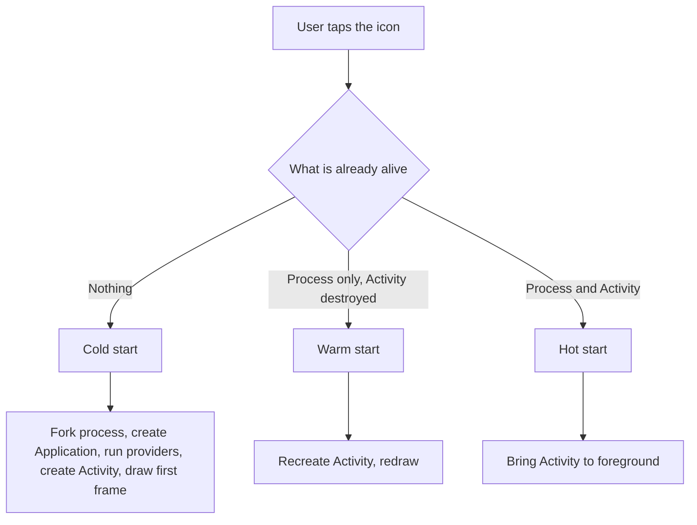
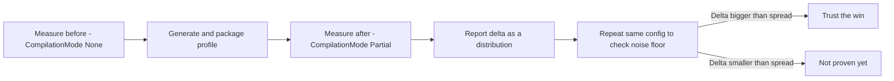

# Lecture 1 — Cold start, Macrobenchmark, and Baseline Profiles

> "Cold start is the only first impression you get. The user taps your icon, and a stopwatch starts that you can't pause, can't apologize to, and can't retake. This week you learn to read that stopwatch — and then to move the number."

This is the lecture that turns "the app feels fast" into "P50 cold start is 340ms on a Pixel 6a, down from 520ms, and here's the macrobenchmark output." We start with what cold/warm/hot start actually measure, then the Macrobenchmark library and how to read its output as a *distribution*, then Baseline Profiles — what they are, how to generate, package, and verify one, and how to measure the effect honestly. By the end you can run the measure → fix → re-measure loop on real hardware and trust the number.

The frame for the whole week is one sentence: **a performance claim is a reproducible distribution on real hardware, or it is a vibe.** Lecture 2 covers R8 and the self-inflicted startup wounds; this lecture owns the measurement and the single biggest free win — the Baseline Profile.

---

## 1. Cold, warm, and hot start: what the stopwatch measures

When the user launches your app, one of three things happens, and they cost wildly different amounts:

- **Cold start.** The process does not exist. The system forks a new process from the Zygote, creates your `Application`, runs every `ContentProvider`-based initializer, creates the launch Activity, inflates/composes the first screen, and draws the first frame. This is the **worst case and the one that matters** — it's what the user sees the first time, after a reboot, after the system kills your app to reclaim memory, or after they haven't opened it in a while. Hundreds of milliseconds to seconds.

- **Warm start.** The process is alive but the Activity was destroyed (e.g. the user backed out and returned). The system recreates the Activity and redraws, but skips process creation and `Application.onCreate`. Cheaper than cold.

- **Hot start.** The process and the Activity are both in memory; the system just brings the Activity to the foreground. Nearly free — a few frames.


*What the system skips or rebuilds for each of the three start types.*

The relative cost is roughly an order of magnitude between each rung: a hot start is a few frames (tens of milliseconds), a warm start is the Activity-rebuild cost (low hundreds), and a cold start is everything (hundreds to over a second on a constrained device). The trap is benchmarking the wrong one and feeling good: hot starts dominate *your* day-to-day use of your own app, so it always feels fast to you, while your users on tight-memory devices eat the cold path constantly. Always benchmark cold (`StartupMode.COLD`); it's the number that reflects the experience you don't see.

There's also a distinction the platform draws between **a true cold start** (the app was never started since boot, or its caches are gone) and a *cold-ish* start where the process was killed but disk caches and the Cloud Profile are warm. Macrobenchmark's `StartupMode.COLD` force-stops the app to approximate the worst realistic case; it's the honest pessimistic number, and the one you optimize against. Don't be lulled by a fast hot start in everyday use — your users on memory-constrained devices get the cold path far more often than you do on your high-end dev phone, because the system kills backgrounded apps aggressively when memory is tight. The cold number is *their* normal.

You optimize **cold start** because it's the worst case and the first impression. Within cold start, two finish lines matter:

- **Time to initial display (TTID)** — the first frame is drawn. The app is "on screen," even if it's still loading content. This is the headline cold-start number Macrobenchmark reports.
- **Time to full display (TTFD)** — the screen is fully usable, content loaded. You signal it yourself with `reportFullyDrawn()`. A screen can hit TTID fast (a skeleton) and TTFD slow (the data took a second), and the user feels the *gap*.

Why does the *gap* matter as much as either endpoint? Because the two failure modes feel completely different to a user. A slow TTID is "the app didn't open" — a blank or frozen launcher icon, the worst impression, because the user can't tell if their tap registered. A fast TTID with a slow TTFD is "the app opened but isn't ready" — a skeleton screen with shimmer placeholders that the user *can* see is making progress, which they tolerate far better. The design implication runs straight into Week 7's work: you want the first frame to draw *something* meaningful as fast as possible (good TTID), even if the real content streams in after (TTFD). That's why a well-built screen shows a skeleton instantly rather than waiting for data — it converts a frightening blank into a reassuring "loading." Measure both, optimize TTID first, and use the skeleton to make the TTID→TTFD gap feel like progress instead of a hang.

The Android Vitals dashboard in Play Console flags apps whose cold start exceeds the "excessive" threshold (around 5s) — but that's the floor of acceptable, not the goal. A good app cold-starts in a few hundred milliseconds on a mid-range device. Your job this week: measure it, then move it.

### What "cold start" includes, span by span

It helps to know exactly what the stopwatch is timing, because every span is something you can potentially shrink. From the user's tap to the first frame, a cold start runs, roughly in order:

1. **Process fork from the Zygote.** The OS forks a pre-warmed process that already has the framework classes and shared libraries mapped in. You don't control this; it's a fixed cost the platform pays.
2. **`Application` instantiation and `attachBaseContext`.** Your `Application` subclass is created.
3. **`ContentProvider` initialization.** *Every* declared `ContentProvider` is instantiated and its `onCreate` run — including the ones libraries declared for auto-init (lecture 2, §4). This is on the main thread, before your `Application.onCreate`.
4. **`Application.onCreate`.** Your app-level init — DI graph, crash reporting, anything you put here. A fat `onCreate` directly fattens cold start.
5. **Launch Activity creation** — `onCreate`, `onStart`, `onResume`, and for a Compose app, the first `setContent` and the initial composition.
6. **Measure, layout, draw of the first frame**, then the frame is handed to the display and the stopwatch (TTID) stops.

Three of those six are yours to optimize: `Application.onCreate`, provider init, and the first screen's composition. The Baseline Profile speeds up all three by AOT-compiling their methods; deferring eager init (lecture 2) removes work from steps 3–4; and a leaner first screen shrinks step 5. The trace shows you which span dominates, so you spend your effort where the milliseconds actually are — not on the Zygote fork you can't touch.

## 2. The Macrobenchmark library: measuring on real hardware

You cannot measure cold start by adding `System.currentTimeMillis()` to `onCreate` — that misses process creation, runs in a debuggable build (which is slower and uses a different compilation), and gives you one noisy number. **Macrobenchmark** is the library built for this: it lives in a separate `:benchmark` module, launches your *release-like* app on a *real device* from a *fully cold* state, repeats the measurement, and reports a distribution plus a captured trace.

The structure: a `:benchmark` module (`com.android.test` plugin — it's a test-only module that instruments your app), depending on the app:

```kotlin
// benchmark/build.gradle.kts
plugins {
    id("com.android.test")
    id("org.jetbrains.kotlin.android")
}
android {
    targetProjectPath = ":app"
    experimentalProperties["android.experimental.self-instrumenting"] = true
    defaultConfig {
        testInstrumentationRunner = "androidx.test.runner.AndroidJUnitRunner"
    }
}
dependencies {
    implementation("androidx.benchmark:benchmark-macro-junit4:1.3.3")
    implementation("androidx.test.ext:junit:1.2.1")
    implementation("androidx.test.uiautomator:uiautomator:2.3.0")
}
```

The benchmark itself measures `StartupTimingMetric` over a cold launch:

```kotlin
@RunWith(AndroidJUnit4::class)
class StartupBenchmark {
    @get:Rule
    val benchmarkRule = MacrobenchmarkRule()

    @Test
    fun coldStartup() = benchmarkRule.measureRepeated(
        packageName = "com.crunch.reader",
        metrics = listOf(StartupTimingMetric()),
        iterations = 20,                       // enough to average out noise
        startupMode = StartupMode.COLD,
        compilationMode = CompilationMode.None()   // worst case baseline (see §4)
    ) {
        pressHome()                            // ensure fully cold
        startActivityAndWait()                 // launch and wait for the first frame
    }
}
```

Run it with `./gradlew :benchmark:connectedBenchmarkAndroidTest` on a connected physical device. (The emulator's numbers are meaningless — emulated hardware, host CPU contention, no thermal reality. **Macrobenchmark on the emulator is the single most common beginner mistake.** Use a real phone, ideally mid- or low-end, because that's where your users' bottlenecks actually live.)

### `measureRepeated` anatomy

Worth pausing on the structure of `measureRepeated`, because the two blocks it takes are easy to confuse and getting them wrong corrupts the number:

- The **`setupBlock`** runs *before* each measured iteration and is *not* timed. This is where you put the work that gets you into the right starting state — `pressHome()` to background the app, clearing a cache, navigating to a precondition. Anything here is free; it doesn't count toward the result.
- The **`measureBlock`** (the trailing lambda) *is* timed. For a cold-start benchmark it's just `startActivityAndWait()` — launch the app and block until the first frame is reported. Everything in here is the number.

The classic mistake is doing setup work inside the measured block (so your "cold start" number includes a cache-clear you didn't mean to time), or forgetting `startActivityAndWait()` and using `startActivity()` (which returns before the frame, so you time "the launch intent was sent," not "the app is on screen"). The `…AndWait` variants exist precisely so the measured block ends at a meaningful, observable point — the first frame. Get the boundary right and the distribution means what you think it means.

## 3. Reading the output as a distribution

Macrobenchmark does not print "cold start: 412ms." It prints a *distribution* over the iterations:

```
StartupBenchmark_coldStartup
timeToInitialDisplayMs   min 318.2,   median 341.6,   max 498.1
   ... 20 iterations
```

Read it like an engineer:

- **Median (P50)** is your typical case — half of launches are faster, half slower. The headline number.
- **P90 / P95 / max** is the **tail** — the slow launches. This is where users actually suffer, because a P90 of 900ms means one in ten launches feels sluggish. A change that improves P50 but worsens P90 is often a *regression* in lived experience. Always report both.
- **Min** is the best case (warm caches, lucky scheduling) — interesting but not what users feel.
- **The spread** (max − min) tells you how *noisy* the measurement is. A huge spread means the device wasn't controlled (thermal throttling, background work, an unlocked CPU) and the number can't be trusted yet.

The senior discipline: **a change is only "real" when it clears the run-to-run noise.** If your benchmark swings ±40ms between identical runs, a 20ms "improvement" is noise. Run the *same* code twice, see the spread, and only believe deltas bigger than that spread. This is exactly Week 17's determinism discipline pointed at a stopwatch: control the inputs (device state, iterations, compilation mode) so the output is reproducible.

Macrobenchmark also captures a **system trace** per iteration (a Perfetto trace you open in Android Studio or ui.perfetto.dev). When the number is bad, the trace tells you *where* — a long span in `Application.onCreate`, a synchronous disk read, a library initializing eagerly. Lecture 2 reads traces; for now, know that the number tells you *whether* and the trace tells you *where*.

One more discipline on reporting: **state the units and the metric name, not just the number.** "Cold start is 340" is ambiguous — 340 what, measured how? "TTID P50 340ms, 20 iterations, Pixel 6a, `CompilationMode.Partial`" is a claim a reviewer can trust and reproduce. The macrobenchmark output gives you all of that; carry it into your PR verbatim rather than reducing it to a single bare figure. A bare number invites the exact over-claiming this week trains out of you, because it hides whether you measured the median or the lucky minimum, on real hardware or an emulator, with the profile on or off. The full label *is* the rigor.

## 4. CompilationMode: why you benchmark None vs Partial

Here is the subtle, essential idea that makes Baseline Profiles measurable. When ART runs your app, code can be in one of three states:

- **Interpreted** — ART reads the dex bytecode instruction by instruction. Slowest.
- **JIT-compiled** — after a method runs enough times, ART compiles it to native code *at runtime*. Faster, but the compilation itself costs time and happens *on the user's device, during use*.
- **AOT-compiled** — the method was compiled to native code *ahead of time*, at install. Fastest at runtime, with no JIT cost.

A fresh install with no Baseline Profile: everything starts **interpreted**, and the hot startup methods get JIT-compiled the first few times you launch — so the first launches are slow, and they warm up over time. A Baseline Profile **pre-AOT-compiles the listed startup methods at install**, so the very first launch is already fast.

`CompilationMode` in the benchmark lets you control which state you measure:

- **`CompilationMode.None()`** — wipes any profile and forces interpretation/JIT. This is the **worst case**, the honest baseline for a fresh install with no profile. Benchmark this to know your starting point.
- **`CompilationMode.Partial(BaselineProfileMode.Require)`** — applies the Baseline Profile (AOT-compiles the listed methods). Benchmark this to know your *with-profile* number.
- **`CompilationMode.Full()`** — AOT-compiles *everything*. Faster still, but **not realistic** — release apps don't ship fully AOT-compiled (the install would be huge and slow). Useful only as a theoretical ceiling.

**The profile's effect is `None()` minus `Partial()`.** You benchmark both and report the delta. If you only ever benchmark `Partial`, you can't tell whether the profile did anything. Isolating the variable — profile off vs. profile on, everything else identical — is the whole measurement.

## 5. Baseline Profiles: what they are

A **Baseline Profile** is a text file (`baseline-prof.txt`) listing classes and methods, in a specific format, that ART should AOT-compile at install time:

```
# A few lines from a real baseline-prof.txt:
HSPLcom/crunch/reader/MainActivity;-><init>()V
HSPLcom/crunch/reader/ReaderScreenKt;->ReaderScreen(...)V
Landroidx/compose/runtime/ComposerImpl;
```

The cryptic prefixes are flags: `H` = "hot" (called often), `S` = "startup" (called during startup), `P` = "post-startup", `L` = the class itself. You do not write this by hand — you *generate* it by running your cold-start journey under a profiler and letting the tooling record which methods ran.

Why it works: the startup path runs a few hundred methods (Compose runtime, your Activity, your first screen, the libraries they touch). Without a profile, all of them start interpreted and JIT slowly. With a profile, they're native code before the user's first tap. The win is typically **20–40% off cold start** — real, free, and exactly what the capstone requires (≥20%).

The Baseline Profile ships *inside your APK/AAB* (in `assets/dexopt/baseline.prof`), and Play also aggregates **Cloud Profiles** from real users over time — but the Baseline Profile gives you the win on day one, before any user has run the app.

A useful intuition for *why the win is so large for Compose apps specifically*: Compose is a big, generic runtime — the composer, the slot table, the snapshot system, the layout and draw machinery from Week 7 — and almost all of it runs during your first screen's composition. Without a profile, all of that generic runtime code starts interpreted and JITs slowly on the user's device during their first launch. With a profile, the Compose runtime's hot startup methods are already native. This is why Compose apps tend to see the upper end of the 20–40% range: the framework code dominates the startup method count, and the profile front-loads its compilation. The same app written in Views would still benefit, but Compose's larger runtime surface is exactly what the Baseline Profile is best at warming.

## 6. Generating a Baseline Profile

You use the **Baseline Profile Gradle plugin** (`androidx.baselineprofile`) and a generator test that drives your cold-start journey. The generator lives in the `:benchmark` (or a dedicated `:baselineprofile`) module:

```kotlin
@RunWith(AndroidJUnit4::class)
class BaselineProfileGenerator {
    @get:Rule
    val baselineProfileRule = BaselineProfileRule()

    @Test
    fun generate() = baselineProfileRule.collect(
        packageName = "com.crunch.reader",
        // include the critical user journey: launch + the first screen's key interactions
        includeInStartupProfile = true
    ) {
        pressHome()
        startActivityAndWait()
        // drive the journey the profile should cover — scroll the article list,
        // open an article — so those methods get AOT-compiled too.
        device.findObject(By.res("article_list")).fling(Direction.DOWN)
        device.waitForIdle()
    }
}
```

Wire the plugin so the app consumes the generated profile:

```kotlin
// app/build.gradle.kts
plugins { id("androidx.baselineprofile") }
dependencies { baselineProfile(project(":benchmark")) }
```

Run `./gradlew :app:generateBaselineProfile`. It builds a non-minified release variant, runs the generator on the device, records the methods, and writes the profile to `app/src/release/generated/baselineProfiles/baseline-prof.txt`. **Commit that file** — it's a source artifact, and you want it deterministic and reviewed, not regenerated unpredictably.

### What to put in the journey

The generator captures whatever methods *run* during your journey, so the journey *is* the profile. Cover the critical path: app launch, the first screen, the most common first interaction (scroll the list, open the top item). Don't try to cover the whole app — a bloated profile AOT-compiles methods that don't matter and bloats install. The startup path plus the one or two highest-traffic screens is the sweet spot.

A few practical rules for a good journey, learned the hard way:

- **Drive it like a real first session, not a test suite.** The profile should compile what a *user* hits in their first ten seconds: the splash, the home screen, the first scroll. It should *not* tour every screen — that compiles rarely-used code at the cost of install size and the very startup time you're optimizing.
- **`waitForIdle()` after each interaction.** If the journey races ahead before the screen settled, the methods that ran *after* your next action got attributed wrong, or didn't run at all. Let each step finish.
- **Keep it deterministic.** The same journey should produce a near-identical profile each run. If it depends on network data that changes, stub it (the same fakes from Week 17), or the profile churns and your diffs are noise. A profile you can't reproduce is a profile you can't review.
- **Regenerate when startup code moves.** A refactor that renames or relocates your startup methods makes the old profile stale — it lists methods that no longer exist, and the new ones aren't compiled. Regenerate after structural changes and re-measure; a stale profile is a silent regression (§8c).

### Where the profile lives, and Cloud Profiles

Worth knowing the full lifecycle, because it explains both why your profile helps on day one and why Play eventually helps even without you. Your generated `baseline-prof.txt` is compiled into a binary `baseline.prof` packaged in the app's `assets/dexopt/`. At **install time** (or on the next device idle-maintenance window), ART reads that profile and AOT-compiles the listed methods — so the very first launch benefits. That's the win you ship and control.

Separately, Google Play aggregates **Cloud Profiles**: as real users run your app, Play collects anonymized profiles of what *they* actually execute, merges them, and ships the aggregate to future installers. Cloud Profiles are powerful (they reflect real usage across your whole user base) but they have a *cold-start-of-the-app's-life* problem: a brand-new app or a fresh release has no aggregated profile yet, so early adopters get no benefit until Play has gathered enough data. **The Baseline Profile is what covers that gap** — it gives every install the startup win from version one, before any Cloud Profile exists. The two are complementary: you ship the Baseline Profile for guaranteed day-one performance; Cloud Profiles layer on real-world coverage over time. This is why "Play does profiles automatically, why do I need a Baseline Profile?" has a crisp answer: Play's automatic profiles arrive late; yours arrives at install.

## 7. Packaging and verifying

The plugin packages the profile into your release build automatically — the generated `baseline-prof.txt` becomes `assets/dexopt/baseline.prof` (binary) and `baseline.profm` (metadata) in the APK/AAB. Build the release (`./gradlew :app:assembleRelease`) and confirm those assets are present (unzip the APK and look in `assets/dexopt/`).

But packaging isn't proof ART *used* it. Verify on-device:

```bash
# After installing the release build, check the compilation status:
adb shell dumpsys package com.crunch.reader | grep -A2 "Dexopt state"
# You want to see the profile applied — "status=speed-profile" or a profile-based reason.
# You can also force-apply for a test:
adb shell cmd package compile -f -m speed-profile com.crunch.reader
```

And the real verification is the *benchmark*: `CompilationMode.None()` (profile off) should be meaningfully slower than `CompilationMode.Partial()` (profile on). If they're identical, the profile isn't doing anything — most likely the journey didn't cover the startup path, or the profile didn't package. The number is the truth; `dumpsys` is the corroboration.

### Startup Profiles — the dex-layout companion

There's a younger sibling worth knowing: a **Startup Profile**. A Baseline Profile tells ART which methods to AOT-compile; a Startup Profile additionally tells the build tooling how to **lay out the dex files** so the classes touched at startup are physically grouped together. The benefit is fewer page faults and less dex-loading work during cold start — the startup classes are contiguous on disk instead of scattered across multiple dex files. You generate it the same way (the generator with `includeInStartupProfile = true` produces both), and it's a complementary win on top of the AOT compilation. For this week, the headline is the Baseline Profile; know the Startup Profile exists and ships from the same generator.

### What goes wrong, and how the profile silently does nothing

The most demoralizing failure mode is a Baseline Profile that *packages fine and changes nothing*. Three usual causes, all worth checking before you conclude "profiles don't help my app":

- **The journey didn't cover the startup path.** If your generator only launches and immediately stops, the profile lists the launch methods but not the first screen's composables — and the screen is most of your cold-start cost. Drive the journey far enough to touch the first real screen.
- **The profile didn't actually package.** `assets/dexopt/baseline.prof` is missing from the release artifact. Unzip and check. Using `BaselineProfileMode.Require` in the benchmark makes this fail loudly instead of silently measuring no-profile numbers.
- **You benchmarked `Partial` against `Partial`.** If both your "before" and "after" applied the profile (or both didn't), there's no contrast. The before must be `None()`.

A profile that does nothing is almost always one of these three, not a fundamental limit. The benchmark distribution plus a check of the packaged assets diagnoses it in minutes.

### A second metric: `FrameTimingMetric` and jank

Cold start is the headline, but Macrobenchmark measures more. `FrameTimingMetric` records the duration of each frame produced during your `measureBlock`, so you can measure **jank** — frames that took longer than the display's budget (about 16.7ms at 60Hz, 11.1ms at 90Hz, 8.3ms at 120Hz). A scroll benchmark:

```kotlin
@Test
fun scrollJank() = benchmarkRule.measureRepeated(
    packageName = "com.crunch.reader",
    metrics = listOf(FrameTimingMetric()),
    iterations = 10,
    startupMode = StartupMode.WARM,
    compilationMode = CompilationMode.Partial()
) {
    startActivityAndWait()
    val list = device.findObject(By.res("article_list"))
    list.setGestureMargin(device.displayWidth / 5)
    repeat(3) { list.fling(Direction.DOWN) }
    device.waitForIdle()
}
```

It reports `frameDurationCpuMs` and `frameOverrunMs` distributions — the P90 of `frameOverrunMs` tells you how badly your worst frames blew the budget. A Baseline Profile helps here too (the scroll path's methods are AOT-compiled), which connects this week's profile work back to Week 7's recomposition discipline: a frame janks either because it did too much (recomposition) or because the code wasn't compiled yet (no profile). Different cause, same symptom, both measurable.

## 8. Measuring the effect honestly

Put it together. The full loop for the mini-project:

1. **Measure the "before."** Benchmark cold start with `CompilationMode.None()`, 20+ iterations, on a real device. Record P50 and P90. This is the no-profile baseline.
2. **Generate and package the profile.** Run the generator over the cold-start journey; commit `baseline-prof.txt`; build the release with the profile packaged.
3. **Measure the "after."** Benchmark cold start with `CompilationMode.Partial(Require)`, same device, same iterations. Record P50 and P90.
4. **Report the delta as a distribution.** "P50: 520ms → 340ms (−35%); P90: 740ms → 510ms (−31%), over 20 iterations on a Pixel 6a." Both percentiles, the device named, the iteration count stated.
5. **Be honest about noise.** Run the *same* config twice to see the run-to-run spread. If your "improvement" is smaller than the spread, you haven't proven anything — say so, and take more iterations or control the device better.


*The measure, generate, re-measure loop that turns a number into a defensible claim.*

The failure mode this week trains out of you: measuring once, seeing a smaller number, and declaring a 35% win that was really 10% plus noise. A senior engineer's performance PR says "here's the distribution, here's the noise floor, here's why I believe the delta is real." That honesty is the deliverable.

## 8a. Controlling the device: where the noise comes from

When two identical runs differ by more than a few percent, the *device* is the variable, not your code. The sources of benchmark noise, in rough order of impact, and how to control them:

- **Thermal throttling.** A phone that's been running benchmarks for ten minutes is hot, and ART/CPU clock down to avoid overheating — so later iterations are slower than earlier ones, smearing the distribution. Let the device cool between runs; plug it in (charging keeps clocks more stable than draining a hot battery); and run on a device that isn't in direct sun on your desk. Macrobenchmark will actually *warn* you in the output if it detects sustained-performance issues.
- **Background work.** Other apps syncing, the launcher animating, a system update downloading — all steal CPU. Close other apps, disable auto-sync for the benchmark window, and don't touch the device mid-run.
- **CPU governor / clock instability.** On a rooted device or a Firebase Test Lab device you can lock clocks for a rock-steady measurement; on a normal retail device you can't, so you compensate with more iterations (the noise averages out) and by reporting the distribution honestly.
- **Too few iterations.** Three iterations can't average out a single unlucky launch. Twenty is a reasonable floor for startup; if the spread is still wide, raise it. Macrobenchmark picks a sensible default but you can set it explicitly.

The reframe from Week 17: a flaky test fails because of uncontrolled inputs (a real clock, shared state); a noisy benchmark *misleads* because of uncontrolled inputs (thermal, background work, too few samples). The cure is identical — lock down the variables until the output is reproducible — and the discipline of *reporting the noise floor alongside the result* is what makes the number trustworthy to a reviewer who wasn't there when you ran it.

## 8b. Macrobenchmark vs. Microbenchmark — pick the right scope

There are two benchmark libraries, and confusing them wastes a day:

- **Macrobenchmark** (this week) measures a **whole-app user journey on a real device from the outside** — cold start, a scroll, a navigation. It launches your *release-like* app in a separate process and instruments it from a test app. This is the right tool for "how fast does my app start" and "does this screen jank," because those are emergent properties of the whole running app.
- **Microbenchmark** (the `benchmark-junit4` library) measures a **single tight function in isolation**, in the same process, with loop-warming and outlier rejection — "how long does this JSON parse take," "is this sort faster than that one." It's the right tool for a hot inner loop you can isolate, and the *wrong* tool for startup (a function timed in isolation tells you nothing about process creation and the first frame).

The rule of thumb: if the thing you're measuring only has meaning *as part of the running app* (startup, frames, navigation), it's a macrobenchmark. If it's a pure function whose cost you can isolate, it's a microbenchmark. Cold start is unambiguously macro — which is why the whole week lives in a `com.android.test` module launching the real app, not a unit test timing a method.

## 8c. A worked diagnosis: the regression that wasn't

A scenario you will live, because it's the most common real performance ticket: "cold start regressed after the last release — Vitals shows it up 80ms." You're handed a number and asked to fix it. Here's the senior workflow, every step measured:

1. **Reproduce locally as a distribution.** Before touching code, run the cold-start macrobenchmark on the *current* release build, `CompilationMode.None()`, 20 iterations, and on the *previous* release tag. If the regression doesn't reproduce locally, the production signal might be a *device-mix shift* (more low-end devices installed it) rather than a code regression — a different problem entirely. Don't optimize blind.

2. **Establish the noise floor first.** Run the current build twice. If the two P50s differ by 50ms and the "regression" is 80ms, you're chasing a number barely above noise — gather more iterations before believing it.

3. **Bisect with the trace, not with guesses.** Each macrobenchmark iteration captures a Perfetto trace. Open the current-build trace and the previous-build trace side by side and look for a span that grew. Maybe `Application.onCreate` is 60ms wider — and inside it, a new SDK's initializer appeared. *That's* your regression, named, not guessed.

4. **Pull one lever, re-measure.** Defer the new initializer off the startup path (lecture 2, §4). Re-run the benchmark. Did P50 drop back ~60ms? If yes, you've confirmed the cause *and* the fix with the same instrument. If no, your hypothesis was wrong — back to the trace.

5. **Confirm the profile still covers the path.** A regression sometimes isn't new work — it's the Baseline Profile going stale because a refactor moved the startup methods, so the profile no longer AOT-compiles them. Regenerate the profile against the new code and re-measure. A stale profile is a silent cold-start regression with no "new code" to blame.

The meta-lesson: every step is a *measurement*, and you change exactly one thing between measurements. The engineer who "optimizes" by changing five things and shipping when the number looks better has learned nothing and probably kept four changes that did nothing (or made it worse). Measure, isolate one variable, re-measure, keep only what the distribution proves helped.

## 9. Recap

Cold start is the first impression, and you now have the loop to measure and move it:

1. **Cold start is the metric.** Process-from-scratch, the worst case, the first impression. TTID is the first frame; TTFD is fully usable. Optimize the cold path.
2. **Macrobenchmark measures on real hardware.** A `:benchmark` module, `StartupTimingMetric`, `StartupMode.COLD`, enough iterations. The emulator's numbers are meaningless.
3. **Read the distribution, not a number.** P50 is typical, P90 is the tail where users suffer, the spread is your noise floor. Believe a delta only when it clears the noise.
4. **CompilationMode isolates the profile's effect.** `None()` is the no-profile worst case; `Partial()` applies the profile; the difference is what the profile bought.
5. **Baseline Profiles AOT-compile the startup path at install.** Generate by driving the journey, commit the `.txt`, package into release, verify ART used it, and measure the before/after as a distribution — 20–40% off cold start, free.

And one habit above all the mechanics: **change one variable, measure, keep only what the distribution proves.** Every lever this week — the profile, deferred init, R8 — is a hypothesis until the before/after on real hardware confirms it, against a noise floor you established by running the same thing twice. The engineer who sprinkles `remember`, flips three build flags, and ships because the app "feels snappier" has learned nothing and is carrying changes that may have done nothing or hurt. The engineer who measures, isolates, and reports a labeled distribution has a number they can defend in a review, a regression they can catch next quarter, and a habit that transfers to every performance problem they'll ever touch. That habit — not any single API — is what this week is really teaching.

Lecture 2 covers the other levers: R8 to shrink and optimize the release (and the keep rules that stop it breaking your reflection-heavy code), the App Startup library to stop eager initializers from running before your first frame, and StrictMode plus system traces to find the self-inflicted wounds. The exercises read a macrobenchmark report and write a startup benchmark; the challenge takes a profile-less app to a ≥20% win; the mini-project does it on the reader app for real. Measure, move, prove.
