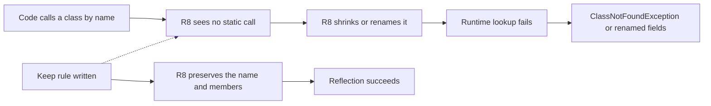
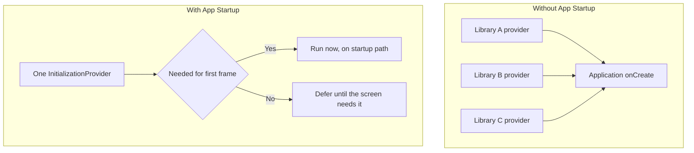

# Lecture 2 — R8, keep rules, App Startup, and StrictMode

> "R8 makes your app smaller and faster by deleting code it can prove you don't use and renaming what's left. The catch: reflection calls code by *name*, and R8 renamed the names. Disabling R8 to make the crash go away is throwing out the optimizer to avoid writing four lines of keep rules."

Lecture 1 owned measurement and the Baseline Profile — the biggest free cold-start win. This lecture covers the other levers: **R8**, the optimizer/shrinker that makes the release build smaller and faster (and the keep rules that stop it breaking reflection-heavy code), the **App Startup** library that stops eager initializers from running before your first frame, and **StrictMode** plus **system traces** that catch the self-inflicted wounds. By the end you can enable R8 in full mode, write the minimal keep rules to keep your serialization and DI working, and find the slow span in a startup trace.

The through-line: **most performance problems on Android are work you didn't have to do, done at the worst possible time — before the first frame.** R8 removes work (dead code); App Startup defers work (eager init); StrictMode catches work on the wrong thread. All three shrink the cold-start path lecture 1 taught you to measure.

---

## 1. R8: the three jobs

R8 is the default optimizer and shrinker that runs on your **release** build (it replaced ProGuard; it reads ProGuard-format rules for compatibility). It does three things, in one pass over your whole program:

1. **Shrinking (tree-shaking).** R8 builds a reachability graph from your entry points (the manifest's Activities, `@Keep`-annotated members, keep rules) and **deletes every class, method, and field nothing reaches.** A library you use 5% of ships only the 5%. This is where the size win comes from — a release AAB is often 30–50% smaller than the debug APK.
2. **Optimization.** R8 inlines small methods, removes unused arguments, merges classes, propagates constants, and removes dead branches. "Full mode" (the default since AGP 8) does more aggressive optimization than legacy compatibility mode. This is a real runtime win on top of the Baseline Profile.
3. **Obfuscation.** R8 renames classes, methods, and fields to short names (`a`, `b`, `c`) — partly to shrink (shorter names = smaller dex), partly to obscure. It writes a **`mapping.txt`** so you can de-obfuscate a crash stack trace later.

You enable it on the release build type:

```kotlin
// app/build.gradle.kts
android {
    buildTypes {
        release {
            isMinifyEnabled = true          // R8 shrinking + optimization
            isShrinkResources = true        // also remove unused resources
            proguardFiles(
                getDefaultProguardFile("proguard-android-optimize.txt"),
                "proguard-rules.pro"        // your keep rules
            )
        }
    }
}
```

The outputs land in `app/build/outputs/mapping/release/`:

- **`mapping.txt`** — the obfuscation map (original name ↔ obfuscated name). **Upload this to Play Console** (or keep it) so crash stack traces de-obfuscate. Lose it and your production crashes read `a.b.c(Unknown Source)`.
- **`usage.txt`** — what R8 *removed* (the shrunk code). Read it to confirm R8 deleted what you expected — or to discover it deleted something you needed.
- **`seeds.txt`** — what R8 *kept* as entry points (the seeds of the reachability graph). Read it to confirm your keep rules took effect.

### Why R8 helps cold start, not just app size

It's tempting to file R8 under "makes the download smaller" and move on, but it's a *runtime* win too, which is why it belongs in a performance week. Three of its effects touch startup directly:

- **Less code to load.** A smaller dex means fewer bytes ART maps and verifies during process creation. Tree-shaking a few thousand unreachable methods out of your dependencies shaves real time off the load step.
- **Inlining removes call overhead.** R8 inlines small methods into their callers, eliminating method-call dispatch on hot paths — including the startup path. Fewer frames on the stack, less work per call.
- **Dead-branch and constant elimination.** Code that R8 proves unreachable (a debug-only branch behind a `BuildConfig.DEBUG` that's `false` in release) is removed entirely, so it costs nothing at runtime.

The Baseline Profile and R8 stack: R8 makes the startup code *smaller and tighter*, and the Baseline Profile makes whatever survives *AOT-compiled*. You want both on for release, and you measure their combined effect the same way — `None()` vs `Partial()` on the R8-minified build. A common, instructive surprise: turning R8 on can *change* which methods the profile should list (inlining merged some), which is another reason to regenerate the profile against the release-configured build, not a debug one.

## 2. Why reflection breaks R8 (and the fix)

Here's the crash. R8 shrinks and obfuscates based on **static reachability** — what the code *calls*. But reflection calls code by **name at runtime**, which R8 can't see statically. So R8 decides a class is unused (nothing *calls* it directly), deletes or renames it, and then your reflective code fails: `ClassNotFoundException`, `NoSuchMethodException`, or — subtler — a serializer that produces `{"a":1,"b":2}` because R8 renamed your fields.

The libraries that reflect, and therefore need protecting:

- **kotlinx-serialization** — reflects on the generated serializer and (in some setups) field names.
- **Hilt / Dagger** — generates and reflects on component/factory classes by name.
- **Room** — generates DAO implementations and reflects on entity field names for the schema.
- **Retrofit / Moshi / Gson** — Gson especially reflects on field names; Retrofit reflects on interface methods and annotations.
- **Anything using `Class.forName(...)`, `@Keep`-worthy entry points, or enum `valueOf` by name.**

The fix is a **keep rule**: tell R8 "don't shrink/rename this, even though nothing statically calls it."


*Why reflective lookups break under R8, and how a keep rule short-circuits the failure.*

```proguard
# proguard-rules.pro

# Keep a specific class and all its members (the heavy hammer; use narrowly).
-keep class com.crunch.reader.network.WireModels { *; }

# Keep the members (fields/methods) of classes annotated @Serializable — Gson/reflection-style.
-keepclassmembers,allowobfuscation class * {
    @kotlinx.serialization.SerialName <fields>;
}

# Don't warn about a transitive dependency's missing optional class.
-dontwarn org.somelib.OptionalThing

# Keep an enum's valueOf/values (reflected by name).
-keepclassmembers enum * {
    public static **[] values();
    public static ** valueOf(java.lang.String);
}
```

### The crucial point: you usually don't write these

Modern libraries ship their own keep rules as **`consumer-rules.pro`** bundled in the AAR — when you depend on kotlinx-serialization, Hilt, Room, or Retrofit, their keep rules are *automatically* merged into your R8 configuration. So in a well-behaved project, R8 "just works" with no hand-written rules. You write a keep rule only when:

- You reflect on **your own** code (a custom serializer, a `Class.forName` on your own class, a plugin you load by name).
- A library is **missing or has incomplete** consumer rules (rarer now, but happens with smaller libs).
- You hit a release-only crash and the stack trace points at a reflective call.

**The senior move when R8 breaks something: don't disable R8.** Read the release crash, find the reflected name, write the *narrowest* keep rule that fixes it (keep one class, or one annotation's members — not `-keep class ** { *; }`, which keeps everything and defeats R8). A surgical keep rule preserves 99% of the shrinking; disabling R8 throws all of it away.

## 3. Testing R8: the release build must be tested

R8 only runs on release builds, so a bug R8 introduces *only appears in release* — and your debug-built test suite won't catch it. This is why the Macrobenchmark and Baseline Profile work in lecture 1 runs against a **release-like** build, and why a senior team:

- Runs at least the **Espresso end-to-end smoke** (Week 17) against a minified build in CI, so an R8-broken serialization path fails *before* production.
- Reads `usage.txt` after enabling R8 on a new feature, to confirm nothing critical was shrunk away.
- Keeps `mapping.txt` per release, so production crashes de-obfuscate.

"It works in debug" is meaningless for R8 issues. The release build is a different program.

### Reading `usage.txt` and `seeds.txt` like an engineer

The mapping outputs are not just for crash de-obfuscation; they're how you *audit* R8's decisions. After enabling R8 on a new feature, open the three files:

- **`seeds.txt`** answers "what did R8 treat as roots?" Every entry point — your manifest Activities, `@Keep` members, and everything your keep rules matched — appears here. If you wrote a keep rule and the class *isn't* in `seeds.txt`, your rule didn't match (wrong package, wrong syntax) and R8 may still shrink it. This is the first place to look when a keep rule "didn't work."
- **`usage.txt`** answers "what did R8 delete?" Scan it for anything surprising — a class you *thought* was used but R8 proved unreachable (often dead code you can delete from source too, or a reflection path R8 couldn't see). A class you needed appearing in `usage.txt` is the smoking gun for a release-only `ClassNotFoundException`.
- **`mapping.txt`** answers "what did R8 rename to what?" `com.crunch.reader.RemoteConfig -> a.b.c:` plus the field/method renames beneath. For a reflection bug, you confirm here that the field you expected to keep is *not* renamed.

The senior habit: when you turn R8 on for a module, you don't just check the app still launches — you read `usage.txt` for surprises and confirm your keep-rule targets landed in `seeds.txt`. R8 is doing a whole-program transform; the mapping files are how you verify it did what you intended.

### Full mode vs. compatibility mode

Since AGP 8, R8 runs in **full mode** by default (set by `android.enableR8.fullMode=true`, on unless you opt out). Full mode is more aggressive than the legacy ProGuard-compatibility mode: it assumes classes not kept can be freely optimized, it does more inlining and class merging, and it interprets some keep rules more strictly (a `-keep` that ProGuard treated leniently, full-mode R8 takes literally). The practical consequence: a project migrated from ProGuard sometimes needs an extra keep rule under full mode that it didn't need before, because full mode no longer keeps things "just in case." The fix is the same — a narrow keep rule — and the win is more shrinking and optimization. Don't turn full mode off to dodge a keep rule; that's the same mistake as disabling R8, one notch smaller.

## 4. The App Startup library: stop running work before the first frame

A surprising amount of cold-start time is libraries initializing themselves *before your first frame* — and you never asked them to. The old mechanism: a library declares a `ContentProvider` in its manifest, and Android instantiates every `ContentProvider` during `Application` creation, on the main thread, before `onCreate` returns. Five libraries, five `ContentProvider`s, all on the startup critical path. WorkManager, some analytics SDKs, and others did exactly this.

The **App Startup library** (`androidx.startup`) replaces N `ContentProvider`s with **one** merged `InitializationProvider`, and lets you express *dependencies* and *lazy* initialization:

```kotlin
// An initializer for your own component.
class AnalyticsInitializer : Initializer<Analytics> {
    override fun create(context: Context): Analytics {
        return Analytics.create(context)        // runs during the single merged provider
    }
    // Declare dependencies on other initializers; they run first.
    override fun dependencies(): List<Class<out Initializer<*>>> = emptyList()
}
```

```xml
<!-- In the manifest, under the merged provider: -->
<provider
    android:name="androidx.startup.InitializationProvider"
    android:authorities="${applicationId}.androidx-startup"
    android:exported="false"
    tools:node="merge">
    <meta-data android:name="com.crunch.reader.AnalyticsInitializer"
               android:value="androidx.startup" />
</provider>
```

Two wins:

- **One provider instead of N** — less manifest-merge and provider-instantiation overhead.
- **Lazy / deferred init.** The bigger win: **don't initialize on startup what you don't need until later.** Remove an SDK's auto-`ContentProvider` (`tools:node="remove"`) and initialize it lazily the first time the relevant screen needs it (`AppInitializer.getInstance(context).initializeComponent(...)`). The analytics SDK you don't touch until screen three has no business running before your first frame.


*N eager providers collapse into one provider, then a yes-or-no call on whether each initializer belongs on the startup path.*

The diagnostic loop: a startup trace (next section) shows a long span in `Application.onCreate` labeled with some SDK's initializer. You move that init off the startup path. You re-measure with macrobenchmark and watch the cold-start number drop. Same loop as the Baseline Profile, different lever.

### Worked example: removing an SDK's auto-init and deferring it

Say an analytics SDK auto-initializes via its own `ContentProvider`, costing 40ms on your startup path — but you don't log anything until the user reaches the second screen. Remove its provider and defer:

```xml
<!-- Disable the SDK's auto-init provider in your manifest. -->
<provider
    android:name="com.thirdparty.analytics.AnalyticsInitProvider"
    android:authorities="${applicationId}.analytics-init"
    tools:node="remove" />
```

```kotlin
// Initialize it lazily, the first time the screen that needs it appears.
@Composable
fun SecondScreen() {
    val context = LocalContext.current
    LaunchedEffect(Unit) {
        // Off the startup path entirely — runs when this screen first composes.
        withContext(Dispatchers.Default) {
            AppInitializer.getInstance(context)
                .initializeComponent(AnalyticsInitializer::class.java)
        }
    }
    // ... screen content ...
}
```

The 40ms is no longer on the cold-start critical path. Measure before and after with macrobenchmark; the delta is the win. The principle generalizes: **anything that runs in `Application.onCreate` or an eager provider but isn't needed for the first frame should be deferred.** Crash reporting and the DI graph usually *do* need to be early; analytics, image loaders, A/B frameworks, and remote-config fetches usually don't.

### Resource shrinking

`isShrinkResources = true` is R8's sibling for *resources* — it removes drawables, layouts, strings, and other resources that nothing references, after code shrinking has removed the code that referenced them. It depends on code shrinking (`isMinifyEnabled`) because the reachability of a resource often depends on whether the code using it survived. The win is a smaller APK (fewer resources to install and load). The footgun mirrors the code side: resources referenced *by name* via `Resources.getIdentifier("...")` look unused to the shrinker and get removed — the fix is a `tools:keep` list in a `res/raw/keep.xml`, the resource analogue of a `-keep` rule. Same lesson: dynamic, name-based access is invisible to a static shrinker, and you tell it explicitly what to keep.

### Initializer ordering and the dependency graph

App Startup's quieter feature is the `dependencies()` list on each `Initializer`. If your `WorkManagerInitializer` needs the DI graph ready first, you declare the DI initializer as a dependency, and App Startup topologically sorts them — running each exactly once, in the right order, even if two initializers share a dependency. This replaces the brittle pattern of "everything in `Application.onCreate` in whatever order I happened to write it," where a reorder silently breaks an init that depended on an earlier one.

The performance angle: the dependency graph also makes it *visible* which initializers are on the startup critical path versus which can be lazy. An initializer with no dependents that nothing needs for the first frame is a candidate to defer. Drawing the graph — even on a whiteboard — for an app with a dozen SDKs is often where the easy cold-start wins hide: half of them don't need to run before the first frame, and App Startup gives you a clean mechanism to move them off it without the spaghetti of manual ordering.

## 5. StrictMode: catch the main-thread sins in debug

The classic self-inflicted startup wound is **disk or network I/O on the main thread** — reading a `SharedPreferences` file synchronously in `onCreate`, decoding a bitmap, hitting the network before the first frame. It's invisible on your fast dev device and a jank-fest on a user's slow one. **StrictMode** makes it loud in debug builds:

```kotlin
// In Application.onCreate, debug builds only.
if (BuildConfig.DEBUG) {
    StrictMode.setThreadPolicy(
        StrictMode.ThreadPolicy.Builder()
            .detectDiskReads()
            .detectDiskWrites()
            .detectNetwork()
            .penaltyLog()           // log every violation; penaltyDeath() to crash on it
            .build()
    )
    StrictMode.setVmPolicy(
        StrictMode.VmPolicy.Builder()
            .detectLeakedClosableObjects()      // a Cursor/InputStream you didn't close
            .detectActivityLeaks()
            .penaltyLog()
            .build()
    )
}
```

`ThreadPolicy` catches work on the *current* (usually main) thread — disk, network, slow calls. `VmPolicy` catches process-wide leaks — unclosed `Closeable`s, leaked Activities, SQLite cursors. Run with `penaltyLog()` and watch Logcat during startup; every violation is a span you can move off the main thread or defer. Some teams use `penaltyDeath()` in debug to make violations impossible to ignore (with targeted `permitDiskReads { }` around the genuinely-unavoidable ones).

StrictMode is a *debug* tool — never enable `penaltyDeath` in release, where a third-party SDK's disk read would crash real users. It's the smoke detector you keep in the kitchen, not the one wired to the fire department.

### The honest exceptions

Some main-thread work is genuinely unavoidable at startup — reading the one preference that decides which screen to show, for instance. StrictMode lets you scope a permit around exactly that, so it stops shouting about the read you've decided to accept while still catching every *other* one:

```kotlin
val theme = StrictMode.allowThreadDiskReads().run {
    try {
        prefs.getString("theme", "system")   // the one read we accept on the main thread
    } finally {
        StrictMode.setThreadPolicy(this)      // restore the strict policy immediately
    }
}
```

The discipline is to make every such exception *explicit and visible in code review* — a `allowThreadDiskReads` block is a flag that says "I considered this and decided it's worth it," which a reviewer can challenge. The anti-pattern is loosening the *global* policy to stop the noise, which silences every violation including the ones you'd have wanted to fix. Permit narrowly, just like you keep narrowly with R8; the shape of the lesson repeats because it's the same lesson — be precise about the exceptions you grant the tooling.

## 6. Reading a startup system trace

When the macrobenchmark number is bad, the *trace* tells you where. Each macrobenchmark iteration captures a Perfetto system trace; open it in Android Studio (the benchmark result links it) or at ui.perfetto.dev. You're looking at the timeline of your app's main thread from process start to first frame, and you scan for the **long spans**:

- A wide `Application.onCreate` span → something heavy in app init (an SDK, a synchronous DB open).
- A wide `bindApplication` or provider span → eager `ContentProvider` init (App Startup territory).
- A gap before the first `Choreographer#doFrame` → the first frame is waiting on something.
- A long span on a background thread that the main thread is *blocked waiting on* → a synchronous dependency.

Label your own spans so the trace is readable:

```kotlin
androidx.tracing.Trace.beginSection("ReaderDb.open")
val db = openDatabase()
androidx.tracing.Trace.endSection()
```

Now `ReaderDb.open` appears as a named span in the trace, and you can see exactly how many milliseconds it costs on the startup path. The loop: trace → find the fat span → defer/remove/move-off-thread it → re-measure. Lecture 1's macrobenchmark gives you the *number*; the trace gives you the *cause*.

## 6a. Keep-rule syntax, decoded

Keep rules read like line noise until you learn the four axes they vary on. A rule answers: *which members*, of *which classes*, kept *how strongly*, and *allowing what transformation*. The vocabulary:

- **`-keep`** — keep the class *and* the named members, and don't rename them. The strongest, broadest verb. `-keep class com.x.Foo` keeps `Foo` and its name but lets R8 shrink unused members. `-keep class com.x.Foo { *; }` keeps everything in `Foo`.
- **`-keepclassmembers`** — keep the *members* (fields/methods) named, but only *if the class itself is kept by something else*. Narrower than `-keep` because it doesn't force the class to survive — ideal for "if you keep this model, keep its field names too" (the serialization case).
- **`-keepnames` / `-keepclassmembernames`** — keep the *names* (don't obfuscate) but *allow shrinking*. Use when reflection needs the name but you're fine with R8 removing the member if truly unused.
- **`-dontwarn`** — suppress R8's warning about a referenced-but-missing class (common with optional transitive deps). It silences the warning; it does not keep anything.
- **`-if`** — a conditional keep ("if this class is kept, then keep that one"), for advanced cases.

The member wildcards inside `{ }`:

- `*;` — all fields and methods.
- `<init>(...);` — constructors.
- `<fields>;` / `<methods>;` — all fields / all methods.
- `@some.Annotation <fields>;` — only members carrying an annotation.
- `public *;` — only public members.

The most common mistakes, each a real bug:

- **`-keep class ** { *; }`** — keeps *everything*, in *every* package. This compiles and "fixes" the crash, and it disables R8's shrinking for your whole app. Almost always wrong. Scope it.
- **`-keep` where `-keepclassmembers` was meant** — `-keep` forces the class to survive even if nothing uses it; `-keepclassmembers` only protects members of classes already reachable. Using `-keep` broadly keeps dead classes alive, bloating the app.
- **A typo in the class name** — the rule silently matches nothing, R8 shrinks the class anyway, and you get the release crash you thought you'd prevented. Always confirm the target appears in `seeds.txt`.
- **Keeping names but allowing shrinking when you needed both** — `-keepnames` lets R8 *remove* an unused member; if reflection might call it, you need `-keep`/`-keepclassmembers` (keep it *and* its name).

The discipline: write the narrowest rule that names exactly what reflects, prefer `-keepclassmembers` over `-keep` when you can, and verify with `seeds.txt`. A keep rule is a hole you punch in the optimizer — make it the size of the thing that needs to fit through, not the size of the wall.

## 7. Putting the levers together

You have, this week, four levers on cold start, in rough order of bang-for-buck:

1. **Baseline Profile** (lecture 1) — AOT-compile the startup path. The biggest free win, 20–40%. Generate, package, verify, measure.
2. **App Startup / deferred init** (this lecture) — stop running work before the first frame. Find eager initializers in the trace, defer them.
3. **R8** (this lecture) — smaller, optimized release; on by default for release, kept working with surgical keep rules. Don't disable it.
4. **StrictMode + traces** (this lecture) — find and remove main-thread I/O and the self-inflicted wounds.

And one meta-lever from lecture 1: **measure all of it with macrobenchmark, on real hardware, as a distribution.** Every lever above is a hypothesis until the before/after distribution proves it. A senior engineer pulls one lever at a time and measures each — because if you pull all four at once and the number drops, you don't know which one mattered, and the one that didn't might be a maintenance cost for nothing.

## 7a. De-obfuscating a production crash

R8 obfuscation has a consequence you meet the first time a release crash lands: the stack trace is unreadable.

```
java.lang.NullPointerException
    at a.b.c.a(SourceFile:1)
    at d.e.f.b(SourceFile:3)
```

`a.b.c` means nothing. The `mapping.txt` from *that exact release build* is the decoder ring — it maps every obfuscated name back to the original. You **retrace** the stack:

```bash
# Using the R8 retrace tool with the build's mapping file:
retrace mapping.txt obfuscated-stacktrace.txt
# -> the original class/method/line names, readable again.
```

Play Console does this automatically *if you uploaded the `mapping.txt`* for the release (or it's bundled via Play App Signing). The operational rule that follows: **archive `mapping.txt` for every release you ship.** Lose it and that version's production crashes are permanently unreadable — you cannot regenerate the exact mapping after the fact, because a rebuild produces different obfuscated names. This is the single most common R8 operational mistake, and it only bites you weeks later, in production, when you can least afford an unreadable crash. Wire mapping-file archival into your release pipeline (Week 21 does exactly this) and you never think about it again.

This also closes the loop on *why* you keep `mapping.txt` rather than just disabling obfuscation: obfuscation shrinks the dex (shorter names) and is the cheapest part of R8 to keep working, since the only cost is archiving one file per release. Throwing away obfuscation to get readable crashes is, again, the disable-R8 reflex in miniature — the right answer is to keep the optimizer and keep the map.

## 8. Recap

The levers beyond the Baseline Profile, each shrinking the cold-start path:

1. **R8 does three jobs** — shrink dead code, optimize, obfuscate. On for release. `mapping.txt`/`usage.txt`/`seeds.txt` are the outputs you read.
2. **Reflection breaks R8; surgical keep rules fix it.** Libraries ship `consumer-rules.pro` so you usually write none; when you must, keep the *narrowest* thing — never disable R8.
3. **Test the release build.** R8 bugs only appear in release; run the smoke against a minified build and read `usage.txt`.
4. **App Startup defers eager init.** One merged provider, lazy initialization — don't run before the first frame what you don't need until screen three.
5. **StrictMode catches main-thread I/O in debug; traces show you where.** `penaltyLog` for disk/network/leaks; label spans with `Trace.beginSection`; read the Perfetto trace for the fat span.

You now have the full performance loop: measure cold start as a distribution (lecture 1), pull a lever — Baseline Profile, deferred init, R8, main-thread fix — and re-measure to prove it (this lecture). The exercises read a report and write keep rules; the challenge takes an app to a ≥20% Baseline-Profile win; the mini-project does the whole loop on the reader app and documents the improvement. Measure, pull one lever, prove, repeat — never guess.
