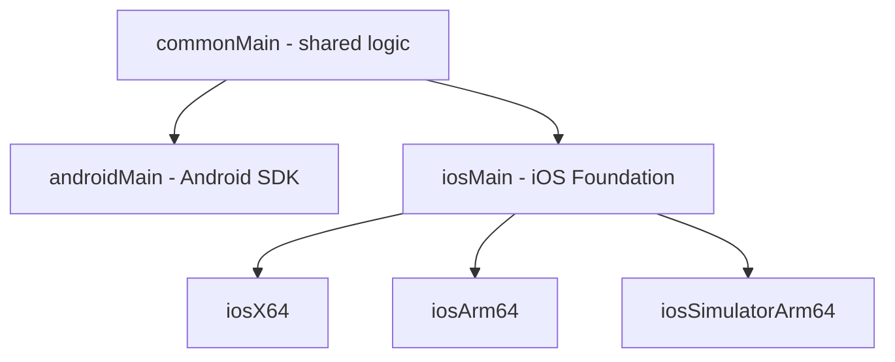
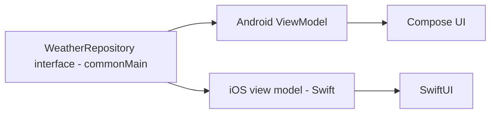

# Lecture 1 — Kotlin Multiplatform: the shared core

> "KMP's bet is the opposite of the one that burned the last generation of cross-platform tools. They shared the UI and fought the platform forever. KMP shares the business logic — the part that genuinely is the same everywhere — and lets each platform keep its own native skin."

This is the lecture that turns "cross-platform" from a scary word into a disciplined module strategy. We start with what KMP shares and — more importantly — what it deliberately does *not*, then the source-set model that makes it work, then `expect`/`actual` for the platform-specific seams, then the KMP-friendly library constraint that quietly governs everything, and finally the shape of a real shared core and an honest look at Compose Multiplatform. By the end you can draw the share/don't-share line on a real app and set up a `:shared-core` module that compiles for two platforms.

The frame for the whole week is one sentence: **share the business layer, not the UI layer — and prove the shared code compiles for every target, because "multiplatform" that only compiles for one platform is a single-platform module in a costume.** Lecture 2 takes you to the wrist; this lecture makes your core portable.

---

## 1. The bet KMP makes

Cross-platform development has a graveyard of tools that promised "write once, run everywhere" and delivered "write once, debug everywhere." React Native and Flutter share the *UI* — one widget tree rendered on both platforms — and the cost is the platform-channel ceiling: every time you need something native (a specific permission flow, a platform widget, real accessibility), you drop down to a bridge, and the bridge is where the pain lives. Some of you in this cohort came to Crunch Droid *because* you hit that ceiling.

Kotlin Multiplatform makes a deliberately narrower, more durable bet:

> **Share the code that is genuinely platform-agnostic — the business layer — and let each platform render its own native UI.**

Think about a weather app. What's actually the same on Android and iOS?

- The `WeatherForecast` domain model — a temperature, a condition, a timestamp. Identical.
- The networking — fetch the forecast from an API, parse the JSON, handle the error cases. Identical logic.
- The business rules — "show a rain alert if precipitation probability > 60%," unit conversion, the cache policy. Identical.

And what's genuinely *different*?

- The UI — Compose on Android, SwiftUI on iOS — because each platform has its own conventions, its own navigation idioms, its own accessibility model, its own input. A native UI *feels* native; a shared UI fights to.
- Platform integrations — push notifications, biometrics, secure storage, deep links — which have the same *purpose* on each platform but completely different *APIs*.
- Anything the OS owns — the back gesture, the share sheet, the permission dialogs — which look and behave by each platform's rules.

The line between the two lists is the line KMP asks you to draw, and it's not always obvious. A good heuristic: **if the code makes a decision (a business rule, a calculation, a parse, a state transition), it's probably shareable; if the code touches the screen, the hardware, or an OS service, it's probably platform-specific.** Decisions are universal; interactions are local. When in doubt, ask "would the answer be identical on a phone, a watch, and an iPhone?" — if yes, share it; if it depends on the device, don't. That question, applied honestly per module, is most of the skill this week builds.

KMP shares the first list and leaves the second to each platform. The insight is that **the business layer is where the real logic and the real bugs live, and the UI is where the platform conventions live.** Sharing the logic eliminates duplicate bugs (fix the forecast-parsing edge case once, not twice) without paying the bridge tax, because there's no bridge — the shared code compiles to native code on each platform.

Notice the words "compiles to native code." This is the technical difference that makes KMP's bet work where others' didn't. React Native ships a JavaScript engine and bridges to native widgets at runtime — the bridge is a serialization boundary you pay for on every interaction. KMP has no runtime bridge: `commonMain` is compiled *ahead of time* by the Kotlin compiler to JVM bytecode for Android and to native machine code (via LLVM, "Kotlin/Native") for iOS. By the time the app runs, there is no "shared layer" as a separate runtime thing — there's just native code on each platform that happens to have come from the same source. That's why a KMP shared core has no performance penalty versus hand-writing the same logic twice: it *is* the same compiled logic, authored once. The sharing happens at build time, not run time, and that's the whole trick.

## 2. The source-set model

A KMP module is a normal Gradle module with a different structure: instead of one `src/main`, it has multiple **source sets**, one shared and one per platform:

- **`commonMain`** — the shared code. Compiles for *every* target. May only use multiplatform-compatible APIs (this is the central constraint, §4).
- **`androidMain`** — Android-specific code. Compiles for the Android target only; may use the Android SDK and JVM APIs.
- **`iosMain`** — iOS-specific code. Compiles for the iOS targets; may use iOS/Foundation APIs via Kotlin/Native interop.
- **`commonTest`**, **`androidUnitTest`**, **`iosTest`** — the corresponding test source sets.

The hierarchy matters: `commonMain` is the *parent*; `androidMain` and `iosMain` *extend* it. Code in `androidMain` can see everything in `commonMain` (and add Android specifics); `commonMain` cannot see anything in `androidMain` (it has to compile for iOS too, where Android code doesn't exist). This is enforced by the compiler — try to use a JVM-only class in `commonMain` and the iOS compile fails. That failure is the discipline working.

Picture the source-set tree as a diamond, because it explains both the "see down but not up" rule and where shared-but-not-fully-common code lives:

```
                 commonMain
                /          \
         androidMain      iosMain
                              |
            (iosX64, iosArm64, iosSimulatorArm64
             share an "iosMain" intermediate set)
```

`commonMain` is at the top: its code must compile for *every* leaf, so it's the most constrained (multiplatform libraries only). Each platform set below it is *less* constrained (it can use that platform's full API) but reaches *fewer* targets. The intermediate `iosMain` set is a nice detail: the three iOS targets (Intel simulator, real device, Apple-Silicon simulator) share almost all their code, so `iosMain` holds the iOS-common code once and the three leaf targets inherit it. You rarely write target-specific code below `iosMain`; the intermediate set is where "iOS, all variants" code lives. The mental rule: **put code as high in the diamond as it will compile.** Common if it can be; platform-intermediate if it needs that platform's API; leaf-specific almost never.


*The source-set diamond: commonMain sits above every platform-specific set, and code lives as high as it will compile.*

A practical consequence for *testing*: `commonTest` runs on every target, so a test you write there runs on the JVM *and* on iOS — proving your shared logic behaves identically on both. That's a stronger guarantee than a JVM-only unit test, and it's free: write the forecast-parsing test once in `commonTest` and the iOS test run confirms Kotlin/Native didn't change the behavior.

The `build.gradle.kts` declares the targets and the source-set dependencies:

```kotlin
plugins {
    kotlin("multiplatform")
    kotlin("plugin.serialization")
}

kotlin {
    androidTarget()                       // the Android target
    iosX64()                              // iOS simulator on Intel Macs
    iosArm64()                            // real iOS devices
    iosSimulatorArm64()                   // iOS simulator on Apple Silicon

    sourceSets {
        commonMain.dependencies {
            implementation("io.ktor:ktor-client-core:3.0.1")
            implementation("org.jetbrains.kotlinx:kotlinx-serialization-json:1.7.3")
            implementation("org.jetbrains.kotlinx:kotlinx-coroutines-core:1.9.0")
            implementation("org.jetbrains.kotlinx:kotlinx-datetime:0.6.1")
        }
        androidMain.dependencies {
            implementation("io.ktor:ktor-client-okhttp:3.0.1")   // Ktor's Android engine
        }
        iosMain.dependencies {
            implementation("io.ktor:ktor-client-darwin:3.0.1")   // Ktor's iOS engine
        }
        commonTest.dependencies {
            implementation(kotlin("test"))
            implementation("org.jetbrains.kotlinx:kotlinx-coroutines-test:1.9.0")
        }
    }
}
```

Notice the pattern with Ktor: the *core* (the API, the logic) is in `commonMain`, but the HTTP *engine* (the thing that actually opens sockets) is platform-specific — `ktor-client-okhttp` on Android, `ktor-client-darwin` on iOS. The common code talks to a common `HttpClient` interface; each platform plugs in its engine. This engine pattern is how a lot of KMP libraries bridge to platform internals while keeping the API shared.

## 3. `expect` / `actual`: the platform seam

Most code in `commonMain` is fully shared — a `data class`, a parsing function, a coroutine. But occasionally you need something that's *common in shape but platform-specific in implementation*: generating a UUID, getting the current time zone, accessing secure storage. These don't exist in `commonMain` (no `java.util.UUID` on iOS), but they exist on *both* platforms in different forms. The bridge is `expect`/`actual`.

You **declare** the common API in `commonMain` with `expect`:

```kotlin
// commonMain — the contract. No implementation; just the shape.
expect fun randomUuid(): String

expect fun currentPlatformName(): String
```

And you **provide** the implementation per platform with `actual`:

```kotlin
// androidMain
actual fun randomUuid(): String = java.util.UUID.randomUUID().toString()
actual fun currentPlatformName(): String = "Android ${android.os.Build.VERSION.SDK_INT}"
```

```kotlin
// iosMain
import platform.Foundation.NSUUID
import platform.UIKit.UIDevice

actual fun randomUuid(): String = NSUUID().UUIDString()
actual fun currentPlatformName(): String =
    UIDevice.currentDevice.systemName() + " " + UIDevice.currentDevice.systemVersion
```

Now `commonMain` code calls `randomUuid()` and gets the right implementation on each platform, resolved at compile time. You can `expect`/`actual` functions, classes, properties, and even type aliases (a common pattern: `expect class PlatformContext` that's an `Android Context` on one side and `Unit` on the other).

The discipline: `expect`/`actual` is for *genuine* platform seams, not a way to paper over bad design. If you find yourself `expect`/`actual`-ing your whole business logic, the logic isn't actually shared — rethink the boundary. The good uses are small and obvious: UUIDs, time zones, secure storage, the platform name, a logging sink. The bad use is "I couldn't figure out how to share this, so I split it" — which is a single-platform module pretending.

### `expect class` and the interface alternative

For a stateful platform concern — secure key-value storage, say — you have two idioms, and the choice is worth understanding:

```kotlin
// Idiom A: expect class. The common code uses a concrete type whose body is per-platform.
// commonMain
expect class SecureStore() {
    fun put(key: String, value: String)
    fun get(key: String): String?
}
// androidMain — backed by EncryptedSharedPreferences
actual class SecureStore actual constructor() { /* Android impl */ }
// iosMain — backed by the iOS Keychain
actual class SecureStore actual constructor() { /* iOS impl */ }
```

```kotlin
// Idiom B: a common interface + a platform factory. Often cleaner and more testable.
// commonMain
interface SecureStore {
    fun put(key: String, value: String)
    fun get(key: String): String?
}
expect fun createSecureStore(): SecureStore     // only the FACTORY is expect/actual
```

Idiom B is usually preferable: the common code depends on an *interface* (so tests can supply a fake `SecureStore`), and only the factory crosses the platform seam. `expect class` ties the common code to a concrete type, which is harder to fake in `commonTest`. The general lesson mirrors Week 17's fakes-vs-mocks thinking: prefer an interface you can substitute over a concrete type you can't. Reach for `expect class` when the platform type genuinely has no common interface worth defining; reach for the interface-plus-factory pattern otherwise.

## 4. The KMP-friendly library constraint

Here is the rule that quietly governs everything in `commonMain`: **it may only depend on multiplatform libraries.** A library written for the JVM only (Retrofit, Gson, `java.time`, anything in `java.*`) does not exist on the iOS target, so the moment `commonMain` touches it, the iOS compile breaks. This forces a specific set of library choices, and learning the swaps is half of becoming KMP-fluent:

| You used (Android-only, Weeks 1–18) | You use now (multiplatform) |
|---|---|
| Retrofit | **Ktor Client** — multiplatform HTTP |
| Gson / Moshi | **kotlinx-serialization** — multiplatform JSON |
| `java.time` (LocalDate, Instant) | **kotlinx-datetime** — multiplatform date/time |
| `java.util.UUID` | `expect`/`actual` or a KMP UUID library |
| JVM `Dispatchers` quirks | **kotlinx-coroutines** — already multiplatform |
| Room (JVM/Android) | SQLDelight (multiplatform) — *if* you share persistence |

Most of these you already know — kotlinx-serialization and kotlinx-coroutines are the *same* libraries you've used since Weeks 4–5 and 15, and they happen to be multiplatform. The new ones are **Ktor** (in place of Retrofit) and **kotlinx-datetime** (in place of `java.time`). Ktor's client is a coroutine-based, content-negotiating HTTP client that compiles for every target; you'll meet it properly in the shared repository below.

The mental model: when you're writing `commonMain`, a JVM-only API is simply *not on the menu*. The IDE and the compiler enforce it, and the constraint is a feature — it keeps your shared code honestly portable instead of secretly Android-only.

### The gotchas that trip everyone once

A few KMP surprises worth meeting before they bite:

- **`System.currentTimeMillis()` isn't common.** It's JVM-only. Use `kotlinx.datetime.Clock.System.now()` for the current instant in `commonMain`. The same goes for `Math.*` (use Kotlin's `kotlin.math.*`), `String.format` (build strings differently), and anything in `java.*`.
- **Resources are platform-specific.** There's no shared "load a string resource" in `commonMain` — Android resources and iOS asset catalogs are different worlds. Keep user-facing strings in the platform UI, or pass them in; the shared core deals in keys and data, not localized display text.
- **Threading models differ.** The JVM and Kotlin/Native have different memory/threading rules historically (Native's strict model has relaxed in newer Kotlin, but coroutines dispatchers and main-thread assumptions still differ). Lean on `kotlinx-coroutines` and don't assume a `Dispatchers.Main` exists the same way everywhere — provide dispatchers via the constructor (the same testability pattern from Week 17).
- **A dependency must declare KMP targets.** Even a Kotlin library is only usable in `commonMain` if it *published* multiplatform artifacts for your targets. A library that's "Kotlin" but JVM-only-published won't resolve for iOS. Check the artifact, not just the language.

None of these is hard; each is a once-per-developer "oh, that's JVM-only" moment. The compiler's iOS target is your guard — it surfaces every one of these as a compile error in `commonMain` long before a user hits it.

## 5. The shared-core architecture

Put it together into the shape you'll build this week: a `:shared-core` module exposing a typed domain model, a Ktor-backed repository, and serialization — all in `commonMain`.

The domain model (a serializable `data class`, in `commonMain`):

```kotlin
import kotlinx.serialization.Serializable
import kotlinx.datetime.Instant

@Serializable
data class WeatherForecast(
    val location: String,
    val temperatureCelsius: Double,
    val condition: Condition,
    val observedAt: Instant            // kotlinx-datetime, not java.time
)

@Serializable
enum class Condition { CLEAR, CLOUDY, RAIN, SNOW }
```

The repository (Ktor + the typed `NetworkResult` from Week 15, in `commonMain`):

```kotlin
import io.ktor.client.HttpClient
import io.ktor.client.call.body
import io.ktor.client.request.get
import io.ktor.client.request.parameter
import kotlinx.coroutines.flow.Flow
import kotlinx.coroutines.flow.flow

sealed interface NetworkResult<out T> {
    data class Success<T>(val data: T) : NetworkResult<T>
    data class Failure(val message: String) : NetworkResult<Nothing>
}

interface WeatherRepository {
    fun forecast(location: String): Flow<NetworkResult<WeatherForecast>>
}

class KtorWeatherRepository(private val client: HttpClient) : WeatherRepository {
    override fun forecast(location: String): Flow<NetworkResult<WeatherForecast>> = flow {
        emit(
            try {
                val forecast: WeatherForecast = client
                    .get("https://api.example.com/forecast") { parameter("q", location) }
                    .body()
                NetworkResult.Success(forecast)
            } catch (e: Exception) {
                NetworkResult.Failure(e.message ?: "Network error")
            }
        )
    }
}
```

The `HttpClient` is constructed per platform (it needs the platform engine), so you provide it via a small factory — often an `expect`/`actual` or a platform-provided dependency:

```kotlin
// commonMain
import io.ktor.client.HttpClient
import io.ktor.client.plugins.contentnegotiation.ContentNegotiation
import io.ktor.serialization.kotlinx.json.json

fun createHttpClient(engineClient: HttpClient): HttpClient = engineClient.config {
    install(ContentNegotiation) { json() }     // wire JSON <-> our @Serializable types
}
```

The Android app then consumes `WeatherRepository` — a `commonMain` interface — through its `ViewModel`, mapping `WeatherForecast` to a UI type at the boundary (the Now-In-Android discipline from Week 12, now across the module boundary). The iOS app would consume the *same* `WeatherRepository` from Swift. One core, two consumers, zero duplicated logic.


*One shared repository interface, consumed by two native view models and rendered by two native UIs.*

## 6. Consuming the shared core from Android

On the Android side, nothing exotic: you depend on `:shared-core` and inject the repository into a `ViewModel`, exactly as if it were a local module:

```kotlin
// androidApp — a normal Hilt ViewModel consuming the shared interface.
class ForecastViewModel(private val repository: WeatherRepository) : ViewModel() {
    val uiState: StateFlow<ForecastUiState> = repository.forecast("Lisbon")
        .map { result ->
            when (result) {
                is NetworkResult.Success -> ForecastUiState.Content(result.data.toUiModel())
                is NetworkResult.Failure -> ForecastUiState.Error(result.message)
            }
        }
        .stateIn(viewModelScope, SharingStarted.WhileSubscribed(5_000), ForecastUiState.Loading)
}

// Map the SHARED domain type to a UI type AT THE BOUNDARY — the same discipline as Week 12,
// now keeping the shared core free of any Android UI concern.
private fun WeatherForecast.toUiModel() = ForecastUi(
    title = location,
    temperature = "${temperatureCelsius.roundToInt()}°C",
    icon = condition.toIconRes()
)
```

The key architectural point: the **shared core knows nothing about the UI.** It exposes domain types and a repository interface; the Android UI maps those to its own `ForecastUi` and Compose state, and the iOS UI would map them to its own Swift view model. The boundary is the same one you drew in Week 12 between domain and UI — KMP just makes that boundary also the boundary between shared and platform-specific.

A subtle but important question: **where does the `ViewModel` live — shared or platform?** There are two schools. The conservative, widely-deployed one (and this week's) keeps the `ViewModel` *platform-specific* — an Android Jetpack `ViewModel` on Android, an `ObservableObject` on iOS — each consuming the shared repository. The more aggressive school shares a presentation layer too (a KMP "shared ViewModel" exposing a `StateFlow<UiState>` that both platforms observe). The shared-ViewModel approach saves more code but couples the shared module to a UI-state shape and needs the Flow-to-Swift bridging from §6's interop note. For a course-and-capstone context, keep the `ViewModel` on the platform side: the repository and domain are shared, the presentation is native. It's the clearest boundary, the easiest to test, and the one that keeps the "share the business layer, not the UI" rule crisp — a `ViewModel` is arguably already half UI.

### How iOS actually consumes the shared core

You won't build the Swift side this week, but knowing *how* it connects makes the architecture concrete. The KMP build compiles `commonMain` + `iosMain` into a **framework** — a binary Apple's toolchain understands — which the iOS app imports like any other framework. Kotlin types appear in Swift with bridged names: a `WeatherRepository` interface becomes a Swift protocol, a `data class` becomes a Swift class, an `enum` becomes a Swift enum. The iOS view model calls `repository.forecast("Lisbon")` in Swift, the same call the Android `ViewModel` makes in Kotlin, and gets the same logic.

Two interop seams are worth knowing exist (Week-20-and-beyond territory, but they shape what you put in the shared API):

- **Suspend functions and Flows** cross the boundary with help. A Kotlin `suspend fun` is exposed to Swift as a function taking a completion handler (or via async/await with recent Kotlin); a `Flow` needs a small wrapper (libraries like SKIE or KMP-NativeCoroutines generate Swift-friendly `AsyncSequence`s). So a shared API that returns `Flow<NetworkResult<T>>` is consumable from Swift, just with a thin adapter on the iOS side.
- **`expect`/`actual` with platform types.** Your `iosMain` actuals can call Foundation/UIKit directly (you saw `NSUUID`, `UIDevice`), because `iosMain` compiles against the iOS SDK. That's the same mechanism the Android actuals use for the Android SDK — each platform set sees its own platform's API.

The design implication for *this* week: keep the shared API in terms that bridge cleanly — domain `data class`es, interfaces, `Flow`s, sealed results. Avoid leaking Android-only types into the shared interface (a `Context`, a `LiveData`), because those don't bridge to Swift and would force the iOS side into ugly workarounds. A clean, platform-neutral shared API is one that *both* a Compose `ViewModel` and a SwiftUI view model can consume without contortion — which is exactly the Week 12 "domain knows nothing about UI" discipline, now load-bearing across two languages.

## 7. Compose Multiplatform — the honest overview

"But wait," someone always asks, "can't I share the UI too with Compose Multiplatform?" **Compose Multiplatform** is JetBrains' project to compile Compose UI for Android, desktop, iOS, and web — the same `@Composable` functions rendering everywhere. It's real, it's progressing fast, and on **Android and desktop** it's solidly production-ready. On **iOS** it has reached stable, and teams ship it — but you should form an *honest* judgment rather than a hype-driven one:

- **When shared Compose UI makes sense:** internal tools, apps where pixel-identical UI across platforms is a *feature* not a liability, teams that are all-Kotlin and don't want to maintain SwiftUI, and desktop+Android sharing (very mature).
- **When native-UI-per-platform is still the safer bet:** consumer apps where iOS users expect *iOS-native* feel and behavior, apps that lean heavily on platform-specific UI capabilities, and teams with iOS engineers who'd rather own SwiftUI. The platform-channel-ceiling lesson still partly applies — shared UI trades native fidelity for shared code, and that trade isn't always worth it.

**This week's architecture is the conservative, widely-deployed one:** share the *business* layer with KMP, write *native* UI per platform (Compose on Android). That's what Now-In-Android-style production apps do today and what the capstone expects. Compose Multiplatform is a forward-looking note — know it exists, know it's good and getting better, and reach for it deliberately when the trade favors it, not reflexively because "share everything" sounds efficient. The whole point of KMP's bet is that "share everything" is exactly the mistake the last generation made.

One more nuance, because it's a fair counter-question: "isn't Wear OS just Android, so isn't *that* UI shareable with the phone?" It's the same *platform* (both Android, both Compose), but it is emphatically *not* the same UI — a watch's round, glanceable, tiny screen demands a different layout, different components (`ScalingLazyColumn`, not `LazyColumn`), and a different interaction model. So even *within* Android, you don't share the phone UI to the wrist — you share the *business* core (the `WeatherForecast` model and repository) and write a Wear-native UI on top. That's lecture 2's whole point, and it's the same discipline as the Android/iOS split, just one platform smaller: the core travels, the UI is built fresh for the surface it lives on. Share-the-core, build-the-skin holds across iOS, the phone, *and* the wrist.

## 8. Recap

KMP is a module strategy with a sharp discipline, and you now have it:

1. **Share the business layer, not the UI.** The logic is the same everywhere and is where the bugs live; the UI is where the platform conventions live. KMP shares the first and lets each platform keep the second — the opposite of the bet that burned React Native/Flutter.
2. **The source-set model.** `commonMain` (shared, compiles everywhere), `androidMain`/`iosMain` (platform-specific), with `commonMain` as the parent that can't see platform code. The compiler enforces the boundary.
3. **`expect`/`actual` bridges genuine platform seams.** Declare the shape in `commonMain`, implement per platform — for UUIDs, time zones, secure storage, the platform name. Not for papering over bad design.
4. **`commonMain` may only use multiplatform libraries.** Ktor (not Retrofit), kotlinx-serialization, kotlinx-coroutines, kotlinx-datetime (not `java.time`). A JVM-only API in `commonMain` breaks the iOS compile — and that's the discipline working.
5. **The shared core knows nothing about the UI.** It exposes domain types and a repository interface; each platform's UI maps those to its own view models — the Week 12 boundary, now spanning two platforms.
6. **Prove portability by compiling every target.** "Multiplatform" that only compiles for Android is a single-platform module in a costume. Compile the iOS target (even if you can't run it) and write a `commonTest` that runs on both — the green iOS compile is the proof, and the compiler is the enforcer.

The deeper takeaway connects to everything you've built: the share-the-core discipline is the *same boundary discipline* you've practiced all course — domain vs. UI (Week 12), test doubles vs. real (Week 17), the seam between what's stable and what changes. KMP just raises the stakes by making that boundary span two languages and two runtimes, where a sloppy line doesn't merely make the code harder to maintain — it fails to compile. The constraint feels strict at first and becomes a relief: the compiler tells you, immediately, every time you accidentally reach across the line. Lean on it.

Before you move on, internalize the one-line test that does most of the work: *would the answer be identical on every device?* If yes, it's shared business logic; if it depends on the screen, the hardware, or an OS service, it's platform-specific. Apply it per module and the share/don't-share line draws itself.

Lecture 2 takes you to your second form factor — Compose for Wear OS, where the same `WeatherForecast` model you just made portable renders on a watch. The exercises drill the share/don't-share decision and an `expect`/`actual` pair; the challenge builds a `:shared-core` that compiles for Android *and* iOS with a shared test; the mini-project ships the whole core plus a Wear screen. Make your core travel — and prove it compiles for every platform it claims.
