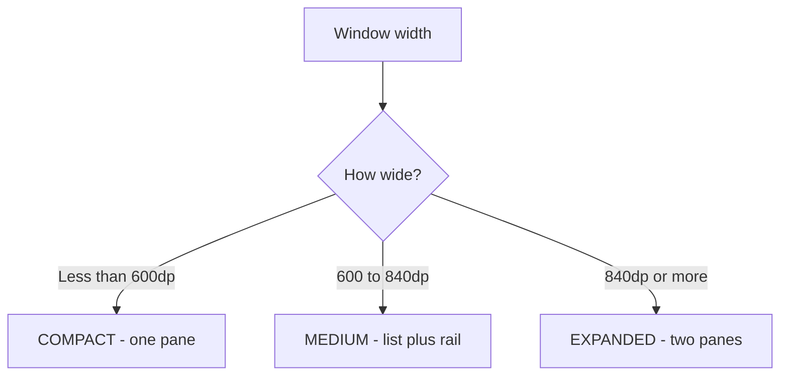
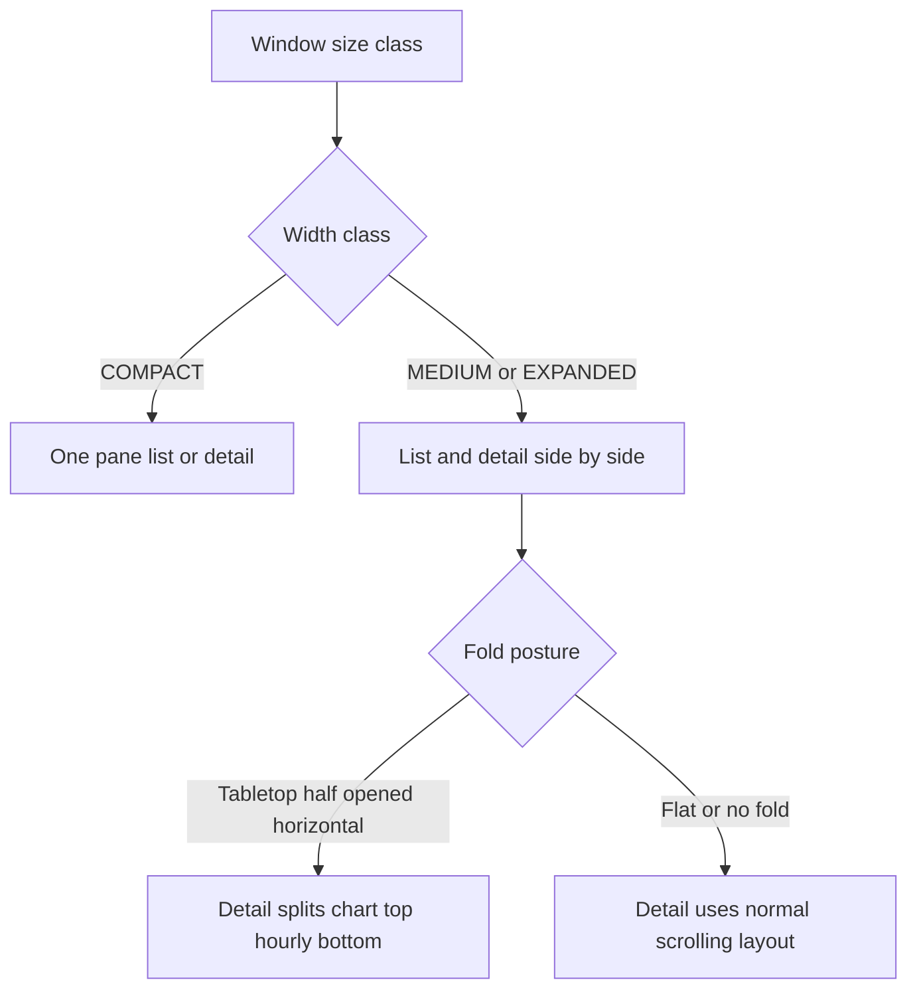

# Lecture 1 — Adaptive layouts: window size classes and foldables

> "Stop asking the device what it is. Ask the window how much space you have, and lay out for that."

This is the lecture that ends the `if (isTablet)` era of your Android career. For most of the platform's history, "responsive" meant a handful of resource qualifiers (`layout-sw600dp`) and a boolean you computed from screen width. That model breaks the moment the device stops being one fixed size: a foldable that is a phone closed and a tablet open, a phone in split-screen sharing the display with another app, a free-form window on a Chromebook you can drag to any dimension. The window your app lives in is no longer the device. This lecture teaches you to treat **available window space as an observable input to your composition** and to build a single layout that reflows itself — across phones, tablets, and foldables — without a single device check.

We build it bottom-up: the size-class abstraction, then the adaptive scaffolds that consume it, then fold state as a second, finer input, then one worked layout that uses both.

---

## 1. The shift: device size → window size

Here is the Android adaptive code you are leaving behind:

```kotlin
// The old world. Compute a boolean from the screen, branch the whole UI on it.
val isTablet = resources.configuration.smallestScreenWidthDp >= 600
if (isTablet) {
    showTwoPaneLayout()
} else {
    showSinglePaneLayout()
}
```

Three things are wrong with this, and they are not stylistic — they are *bugs*:

1. **It reads the device, not the window.** On a tablet in 50/50 split-screen, your app gets half the display, but `smallestScreenWidthDp` may still report the full device width. You render a two-pane layout into a phone-width window and everything is cramped.
2. **It is computed once.** A foldable that unfolds mid-session changes the available width *while your app is running*. A one-time boolean never updates; your layout is frozen in whatever posture it launched in.
3. **It encodes a guess about intent.** "Tablet means two panes" is a design decision smuggled into a device check. The real decision is "*if I have enough width*, show two panes" — and width can come from a tablet, an unfolded foldable, a desktop window, or a phone rotated landscape.

The modern model replaces the device boolean with a **window size class** — a coarse bucket of *currently available* window space — and makes it *observable*, so it updates live as the window changes. Your layout becomes `UI = f(windowState)`, the same `UI = f(state)` discipline from Week 7, with the window as part of the state.

---

## 2. Window size classes — the breakpoints

A `WindowSizeClass` bins the available window into coarse buckets along two axes. The width buckets (the ones you will use most):

- **`COMPACT`** — width `< 600.dp`. A phone in portrait, a small free-form window. One pane.
- **`MEDIUM`** — width `600.dp ..< 840.dp`. A phone in landscape, a small tablet in portrait, a half-unfolded foldable, a split-screen pane. A list-detail or a navigation rail starts to make sense.
- **`EXPANDED`** — width `≥ 840.dp`. A tablet in landscape, an unfolded large foldable, a desktop window. Two panes comfortably.

There is a parallel set of **height** classes (`COMPACT < 480dp`, `MEDIUM 480–900dp`, `EXPANDED ≥ 900dp`) that you use less often — mostly to decide whether a bottom bar fits or whether a dialog should be full-screen.

The breakpoints are deliberately *coarse*. The whole point is to stop you pixel-tuning for every device and instead design three layouts — compact, medium, expanded — that each cover a band of real devices. You read them through the adaptive info:

```kotlin
import androidx.compose.material3.adaptive.currentWindowAdaptiveInfo
import androidx.compose.material3.windowsizeclass.WindowWidthSizeClass

@Composable
fun MyApp() {
    val windowSizeClass = currentWindowAdaptiveInfo().windowSizeClass
    val widthClass = windowSizeClass.windowWidthSizeClass

    when (widthClass) {
        WindowWidthSizeClass.COMPACT  -> SinglePaneScreen()
        WindowWidthSizeClass.MEDIUM   -> SinglePaneScreen(navigationRail = true)
        WindowWidthSizeClass.EXPANDED -> TwoPaneScreen()
        else                          -> SinglePaneScreen()
    }
}
```

`currentWindowAdaptiveInfo()` is a composable that reads the current window metrics and **recomposes when they change** — that is the magic. When a foldable unfolds and the window jumps from `MEDIUM` to `EXPANDED`, this composable recomposes, the `when` re-evaluates, and the UI reflows to two panes. No lifecycle callback, no manual remeasure. It is the declarative model applied to window space.

> The mental model: a window size class is a **breakpoint based on currently available window space**, read reactively, not a device identity computed once. Branch on the class, never on `isTablet`.


*The three width buckets and the layout each one implies.*

---

## 3. The adaptive scaffolds — don't hand-roll the reflow

You *could* write the `when` above and hand-build a two-pane `Row` for `EXPANDED`. For the common case — a list that opens a detail — the `material3-adaptive` library gives you a scaffold that does the reflow *and* the navigation *and* the back behavior for you: **`ListDetailPaneScaffold`** and its navigable wrapper **`NavigableListDetailPaneScaffold`**.

The mental model is three logical panes — **list**, **detail**, and an optional **extra** — and the scaffold decides how many to show based on the window class:

- **`COMPACT`** — show *one* pane at a time. Tapping a list item navigates to the detail pane (which fills the window); back returns to the list.
- **`MEDIUM` / `EXPANDED`** — show list *and* detail side by side. Tapping a list item updates the detail pane in place; back is handled within the two-pane view.

Here is the navigable version, which manages the pane navigator and the predictive-back integration for you:

```kotlin
import androidx.compose.material3.adaptive.layout.AnimatedPane
import androidx.compose.material3.adaptive.layout.ListDetailPaneScaffoldRole
import androidx.compose.material3.adaptive.navigation.NavigableListDetailPaneScaffold
import androidx.compose.material3.adaptive.navigation.rememberListDetailPaneScaffoldNavigator

@Composable
fun WeatherListDetail(cities: List<City>) {
    // The navigator holds which pane is active and which item is selected.
    val navigator = rememberListDetailPaneScaffoldNavigator<String>()  // payload = city id

    NavigableListDetailPaneScaffold(
        navigator = navigator,
        listPane = {
            AnimatedPane {
                CityList(
                    cities = cities,
                    onCityClick = { id ->
                        // navigateTo the detail pane with this city's id as the payload.
                        navigator.navigateTo(ListDetailPaneScaffoldRole.Detail, id)
                    }
                )
            }
        },
        detailPane = {
            AnimatedPane {
                // currentDestination?.contentKey is the payload we passed above.
                val cityId = navigator.currentDestination?.contentKey
                if (cityId != null) CityDetail(cityId) else EmptyDetailPlaceholder()
            }
        }
    )
}
```

What you get for free:

- **The reflow.** On a phone the scaffold shows one pane; on a tablet/unfolded foldable it shows two. You never wrote a `when (widthClass)`; the scaffold read it.
- **The navigation.** `navigator.navigateTo(...)` does the right thing per form factor — a screen transition on compact, an in-place detail swap on expanded.
- **The back behavior.** `NavigableListDetailPaneScaffold` wires predictive back: on compact, back pops detail → list; on expanded, back may do nothing (both panes already visible) or pop the navigator's history. This is the single most-commonly-botched part of a hand-rolled adaptive layout, and the scaffold gets it right.

There are sibling scaffolds for other shapes: **`SupportingPaneScaffold`** (a main pane with a supporting pane that tucks away on compact — think an article with a related-links sidebar), and the general **three-pane** model underneath both. Reach for the scaffold that matches your information architecture; only hand-roll when none fits.

### Why not just rotate resource qualifiers?

You may ask: didn't `layout-sw600dp` already do this? No. Resource qualifiers swap *whole layout files* at inflation time, in the `View` world, keyed off device configuration — they don't reflow live, they don't compose, and they don't integrate with predictive back. The adaptive scaffolds are the Compose-native, reactive, navigation-aware replacement. If you find yourself reaching for a qualifier in a Compose app, you want a window size class instead.

---

## 4. Fold state — the finer input

Window size classes tell you *how much* space you have. They do **not** tell you that the space has a **hinge running through it** — a physical fold that content should not straddle. For that you need a second, finer input: the **fold state**, read from `WindowInfoTracker`.

A foldable has *postures*. The two that matter:

- **Tabletop posture** — the device is half-opened (`HALF_OPENED`) with a *horizontal* hinge, sitting like a tiny laptop. Natural design: media/content in the top half, controls in the bottom half (think a video on top, scrubber on bottom).
- **Book posture** — half-opened with a *vertical* hinge, held like a book. Natural design: two-page content, one logical "page" per half.

And the flat states: fully open (`FLAT`, one big screen) or, on some devices, closed (the outer cover display, a separate, small window).

You observe fold state as a `Flow` from `WindowInfoTracker`:

```kotlin
import androidx.window.layout.FoldingFeature
import androidx.window.layout.WindowInfoTracker
import androidx.lifecycle.compose.collectAsStateWithLifecycle
import kotlinx.coroutines.flow.map

/** A small reusable holder for the current fold, derived from WindowLayoutInfo. */
data class FoldState(
    val isTabletop: Boolean,
    val isBook: Boolean,
    val hingeBounds: androidx.compose.ui.unit.IntRect?  // where the hinge is, in window pixels
)

@Composable
fun rememberFoldState(activity: android.app.Activity): FoldState {
    val tracker = remember { WindowInfoTracker.getOrCreate(activity) }
    val layoutInfo by remember(tracker) {
        tracker.windowLayoutInfo(activity)
    }.collectAsStateWithLifecycle(initialValue = null)

    val fold = layoutInfo?.displayFeatures
        ?.filterIsInstance<FoldingFeature>()
        ?.firstOrNull()

    return FoldState(
        // tabletop: half-opened, horizontal hinge, separating the window into top/bottom.
        isTabletop = fold?.state == FoldingFeature.State.HALF_OPENED &&
            fold.orientation == FoldingFeature.Orientation.HORIZONTAL,
        // book: half-opened, vertical hinge, separating left/right.
        isBook = fold?.state == FoldingFeature.State.HALF_OPENED &&
            fold.orientation == FoldingFeature.Orientation.VERTICAL,
        hingeBounds = fold?.takeIf { it.isSeparating }?.bounds?.let {
            androidx.compose.ui.unit.IntRect(it.left, it.top, it.right, it.bottom)
        }
    )
}
```

The key fields on `FoldingFeature`:

- **`state`** — `FLAT` (fully open) or `HALF_OPENED` (the posture states).
- **`orientation`** — `HORIZONTAL` (hinge runs left-to-right → tabletop) or `VERTICAL` (hinge runs top-to-bottom → book).
- **`isSeparating`** — `true` when the fold splits the window into two *logical* areas you should lay out around (half-opened always separates; a flat fold on a dual-screen device may too). When `false`, treat the window as one continuous surface.
- **`occlusionType`** — `FULL` when the hinge physically occludes pixels (a true gap you must not draw content into), or `NONE` when the display is continuous across the fold.
- **`bounds`** — the hinge's rectangle in window coordinates, so you can place content *above and below* (tabletop) or *left and right* (book) of it.

`collectAsStateWithLifecycle` is the correct collector here — it stops collecting when the app is in the background, so you are not tracking window changes for a UI nobody is looking at. (You learned this lifecycle-aware collection in the Flow weeks; here it is load-bearing for battery.)

---

## 5. Laying out around the hinge

Once you have the fold state, you reflow. The clean pattern: branch on posture, and in tabletop, split your content into a top region and a bottom region with the hinge between them.

```kotlin
@Composable
fun PlayerScreen(fold: FoldState) {
    if (fold.isTabletop) {
        // Tabletop: content in the top half, controls in the bottom half, hinge between.
        Column(Modifier.fillMaxSize()) {
            VideoSurface(Modifier.weight(1f))      // top half
            PlaybackControls(Modifier.weight(1f))  // bottom half
        }
    } else {
        // Flat (or non-fold device): the conventional single-surface layout.
        Box(Modifier.fillMaxSize()) {
            VideoSurface(Modifier.fillMaxSize())
            PlaybackControls(Modifier.align(Alignment.BottomCenter))
        }
    }
}
```

For pixel-perfect work — placing content to *exactly* dodge the hinge gap on a device with `occlusionType == FULL` — you use the `hingeBounds` rectangle to compute padding or a spacer of the hinge's height. For most apps the `weight(1f)` split above is enough, because the system already reports the two halves as the natural top/bottom regions.

The discipline: **fold state is an input you observe and reflow on, exactly like window size class — both are reactive, both update mid-session, and neither is a device check.** A foldable that opens from half to flat recomposes `rememberFoldState`, `isTabletop` flips to `false`, and `PlayerScreen` reflows from the split layout to the single surface, live, while the user watches.

---

## 6. Combining both inputs — one worked layout

In a real app you use *both* signals together: window size class for *how many panes*, fold state for *how to arrange within a pane*. Here is a list-detail screen that does both — two panes when the window is wide enough, and a hinge-aware split inside the detail pane when the device is in tabletop posture:

```kotlin
@Composable
fun AdaptiveWeatherScreen(activity: Activity, cities: List<City>) {
    val widthClass = currentWindowAdaptiveInfo().windowSizeClass.windowWidthSizeClass
    val fold = rememberFoldState(activity)
    val navigator = rememberListDetailPaneScaffoldNavigator<String>()

    NavigableListDetailPaneScaffold(
        navigator = navigator,
        listPane = {
            AnimatedPane {
                CityList(cities) { id ->
                    navigator.navigateTo(ListDetailPaneScaffoldRole.Detail, id)
                }
            }
        },
        detailPane = {
            AnimatedPane {
                val cityId = navigator.currentDestination?.contentKey
                if (cityId == null) {
                    EmptyDetailPlaceholder()
                } else if (fold.isTabletop) {
                    // Inside the detail pane, in tabletop posture: forecast chart on top,
                    // hourly breakdown on the bottom, hinge between.
                    Column(Modifier.fillMaxSize()) {
                        ForecastChart(cityId, Modifier.weight(1f))
                        HourlyBreakdown(cityId, Modifier.weight(1f))
                    }
                } else {
                    // Flat: the conventional scrolling detail.
                    CityDetail(cityId)
                }
            }
        }
    )

    // (widthClass is read by NavigableListDetailPaneScaffold internally to decide
    //  one-pane vs two-pane; we keep the local for logging/branching if needed.)
}
```

Trace the behavior across four states of one device:

1. **Phone, portrait (COMPACT, no fold).** One pane. The list fills the screen; tapping a city pushes the detail; back returns. Plain mobile.
2. **Foldable, folded (COMPACT, no separating fold).** Same as the phone — the cover display is a compact window.
3. **Foldable, unfolded flat (EXPANDED, FLAT).** Two panes side by side. List on the left, detail on the right, updating in place. The detail uses its conventional scrolling layout because the fold is `FLAT`.
4. **Foldable, half-opened tabletop (EXPANDED or MEDIUM, HALF_OPENED horizontal).** Two panes, *and* the detail pane splits into chart-on-top / hourly-on-bottom around the hinge.


*How width class and fold posture combine to pick the final layout.*

One composable. No `if (isTablet)`. Every transition is a recomposition driven by an observable window input. **That is the entire adaptive story:** read the window (size class) and the device geometry (fold state) as reactive inputs, branch your layout on them, and let recomposition reflow the UI live.

---

## 6b. The adaptive navigation surface — the *other* thing that reflows

Panes are not the only thing that adapts; the *navigation surface* should too. A bottom navigation bar is right on a compact phone, but on a wide window it wastes the bottom edge and the better idiom is a **navigation rail** (a slim vertical bar) or, on the widest windows, a **permanent navigation drawer**. Hand-rolling that `when (widthClass)` is exactly the kind of boilerplate the adaptive library removes, this time with **`NavigationSuiteScaffold`** (from `material3-adaptive-navigation-suite`):

```kotlin
import androidx.compose.material3.adaptive.navigationsuite.NavigationSuiteScaffold
import androidx.compose.material3.adaptive.navigationsuite.NavigationSuiteItem

@Composable
fun AppShell(selected: Destination, onSelect: (Destination) -> Unit, content: @Composable () -> Unit) {
    NavigationSuiteScaffold(
        navigationSuiteItems = {
            Destination.entries.forEach { dest ->
                item(
                    selected = dest == selected,
                    onClick = { onSelect(dest) },
                    icon = { Icon(dest.icon, contentDescription = dest.label) },
                    label = { Text(dest.label) }
                )
            }
        }
    ) {
        content()    // your screen; the suite picks bar / rail / drawer by window class
    }
}
```

`NavigationSuiteScaffold` reads the same `currentWindowAdaptiveInfo()` you saw in §2 and renders:

- a **bottom navigation bar** on `COMPACT`,
- a **navigation rail** on `MEDIUM`,
- a **permanent/expanded drawer** on `EXPANDED`.

You declare the *items* once — destination, icon, label, selected state — and the suite chooses the surface. The same reflow discipline as the panes: one declaration, many windows, driven reactively. In a real app you compose the two — `NavigationSuiteScaffold` for the top-level nav surface, a `ListDetailPaneScaffold` inside the content for the screen's panes — and *both* reflow independently on a window change. That composition is what a polished adaptive app looks like: nothing fixed to a device, everything keyed to available space.

> The reviewer's tell: if a tablet build shows a phone-sized bottom bar marooned at the bottom of a 1280dp window, the team hand-coded the nav surface and forgot the wide case. The navigation suite makes "bar on phone, rail on medium, drawer on expanded" the default, not an afterthought.

---

## 7. Testing adaptive layouts without a drawer full of devices

You do not need a Pixel Fold to build this. Two free tools cover almost everything:

- **The Resizable (Experimental) emulator.** One AVD that switches between phone / unfolded / tablet at runtime. As you toggle, watch your layout reflow — that *is* the window-size-class change firing. This is your primary harness.
- **The foldable emulator's virtual sensors.** A Pixel Fold AVD (or the resizable device) exposes a hinge-angle control under "Virtual sensors." Drag it to `HALF_OPENED` and watch `FoldingFeature.state` flip and your tabletop layout engage.

For automated coverage, **Compose UI tests** can set the window size by wrapping your content and asserting the right pane count renders, and **Paparazzi** (Week 17) can snapshot each size class. You will wire those into CI next week. For now, build with the resizable emulator open and *drag it* — the live reflow is the fastest feedback loop you have.

A practical checklist a reviewer applies to an adaptive screen:

- **No `isTablet` / no raw pixel-width branches.** Every layout decision branches on a `WindowWidthSizeClass` or a `FoldingFeature`, read reactively.
- **The size class is read via `currentWindowAdaptiveInfo()`**, so it recomposes on window change — not captured once into a `val` at startup.
- **Fold state uses `collectAsStateWithLifecycle`**, so tracking stops in the background.
- **Back behavior is correct on every form factor** — on compact, back pops detail→list; on expanded, back does the sane thing. (Use the navigable scaffold; don't hand-roll this.)
- **It reflows *live*.** Unfold the emulator mid-session and the layout updates without a restart. If it only adapts on launch, you captured the class once instead of reading it reactively.

---

## 8. Recap — the one-question habit

The reflex this lecture installs: on any layout decision, ask **"what window signal drives this, and am I reading it reactively?"**

- I need a different number of panes → window size class (`WindowWidthSizeClass`), via `currentWindowAdaptiveInfo()`.
- I need to dodge or exploit a hinge → fold state (`FoldingFeature`), via `WindowInfoTracker`, collected with lifecycle.
- It's a list that opens a detail → `NavigableListDetailPaneScaffold`, which reads the size class and handles the back behavior for me.
- It adapts on launch but not on unfold → I captured the signal once; read it reactively so recomposition reflows it.
- I wrote `if (isTablet)` → I encoded a guess about intent into a device check; rewrite it as "if I have *this much width*."

You now have both adaptive inputs and the scaffolds that consume them. In lecture 2 we change form factors entirely: the wrist. Wear OS *is* Compose, but the design constraints invert — round screens, three-second glances, a brutal battery budget, and three different surfaces (the app, the tile, the complication) each built with a *different* API. Bring the `UI = f(windowState)` discipline; we are about to apply it where the window is a 1.4-inch circle and the wrong API choice drains a battery.
