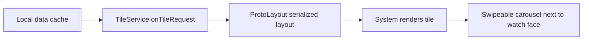
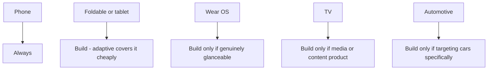

# Lecture 2 — Wear OS deep, and the TV / Automotive boundary

> "A watch app is not a phone app shrunk. It is three different surfaces — the app, the tile, the complication — each built with a different API, each measured in seconds of attention and milliamps of battery."

Lecture 1 kept you on the big glass: phones, tablets, foldables, all sharing the same Compose toolkit with window space as the variable. This lecture moves to the wrist, where the toolkit *looks* the same — `@Composable`, `Modifier`, recomposition — but the constraints invert hard enough that porting a phone screen is the canonical Wear OS mistake. Then it pulls back to the two form factors a 24-week course treats as overview, TV and Automotive, and teaches the most senior skill in this whole week: knowing what *not* to build.

We go: the design inversion first (so every API choice has a reason), then the three Wear surfaces (app, tile, complication), then ongoing activities, then TV and Automotive at overview depth, then the judgment call.

---

## 1. The design inversion — why Wear is not a small phone

Four constraints flip on the wrist, and every Wear API choice falls out of them:

1. **Glanceability over engagement.** A phone interaction is minutes; a watch interaction is *three seconds*. You are not building screens to dwell in; you are building a glance. This is why the **tile** (a glanceable card) and the **complication** (a single datum on the watch face) are first-class surfaces, often more important than the app itself.
2. **A round screen.** Most Wear devices are circular. Content near the edges falls off the curve, so lists must *scale and fade* items toward the top and bottom — which is why the list component is not `LazyColumn` but `TransformingLazyColumn` (Wear 4/5) / `ScalingLazyColumn` (older), and why centered, curved-edge layouts replace rectangular ones.
3. **Battery measured in a day, not a charge cycle.** A watch battery is tiny. An animation that is free on a phone is a measurable drain on a watch. Ambient mode (the always-on dimmed screen) means your UI sometimes must render in a low-power state. Every recomposition and every frame *costs* in a way it does not on a phone.
4. **System gestures own the edges.** The left-edge swipe is the system's swipe-to-dismiss (back). You cannot use a phone `NavHost` that also wants that edge — you use `SwipeDismissableNavHost`, which cooperates with the system gesture.

Hold these four and the rest of the lecture is consequences. The Wear team did not invent gratuitously different APIs; they made different APIs because the wrist is a different problem.

---

## 2. The Wear app — Compose, but Wear Material 3

Wear Compose ships its own Material library — `androidx.wear.compose.material3` — with components shaped for the watch. The scaffold is two-layer: an `AppScaffold` at the app level (owns the time text and the app-wide chrome) and a `ScreenScaffold` per screen (owns the scroll indicator and per-screen chrome).

```kotlin
import androidx.wear.compose.material3.AppScaffold
import androidx.wear.compose.material3.ScreenScaffold
import androidx.wear.compose.material3.Text
import androidx.wear.compose.material3.TimeText
import androidx.wear.compose.foundation.lazy.TransformingLazyColumn
import androidx.wear.compose.foundation.lazy.rememberTransformingLazyColumnState

@Composable
fun ForecastApp(forecasts: List<HourForecast>) {
    AppScaffold {                              // app-level chrome: TimeText, etc.
        val listState = rememberTransformingLazyColumnState()
        ScreenScaffold(scrollState = listState) {
            // The scaling list: items shrink and fade toward the curved top/bottom edges.
            TransformingLazyColumn(state = listState) {
                item { Text("Today") }         // header scales as it nears the edge
                items(forecasts, key = { it.hour }) { f ->
                    ForecastRow(f)
                }
            }
        }
    }
}
```

Three Wear-specific things in that small block:

- **`TransformingLazyColumn`** is the modern scaling list. As an item approaches the top or bottom of the round screen, the list *transforms* it — scaling it down and fading it — so the curved edge looks intentional instead of clipped. (On older code you will see `ScalingLazyColumn` doing the same job with a slightly different API; both exist, `TransformingLazyColumn` is current.) A plain `LazyColumn` on Wear renders items hard against the curved edge and looks broken — using it is a review-failing mistake.
- **`TimeText`** (provided by `AppScaffold`) draws the current time curved across the top of the screen. Watch users expect the time always visible; the scaffold gives it to you.
- **The scroll indicator** (provided by `ScreenScaffold` via the scroll state) is the curved position indicator on the right edge — the Wear equivalent of a scrollbar, shaped to the bezel.

Everything you know about recomposition and stability (Weeks 7–8) applies unchanged — and matters *more*, because every needless recomposition burns battery you cannot spare. The skippability discipline from Week 7 is not optional polish on Wear; it is power management.

### Rotary input — the crown and the bezel

Wear devices have a rotating input: a crown (like the Apple Watch's) or a physical bezel. Users scroll lists with it. You opt a scrollable into rotary input with `Modifier.rotaryScrollable`:

```kotlin
import androidx.wear.compose.foundation.rotary.rotaryScrollable
import androidx.wear.compose.foundation.rotary.RotaryScrollableDefaults

TransformingLazyColumn(
    state = listState,
    modifier = Modifier.rotaryScrollable(
        RotaryScrollableDefaults.behavior(scrollableState = listState),
        focusRequester = rememberActiveFocusRequester()
    )
) { /* items */ }
```

The rotary input is focus-based: the scrollable must hold focus for the crown to drive it. `rememberActiveFocusRequester()` (from Wear foundation) wires that up. Forgetting rotary support is a common port bug — the list scrolls by touch but ignores the crown, and on a watch the crown is the primary scroll input.

### Navigation — `SwipeDismissableNavHost`

Because the system owns the left-edge swipe (swipe-to-dismiss = back), Wear navigation uses a dedicated host that cooperates with it:

```kotlin
import androidx.wear.compose.navigation.SwipeDismissableNavHost
import androidx.wear.compose.navigation.rememberSwipeDismissableNavController
import androidx.wear.compose.navigation.composable

@Composable
fun ForecastNav() {
    val navController = rememberSwipeDismissableNavController()
    SwipeDismissableNavHost(navController, startDestination = "list") {
        composable("list") { ForecastListScreen(onOpen = { navController.navigate("detail/$it") }) }
        composable("detail/{hour}") { backStack ->
            ForecastDetailScreen(backStack.arguments?.getString("hour"))
        }
    }
}
```

Swiping from the left edge dismisses the current screen back to the previous one, exactly as the platform conditions watch users to expect. A phone `NavHost` here fights the system gesture and feels broken.

---

## 3. The tile — a serialized layout, not a composition

This is the single most important conceptual point in Wear development, and the one engineers coming from phone Compose get wrong: **a tile is not a `@Composable`.** A tile is a *glanceable card* the system shows in a swipeable carousel next to the watch face — the user reaches it without opening any app. Because the system renders tiles (in its own process, on its own schedule, even when your app is not running), you cannot hand it a live composition. You hand it a **serialized layout** built with the **Tiles + ProtoLayout** API, and the system renders that.


*A tile is a view of pre-fetched data, rendered by the system, not a live composition.*

A tile is a `TileService`. You implement two requests:

```kotlin
import androidx.wear.tiles.TileService
import androidx.wear.protolayout.material3.materialScope
import androidx.wear.protolayout.material3.primaryLayout
import androidx.wear.protolayout.material3.text
import androidx.wear.tiles.RequestBuilders
import androidx.wear.tiles.TileBuilders
import androidx.wear.protolayout.ResourceBuilders
import com.google.common.util.concurrent.ListenableFuture
import com.google.common.util.concurrent.Futures

private const val RESOURCES_VERSION = "1"     // bump when the image resources change

class ForecastTileService : TileService() {

    override fun onTileRequest(
        requestParams: RequestBuilders.TileRequest
    ): ListenableFuture<TileBuilders.Tile> {
        // Read CACHED data — NEVER a network call here. The tile must render instantly,
        // even with no connectivity, even when the app is not running.
        val forecast = ForecastCache.latest(this)   // a fast local read

        val layout = materialScope(this, requestParams.deviceConfiguration) {
            primaryLayout(
                mainSlot = {
                    text("${forecast.tempC}°  ${forecast.condition}".layoutString)
                }
            )
        }

        val tile = TileBuilders.Tile.Builder()
            .setResourcesVersion(RESOURCES_VERSION)
            .setFreshnessIntervalMillis(15 * 60 * 1000L)   // ask the system to refresh ~every 15 min
            .setTileTimeline(
                androidx.wear.protolayout.TimelineBuilders.Timeline.fromLayoutElement(layout)
            )
            .build()

        return Futures.immediateFuture(tile)
    }

    override fun onTileResourcesRequest(
        requestParams: RequestBuilders.ResourcesRequest
    ): ListenableFuture<ResourceBuilders.Resources> =
        Futures.immediateFuture(
            ResourceBuilders.Resources.Builder()
                .setVersion(RESOURCES_VERSION)   // MUST match the tile's resources version
                .build()
        )
}
```

Three things that define correct tile engineering:

- **Data must be cheap and cached.** `onTileRequest` may be called when your app is not running and the network is down. A tile that does a network call on render is a bug — it will render stale or blank. Populate a local cache (Room/DataStore, refreshed by your phone-side WorkManager sync) and have the tile read *that*. The tile is a *view* of pre-fetched data, never a fetch.
- **The freshness interval is a request, not a guarantee.** `setFreshnessIntervalMillis` asks the system to call `onTileRequest` again after the interval — the system batches and may defer it for battery. You can also push an immediate refresh from your app with `TileService.getUpdater(context).requestUpdate(ForecastTileService::class.java)` when fresh data arrives.
- **Resource versions must match and be bumped on change.** Images and other resources are versioned. The `Tile`'s `resourcesVersion` and the `Resources`' `version` must agree, and you bump the constant whenever the image set changes so the system re-requests resources. A mismatch shows stale or missing images.

The `protolayout-material3` `materialScope { primaryLayout { ... } }` builder gives you Material-styled tile primitives (`text`, buttons, `titleSlot`/`mainSlot`/`bottomSlot`) so your tile looks like a system tile without hand-laying-out ProtoLayout nodes. You are still building a *layout tree of data*, not a composition — there is no recomposition, no state, no side effects. It is render-once-per-request by design.

---

## 4. The complication — one datum, the right type

A **complication** is even smaller than a tile: it is a single piece of your data dropped into a *slot on the user's watch face* — the little temperature in the corner, the step count on the dial, the next-event time. The watch face owns the rendering; you supply the *data* in a typed shape the slot understands.

You implement a `ComplicationDataSourceService` and answer two questions: what does a preview look like (for the picker), and what is the live value.

```kotlin
import androidx.wear.watchface.complications.datasource.ComplicationDataSourceService
import androidx.wear.watchface.complications.datasource.ComplicationRequest
import androidx.wear.watchface.complications.data.ComplicationData
import androidx.wear.watchface.complications.data.ComplicationType
import androidx.wear.watchface.complications.data.ShortTextComplicationData
import androidx.wear.watchface.complications.data.PlainComplicationText

class TemperatureComplicationService : ComplicationDataSourceService() {

    // Shown in the watch-face complication picker so the user can preview the slot.
    override fun getPreviewData(type: ComplicationType): ComplicationData? =
        when (type) {
            ComplicationType.SHORT_TEXT -> shortText("21°", "Temp")
            else -> null     // we only support SHORT_TEXT; the picker filters us out for others
        }

    // The live value the watch face renders.
    override fun onComplicationRequest(
        request: ComplicationRequest,
        listener: ComplicationRequestListener
    ) {
        if (request.complicationType != ComplicationType.SHORT_TEXT) {
            listener.onComplicationData(null)
            return
        }
        val forecast = ForecastCache.latest(this)        // cached, fast — same rule as the tile
        listener.onComplicationData(shortText("${forecast.tempC}°", "Temp"))
    }

    private fun shortText(text: String, contentDescription: String): ShortTextComplicationData =
        ShortTextComplicationData.Builder(
            text = PlainComplicationText.Builder(text).build(),
            contentDescription = PlainComplicationText.Builder(contentDescription).build()
        ).build()
}
```

The critical concept is **`ComplicationType`**. A watch-face slot declares which types it accepts, and you must supply the matching one:

- **`SHORT_TEXT`** — a few characters (a temperature, a count). The most common.
- **`LONG_TEXT`** — a longer string (a next-event title).
- **`RANGED_VALUE`** — a value within a min/max, rendered as an arc or bar (battery %, progress toward a goal). Carries `value`, `min`, `max`.
- **`MONOCHROMATIC_IMAGE`** / **`SMALL_IMAGE`** — an icon or a small image.

Supply the wrong type for a slot and the watch face shows nothing. You declare which types your service supports in the manifest (`SUPPORTED_TYPES` metadata), and you push refreshes with `ComplicationDataSourceUpdateRequester.requestUpdate(...)` when your data changes — same caching discipline as the tile: the complication reads a fast local value, never fetches.

---

## 5. Ongoing activities — a live task on the watch's surfaces

The third Wear surface is the **ongoing activity**: when your app has something *actively happening* — a workout in progress, a timer running, a rain alert active — the `OngoingActivity` API surfaces it on the watch face and in recents, so the user can return to it with one tap. It is layered on top of a notification: you post an ongoing notification, then attach an `OngoingActivity` to it.

```kotlin
import androidx.wear.ongoing.OngoingActivity
import androidx.wear.ongoing.Status
import androidx.core.app.NotificationCompat

fun startRainAlertOngoing(context: Context, channelId: String) {
    val notification = NotificationCompat.Builder(context, channelId)
        .setSmallIcon(R.drawable.ic_rain)
        .setContentTitle("Rain incoming")
        .setContentText("Rain expected in ~20 min")
        .setOngoing(true)                         // an ongoing notification is the substrate
        .setContentIntent(openAppPendingIntent(context))
        .build()

    val ongoingActivity = OngoingActivity.Builder(context, RAIN_NOTIFICATION_ID, notification.let {
        NotificationCompat.Builder(context, channelId)  // rebuild via the same builder
            .setSmallIcon(R.drawable.ic_rain)
            .setContentTitle("Rain incoming")
            .setContentText("Rain expected in ~20 min")
            .setOngoing(true)
            .setContentIntent(openAppPendingIntent(context))
    }.build() as NotificationCompat.Builder /* see note */)
        .setStaticIcon(R.drawable.ic_rain)
        .setTouchIntent(openAppPendingIntent(context))
        .setStatus(Status.Builder().addTemplate("Rain in ~20 min").build())
        .build()

    ongoingActivity.apply(context)                // attach to the surfaces
    NotificationManagerCompat.from(context).notify(RAIN_NOTIFICATION_ID, notification)
}
```

> Note: in real code you build *one* `NotificationCompat.Builder`, pass it to `OngoingActivity.Builder`, call `ongoingActivity.apply(context)` so it can decorate the builder, then `notify(...)` with the built notification. The snippet above is expanded for clarity of the two pieces (the notification and the ongoing activity); keep a single builder in practice.

The key ideas:

- **An ongoing activity is bound to a notification.** Same notification id; the ongoing activity *decorates* the surfaces while the notification provides the substrate and the channel. Cancel the notification and the ongoing activity goes with it.
- **`Status` is a live, templated string.** `Status.Builder().addTemplate("Rain in ~20 min")` can include dynamic parts (e.g. a countdown timer the system renders), so the surface stays current without you re-posting every minute.
- **The touch intent returns the user to the live task** — one tap from the watch face back into your app's active screen.

Use it sparingly and only for genuinely *ongoing* tasks. An ongoing activity that lingers after the task ended is the watch equivalent of a notification you forgot to dismiss — annoying and battery-costly.

---

## 6. Android TV — overview

TV is the **10-foot UI**: a screen three metres away, driven by a **D-pad** (up/down/left/right + select) on a remote, with no touch. Two facts define it.

**The component set is `androidx.tv:tv-material`.** It mirrors Material 3 but is shaped for focus and the big screen — `Carousel`, `ImmersiveList`, focusable cards. You compose TV UIs in Compose, using the lazy lists from foundation with TV focus behavior.

**Focus is the whole interaction model.** With no touch, *focus* is the cursor. The user moves focus with the D-pad; the focused element is visually highlighted and grows; select acts on it. So TV layout is fundamentally about **focus order and focus restoration**:

```kotlin
// The shape of TV focus work (overview — you won't build a full TV app this week):
@Composable
fun TvRow(items: List<Movie>) {
    LazyRow {
        items(items, key = { it.id }) { movie ->
            Card(
                onClick = { /* select */ },
                modifier = Modifier
                    .focusable()                 // participates in D-pad focus traversal
                    // focused state scales/highlights the card (the "cursor")
            ) { MoviePoster(movie) }
        }
    }
}
```

The senior points to remember about TV without building one:

- **Design for focus, not touch.** Every interactive element must be reachable and visually distinct when focused. Focus restoration (returning focus to where the user left it after navigating away) is the most-botched part.
- **Respect overscan.** TVs crop edges; keep content inside a safe margin (`~5%` inset) so nothing important falls off the bezel.
- **No small touch targets, no hover, no scroll-by-drag.** Everything is D-pad steps.

A 24-week course teaches you *that TV exists, that it is Compose + `tv-material` + a focus model, and the 10-foot constraints* — enough to start a TV target if a job demands it — but does not spend a mini-project on it.

---

## 7. Android Automotive and Android Auto — overview

Cars are the form factor where the platform actively *prevents* you from shipping arbitrary UI, because a distracting UI in a moving vehicle is a safety hazard. There are two related things:

- **Android Auto** — your phone projects a car-optimized UI onto the car's head unit.
- **Android Automotive OS (AAOS)** — Android *is* the car's operating system; your app runs on the head unit directly.

For both, app categories like media and navigation and point-of-interest use the **Car App Library** (`androidx.car.app`), and — this is the defining constraint — **you do not draw your own pixels. You declare a *template*, and the system renders it** in a distraction-optimized way:

```kotlin
// The shape of a Car App Library screen (overview):
class PlacesScreen(carContext: CarContext) : Screen(carContext) {
    override fun onGetTemplate(): Template {
        val list = ItemList.Builder()
            .addItem(Row.Builder().setTitle("Nearest charger").addText("2.1 km").build())
            .addItem(Row.Builder().setTitle("Coffee").addText("0.8 km").build())
            .build()
        return ListTemplate.Builder().setSingleList(list).setTitle("Nearby").build()
    }
}
```

The templates — `ListTemplate`, `PaneTemplate`, `NavigationTemplate`, `GridTemplate`, `MessageTemplate` — are a *fixed vocabulary*. You cannot add a custom view, a free-form animation, or an arbitrary Compose tree, because the system enforces **driver-distraction guidelines**: limits on the number of list items shown while driving, restrictions on text length, no video, no fine-grained touch interactions at speed. The constraint is the point — the platform guarantees a baseline of safety by only rendering what its templates allow.

The senior takeaways:

- **You compose templates, not pixels.** The Car App Library's template vocabulary is the entire UI surface.
- **Distraction rules are hard limits, not suggestions.** Item counts, text, and interaction are capped while driving; the system enforces them and rejects apps that try to evade them.
- **It is a specialized track.** Building for cars means learning the template model, the app categories, and the certification rules — a serious investment that pays off only if automotive is your product.

---

## 8. The senior skill: what *not* to build

Here is the judgment this whole week builds toward. You now know five form factors exist. A senior engineer on a course-sized (or startup-sized) team does **not** build full implementations of all five. The allocation:

- **Phone** — always. The baseline.
- **Foldable / tablet** — *adaptive*, not separate. One adaptive layout (lecture 1) covers phones, tablets, and foldables for the cost of using the size-class scaffolds. High value, low marginal cost. **Build it.**
- **Wear OS** — build it *if* your product has a genuine glanceable use case (a fitness app, a transit app, an alerts app). The companion is real work (three surfaces, their own APIs), but for the right product it is a differentiator. The capstone builds it because the capstone's product earns it.
- **TV** — build it only if your product is *media or content consumption* and TV is a real channel. Otherwise: overview knowledge, deferred backlog item. The focus model and `tv-material` are learnable in a week when a job needs them.
- **Automotive** — build it only if you are *specifically* a navigation, media, or messaging product targeting cars, and you are prepared to invest in the template model and certification. For almost every team: not now.


*The senior allocation call for each form factor this week covers.*

The anti-pattern is the engineer who, excited by breadth, ships a half-working TV app and a half-working car app that nobody uses, instead of one excellent adaptive phone/foldable/Wear experience. **Breadth without judgment is waste.** The deliverable that lands in a senior interview is "we shipped a great adaptive phone and foldable app with a focused Wear companion, and we have a one-page evaluation of why TV and Automotive are deferred" — not "we technically run on five form factors, badly."

---

## 9. Recap

Two halves this week. Lecture 1: the big glass adapts via window size classes and fold state, read reactively, consumed by the adaptive scaffolds — one layout, many windows. This lecture: the wrist is a *different problem*, with three surfaces each built with a different API —

1. **The app** — Wear Compose (`material3`), `TransformingLazyColumn`, `SwipeDismissableNavHost`, rotary input; everything you know about recomposition, now under a battery budget.
2. **The tile** — a serialized ProtoLayout the system renders, reading cached data, with versioned resources and a freshness interval. *Not a composition.*
3. **The complication** — a single datum in the right `ComplicationType`, dropped into a watch-face slot, again from a cache.
4. **The ongoing activity** — a live task surfaced via a notification, for genuinely ongoing work only.

And TV and Automotive as overview — `tv-material` + a D-pad focus model + the 10-foot UI; the Car App Library + templates + driver-distraction limits — plus the senior discipline to *not* over-build them.

The exercises put a window-size-class reflow and a Wear scaling list and a tile under your hands; the challenge ships one feature on phone, foldable, and Wear with one shared domain layer; the mini-project builds the real Wear weather companion — tile, complication, ongoing activity — each on the right API. Go build for the wrist like it is the wrist, not a tiny phone.
