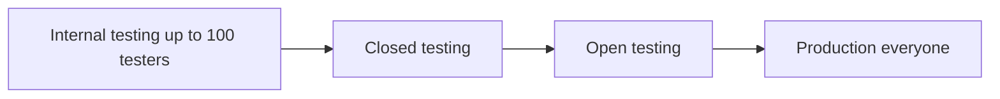
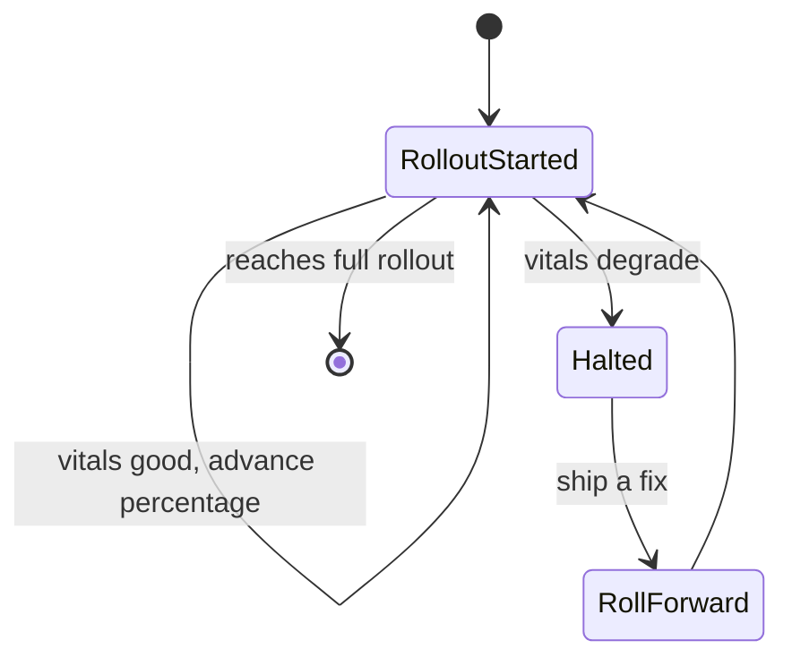

# Lecture 2 — fastlane, the Play Console API, tracks, and staged rollout

> "The upload is one lane, the tracks are four doors, and the rollout percentage is the one dial you turn slowly with a human's hand on it."

Lecture 1 built the *production* half of the pipeline: a gated, cached, signed release AAB sitting on a clean runner. This lecture builds the *delivery* half — how that bundle gets from the runner to a Play Console track and, eventually, to users. The tool is **fastlane**, the API underneath is the **Google Play Developer (Android Publisher) API**, the destinations are the **four tracks**, and the one place we deliberately slow down and keep a human is the **staged rollout to production**. By the end you can write a lane that uploads to the internal track on every tag, and you can explain exactly where automation stops and judgment begins.

We go: fastlane's shape, then `supply` and the Play API, then the four tracks, then staged rollout and the human gate, then the no-Play-account path so the fee never blocks you.

---

## 1. fastlane — lanes over a pile of scripts

fastlane is a Ruby tool that wraps the dozens of fiddly CLI steps a release needs into named **lanes**. Instead of a bash script that calls `gradlew`, then `bundletool`, then a Python uploader you found on a gist, you write a `Fastfile` with declarative actions.

The structure:

- **`Fastfile`** — the lanes (named sequences of actions).
- **`Appfile`** — the app identity: package name and the path to the Play service-account JSON.
- **`Pluginfile`** / **`Gemfile`** — pinned versions so the lane runs identically locally and in CI.

A minimal Android `Fastfile`:

```ruby
# fastlane/Fastfile
default_platform(:android)

platform :android do

  desc "Build a signed release AAB"
  lane :build do
    gradle(task: "bundle", build_type: "Release")   # ./gradlew bundleRelease
  end

  desc "Upload the AAB to the Play internal track"
  lane :internal do
    build                                            # call the build lane first
    upload_to_play_store(                            # this IS `supply`
      track: "internal",
      aab: "app/build/outputs/bundle/release/app-release.aab",
      release_status: "draft",                       # don't auto-publish; sit as a draft
      skip_upload_metadata: true,                    # we're only shipping the binary here
      skip_upload_images: true,
      skip_upload_screenshots: true
    )
  end
end
```

And the `Appfile`:

```ruby
# fastlane/Appfile
package_name("com.crunch.weather")
json_key_file(ENV["PLAY_SERVICE_ACCOUNT_JSON_PATH"])   # path, fed from a secret in CI
```

Run it: `bundle exec fastlane internal` locally, or `run: bundle exec fastlane internal` as the last step of the `release` job from lecture 1. The lane is the *same* code locally and in CI — which is the whole point. A release you can run on your laptop and the runner runs identically is a release you can trust.

Why lanes beat ad-hoc scripts: they're *named* (intent is legible), *composable* (`internal` calls `build`), *idempotent-ish* (re-running is predictable), and *shared* (the team runs the same lane, not each person's pet script). fastlane is the difference between "the release process is in Jordan's head" and "the release process is `fastlane internal`."

---

## 2. `supply` and the Play Console API

`upload_to_play_store` (aliased `supply`) drives the **Google Play Developer API** (the Android Publisher API). Understanding the API model makes the lane's behavior predictable.

The Play API is **transactional**, built around an *edit*:

1. **Create an edit** — a draft transaction against your app.
2. **Make changes within the edit** — upload a bundle, set a track's release, attach release notes, set a rollout fraction.
3. **Validate and commit the edit** — apply it atomically, or abandon it.

`supply` does all three for you in one call. You don't manage the edit lifecycle by hand (though you can with the raw API); `supply` opens an edit, uploads the AAB, assigns it to the track you named, sets the release status/notes/rollout, and commits. If anything fails, the edit isn't committed — you don't end up with a half-applied release.

The service account is how the lane authenticates. In the Play Console you create (or link) a Google Cloud **service account**, grant it the **Android Publisher** permission scoped to your app, download its JSON key, and point `Appfile`'s `json_key_file` at it. In CI, that JSON is a **secret** (lecture 1) written to a temp file whose path you feed via the `PLAY_SERVICE_ACCOUNT_JSON_PATH` env var:

```yaml
- name: Write service-account JSON
  env: { PLAY_JSON: '${{ secrets.PLAY_SERVICE_ACCOUNT_JSON }}' }
  run: |
    echo "$PLAY_JSON" > "$RUNNER_TEMP/play.json"
    echo "PLAY_SERVICE_ACCOUNT_JSON_PATH=$RUNNER_TEMP/play.json" >> "$GITHUB_ENV"
- name: Upload to internal
  run: bundle exec fastlane internal
```

Same hygiene as the keystore: the JSON lives in `$RUNNER_TEMP`, dies with the job, never touches the repo. (And per lecture 1, OIDC/workload-identity-federation can replace this standing JSON secret entirely where you want the stronger posture.)

---

## 3. The four tracks — internal, closed, open, production

A Play app has four **tracks**, ordered from smallest/safest audience to largest/riskiest. You upload to a track; users on that track get the build.

- **Internal testing** — up to ~100 named testers, available almost immediately (minutes, minimal review). This is where CI uploads on every tag. Fast, private, for the team. **This is the course/capstone target.**
- **Closed testing** — a larger, invited group (an alpha/beta program, by email lists or Google Groups). More review latency. For pre-release feedback from real testers.
- **Open testing** — a public opt-in beta; anyone can join from the store listing. Broad, but still flagged as testing.
- **Production** — everyone. Full store availability, full review. The real release.

The discipline: **promote upward, don't upload sideways.** A build proves itself on internal, gets promoted to closed for wider testing, then open, then production — each step a deliberate decision. `supply` can upload directly to any track, but the *workflow* should upload to internal automatically and promote to higher tracks with intent.


*Builds promote upward through the four tracks; the same proven artifact moves, it is never rebuilt.*

```ruby
  desc "Promote the latest internal build to closed testing"
  lane :promote_to_closed do
    upload_to_play_store(
      track: "internal",
      track_promote_to: "closed",     # move the existing release up a track
      version_code: ENV["VERSION_CODE"]
    )
  end
```

`track_promote_to` moves an *existing* release to a higher track without re-uploading the binary — the same artifact that passed internal is what reaches closed, which is exactly what you want (don't rebuild between tracks; promote the proven artifact).

---

## 4. Staged rollout — the dial you turn slowly

Production is where you stop trusting full automation, because production means *real users* exposed to *new code*, and new code occasionally crashes. The control is a **staged (percentage) rollout**: release to 1%, then 5%, then 20%, then 50%, then 100% — watching crash-free rate and ANR rate between each step, ready to **halt** if the numbers degrade.

`supply` sets the rollout fraction:

```ruby
  desc "Start a 10% production rollout (HUMAN-INITIATED, not on every tag)"
  lane :production_rollout do
    upload_to_play_store(
      track: "production",
      rollout: "0.1",                  # 10% of users
      release_status: "inProgress"     # a staged, not completed, release
    )
  end
```

And to advance or halt:

- **Advance:** re-run with a higher `rollout` (e.g. `0.5`, then `1.0`). The same release reaches more users.
- **Halt:** set the release status back, or in the console, pause the rollout. Users already on the new version stay; no *new* users get it. You then ship a fix and resume.


*A human watches crash-free and ANR vitals between steps, choosing to advance or halt rather than automating the trigger.*

> **This is the one place a human belongs by design.** Steps 1–3 of the release (build, gate, upload-to-internal) are pure automation — a machine does them perfectly. Step 4 — *deciding to expose more real users to new code, and deciding to halt if vitals dip* — is a judgment call about risk and blast radius. You can automate the *mechanism* (the `rollout` lane), but the *trigger* should be a person reading the Play Console vitals and choosing to advance. Automating the production rollout trigger is how teams ship a crash to 100% of users at 2am because nobody was watching.

The senior framing for an interview: "We automate build, test, screenshot, and upload-to-internal on every tag. Promotion to closed/open and the production staged rollout are human-gated: a person reads crash-free and ANR rates between rollout steps and chooses to advance or halt. The pipeline removes the error-prone manual work; it does *not* remove the judgment about exposing users."

---

## 5. Screenshots in the pipeline — `screengrab`

The Play listing wants screenshots, and keeping them current by hand is tedious and stale-prone. fastlane's **`screengrab`** drives your *instrumented UI tests* to capture localized screenshots automatically, so the listing reflects the current UI.

```ruby
  desc "Capture localized Play-listing screenshots"
  lane :screenshots do
    capture_android_screenshots(            # this is `screengrab`
      locales: ["en-US", "fr-FR"],
      app_package_name: "com.crunch.weather"
      # ...driven by a screenshot-tagged instrumented test...
    )
  end
```

`screengrab` runs a special UI-test that navigates the app and calls `Screengrab.screenshot("name")` at each surface; fastlane collects the images per locale. You can then upload them with `supply` (don't `skip_upload_screenshots`). The win: screenshots regenerate from the *actual current app* on demand, so a redesign updates the store listing by re-running a lane, not by a designer manually re-capturing on a device.

(Note: `screengrab` needs an emulator/device, so it's the slower, instrumented part of the pipeline — run it on the `release` path or a dedicated job, not on every PR. Paparazzi from Week 17 is your fast, JVM-only *visual regression* gate; `screengrab` is for *listing* screenshots. Different tools, different jobs.)

---

## 6. The complete delivery lane — wired into the tag pipeline

Combining lecture 1's signed-build job with this lecture's upload, the `release` job's tail becomes:

```yaml
  release:
    needs: [ ci ]
    if: startsWith(github.ref, 'refs/tags/v')
    runs-on: ubuntu-latest
    steps:
      - uses: actions/checkout@v4
      - uses: actions/setup-java@v4
        with: { distribution: temurin, java-version: '17' }
      - uses: ruby/setup-ruby@v1
        with: { ruby-version: '3.2', bundler-cache: true }   # installs the Gemfile's fastlane
      - uses: gradle/actions/setup-gradle@v4
      - name: Decode keystore
        env: { KEYSTORE_BASE64: '${{ secrets.KEYSTORE_BASE64 }}' }
        run: |
          echo "$KEYSTORE_BASE64" | base64 --decode > "$RUNNER_TEMP/ks.jks"
          echo "KEYSTORE_FILE=$RUNNER_TEMP/ks.jks" >> "$GITHUB_ENV"
      - name: Write Play service-account JSON
        env: { PLAY_JSON: '${{ secrets.PLAY_SERVICE_ACCOUNT_JSON }}' }
        run: |
          echo "$PLAY_JSON" > "$RUNNER_TEMP/play.json"
          echo "PLAY_SERVICE_ACCOUNT_JSON_PATH=$RUNNER_TEMP/play.json" >> "$GITHUB_ENV"
      - name: Build + upload to internal
        env:
          KEYSTORE_FILE: ${{ env.KEYSTORE_FILE }}
          KEYSTORE_PASSWORD: ${{ secrets.KEYSTORE_PASSWORD }}
          KEY_ALIAS: ${{ secrets.KEY_ALIAS }}
          KEY_PASSWORD: ${{ secrets.KEY_PASSWORD }}
        run: bundle exec fastlane internal     # build lane + supply to internal
```

Trace the whole flow one more time, tag to track:

1. `git tag v1.4.0 && git push --tags` — the *cause*.
2. `ci` runs (lecture 1): tests, lint, Paparazzi. If red, everything stops.
3. `release` runs only because the tag matched `v*` *and* `ci` passed.
4. Secrets decode into `$RUNNER_TEMP`: the upload keystore and the Play JSON.
5. `fastlane internal` builds the signed AAB (env-fed signing config) and `supply` uploads it to the internal track as a draft.
6. Minutes later, the build appears on the internal track; your testers update.

No mouse. No local build. No secret in the repo. A tag became a tested, signed artifact on a track. That is capstone deliverable #7.

---

## 6b. Release notes, version codes, and the rollback you can't do

Three operational details separate a pipeline that *works once* from one a team lives with.

**Version codes must be monotonic.** Play rejects an AAB whose `versionCode` is not strictly greater than the last one on that track. If you hardcode `versionCode = 1`, the second tag fails to upload. The clean fix is to derive it from a monotonic CI value — the run number is perfect:

```kotlin
// app/build.gradle.kts
android {
    defaultConfig {
        versionCode = System.getenv("VERSION_CODE")?.toInt() ?: 1        // CI feeds run_number
        versionName = System.getenv("VERSION_NAME") ?: "1.0.0-dev"       // CI feeds the tag
    }
}
```

```yaml
env:
  VERSION_CODE: ${{ github.run_number }}     # strictly increasing across runs
  VERSION_NAME: ${{ github.ref_name }}       # e.g. "v1.4.0"
```

Now every tag carries a higher code than the last, automatically, with no human bumping a number.

**Release notes ride with the release.** `supply` reads localized changelogs from `fastlane/metadata/android/<locale>/changelogs/<versionCode>.txt`. Drop a file named for the version code, and the upload attaches it as the track's release notes:

```text
fastlane/metadata/android/en-US/changelogs/42.txt   -> notes for versionCode 42
```

You can also generate the changelog from your commit history or the tag annotation, so each release's notes come from the same commit that triggered it — no separate "remember to write release notes" step that gets skipped.

**There is no real rollback — only roll-forward.** This is the operational fact that makes staged rollout (next section) matter so much. Once users have installed a version, you cannot *uninstall* it from their devices or downgrade them. "Rolling back" on Android means one of two things: **halt** the rollout (stop *new* users getting the bad version — users already on it stay) and **roll forward** (ship a *fixed* higher version fast). You can't take a bad release back; you can only stop its spread and replace it. That asymmetry — easy to ship to everyone, impossible to un-ship — is exactly why you expose production gradually and watch, rather than shipping to 100% and hoping.

---

## 7. The no-Play-account path — the fee never blocks learning

Every learning objective this week is reachable *without* the USD 25 Play fee. If you don't have (or don't want) a Play account, run the pipeline through the upload step but target a verifiable local/free destination:

- **Build + sign + verify.** The `ci` and signed-`bundleRelease` halves need no Play account. `apksigner verify --print-certs` (after `bundletool build-apks`) proves the signing wiring works. This covers the whole GitHub Actions, caching, matrix, signing, and secrets curriculum.
- **Upload the AAB as a workflow artifact.** Replace the `supply` step with `actions/upload-artifact` so the signed bundle is downloadable from the run. You exercise the full gated pipeline; the only thing missing is the Play API call.
- **F-Droid metadata path.** Prepare the F-Droid metadata (`fastlane/metadata/android/...`) and a reproducible build recipe. F-Droid is a free store; the capstone explicitly accepts an F-Droid submission as the no-fee fallback.
- **`supply --validate_only` (dry run).** If you *do* have a service account but want to avoid a real upload, `supply` can validate the edit without committing it, exercising the API auth and the bundle validation without publishing.

So the rubric grades the *pipeline*, not whether you paid Google. A green tag run that builds, tests, signs, verifies, and either uploads-to-internal *or* publishes a verified signed AAB as an artifact is full marks.

### Vitals — the numbers the human gate watches

When you do reach a production staged rollout, the human at the dial isn't watching vibes — they're watching **Play Console vitals**, the same metrics Google uses to rank and (above thresholds) penalize your app:

- **Crash-free users / crash-free sessions.** The percentage of users (or sessions) that didn't hit a crash. A staged rollout that drops crash-free rate below your release's baseline is the canonical "halt" signal.
- **ANR rate.** Application Not Responding events — the main thread blocked too long. A spike here is as serious as a crash spike and is the other primary halt trigger.
- **Excessive wakeups / battery / stuck partial wake locks.** Slower-burn regressions; relevant for background-heavy apps.

The rollout discipline: note the *current* crash-free and ANR figures before you start, roll out to a small percentage, let it bake long enough to gather signal (real users hit real edge cases over hours, not minutes), compare, and only then advance. If the new version's vitals are materially worse than the baseline, **halt** — stop new users getting it — and roll forward a fix. These thresholds are exactly what a senior on-call rotation tracks, and they're why the production trigger stays human: a number dipping is a judgment about *how much* worse is too much, weighed against the value of the release. The pipeline can *show* you the vitals; deciding to advance or halt on them is the part that doesn't automate.

---

## 7b. Instrumented tests, emulators, and runner economics

Two operational realities shape *where* the heavy parts of the pipeline run.

**Instrumented tests need an emulator, and emulators are the expensive, flaky part.** Unit tests, Robolectric, and Paparazzi all run on the plain JVM — fast, deterministic, perfect for the every-PR gate. But Espresso and `screengrab` need a *running* Android — an emulator with hardware acceleration. On CI, the de-facto tool is **`ReactiveCircus/android-emulator-runner`**, which boots an emulator on the runner and runs your `connectedCheck`:

```yaml
  instrumented:
    runs-on: ubuntu-latest
    steps:
      - uses: actions/checkout@v4
      - uses: actions/setup-java@v4
        with: { distribution: temurin, java-version: '17' }
      - uses: gradle/actions/setup-gradle@v4
      - name: Run instrumented tests on an emulator
        uses: reactivecircus/android-emulator-runner@v2
        with:
          api-level: 34
          arch: x86_64
          script: ./gradlew connectedDebugAndroidTest
```

The gotchas you must respect: emulator jobs are *slow* (boot + run can be many minutes), *flakier* than JVM tests (timing, animations, the emulator itself), and need KVM acceleration (Linux runners have it; macOS runners are slower and pricier). The discipline: run a *small smoke set* of instrumented tests on the release path or a nightly schedule, **not** the whole suite on every PR. Keep the every-PR gate JVM-only (unit + Robolectric + Paparazzi) so PRs stay fast and deterministic; reserve the emulator for the few end-to-end checks that genuinely need a real device.

**Runner economics — hosted vs self-hosted.** GitHub's hosted runners are free for public repos and metered for private (with a monthly free allotment). For most projects that's plenty. Two cases push teams to **self-hosted runners**: very high build volume (the metered minutes add up), and builds needing specialized hardware (more RAM/CPU for big Gradle builds, or a beefier emulator host). Self-hosted runners are machines *you* operate that register with GitHub and pick up jobs. The trade-off is real: you get speed and control, but you own the security (a self-hosted runner on a public repo is a serious risk — a malicious PR can run code on your machine) and the maintenance. For this course and the capstone, **hosted runners are correct** — free, clean, zero-maintenance. Know self-hosted exists for when scale or hardware demands it; don't reach for it prematurely.

The framing: **put fast, deterministic work on every PR (hosted, JVM); put slow, device-dependent work on a narrower trigger (the release path or nightly); reach for self-hosted only when volume or hardware forces it.** Matching the job to the right runner and trigger is what keeps a pipeline both thorough and fast.

### The release-engineer's pre-flight checklist

Before you call a release pipeline production-ready, walk this list — it's what a senior reviewer checks on the pipeline PR:

- **A tag triggers it, and only a tag.** Releases come from `v*` tags, not from a `main` push or a manual button.
- **The release job `needs` the gate.** A red test physically blocks the upload; the dependency is structural, not a convention.
- **No secret is in the repo.** Keystore (base64) and Play JSON are encrypted secrets, decoded into `$RUNNER_TEMP`, gone with the job. `.gitignore` blocks `*.jks` and `keystore.properties`.
- **The signed artifact is verified.** `apksigner verify` (or `supply`'s validation) confirms it's signed by the upload key before it ships.
- **`versionCode` is monotonic.** Derived from the run number, so every tag is strictly higher than the last.
- **The fastlane lane runs locally too.** `bundle exec fastlane internal` works on a laptop, not just on the runner — the lane is the release, identically everywhere.
- **The production rollout is human-gated.** A `production_rollout` lane exists but is *not* auto-triggered; a person advances it while watching vitals.
- **Release notes ride with the tag.** A changelog file keyed to the version code, generated from the commit/tag, attaches automatically.

If every box is checked, you have a release a tag *causes*, gated, signed, and safe — not a manual ritual in one person's head.

---

## 8. Recap

Lecture 1 produced a gated, cached, signed AAB on a clean runner. This lecture delivered it:

1. **fastlane lanes** turn a pile of release scripts into named, composable, shared commands that run identically locally and in CI — `fastlane internal` is the whole release.
2. **`supply` drives the Play API** transactionally (edit → upload → commit), authenticated by a service-account JSON kept as a secret (or replaced by OIDC).
3. **Four tracks**, smallest to largest: internal (CI's target, every tag) → closed → open → production. Promote the proven artifact upward; don't rebuild between tracks.
4. **Staged rollout is the human gate.** Build/test/upload-to-internal is full automation; the production rollout percentage is a dial a person turns while watching vitals, ready to halt. Automating *that* trigger is how crashes reach everyone.
5. **`screengrab`** keeps the listing screenshots current from the real app; **Paparazzi** (Week 17) is the fast visual *regression* gate. Different jobs.
6. **The no-account path** reaches every objective without the fee — build, sign, verify, and artifact-upload or F-Droid.
7. **The operational facts that make it real:** monotonic `versionCode` (from the run number), release notes that ride with the tag, no true rollback (only halt + roll-forward), JVM tests on every PR and emulator tests on a narrow trigger, hosted runners until scale forces self-hosted, and vitals (crash-free, ANR) as the numbers the human watches at the production dial.

Hold the whole shape from both lectures in one sentence: **a tagged commit, on a clean cached runner, runs a binding test gate, signs with an upload key that exists only as a decoded-in-memory secret, and `fastlane supply` ships the proven artifact to the internal track — while promotion and the production rollout stay a human's call on the vitals.** That is the line between a hobby project and a shipping product, and it is the exact pipeline the capstone's deliverable #7 demands.

The exercises put a CI workflow, a secrets-fed signing config, and a `supply` lane under your hands; the challenge wires the complete tag→internal pipeline for both the phone AAB and the Wear APK; the mini-project is that pipeline, end to end, that you watch turn a tag into a build on a track. Go make a release something a commit *causes*, not something you *do* — and keep your hand on the one dial that still needs it.
