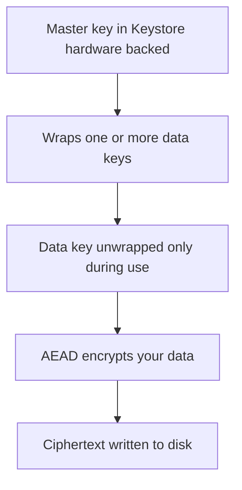
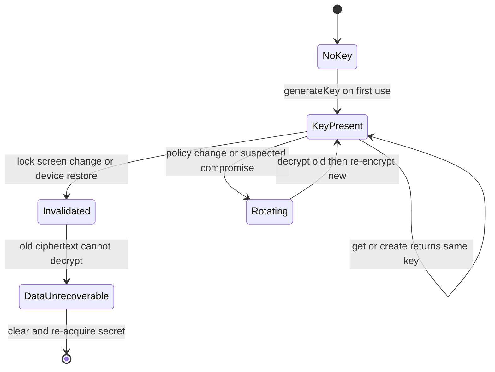

# Lecture 1 — The Keystore, encrypted storage, and the data-at-rest threat model

> "A secret you can read off the device with `adb pull` is not a secret. This lecture is about keys that live where your process can't reach them, and data that's ciphertext the moment it touches disk."

This is the lecture that turns "I stored a token" into "I stored a token an attacker with a rooted device can't read." We build it bottom-up: the threat model first (what are we actually defending against), then the Android Keystore (keys that never leave secure hardware), then encrypted storage built on top of those keys, then key attestation (proving to a backend where a key lives), and finally the honest limits of what encryption-at-rest does and does not buy you. By the end you can encrypt a secret with a hardware-backed key and *prove* the on-disk bytes are ciphertext.

---

## 1. The threat model — what are we defending against?

Security without a threat model is theater. Before any crypto, name the adversary. For data at rest on Android, the realistic threats are:

1. **A lost or stolen device, unlocked or rooted.** The attacker has the hardware. They can browse the filesystem (rooted), pull an ADB backup, or extract the flash.
2. **A malicious app or a backup extraction.** App-private storage is *mostly* sandboxed, but backups, debuggable builds, and rooted devices punch holes. An auto-backup that uploads your `SharedPreferences` to the cloud is a real leak vector.
3. **Forensic extraction.** A seized or recovered device, imaged offline. No running process to compromise — just the bytes on flash.

What we are *not* (with these tools) defending against: a fully compromised *running* process with your decryption key already in memory, a malware-laden ROM, or a user who hands their unlocked phone to an attacker mid-session. Encryption at rest protects the *bytes on disk* when the app isn't actively decrypting them. Be precise: it's a strong control against the device-at-rest threats, and *not* a control against an attacker inside your live process. Claiming otherwise is the kind of overreach that gets security reviews failed.

The concrete failure this lecture fixes: a token in plaintext `SharedPreferences`:

```kotlin
// The insecure baseline. This writes an XML file you can read with `adb pull`.
val prefs = context.getSharedPreferences("auth", Context.MODE_PRIVATE)
prefs.edit().putString("token", "eyJhbGciOi...").apply()
// On disk at /data/data/<pkg>/shared_prefs/auth.xml — PLAINTEXT. Anyone with the
// device (rooted), an ADB backup, or a forensic image reads the token verbatim.
```

That XML is human-readable. Our job is to make those bytes ciphertext, with a key the attacker can't extract.

---

## 2. The Android Keystore — keys that never leave hardware

The **Android Keystore** is a system service that generates and stores cryptographic keys such that **the key material never enters your app's process memory** — and, on hardware-backed devices, never leaves a secure element (a TEE, Trusted Execution Environment, or a dedicated StrongBox chip). You ask the Keystore to *use* a key (encrypt, decrypt, sign); the operation happens inside the secure hardware and you get the result. You never see the raw key bytes. That is the whole point: even a *rooted* device can't extract a hardware-backed key, because it isn't in a place root can reach.

You generate a key with `KeyGenParameterSpec`, telling the provider exactly what the key is allowed to do:

```kotlin
import android.security.keystore.KeyGenParameterSpec
import android.security.keystore.KeyProperties
import javax.crypto.KeyGenerator

fun getOrCreateAesKey(alias: String): javax.crypto.SecretKey {
    val keyStore = java.security.KeyStore.getInstance("AndroidKeyStore").apply { load(null) }

    // If the key already exists, return it — never regenerate (that would orphan
    // everything you encrypted with the old key).
    (keyStore.getEntry(alias, null) as? java.security.KeyStore.SecretKeyEntry)
        ?.let { return it.secretKey }

    val keyGen = KeyGenerator.getInstance(
        KeyProperties.KEY_ALGORITHM_AES, "AndroidKeyStore"
    )
    keyGen.init(
        KeyGenParameterSpec.Builder(
            alias,
            KeyProperties.PURPOSE_ENCRYPT or KeyProperties.PURPOSE_DECRYPT  // what it can do
        )
            .setBlockModes(KeyProperties.BLOCK_MODE_GCM)        // AES-GCM = authenticated encryption
            .setEncryptionPaddings(KeyProperties.ENCRYPTION_PADDING_NONE)
            .setKeySize(256)
            // .setIsStrongBoxBacked(true)        // dedicated secure chip, if the device has one
            // .setUserAuthenticationRequired(true) // require a recent unlock to USE the key
            .build()
    )
    return keyGen.generateKey()   // generated INSIDE the keystore; you never see the raw bytes
}
```

Read the design choices:

- **`PURPOSE_ENCRYPT or PURPOSE_DECRYPT`** — the key is locked to those operations. A key you can only decrypt with can't be misused to sign. Least privilege, in crypto.
- **`BLOCK_MODE_GCM`** — AES-GCM is *authenticated* encryption (AEAD): it encrypts *and* detects tampering. If someone flips a bit in your ciphertext, decryption fails loudly instead of returning garbage. Always prefer AEAD over a bare cipher.
- **`setUserAuthenticationRequired(true)`** (commented) — binds key *use* to a recent device unlock (biometric/PIN). The key can't be used unless the user authenticated in the last N seconds. This is how you make a key that an attacker can't use even on an unlocked-but-idle device.
- **`setIsStrongBoxBacked(true)`** (commented) — uses a dedicated tamper-resistant chip where present (Pixels, many flagships), the strongest tier.
- **Get-or-create, never regenerate.** The key lives in the Keystore across app restarts; you look it up by alias. Regenerating it would make everything previously encrypted undecryptable — a data-loss bug.

The mental model: **the Keystore is a vault that *does crypto for you* without ever handing you the key.** Your app holds an *alias* (a name), not the key. The hardware holds the key.

### Security levels — software, TEE, and StrongBox

Not every "Keystore key" is equally protected; the *backing* matters. There are three tiers, weakest to strongest:

- **Software keystore.** On devices without secure hardware (rare now, old/cheap devices), the key is protected by software only — encrypted by a key derived from the lock screen, but ultimately reachable by a sufficiently compromised OS. Better than plaintext; not hardware-grade.
- **TEE (Trusted Execution Environment).** The key lives in a secure region of the main processor, isolated from the normal OS. Even a rooted Android can't read it — root runs in the normal world; the key lives in the secure world. This is the common hardware-backed tier on most modern phones.
- **StrongBox.** A *dedicated, separate* tamper-resistant security chip (its own CPU and memory), the strongest tier, on Pixels and many flagships. Requested with `setIsStrongBoxBacked(true)` — but you must handle the device *not* having one (catch `StrongBoxUnavailableException` and fall back to TEE).

You can ask a generated key what tier it got via its `KeyInfo` (`isInsideSecureHardware` / the security level on newer APIs). The practical rule: **request the strongest available, fall back gracefully, and don't assume StrongBox** — design for "hardware-backed where possible," and treat the software-only case as your weakest-supported floor. For high-assurance keys you can *require* hardware backing and refuse to operate on a software-only device, but that excludes some users; it's a product call.

---

## 3. Encrypted storage built on Keystore keys

You rarely use the raw Keystore key to encrypt data directly. The common pattern (and what Jetpack Security automates) is a **two-level key hierarchy**: a Keystore *master key* encrypts (wraps) one or more *data keys*, and the data keys encrypt your actual data. This lets you encrypt large/many items efficiently while the only key in hardware is the master.


*A hardware-backed master key wraps data keys, which encrypt the data that ends up as ciphertext on disk.*

### The Jetpack Security path — and its caveat

`EncryptedSharedPreferences` and `EncryptedFile` (from `androidx.security:security-crypto`) wrap this for you:

```kotlin
import androidx.security.crypto.EncryptedSharedPreferences
import androidx.security.crypto.MasterKey

// A Keystore-backed master key (AES-256-GCM), generated/looked-up by alias.
val masterKey = MasterKey.Builder(context)
    .setKeyScheme(MasterKey.KeyScheme.AES256_GCM)
    .build()

val securePrefs = EncryptedSharedPreferences.create(
    context,
    "secure_auth",                                  // file name
    masterKey,
    EncryptedSharedPreferences.PrefKeyEncryptionScheme.AES256_SIV,    // keys encrypted (deterministic)
    EncryptedSharedPreferences.PrefValueEncryptionScheme.AES256_GCM   // values encrypted (AEAD)
)

// Same API as SharedPreferences — but the on-disk bytes are ciphertext.
securePrefs.edit().putString("token", "eyJhbGciOi...").apply()
val token = securePrefs.getString("token", null)   // transparently decrypted on read
```

The API is drop-in identical to `SharedPreferences`, but the XML on disk is now ciphertext (you'll confirm this in exercise 1 with `adb pull`). The master key lives in the Keystore; the per-entry keys are wrapped by it.

**The caveat you must know:** the `androidx.security:security-crypto` library is effectively in **maintenance mode** — it works, it's widely deployed, but it's not getting new development, and the latest versions carry deprecation notes. For new code, the Android team increasingly points at **using Tink directly** (the same crypto library that backs Jetpack Security) or a thin wrapper, because it's actively maintained and more flexible. The *concept* is identical — a Keystore master key wrapping AEAD-encrypted data keys — so understanding `EncryptedSharedPreferences` transfers directly.

### The Tink-direct path (the modern alternative)

Tink gives you the same AEAD with an actively maintained API. The shape:

```kotlin
// Conceptual Tink-direct flow (the modern path when you outgrow Jetpack Security):
// 1. A keyset (the data keys) is encrypted ("wrapped") by a Keystore master key.
// 2. The wrapped keyset is stored; the master key stays in the Keystore.
// 3. You get an `Aead` primitive to encrypt/decrypt with the unwrapped data key.

// aead.encrypt(plaintext, associatedData) -> ciphertext
// aead.decrypt(ciphertext, associatedData) -> plaintext  (throws if tampered)
```

The key idea to carry: **whether you use Jetpack Security or Tink, the architecture is the same — a hardware-backed master key in the Keystore wraps AEAD data keys that encrypt your data.** Pick the maintained library; understand the model.

### EncryptedFile for larger data

For files (an attachment, an exported note), `EncryptedFile` does the same for a stream:

```kotlin
import androidx.security.crypto.EncryptedFile

val encryptedFile = EncryptedFile.Builder(
    context,
    java.io.File(context.filesDir, "note-attachment.enc"),
    masterKey,
    EncryptedFile.FileEncryptionScheme.AES256_GCM_HKDF_4KB
).build()

encryptedFile.openFileOutput().use { it.write(plaintextBytes) }   // writes ciphertext
val decrypted = encryptedFile.openFileInput().use { it.readBytes() }  // reads plaintext
```

Same model — Keystore master key, AEAD scheme, ciphertext on disk, transparent on read.

---

## 4. Key attestation — proving where a key lives

There's a question a backend sometimes needs answered: "is this key *really* in secure hardware on a genuine device, or is the client lying about it?" **Key attestation** answers it. A Keystore key can produce an **attestation certificate chain** — signed by a Google attestation root — that cryptographically asserts properties of the key: that it lives in verified hardware (TEE/StrongBox), the security level, whether the OS was in a verified-boot state, and the key's properties (purposes, whether user-auth is required).

```kotlin
// Request attestation by passing a challenge (a server-provided nonce) at key gen:
KeyGenParameterSpec.Builder(alias, KeyProperties.PURPOSE_SIGN)
    .setAttestationChallenge(serverNonce)   // the server's challenge, binds the attestation
    .build()
// Then read keyStore.getCertificateChain(alias) and send it to the backend, which
// verifies the chain up to Google's root and inspects the attestation extension.
```

The use case: high-assurance flows (banking, enterprise device trust) where the backend wants proof the client's key is hardware-protected before trusting it for, say, transaction signing. The `setAttestationChallenge(serverNonce)` ties the attestation to a fresh server challenge so it can't be replayed.

You won't build a full attestation-verification backend this week (that's the server's job), but hold the concept: **attestation lets a key *prove its own provenance* to a remote party.** It's the Keystore analog of Play Integrity (lecture 2) — one attests the *key*, the other attests the *app and device*.

---

## 5. The honest limits — what encryption-at-rest does NOT do

A senior engineer is precise about a control's boundaries. Encryption at rest with a Keystore key:

**Does protect against:**
- A rooted device reading the file (the bytes are ciphertext; the key is in hardware root can't reach).
- An ADB/cloud backup leaking the data (it backs up ciphertext).
- A forensic image of the flash (ciphertext, no key).
- (With `setUserAuthenticationRequired`) use of the key on an unlocked-but-idle device.

**Does NOT protect against:**
- **A compromised running process.** If your app has decrypted the data into memory and the process is compromised, the plaintext is in memory. Encryption at rest is about *disk*, not *RAM*.
- **A malicious ROM / kernel-level compromise.** If the OS itself is subverted below the TEE boundary, assumptions break. (Hardware-backed keys still resist extraction, but a compromised OS can ask the key to decrypt.)
- **Obfuscation gaps.** R8 name-mangling (Week 18) is *not* encryption and *not* a security control — it raises reverse-engineering cost, nothing more. Don't list it as a data-protection measure.
- **Bad key lifecycle.** A key with no rotation plan, or a key you regenerate and orphan data behind, is a self-inflicted wound.

The discipline: **state the threat each control addresses, and don't claim more.** "The token is encrypted at rest with a hardware-backed AES-256-GCM key, protecting it against device-at-rest and backup-extraction threats; it is not protected against a compromised running process" is a sentence a security reviewer respects. "It's encrypted, so it's secure" is one they fail.

---

## 5b. Key lifecycle — the part people get wrong after the crypto is right

The crypto is the easy part; the *lifecycle* is where real apps break. Four lifecycle decisions you must make deliberately:

**Get-or-create, never blind-create.** As shown in §2, you look the key up by alias and only generate it if absent. A `generateKey()` that runs unconditionally on every launch destroys the old key and orphans everything you encrypted with it — a silent, total data-loss bug that passes every test (encrypt-then-decrypt in one session works fine) and fails in production on the *second* launch. The get-or-create pattern is not a nicety; it is correctness.

**Decryption must tolerate a missing/changed key.** A Keystore key can disappear out from under you: the user clears app data, removes their device lock screen (which can invalidate auth-bound keys), or restores to a new device (Keystore keys are *not* backed up — by design, since they're hardware-bound). Your decrypt path must catch the failure and degrade gracefully — treat the data as unrecoverable, re-prompt for the secret, re-fetch from the network — *not* crash with an uncaught `KeyPermanentlyInvalidatedException`. Encrypted data whose key is gone is just gone; plan for it.

```kotlin
fun readSecret(prefs: SharedPreferences, key: String): String? =
    try {
        prefs.getString(key, null)
    } catch (e: Exception) {
        // Key invalidated (lock-screen change, restore, etc.) — the ciphertext is
        // unrecoverable. Don't crash; clear it and re-acquire the secret upstream.
        prefs.edit().remove(key).apply()
        null
    }
```

**Rotation is a migration, not a swap.** If you ever need to rotate the data-encryption key (a policy change, a suspected compromise), you can't just generate a new key — the old ciphertext is still encrypted with the old key. Rotation is: decrypt-with-old, re-encrypt-with-new, *then* retire the old key, ideally with both keys present during the migration window. The same ship-before-you-switch discipline as certificate pinning (lecture 2). A key swap without a re-encryption migration orphans data.

**Keys are device-bound and not backed up.** A Keystore key never leaves the device, so it is *not* in a cloud backup and does *not* travel to a new device on restore. This is a feature (an attacker who steals a backup gets no keys) and a constraint (the user's encrypted local data doesn't survive a device migration unless you re-establish the secret from a server). Design for it: store the *encrypted* form locally for at-rest protection, but keep the source of truth somewhere you can re-sync, so a new device can re-encrypt fresh.

The throughline: **a hardware-backed key protects the bytes, but only a thought-through lifecycle keeps the app working.** Get-or-create, tolerate-loss, migrate-on-rotate, design-for-device-bound. Reviewers check these as hard as they check the cipher.


*A Keystore key's lifecycle: created once, reused via get-or-create, and either rotated through a migration or invalidated into unrecoverable data.*

---

## 6. A worked example — hardening the notes app's token

Putting it together, here's the before/after for the mini-project's first task: a token that was plaintext, now Keystore-encrypted.

**Before (insecure):**

```kotlin
class TokenStore(context: Context) {
    private val prefs = context.getSharedPreferences("auth", Context.MODE_PRIVATE)
    fun save(token: String) = prefs.edit().putString("token", token).apply()   // PLAINTEXT
    fun read(): String? = prefs.getString("token", null)
}
```

**After (Keystore-backed encrypted storage):**

```kotlin
class SecureTokenStore(context: Context) {
    private val masterKey = MasterKey.Builder(context)
        .setKeyScheme(MasterKey.KeyScheme.AES256_GCM)
        .build()

    private val prefs = EncryptedSharedPreferences.create(
        context,
        "secure_auth",
        masterKey,
        EncryptedSharedPreferences.PrefKeyEncryptionScheme.AES256_SIV,
        EncryptedSharedPreferences.PrefValueEncryptionScheme.AES256_GCM
    )

    fun save(token: String) = prefs.edit().putString("token", token).apply()   // CIPHERTEXT on disk
    fun read(): String? = prefs.getString("token", null)
}
```

The *API* the rest of the app uses is unchanged (`save`/`read`) — the hardening is encapsulated. The proof, which you'll do in exercise 1:

```bash
# Pull the file off the device and look at it. Before: readable token. After: ciphertext.
adb shell run-as <pkg> cat shared_prefs/secure_auth.xml
# (or `adb pull` on a rooted/debuggable build) — you'll see base64 ciphertext, not "eyJ..."
```

That `adb pull` showing ciphertext where last week there was a readable token is the *proof*. A security control you haven't tried to read past is one you don't know works.

---

## 6b. Choosing the right storage primitive

Not every secret wants `EncryptedSharedPreferences`. Match the primitive to the shape and lifetime of the data:

| Data | Right primitive | Why |
|---|---|---|
| A small string (auth token, refresh token, an opaque id) | `EncryptedSharedPreferences` | Key/value, drop-in API, encrypted at rest |
| A structured blob (a serialized session, encrypted preferences) | Encrypted **Proto DataStore** (encrypt the bytes with a Keystore-wrapped AEAD) | Typed, async, Flow-friendly (Week 14), with encryption layered in |
| A file (an attachment, an exported note, a cached document) | `EncryptedFile` | Streams large data; encrypts the stream, not a value |
| A field inside a Room row (one sensitive column among many) | A Room `TypeConverter` that AEAD-encrypts that column with a Keystore key | Keeps the rest of the table queryable; encrypts only the sensitive field |
| A key used to encrypt *other* keys/data | The **Keystore** directly (the master key) | The root of the hierarchy; never stored as data, only referenced by alias |

The `EncryptedFile` path for a larger payload, in full:

```kotlin
import androidx.security.crypto.EncryptedFile

fun writeEncryptedAttachment(context: Context, masterKey: MasterKey, name: String, bytes: ByteArray) {
    val target = java.io.File(context.filesDir, "$name.enc")
    if (target.exists()) target.delete()   // EncryptedFile won't overwrite; delete first
    val encryptedFile = EncryptedFile.Builder(
        context, target, masterKey,
        EncryptedFile.FileEncryptionScheme.AES256_GCM_HKDF_4KB   // streaming AEAD
    ).build()
    encryptedFile.openFileOutput().use { it.write(bytes) }       // writes ciphertext
}

fun readEncryptedAttachment(context: Context, masterKey: MasterKey, name: String): ByteArray =
    EncryptedFile.Builder(
        context, java.io.File(context.filesDir, "$name.enc"), masterKey,
        EncryptedFile.FileEncryptionScheme.AES256_GCM_HKDF_4KB
    ).build().openFileInput().use { it.readBytes() }              // reads plaintext
```

The `..._HKDF_4KB` scheme encrypts the stream in 4KB AEAD chunks, so you can encrypt a multi-megabyte file without holding it all in memory and each chunk is tamper-detected. (The "delete before write" wrinkle is a real gotcha: `EncryptedFile` refuses to open an output stream over an existing file — overwrite means delete-then-create.)

The selection discipline: **encrypt at the granularity that matches the data and keeps the rest of the app working.** Encrypting one sensitive Room column with a `TypeConverter` beats encrypting the whole database (which would break queries on the other columns). Encrypting a streamed file beats loading it into a string to put in prefs. The Keystore master key sits under all of it; the primitive on top is chosen per data shape.

---

## 7. Recap — the one-question habit

The reflex this lecture installs: for every secret your app stores, ask **"if an attacker had this device's flash, could they read this — and what key would stop them?"**

- A token in `SharedPreferences` → plaintext on disk; an attacker with the device reads it. Wrap it in encrypted storage.
- The encryption key itself → must live in the Keystore (hardware-backed), so it can't be extracted even from a rooted device. Never a key hardcoded in the APK.
- Need a backend to *trust* the key is in hardware → key attestation (a signed chain proving the key's provenance).
- "It's encrypted so it's secure" → name the threat: encryption-at-rest stops device-at-rest and backup threats, *not* a compromised running process. Be precise.
- Reaching for R8 obfuscation as a security control → it isn't one; it raises reverse-engineering cost, full stop.
- Storing a secret that must survive a device migration → remember Keystore keys don't back up; keep the source of truth somewhere you can re-sync, and re-encrypt fresh on the new device.
- A key generated unconditionally on every launch → that orphans all prior ciphertext; always get-or-create by alias, and tolerate a missing/invalidated key on the decrypt path.

You now have keys that live in hardware and data that's ciphertext on disk, with a clear-eyed view of what that protects. In lecture 2 we move from *data at rest* to *data in motion and the trust of the request itself*: certificate pinning so a compromised CA can't read your traffic (and the rotation footgun that's bricked real apps), the network security configuration, and Play Integrity attestation so your backend can tell a genuine app from an impersonator — failing *closed and gracefully* when it can't. Bring the threat-model discipline; we're about to point it at the wire.
