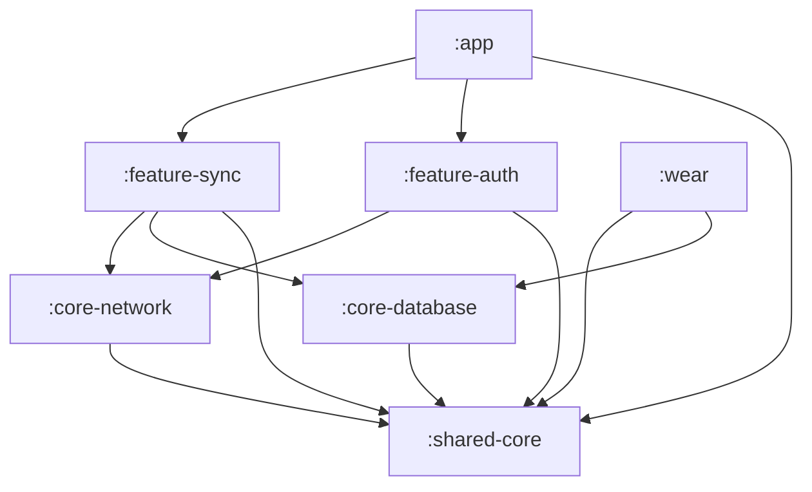

# Exercise 1 — The module graph and dependency directions

**Goal.** Make the capstone's module graph explicit, find the one illegal dependency edge hiding in a starter `settings.gradle.kts`, fix it, and then *enforce* the legal directions so the build rejects a future violation. This is Lecture 1 §2 made concrete: a dependency graph you can violate silently is a graph you do not have.

**Estimated time.** 50 minutes.

**Prerequisites.** The multi-module Gradle Kotlin DSL setup from Week 6, version catalogs, and the seven-module list from Lecture 1. No emulator needed — this is a build-and-graph exercise.

---

## Step 1 — Draw the legal graph

Before touching code, draw the capstone's seven-module dependency graph from Lecture 1 §2, by hand or in Mermaid. Save it to `docs/architecture.md`. The legal edges:



The three rules you must be able to state out loud (you will need them for the quiz and the architecture review):

1. **`:shared-core` depends on nothing in the project** — it is the root; everything depends on it.
2. **Features never depend on each other** — `:feature-sync` and `:feature-auth` are siblings; they communicate through interfaces in `:shared-core`, wired in `:app`.
3. **`:app` is the composition root** — it depends on everything; nothing depends on `:app`.

## Step 2 — Find the illegal edge

Here is a starter set of `build.gradle.kts` dependency blocks for the seven modules. **Exactly one edge violates the rules.** Find it.

```kotlin
// :shared-core/build.gradle.kts
dependencies {
    implementation(libs.kotlinx.coroutines.core)
    implementation(libs.kotlinx.serialization.json)
    implementation(libs.kotlinx.datetime)
    // (no project dependencies — correct: the root depends on nothing)
}

// :core-network/build.gradle.kts
dependencies {
    implementation(project(":shared-core"))
    implementation(libs.grpc.kotlin.stub)
    implementation(libs.grpc.okhttp)
}

// :core-database/build.gradle.kts
dependencies {
    implementation(project(":shared-core"))
    implementation(libs.androidx.room.runtime)
    ksp(libs.androidx.room.compiler)
}

// :feature-sync/build.gradle.kts
dependencies {
    implementation(project(":shared-core"))
    implementation(project(":core-network"))
    implementation(project(":core-database"))
    implementation(project(":feature-auth"))   // <-- look closely
    implementation(libs.androidx.work.runtime)
}

// :feature-auth/build.gradle.kts
dependencies {
    implementation(project(":shared-core"))
    implementation(project(":core-network"))
    implementation(libs.play.integrity)
    implementation(libs.androidx.security.crypto)
}

// :app/build.gradle.kts
dependencies {
    implementation(project(":shared-core"))
    implementation(project(":feature-sync"))
    implementation(project(":feature-auth"))
    implementation(project(":core-network"))
    implementation(project(":core-database"))
    implementation(libs.hilt.android)
    ksp(libs.hilt.compiler)
}

// :wear/build.gradle.kts
dependencies {
    implementation(project(":shared-core"))
    implementation(project(":core-database"))
    implementation(libs.androidx.wear.compose)
}
```

The illegal edge is `:feature-sync` → `:feature-auth` — a sideways dependency between two features (rule 2). It looks innocent: sync needs an auth token, so why not depend on auth? Because that couples the two features, makes neither testable alone, and starts the slide back to a monolith.

## Step 3 — Fix it through an interface in `:shared-core`

`:feature-sync` needs *a token*, not *the auth feature*. Define the seam as an interface in the dependency-free root:

```kotlin
// :shared-core/src/commonMain/kotlin/.../auth/TokenProvider.kt
interface TokenProvider {
    suspend fun currentToken(): String?
}
```

`:feature-auth` implements it (it already has the Keystore token store):

```kotlin
// :feature-auth/.../KeystoreTokenProvider.kt
class KeystoreTokenProvider(
    private val tokenStore: KeystoreTokenStore,
) : TokenProvider {
    override suspend fun currentToken(): String? = tokenStore.get()
}
```

`:feature-sync` depends only on the interface from `:shared-core`:

```kotlin
// :feature-sync/.../SyncWorker.kt — depends on TokenProvider, NOT on :feature-auth
class SyncWorker(
    private val tokenProvider: TokenProvider,   // the interface, from :shared-core
    // ...
)
```

And `:app` — the composition root, the only module that knows both implementations exist — binds them:

```kotlin
// :app/.../AuthModule.kt
@Module
@InstallIn(SingletonComponent::class)
abstract class AuthModule {
    @Binds
    abstract fun bindTokenProvider(impl: KeystoreTokenProvider): TokenProvider
}
```

Now delete `implementation(project(":feature-auth"))` from `:feature-sync`. The graph is legal again, and `:feature-sync` is testable with a fake `TokenProvider`.

## Step 4 — Enforce the direction so it can't regress

A fix that relies on memory is a fix that decays. Add a build-time guard so an illegal edge *fails the build*. Two options; do at least one.

**Option A — a project-level assertion in the root build script (simple, no plugin):**

```kotlin
// root build.gradle.kts — fail if any feature depends on another feature.
gradle.projectsEvaluated {
    val featureProjects = subprojects.filter { it.name.startsWith("feature-") }
    featureProjects.forEach { feature ->
        val illegal = feature.configurations
            .flatMap { it.dependencies }
            .filterIsInstance<ProjectDependency>()
            .map { it.path }
            .filter { dep -> featureProjects.any { it.path == dep } && dep != feature.path }
        require(illegal.isEmpty()) {
            "Illegal sideways dependency: ${feature.path} depends on $illegal. " +
                "Features must communicate through an interface in :shared-core."
        }
    }
}
```

**Option B — a custom Gradle convention or a tool like the `dependency-analysis` plugin / a module-graph-assert plugin.** Production teams use `kotlin-dsl` convention plugins or the [module-graph-assert](https://github.com/jraska/modules-graph-assert) plugin, which lets you declare allowed edges in the build and fails on any other. If you have a convention-plugins setup from Week 6, wire the assertion there.

Re-add the illegal `:feature-sync` → `:feature-auth` edge temporarily and confirm the build now **fails** with your message. Remove it. The guard earns its keep the day someone re-introduces the edge under deadline.

---

## Acceptance criteria

- [ ] `docs/architecture.md` contains the seven-module Mermaid dependency graph with the legal edges.
- [ ] You identified the illegal edge (`:feature-sync` → `:feature-auth`) and can state which rule it breaks (rule 2: no sideways feature dependencies).
- [ ] The edge is removed and replaced by a `TokenProvider` interface in `:shared-core`, implemented in `:feature-auth`, bound in `:app`.
- [ ] A build-time guard fails the build when a feature depends on another feature; you demonstrated it failing, then passing.
- [ ] You can state the three dependency rules out loud.
- [ ] Build with **0 warnings, 0 errors**.

## What you just proved

You proved that the capstone's module graph is a real, enforced contract, not a diagram. You found the most common multi-module footgun — a sideways feature dependency — fixed it the Now-In-Android way (an interface in the dependency-free core, wired in the composition root), and made the fix permanent with a build-time guard. This is the spine of the whole capstone: when the architecture review asks "where does conflict resolution live" or "how does sync get a token without coupling to auth," you point at the seam and the rule that protects it.

---

## Hints (read only if stuck > 10 min)

- **Can't see the illegal edge.** Apply rule 2 mechanically: list every `project(":feature-...")` line and check whether the module it sits in is *also* a feature. `:feature-sync` depending on `:feature-auth` is the only feature-to-feature edge.
- **"Why not just let sync depend on auth?"** Because then you cannot test `:feature-sync` without `:feature-auth`, you cannot reuse either alone, and the next sideways edge (auth → sync) creates a cycle. The interface seam costs five lines and buys independence.
- **The build guard doesn't fire.** `gradle.projectsEvaluated { }` runs after all build scripts evaluate; make sure your `require` is inside it and that you're reading the *resolved* project dependencies. Print `illegal` before the `require` to confirm you're catching the edge.
- **Worried `:wear` → `:core-database` is illegal.** It is not — `:wear` is an app (a composition root for the watch), and `:core-database` is core infrastructure. App-to-core is legal; the rule forbids feature-to-feature and anything-to-`:app`.
