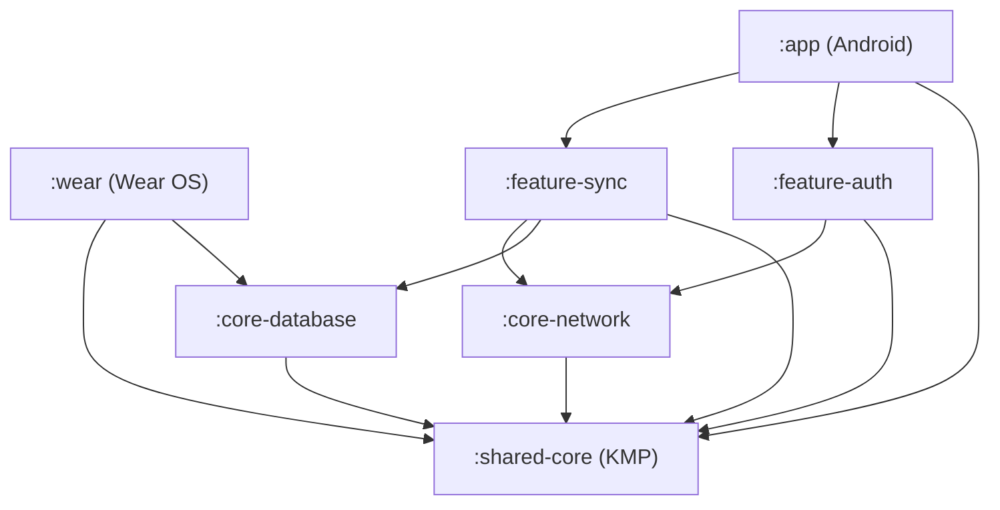
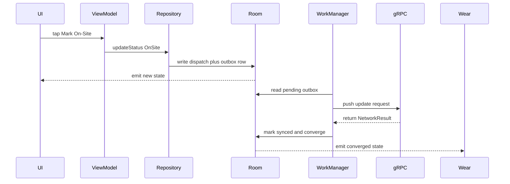
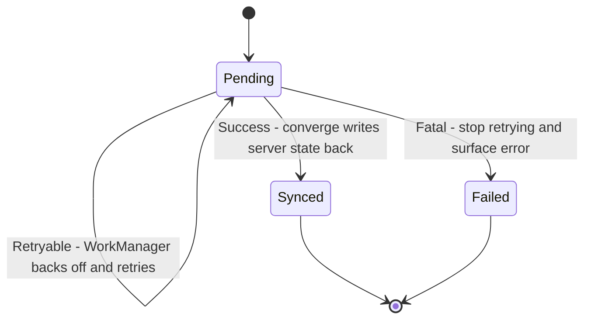

# Lecture 1 — From lab modules to a release candidate

> "You have built every piece. This week the only thing left to learn is the seams — and the seams are where senior engineering lives."

This is the lecture that turns twenty-two weeks of separate modules into one system you can defend on a whiteboard. The framing for the build half of the capstone is one sentence: **the Field-Force Companion is not new code, it is the right wiring of code you already wrote, and the grade is in the seams.** Hold that, and every decision this week has a clean home: where the source of truth lives, which way the module dependencies point, who owns the offline queue, and how a single write travels from a tap to a watch complication. Lose it, and you will rebuild modules you already have and run out of week.

We build the integration model top-down: first the system and its module graph, then the dependency directions that keep it sane, then offline-first as a *system property* rather than a feature, then the trace-one-write discipline that proves the wiring, and finally the release-candidate checklist that the build week ends on. Lecture 2 takes the form factors and the release mechanics; this lecture is the spine.

---

## 1. What we are building, in one paragraph

The **Field-Force Companion** is an offline-first Jetpack Compose application for a fictional field-operations team — think utility-line technicians, delivery drivers, or field surveyors. A dispatcher assigns **dispatches** (a job at a location, with a status), and a field worker on a phone — and a watch on their wrist — sees the active dispatch, updates its status (`Assigned → EnRoute → OnSite → Done`), attaches a note, and the change syncs to a typed gRPC backend when the network allows. The worker is *frequently offline* — basements, rural routes, dead zones — so every write must succeed locally and sync later. That single constraint, "the worker is offline half the time and the app must never block on the network," is the architectural spine of the whole capstone. Everything else — the Wear companion, the KMP core, the WorkManager sync, the Play Integrity gate — hangs off it.

The system the syllabus specifies has **seven modules**:

```text
:shared-core    (KMP)        typed domain model, Ktor API surface, kotlinx-serialization,
                             kotlinx-coroutines flows, kotlinx-datetime time math
:app            (Android)    Compose UI, Material 3 + dynamic color, Navigation 3,
                             MVVM with StateFlow<UiState>, the Hilt graph root
:wear           (Wear OS)    Compose for Wear: one tile, one complication, one ongoing activity
:feature-sync                WorkManager periodic job, exponential backoff, network/battery
                             constraints, foreground-promotion path
:feature-auth                Play Integrity attestation at sign-in, Keystore-backed token storage
:core-network                gRPC client (grpc-kotlin), certificate pinning, structured retry,
                             typed NetworkResult sealed return
:core-database               Room with three entities, Proto DataStore for preferences,
                             schema export in source control, two migrations exercised in tests
```

Read that list as a sentence: *a shared typed core, an Android app and a Wear app that consume it, two cross-cutting feature modules (sync and auth), and two core infrastructure modules (network and database).* You have built every one of these in a prior week. The capstone is the wiring.

---

## 2. The module graph and dependency directions

The single most important diagram this week is not the UI mockup — it is the **module dependency graph**, and the single most important rule is: **dependencies point inward and downward, never sideways between features, never upward toward `:app`.** Get this wrong and you get a build that compiles but cannot be reasoned about, tested in isolation, or kept under a minute on a clean build. Get it right and each module has a job, a boundary, and a test surface.

Here is the legal graph for the capstone, as a Mermaid diagram you will commit to `docs/architecture.md`:



Three rules fall out of this graph, and an interviewer will ask you to state them:

1. **`:shared-core` depends on nothing in the project.** It is the root of the graph — pure Kotlin (KMP `commonMain`), no Android, no Hilt, no Room. Everything depends *on* it; it depends on *nothing*. This is what makes it shareable with iOS later and trivially unit-testable now. If `:shared-core` ever needs to import `android.*`, the boundary is wrong and you have leaked a platform concern into the domain.
2. **Features (`:feature-sync`, `:feature-auth`) never depend on each other.** They both depend on `:core-*` and `:shared-core`, but `:feature-sync` knows nothing of `:feature-auth`. If sync needs an auth token, it does not call `:feature-auth` — it depends on an *interface* defined in `:shared-core` (or `:core-network`) that `:feature-auth` happens to implement, wired together by Hilt in `:app`. Sideways feature dependencies are how a multi-module project rots back into a monolith.
3. **`:app` is the composition root and depends on everything; nothing depends on `:app`.** `:app` is where Hilt assembles the graph — it sees all the modules, binds the implementations to the interfaces, and is therefore the *only* place that knows the whole system. That is correct: there should be exactly one place that knows everything, and it should be the entry point, not a library.

Why enforce this with the build rather than a code-review convention? Because conventions decay and builds do not. You can make an illegal edge **fail the build** with a Gradle dependency rule (Exercise 1 walks the enforcement), so that the day a tired engineer adds `:feature-sync` → `:feature-auth` to fix something at 2 AM, the build rejects it and they find the right seam instead. A graph you can violate silently is a graph you do not actually have.

---

## 3. Offline-first as a system property, not a feature

The deepest decision in the capstone is the one you make in `:core-database` and `:shared-core` together, and it is this: **Room is the source of truth; the network is a sync target.** Not the other way around. This single inversion — "I read from disk and write to disk, and sync is a separate background process" — is what makes the app work in a basement, and it is the decision your ADR-0001 documents.

The naive design, the one every tutorial shows, is **network-first**: the UI calls the repository, the repository calls the network, the result populates the UI, and the database is a cache you fall back to when offline. This works in a demo and fails in the field, because every read and every write *blocks on the network*, and the field worker has no network. The user taps "mark On-Site," a spinner appears, and nothing happens because there is no signal. That is a broken app.

The offline-first design inverts it:

```text
WRITE PATH (local-first):
  UI tap → ViewModel → repository.updateStatus(dispatchId, OnSite)
    → write to Room IMMEDIATELY (the UI updates from the DB, instantly, offline)
    → enqueue an outbox row (a pending sync operation)
    → WorkManager picks up the outbox when constraints allow (network present)
    → gRPC pushes the change; on success, mark the outbox row synced
    → on conflict, apply the documented resolution policy (ADR-0003)

READ PATH (DB-backed Flow):
  UI observes repository.dispatches() : Flow<List<Dispatch>>
    → backed by a Room @Query that returns a Flow
    → the UI re-renders whenever the DB changes, whether the change came from
      a local write or a completed sync — one source of truth, one observer
```

Two properties make this offline-first rather than "has a cache":

- **The UI never awaits the network.** A write returns as soon as Room commits. The user sees their change instantly because the UI reads from Room and Room just changed. Sync is *eventually*, in the background, invisible.
- **There is exactly one source of truth.** The UI observes Room. The network's job is to *converge* Room with the server, not to feed the UI directly. A completed sync writes back into Room, and the same `Flow` the UI is already observing emits the converged state. No second code path, no "is this from the cache or the network" branching in the UI.

The piece that makes writes durable across offline periods is the **outbox** (sometimes called the operation queue or the pending-mutations table). When the user updates a dispatch, you do two writes in one transaction: the new dispatch state *and* an outbox row describing the operation to sync. The outbox is the WorkManager job's work list. This is the pattern Now-In-Android's `:sync` module uses, and it is the pattern your `:feature-sync` implements. The conflict question — "what if the server changed the same dispatch while we were offline" — is the subject of ADR-0003 and next week's chaos drill A; this week you commit to a policy (last-writer-wins by server timestamp, or field-level merge, or a user-facing conflict prompt) and document *why*.

The outbox row carries exactly enough to replay the operation against the server, and not the whole dispatch:

```kotlin
// :core-database — the outbox entity. Replayable, idempotent-keyed, status-tracked.
@Entity(tableName = "outbox")
data class OutboxEntity(
    @PrimaryKey(autoGenerate = true) val rowId: Long = 0,
    val dispatchId: String,
    val operation: String,           // "STATUS_UPDATE", "ADD_NOTE", ...
    val payloadJson: String,         // the serialized change (kotlinx-serialization)
    val clientOpId: String,          // a client-generated UUID for idempotency
    val enqueuedAtEpochMs: Long,
    val state: String = "PENDING",   // PENDING -> SYNCED | FAILED
    val attemptCount: Int = 0,
)
```

Two fields earn their place and an interviewer will ask why. The **`clientOpId`** is a client-generated UUID sent with the operation so the server can deduplicate: if the worker pushes an op, the network drops the *response* but the server *did* apply it, and WorkManager retries the same op, the server recognizes the `clientOpId` and does not apply it twice. Without it, a retry after a lost ack double-applies the change — a real bug in naive sync engines. The **`attemptCount`** lets the worker give up on a poisoned op after N tries rather than retrying a `Fatal` failure forever and draining the battery. These two fields are the difference between an outbox that is a correctness mechanism and one that is a footgun; they are small, and they are the kind of detail that signals you have actually operated an offline-first system rather than read about one.

---

## 4. The trace-one-write discipline

The single best way to know your integration is correct — and the single best thing to put in your architecture doc and your demo — is to **trace one write end to end** and name the owner of every hop. This is the exercise a staff engineer runs in an interview: "walk me through what happens when the user taps 'mark On-Site.'" If you can narrate every hop and say which layer owns which concern, your system is integrated; if you hand-wave a hop, that hop is where your bug lives.

Here is the canonical trace for the Field-Force Companion, the one you will document in `docs/trace-one-write.md` and demo on Friday:

```text
  1. UI            Compose: DispatchDetailScreen has a "Mark On-Site" Button.
                   onClick = { viewModel.updateStatus(OnSite) }. The UI owns ONE
                   thing: rendering state and emitting events. It does not know
                   about Room, gRPC, or the outbox.

  2. ViewModel     updateStatus() calls repository.updateStatus(id, OnSite) and
                   sets UiState to optimistic. The ViewModel owns UI state and the
                   mapping of domain models to UiState. It does NOT touch Room or
                   the network directly.

  3. Repository    DispatchRepository (interface in :shared-core, implementation
                   wired by Hilt) does the local-first write: one Room transaction
                   that (a) updates the dispatch row and (b) inserts an outbox row.
                   The repository owns the offline-first policy — the decision to
                   write locally first and sync later lives HERE, nowhere else.

  4. Room          :core-database commits the transaction. The dispatches() Flow
                   the UI is observing emits the new state. The user sees "On-Site"
                   immediately — no network involved. Room owns persistence and the
                   single source of truth.

  5. WorkManager   :feature-sync's SyncWorker is enqueued (or its periodic run is
                   already scheduled). When the network constraint is satisfied, it
                   reads the outbox, and for each pending op calls the network.
                   WorkManager owns WHEN sync runs (constraints, backoff), not WHAT.

  6. gRPC          :core-network's client sends UpdateDispatchRequest over the
                   pinned channel, returns a typed NetworkResult. The network layer
                   owns the wire format, retry, pinning, and the NetworkResult
                   contract. It does NOT know about Room or the UI.

  7. Converge      On NetworkResult.Success, the worker marks the outbox row synced
                   and writes the server's authoritative state back into Room. The
                   same dispatches() Flow emits again; if the server's value differs
                   (a conflict), ADR-0003's policy decides the winner.

  8. Wear          :wear observes the same :shared-core repository (its own Room
                   instance synced via the data layer, or a shared backend read).
                   The active-dispatch complication and tile reflect the new status.
                   The watch is a SECOND consumer of the SAME source of truth, not a
                   separate app with its own logic.
```


*The trace-one-write path: one tap travels through Room, WorkManager, and gRPC before the watch sees it.*

Notice what the trace makes obvious: **each layer owns exactly one concern, and the concerns do not leak.** The UI does not know about gRPC. The network does not know about Room. The repository is the only place that knows the offline-first *policy*. WorkManager owns *when*, the network owns *what over the wire*, Room owns *the truth*. When you can say that sentence about your own code, you have built a system; when you cannot, you have built a pile of modules that happen to compile together.

---

## 5. Where Hilt assembles the seams

The module graph (§2) says who *may* depend on whom; Hilt is how the dependencies are actually *supplied*. The discipline that keeps the graph clean is **depend on interfaces, bind implementations in `:app`.** Concretely:

- `:shared-core` declares `interface DispatchRepository`. It is pure Kotlin; it has no idea Room or gRPC exist.
- `:core-database` and `:core-network` provide the pieces (`DispatchDao`, `DispatchGrpcClient`).
- A `DispatchRepositoryImpl` (living in a data module, or in `:feature-sync` depending on how you slice it) implements the interface using the DAO and the client.
- `:app`'s Hilt module `@Binds` the implementation to the interface. **`:app` is the only module that knows the implementation exists.**

```kotlin
// in :shared-core — pure Kotlin, no Android, no Hilt
interface DispatchRepository {
    fun dispatches(): Flow<List<Dispatch>>
    suspend fun updateStatus(id: DispatchId, status: DispatchStatus): Result<Unit>
}

// in the data layer — the implementation, using the DAO + client
class DefaultDispatchRepository(
    private val dao: DispatchDao,
    private val client: DispatchClient,
    private val clock: Clock,                 // kotlinx-datetime, injected for testability
) : DispatchRepository {

    override fun dispatches(): Flow<List<Dispatch>> =
        dao.observeDispatches().map { rows -> rows.map(DispatchEntity::toDomain) }

    override suspend fun updateStatus(id: DispatchId, status: DispatchStatus): Result<Unit> =
        runCatching {
            // local-first: ONE transaction, dispatch + outbox, then return.
            dao.withTransaction {
                dao.updateStatus(id.value, status.name, updatedAt = clock.now())
                dao.enqueueOutbox(OutboxEntity.statusUpdate(id, status, clock.now()))
            }
            // the UI already updated from the Flow; sync happens in the background.
        }
}

// in :app — the ONLY place that binds the implementation to the interface
@Module
@InstallIn(SingletonComponent::class)
abstract class RepositoryModule {
    @Binds
    abstract fun bindDispatchRepository(impl: DefaultDispatchRepository): DispatchRepository
}
```

The payoff of this discipline: the `ViewModel` depends on `DispatchRepository` (the interface from `:shared-core`), so it is testable with a fake repository and knows nothing about Room or gRPC; the Wear app can inject a *different* implementation if it needs to; and the day you add an iOS app, `:shared-core` already exposes the interface and the iOS module provides its own implementation. The interface is the seam, and the seam is in the dependency-free module. That is not an accident — it is the whole reason `:shared-core` depends on nothing.

---

## 6. The NetworkResult seam and the converge step

The seam between the network and the rest of the system is the typed `NetworkResult` sealed type you built in Week 15, and getting it right is what keeps the offline-first guarantee honest. The rule is: **the network returns a `NetworkResult`, never throws across the layer boundary, and the sync layer — not the UI — decides what each outcome means.** A gRPC call can fail a dozen ways (no network, a deadline exceeded, an `UNAUTHENTICATED` status, a malformed response), and if any of those throws up into the `ViewModel`, you have leaked a transport concern into the UI and broken the offline-first promise.

```kotlin
// :shared-core (or :core-network) — the typed return the whole system speaks.
sealed interface NetworkResult<out T> {
    data class Success<T>(val value: T) : NetworkResult<T>
    data class Retryable(val cause: Throwable) : NetworkResult<Nothing>   // try again later
    data class Fatal(val cause: Throwable) : NetworkResult<Nothing>       // don't retry; surface
}
```

The distinction between `Retryable` and `Fatal` is load-bearing for the sync engine. A `Retryable` (no network, a timeout, a 503) means "the outbox row stays pending; WorkManager backs off and tries again." A `Fatal` (a malformed request, a permanent `UNAUTHENTICATED` after a token refresh, a 4xx that won't change on retry) means "this op will never succeed as-is; record it, surface it, and stop retrying so we don't burn battery forever." Conflating the two is a classic capstone bug: treat every failure as retryable and a poisoned outbox row retries forever; treat every failure as fatal and a momentary network blip drops a legitimate write.

The **converge step** is where a successful sync writes the server's authoritative state back into Room:

```kotlin
// :feature-sync — draining one outbox op, then converging.
suspend fun syncOne(op: OutboxEntity) {
    when (val result = client.pushStatus(op.dispatchId, op.newStatus)) {
        is NetworkResult.Success -> dao.withTransaction {
            // converge: the server's authoritative dispatch overwrites local,
            // applying ADR-0003's policy if they differ (a conflict).
            dao.upsert(result.value.toEntity())
            dao.markOutboxSynced(op.id)
        }
        is NetworkResult.Retryable -> { /* leave the outbox row; WorkManager retries */ }
        is NetworkResult.Fatal -> dao.markOutboxFailed(op.id, result.cause.message)
    }
}
```


*How an outbox row moves from pending to synced or failed based on the NetworkResult outcome.*

Notice the conflict is handled *here*, at converge, not at write time. When the user updated the dispatch offline and the server changed the same dispatch in the meantime, the converge step is the moment the two versions meet, and ADR-0003's policy (last-writer-wins by server timestamp, in the reference design) decides the winner. This is exactly the seam next week's chaos drill A drives — two devices editing offline, reconnecting, converging — so building it cleanly now is building the thing the drill tests. The UI never sees any of this: it observes the `dispatches()` Flow, and when converge writes the resolved state, the Flow emits the winner. One source of truth, one observer, conflict resolved in one documented place.

---

## 7. What "release candidate" means, and the checklist this week ends on

A module *works* when its tests pass. A system is a *release candidate* when it survives the combination, is built the way Play will serve it, and is locked so the final week is delivery, not construction. The difference is a checklist, and this is the one the build week ends on. Every item is a thing a senior reviewer checks before a launch, and every item is a thing you can finish this week.

```text
RELEASE-CANDIDATE CHECKLIST (the build-week gate)

  BUILD
  [ ] :app:bundleRelease produces a SIGNED AAB (Play App Signing enrolled,
      upload key configured) — not a debug build, not an unsigned bundle.
  [ ] R8 full mode is ON in the release variant; the build has no "missing
      keep rule" warnings; the APK analyzer confirms shrinking happened.
  [ ] minifyEnabled + shrinkResources true; the keep rules for gRPC,
      kotlinx-serialization, and Room are present and minimal.
  [ ] :wear:assembleRelease produces a SIGNED Wear OS APK.

  PERFORMANCE
  [ ] A Baseline Profile is generated, packaged in the release variant, and
      VERIFIED to cut cold start by >= 20% via macrobenchmark.

  CORRECTNESS
  [ ] The full test suite is GREEN ON CI: unit (Turbine + MockK), Robolectric
      (the DAO + migrations), Compose UI test (the dispatch screen), Paparazzi
      (the Material 3 states), one Espresso end-to-end smoke.
  [ ] The two Room migrations are exercised in tests; the schema export is in
      source control.

  INTEGRATION
  [ ] A write traces end to end (trace-one-write.md): UI → VM → repo → Room →
      WorkManager → gRPC → converge → Wear, owner named at each hop.
  [ ] The Wear tile, complication, and ongoing activity read the SAME
      :shared-core repository the phone reads.
  [ ] The Play Integrity sign-in gate produces a clear message + documented
      fallback on attestation failure (no silent fail-open, no brick).

  DELIVERY
  [ ] The signed AAB is UPLOADED to a Play Console internal track.
  [ ] Tagged v1.0.0-rc1; the app is feature-frozen after the tag.

  DOCUMENTATION
  [ ] docs/architecture.md has the Mermaid module + data-flow diagram.
  [ ] Four ADRs: offline-first source of truth, conflict policy, KMP boundary,
      attestation/fallback design.
  [ ] The pre-submission readiness audit is committed and ALL-PASS.
```

Read that checklist as the definition of "done" for the week. If every box is checked Sunday, next week is the launch you earned — submit to the closed track, run the chaos drills, sit the interviews — with a known-good artifact under you. If boxes are open, *that* is your homework, and finding it Sunday is the entire point of building the RC early. The crunch this course is named to avoid is the team that discovers on submission day that R8 stripped a gRPC reflection class or the Baseline Profile never packaged; you find it this week, with a week to fix it.

---

## 7. The trap of the build week: building instead of integrating

The most common failure of a capstone build week is not a hard bug — it is **rebuilding a module you already have because integrating the real one is harder than rewriting a toy.** You hit a Hilt error wiring `:core-network` into `:feature-sync`, and instead of debugging the seam, you write a quick in-memory fake "just to get the screen working," and now you have two sync paths and neither is the real one. By Friday you have a beautiful demo of a system that does not exist.

The discipline is: **integrate the real module, debug the real seam, and if a module is genuinely not ready, cut its scope rather than fake it.** The Field-Force Companion spec is generous about scope — three entities, two migrations, one tile, one complication — precisely so you can build the *real* thing small rather than a *fake* thing large. A real offline-first write through real Room and a real gRPC stub beats a fake write through a mock every time, because the real one is the thing the chaos drill will test next week and the thing the interviewer will ask about.

If you find yourself this week learning a new library, generating a new module type, or writing a "temporary" fake that the real system will route around, stop. You are gold-plating, and gold-plating is how a build week becomes a build-and-a-half week. The grade is integration, and integration is wiring what you have, not building what you do not.

---

## Where this lands

By the end of this lecture you should be able to draw the seven-module graph from memory, state the three dependency rules, explain why Room is the source of truth and the network is a sync target, and narrate one write through eight hops naming the owner of each. Lecture 2 takes the form factors and the release mechanics — the Wear companion against the shared core, the Play Integrity gate done so it never bricks, the Baseline Profile, R8 and signing, and the ADRs — so that by Sunday you have not just an integrated system but a *locked, signed, audited release candidate* on the internal track. The spine is this lecture; the polish is the next; the lock is the challenge.
