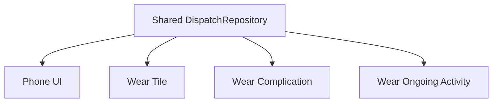
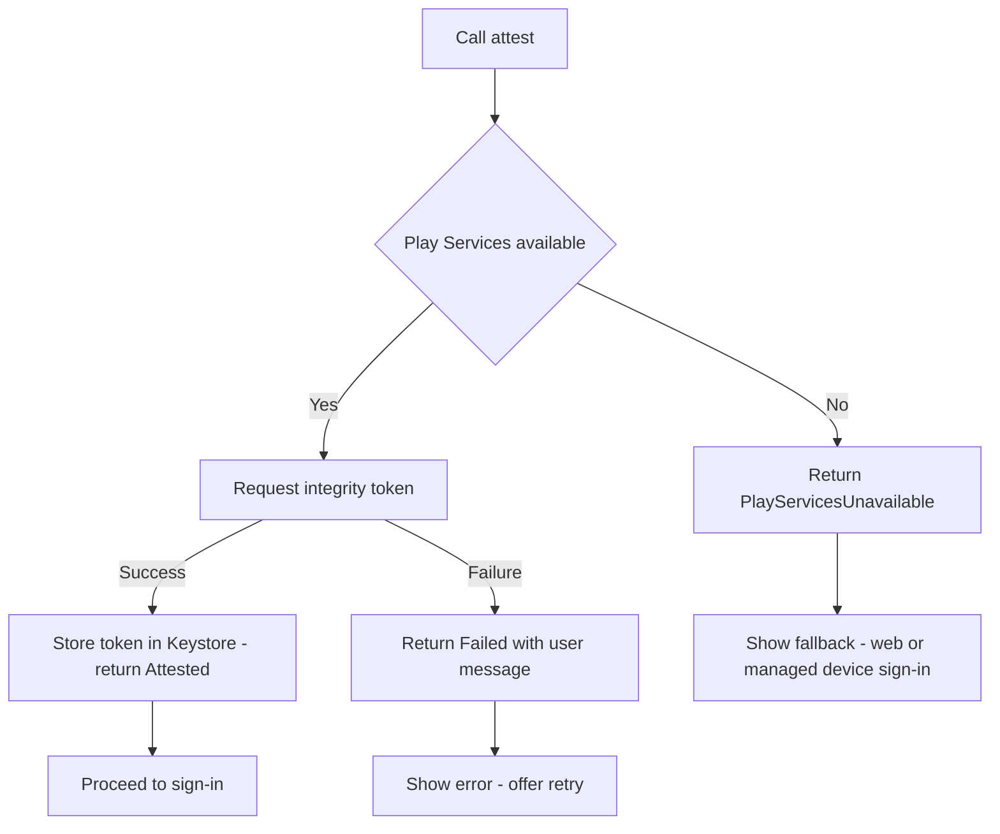

# Lecture 2 — Wiring the form factors and the release candidate

> "A second form factor is not a second app. It is a second *reader* of the same source of truth — and if it isn't, you built two apps and only graded one."

Lecture 1 gave you the spine: the seven-module graph, offline-first with Room as the source of truth, the trace-one-write, and the release-candidate checklist. This lecture wires the rest and locks it. We do four things. First, the **Wear OS companion** against the shared core — the tile, the complication, the ongoing activity — done so they consume the same repository the phone consumes rather than reinventing it. Second, the **Play Integrity sign-in gate**, done so an attestation failure produces a clear message and a documented fallback instead of a silent fail-open or a brick. Third, the **release mechanics** — the Baseline Profile, R8 and the keep rules your reflection-heavy code needs, and the signing config — that turn a debug build into a release-candidate AAB. Fourth, the **ADRs and the architecture diagram** that make the system defensible in an interview. By the end you have everything the build-week gate needs.

---

## 1. The Wear companion as a second reader, not a second app

The capstone requires a `:wear` module with **one tile, one complication, and one ongoing activity**, and the grade is not "does the watch show something" — it is "does the watch read the *same domain* the phone reads." The architectural test is simple: if you can change the active dispatch on the phone and the watch's complication reflects it (within the sync window), the form factors share a source of truth; if the watch has its own hand-rolled dispatch model and its own network calls, you built two apps and the KMP split earned nothing.

The right design has `:wear` depend on `:shared-core` (the domain and the repository interface) and `:core-database` (its own Room instance, kept in sync via the data layer, or a direct backend read for a small dataset). The Wear UI is thin: a `ScalingLazyColumn` of dispatches, built with Compose for Wear, reading the same `DispatchRepository.dispatches()` Flow the phone reads. The three Wear surfaces are each a *view* of that same data:

```kotlin
// :wear — the main list, Compose for Wear, reading the SHARED repository.
@Composable
fun WearDispatchList(viewModel: WearDispatchViewModel = hiltViewModel()) {
    val state by viewModel.uiState.collectAsStateWithLifecycle()
    ScalingLazyColumn(
        modifier = Modifier.fillMaxSize(),
        horizontalAlignment = Alignment.CenterHorizontally,
    ) {
        item { ListHeader { Text("Dispatches") } }
        items(state.dispatches, key = { it.id.value }) { dispatch ->
            DispatchChip(
                dispatch = dispatch,
                onAdvance = { viewModel.advanceStatus(dispatch.id) },  // same write path as phone
            )
        }
    }
}
```

### The tile

A **tile** is a glanceable, swipe-to surface that does not run your full app. It renders from a `TileService` and refreshes on a schedule or on request. The active-dispatch tile shows the one in-progress dispatch and a "mark done" action:

```kotlin
// :wear — the active-dispatch tile. It reads the shared repository, then builds
// a static-ish layout the system renders. It does NOT host the live Compose tree.
class ActiveDispatchTileService : TileService() {

    @Inject lateinit var repository: DispatchRepository   // the SAME interface the phone uses

    override suspend fun tileRequest(requestParams: RequestBuilders.TileRequest): TileBuilders.Tile {
        val active = repository.dispatches().first().firstOrNull { it.isActive }
        return tile(active)                                // builds the tile layout from domain data
    }

    override suspend fun resourcesRequest(
        requestParams: RequestBuilders.ResourcesRequest
    ): ResourceBuilders.Resources = resources()

    // request a refresh when the dispatch changes (the worker or the UI calls this)
    companion object {
        fun requestUpdate(context: Context) =
            getUpdater(context).requestUpdate(ActiveDispatchTileService::class.java)
    }
}
```

The detail that proves the integration: when a sync completes and Room changes, *something* must call `ActiveDispatchTileService.requestUpdate(context)` so the tile re-reads. That call is the seam between the data layer and the Wear surface, and naming it in your trace-one-write doc (hop 8) is how you show the watch is a second reader, not a second app.

### The complication

A **complication** is a tiny data slot on the system watch face — a number, an icon, a short string. The active-dispatch complication exposes "3 dispatches, 1 on-site" to whatever watch face the user runs. It is a `ComplicationDataSourceService`:

```kotlin
// :wear — the complication data source. The system polls it; it returns domain
// data shaped as a ComplicationData. Same repository, third view of the data.
class DispatchComplicationService : SuspendingComplicationDataSourceService() {

    @Inject lateinit var repository: DispatchRepository

    override suspend fun onComplicationRequest(request: ComplicationRequest): ComplicationData {
        val dispatches = repository.dispatches().first()
        val active = dispatches.count { it.isActive }
        return ShortTextComplicationData.Builder(
            text = PlainComplicationText.Builder("$active").build(),
            contentDescription = PlainComplicationText.Builder("$active active dispatches").build(),
        ).build()
    }

    override fun getPreviewData(type: ComplicationType): ComplicationData =
        ShortTextComplicationData.Builder(
            text = PlainComplicationText.Builder("2").build(),
            contentDescription = PlainComplicationText.Builder("active dispatches").build(),
        ).build()
}
```

### The ongoing activity

An **ongoing activity** surfaces an in-progress task — an active dispatch the worker is currently on — as a persistent, glanceable status on the watch (and a chip on the phone's lock screen). It rides on a foreground-service notification and is the Wear analogue of the foreground-promotion path your `:feature-sync` already has. When a dispatch goes `OnSite`, you start an ongoing activity; when it goes `Done`, you stop it. This is the third Wear surface, and it ties directly to the active-dispatch state — one more view of the same truth.

The lesson across all three: **a tile, a complication, and an ongoing activity are three glances at one repository.** They differ in *rendering surface* and *refresh model*, not in *where the data comes from*. If your Wear module has its own `DispatchModel` and its own gRPC call, refactor it to read `:shared-core` before you do anything else — that refactor is the capstone's whole Wear lesson.


*Four surfaces, one shared repository: the phone and all three Wear surfaces read the same source of truth.*

---

## 2. The Play Integrity sign-in gate, done so it never bricks

The capstone gates sign-in with **Play Integrity attestation**: before the backend trusts a sign-in, the app requests an integrity token, the backend decrypts and verifies the verdict, and only an attested device gets a session. This is `:feature-auth`, backed by Keystore token storage. The single most important design decision here is the one the syllabus calls out explicitly and next week's chaos drill C tests: **an attestation failure must produce a clear user-facing message and a documented fallback — never a silent fail-open, never a hard brick.**

Get the failure design wrong in either direction and you fail the drill:

- **Fail-open** (treat an attestation error as success) defeats the entire point of attestation — an attacker on a compromised device sails through. You have a security control that is off whenever it is inconvenient, which is worse than no control because it lies about being there.
- **Hard-brick** (no attestation token → infinite spinner or a crash) takes down every legitimate user on a device without Google Play Services: a de-Googled phone, an enterprise device, an emulator. The syllabus's drill C runs exactly this — the app on an emulator without Play Services — and a brick is a failing grade.

The correct shape is a **sealed result with three outcomes and a fallback path**:

```kotlin
// :feature-auth — the attestation result is a sealed type with EXACTLY the
// outcomes the UI must handle. No boolean: a boolean can't carry the message.
sealed interface AttestationResult {
    data class Attested(val token: AttestationToken) : AttestationResult
    data class Failed(val reason: AttestationFailure, val userMessage: String) : AttestationResult
    data object PlayServicesUnavailable : AttestationResult   // the drill-C device
}

enum class AttestationFailure { NetworkError, VerdictRejected, Timeout }

class PlayIntegrityGate(
    private val integrity: IntegrityManagerProvider,   // wraps the Play Integrity client
    private val tokenStore: KeystoreTokenStore,         // Keystore-backed, :feature-auth
) {
    suspend fun attest(nonce: String): AttestationResult {
        if (!integrity.isPlayServicesAvailable()) {
            // documented fallback: a Play-Services-less device cannot attest.
            // We do NOT fail open. We surface the limitation and offer the fallback.
            return AttestationResult.PlayServicesUnavailable
        }
        return runCatching { integrity.requestToken(nonce) }
            .fold(
                onSuccess = { token ->
                    tokenStore.put(token)               // store in Keystore-backed storage
                    AttestationResult.Attested(token)
                },
                onFailure = { e ->
                    AttestationResult.Failed(
                        reason = e.toAttestationFailure(),
                        userMessage = "We couldn't verify this device. Check your " +
                            "connection and try again, or sign in on a managed device.",
                    )
                },
            )
    }
}
```

And the UI handles all three outcomes explicitly — the compiler enforces it because the type is sealed:

```kotlin
when (val result = gate.attest(nonce)) {
    is AttestationResult.Attested ->
        proceedToSignIn(result.token)
    is AttestationResult.Failed ->
        showError(result.userMessage, retryable = true)            // clear message, retry
    AttestationResult.PlayServicesUnavailable ->
        showFallback(                                              // documented fallback path
            "This device can't use device verification. " +
                "Use the web sign-in or a managed device.",
            fallbackAction = ::openWebSignIn,
        )
}
```


*Attestation never fails open or bricks: every branch ends in a message or a documented fallback.*

The Keystore side of `:feature-auth` is the token storage from Week 22: the session token lives in a Keystore-backed encrypted store, not in plain `SharedPreferences`, so a rooted device or a backup extraction does not yield a usable token. The attestation gate and the encrypted token store are the two halves of `:feature-auth`, and ADR-0004 documents both decisions: *we attest at sign-in, we store the token in Keystore, and an attestation failure surfaces a message + a web/managed-device fallback rather than failing open or bricking.* When the chaos drill runs the app on a Play-Services-less emulator next week, this design is what makes it degrade gracefully — and the `PlayServicesUnavailable` branch is the line of code that earns the drill.

---

## 3. The Baseline Profile: the cold-start lever

The capstone requires a **Baseline Profile that cuts cold-start time by at least 20%**, generated, packaged, and demonstrated. You built this workflow in Week 18; here you apply it to the real app's cold-start path. The mechanism, briefly, so you can defend it: a Baseline Profile is a list of the classes and methods exercised during a critical user journey, shipped in the AAB, that the runtime uses to **ahead-of-time compile** those methods at install time instead of interpreting them on first run. Cold start is the journey most worth profiling because it is the only first impression you get.

The workflow:

```kotlin
// :baselineprofile module — a macrobenchmark that drives the cold-start journey.
// The baselineprofile Gradle plugin runs this to GENERATE the profile.
@RunWith(AndroidJUnit4::class)
class BaselineProfileGenerator {
    @get:Rule val rule = BaselineProfileRule()

    @Test
    fun generate() = rule.collect(packageName = "com.crunch.fieldforce") {
        pressHome()
        startActivityAndWait()                 // cold start to the dispatch list
        // exercise the critical path the profile should cover:
        device.findObject(By.res("dispatch_list")).fling(Direction.DOWN)
        device.findObject(By.text("Mark On-Site"))?.click()
    }
}
```

And the verification — a separate macrobenchmark that *measures* cold start with and without the profile:

```kotlin
@RunWith(AndroidJUnit4::class)
class StartupBenchmark {
    @get:Rule val rule = MacrobenchmarkRule()

    @Test
    fun startupWithProfile() = rule.measureRepeated(
        packageName = "com.crunch.fieldforce",
        metrics = listOf(StartupTimingMetric()),
        iterations = 10,
        startupMode = StartupMode.COLD,
        compilationMode = CompilationMode.Partial(),   // uses the packaged Baseline Profile
    ) {
        pressHome()
        startActivityAndWait()
    }
}
```

You run the benchmark with `CompilationMode.None()` (no profile) and `CompilationMode.Partial()` (profile applied), and the README records the delta. The capstone bar is ≥20% improvement on `timeToInitialDisplay`. If your profile does not move the needle, the usual cause is that the journey you collected does not match the journey users actually run — the generator must exercise the *real* cold-start path (the dispatch list), not a splash screen.

---

## 4. R8, the keep rules, and the signing config

R8 in **full mode** shrinks, optimizes, and obfuscates the release build. It is on by default in the release variant, and it is where reflection-heavy code breaks if you do not give it keep rules. The Field-Force Companion has three reflection-heavy dependencies, and each needs a minimal keep rule — *minimal*, because the temptation under deadline is to `-keep class ** { *; }` and disable R8 in frustration, which throws away the shrinking and the Baseline Profile's value with it.

```proguard
# proguard-rules.pro — minimal keep rules for the capstone's reflective libraries.

# kotlinx.serialization: keep the generated serializers and the @Serializable types'
# companion serializer accessors. The serialization plugin emits most rules; these
# cover the wire-format domain types in :shared-core.
-keepattributes *Annotation*, InnerClasses
-dontnote kotlinx.serialization.**
-keepclassmembers @kotlinx.serialization.Serializable class ** {
    *** Companion;
    *** serializer(...);
}

# gRPC / protobuf: keep the generated message classes and the stub. grpc-kotlin's
# stubs reflect over generated descriptors.
-keep class com.crunch.fieldforce.proto.** { *; }
-keep class io.grpc.** { *; }

# Room: Room's generated code is R8-safe, but keep the entities' no-arg paths and
# any @TypeConverter referenced reflectively.
-keep @androidx.room.Entity class * { *; }
```

Two disciplines around this:

1. **Read the missing-rules report, do not guess.** R8 writes a `missing_rules.txt` when it strips something a `-dontwarn` would have suppressed; the AAB analyzer (`Build ▸ Analyze APK`) shows what actually shipped. If sign-in crashes only in release, R8 stripped a class the reflective code needs, and the report names it. Add the *narrowest* keep rule that fixes it.
2. **Test the release artifact, not the debug build.** A bug that only appears under R8 will not show in your debug runs. Build the AAB, generate APKs with `bundletool`, and run *that* — the exact bytes Play will serve. The Espresso smoke test in the release variant is your guard.

The **signing config** completes the RC. You enroll in **Play App Signing** (Google holds the app-signing key; you hold the upload key), so the AAB you upload is signed with your upload key and Play re-signs with the app key it manages. The signing config in `:app`'s build script references the upload keystore via properties (never the keystore password in source control), and `:app:bundleRelease` produces the signed AAB. The Wear APK gets its own (or a shared) signing config and `:wear:assembleRelease`.

```kotlin
// :app/build.gradle.kts — release signing wired from properties, not hard-coded.
android {
    signingConfigs {
        create("release") {
            storeFile = file(providers.gradleProperty("UPLOAD_STORE_FILE").get())
            storePassword = providers.gradleProperty("UPLOAD_STORE_PASSWORD").get()
            keyAlias = providers.gradleProperty("UPLOAD_KEY_ALIAS").get()
            keyPassword = providers.gradleProperty("UPLOAD_KEY_PASSWORD").get()
        }
    }
    buildTypes {
        release {
            isMinifyEnabled = true
            isShrinkResources = true
            signingConfig = signingConfigs.getByName("release")
            proguardFiles(getDefaultProguardFile("proguard-android-optimize.txt"), "proguard-rules.pro")
        }
    }
}
```

The credentials live in `~/.gradle/gradle.properties` or CI secrets, never in the repo. `grep -ri "STORE_PASSWORD\|KEY_PASSWORD" . --include=*.kts --include=*.properties` over a tracked path must return only the *property names*, never values. A leaked signing key is a security incident, not a style nit, and the audit checks for it.

---

## 5. The ADRs and the architecture diagram

The last build-week artifact is the **documentation that makes the system defensible**: four Architecture Decision Records and a Mermaid architecture diagram. These are not busywork — they are what turns "I built an app" into "I made and can defend a set of architectural decisions," which is the exact thing a senior interview probes.

An ADR is short and has four parts: the **decision**, the **alternatives considered**, the **trade-off**, and the **consequence you accept**. The four the capstone requires:

```text
ADR-0001 — Room is the source of truth; the network is a sync target.
  Decision:    Local-first writes; the UI reads only from Room; sync is background.
  Alternatives: Network-first (cache fallback); a single in-memory store.
  Trade-off:   We accept eventual consistency and an outbox table in exchange for a
               UI that never blocks on the network — the field worker is offline half
               the time.
  Consequence: Conflicts are possible (ADR-0003 handles them); the DB schema carries
               sync metadata (updatedAt, an outbox).

ADR-0002 — The :shared-core boundary: domain + API surface in KMP, nothing else.
  Decision:    Domain model, repository interfaces, Ktor API surface, serialization,
               and time math live in commonMain; UI, Room, Hilt, gRPC stay platform-side.
  Alternatives: Share the UI (Compose Multiplatform); share nothing.
  Trade-off:   We accept duplicated wiring per platform in exchange for a dependency-free,
               trivially testable, iOS-ready domain core.
  Consequence: :shared-core depends on nothing; platform modules provide implementations.

ADR-0003 — Conflict resolution: last-writer-wins by server timestamp (+ a flag).
  Decision:    On a sync conflict, the later server timestamp wins; the loser is
               recorded so the chaos drill can show it.
  Alternatives: Field-level merge; a user-facing conflict prompt.
  Trade-off:   We accept a possible lost same-field edit in exchange for deterministic,
               explainable convergence — and we make the loss visible, not silent.
  Consequence: Drill A (offline-sync conflict) demonstrates and measures this policy.

ADR-0004 — Play Integrity gates sign-in; failure surfaces a message + fallback.
  Decision:    Attest at sign-in; store the token in Keystore; an attestation failure
               shows a clear message and a web/managed-device fallback.
  Alternatives: Fail open on error; hard-require attestation (brick without Play Services).
  Trade-off:   We accept a fallback sign-in path in exchange for never failing open and
               never bricking a Play-Services-less device.
  Consequence: Drill C (attestation failure) demonstrates the graceful degradation.
```

The **architecture diagram** is the Mermaid module-and-data-flow graph from Lecture 1 §2, committed to `docs/architecture.md`, plus the trace-one-write path overlaid or written beside it. The test of a good diagram is that you can hand it to a peer and they can predict where any given concern lives — and that when the interviewer asks "where does conflict resolution happen," you point at the repository box and cite ADR-0003 without hesitation.

A practical note on ADR discipline: ADRs are **append-only and immutable**. You do not edit ADR-0001 when you change your mind in week 24 — you write ADR-0005 that *supersedes* it and says so. This matters because the value of an ADR log is the *history* of why the system is the way it is, including the decisions you later reversed. An interviewer who asks "would you do anything differently" is delighted by an engineer who can say "I made this call for these reasons, and here is the ADR where I superseded it and why" — that is the sound of someone who learns in public. Write the four required ADRs this week; if a chaos-drill finding next week changes one, supersede it then, and leave the original standing as the record of what you knew when.

The four ADRs together tell the capstone's whole story in two pages: an app that writes locally and syncs in the background (0001), with a domain core shareable to iOS (0002), that converges deterministically under conflict (0003), and that verifies its devices without ever locking out a legitimate user (0004). If you can read those four aloud and defend each trade-off, you have done the thing the capstone exists to teach — not "I can use Compose," but "I made a coherent set of architectural decisions and I can defend the seams between them." That is the senior-engineer competence, and it is what the final week's interviews probe directly.

---

## Where this lands

You can now wire the Wear companion as a third and fourth reader of the same repository the phone reads, gate sign-in with Play Integrity in a way that degrades gracefully on a Play-Services-less device, package a verified Baseline Profile, ship a signed R8-optimized AAB, and document the four decisions that make the system defensible. With Lecture 1's spine and this lecture's polish, the build-week gate is reachable: a locked `v1.0.0-rc1` on the internal track, green on CI, audited PASS. The challenge this week is to actually lock it. Next week — the final week — you break it on purpose with the three chaos drills, submit it to the closed track, and defend every one of these decisions live in four senior-Android interviews. You built the thing; next week you ship it and prove it survives.
