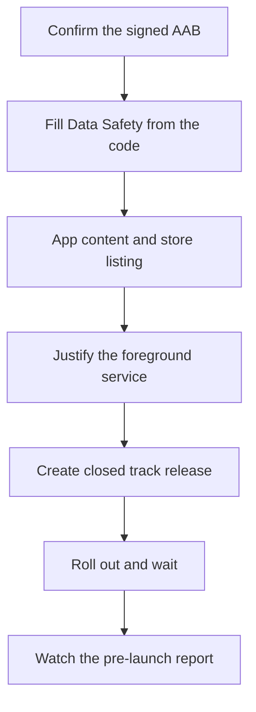
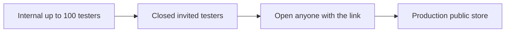

# Lecture 1 — Play submission and shipping to the closed track

> "Play review confirms your app launches and follows the rules. It does not confirm your app survives a real failure. Today is the gate; the chaos drill is the proof."

This is the lecture that gets your locked release candidate through Google's gate and onto real devices. The framing for the submission half of the final week is one sentence: **submit early, walk in clean, and pre-empt the rejections that actually happen — because the review queue is an external dependency you do not control.** Hold that, and the week has slack for the chaos drills and the interviews; lose it, and a Friday rejection eats your weekend and your launch.

We build the lecture in three parts. First, **what Play review actually enforces** — the policies with teeth, the ones that reject apps, distinct from the long list it never checks. Second, the **submission mechanics** — the Data Safety form, the foreground-service-type justification, the target-API requirement, the permissions declaration, and Play App Signing. Third, the **closed-track staged rollout** — the track taxonomy, the pre-launch report, and the halt criteria a senior engineer ships with. By the end you can submit Monday and land on the first try.

---

## 1. What Play review really checks (and what it never does)

Play review is not a code review. No human reads your `ViewModel`. What review actually enforces is a finite, knowable set of **policies**, plus an automated **pre-launch report** that runs your app on real devices and flags crashes and accessibility issues. The single biggest reason teams get rejected is not a hard policy violation — it is a *mismatch* between what they declared and what the app does. Get the declarations right and you land on the first try.

The policies with teeth, the ones that reject capstone-shaped apps:

- **Data safety accuracy.** The Data Safety form (§2) is a declaration of what data your app collects, what it shares, and how it secures it. Review cross-checks the form against the app's observable behavior and the SDKs it bundles. If you declare "collects no data" but bundle Firebase/Crashlytics (which collects a device identifier and crash data), that is a mismatch and a rejection. The fix is to declare honestly, not to under-declare.
- **Foreground service justification.** Since Android 14, a foreground service must declare a *type*, and Play requires a justification for that type at submission. Your `:feature-sync` promotes to a foreground service when the user opens the app mid-sync — that is a `dataSync` (or `shortService`) type, and you must justify it: "we promote an in-progress sync to foreground so a user who opened the app to check a dispatch sees the sync complete rather than being killed by the OS." A foreground service with no justification, or the wrong type, is rejected.
- **Permissions.** Review checks that the permissions you *declared* in the manifest are the ones you *use*, and that sensitive permissions (location, all-files-access, exact-alarm) have a justification. The capstone should declare only what it uses; an unused `ACCESS_FINE_LOCATION` left over from a tutorial is a rejection waiting to happen.
- **Target API level.** Play enforces a minimum `targetSdk` (currently API 34/35 for new apps and updates). Your RC targets 35, so this is satisfied — but it is the silent rejection that catches teams who pinned an old target "to avoid a behavior change."
- **Crashes on review / the pre-launch report.** The pre-launch report runs your app on a fleet of real devices. A crash on launch, or on the main flow, is a rejection. This is why the release-variant Espresso smoke from last week matters — it is the same path the pre-launch report exercises.

A compact way to remember the policies with teeth, the ones that reject capstone-shaped apps:

1. **Honest declarations** — Data Safety matches the code and the bundled SDKs.
2. **Justified services** — every foreground service has a declared type and a real justification.
3. **Minimal permissions** — only what you use; sensitive ones justified.
4. **Current target** — `targetSdk` meets the Play floor.
5. **Account deletion** — present, with a URL, if accounts exist.
6. **No crash** — the pre-launch report's main flow runs clean.

Hit all six and the policy half is a formality. Miss one and it is a multi-day round trip.

Pin that list above your desk for submission day. It is the difference between a launch and a queue.

What review **never** checks: your architecture, your test coverage, your code quality, whether your sync is efficient, whether your Compose recomposes the minimum. Those are *your* bar (and the capstone's), not Google's. Review is a floor, not a ceiling — clearing it means "this app is safe and honest to distribute," not "this app is good." The chaos drills and the interviews are where *good* is tested.

A useful mental model: review has two halves, and they fail differently. The **policy half** is a human-and-automation check of your declarations and your store listing against a rulebook — it fails *slowly* (a rejection days later) and *specifically* (a cited policy section). The **technical half** is the pre-launch report running your APK on real hardware — it fails *fast* (within hours of upload) and *concretely* (a stack trace on a named device). The two halves want different preparation: the policy half wants the readiness audit (§6), and the technical half wants the release-variant test suite from Week 23. A capstone that passes both did its homework on both, and the most common single-point failure is doing one and skipping the other — a flawless Data Safety form on an app that crashes on a Pixel 6 in the pre-launch report, or a rock-solid build with an under-declared SDK.

The thing that surprises engineers coming from web is how *mechanical* and *knowable* the whole process is. There is no taste involved, no reviewer who dislikes your color scheme; there is a rulebook and a device farm. That is good news: a knowable process is a beatable process. Read the rulebook (the policies with teeth), make your declarations match your code, pass the pre-launch report, and you land. The unpredictability people fear is almost always self-inflicted — a declaration that drifted from the code, a permission left over from a tutorial, a crash never tested in release.

---

## 2. The Data Safety form and the declarations that must match the code

The Data Safety form is the single most common source of capstone rejections, because it is a declaration and declarations drift from code. The discipline is: **fill it out from the code, not from memory, and re-check it whenever you add an SDK.**

Walk the form against the Field-Force Companion's actual behavior:

- **Does it collect data?** Yes — the dispatch data the worker enters, synced to your backend. Declare it: "App activity / app info," collected, and (if your backend stores it) not ephemeral.
- **Does it share data?** Sharing means sending to a *third party*. Your backend is first-party (it is yours), so dispatch data is *collected* but not *shared*. But if you bundle Crashlytics, crash data is *shared with Google* — declare it.
- **Is it encrypted in transit?** Yes — gRPC over TLS with certificate pinning. Declare "data is encrypted in transit."
- **Can the user request deletion?** If the app has accounts, you must provide a deletion path and a URL. The Field-Force Companion's sign-in (Play Integrity gated) implies an account, so a deletion path is required — this is the same account-deletion requirement that catches teams across both Play and the App Store.

The fix for every Data Safety rejection is the same: **declare honestly, and make the code match the declaration.** If you do not want to declare a data category, remove the SDK that collects it; do not under-declare and hope. Review's automated SDK scanning will find the Firebase SDK whether you declared it or not.

The form itself walks you through a decision tree per data type. For the Field-Force Companion, your answers are:

- **Does the app collect or share any of the required user data types?** Yes — App activity (the dispatch data) and Device IDs (the FCM token).
- **Is the data collected encrypted in transit?** Yes — gRPC over TLS with certificate pinning. (A "no" here is itself a flag.)
- **Do you provide a way for users to request that their data be deleted?** Yes — the in-app account-deletion path plus a deletion-request URL.
- **For each data type: collected, shared, or both?** Dispatch data: collected (your backend), not shared. FCM token / crash data: collected and shared (Google).
- **Is each collection required or optional?** Dispatch data is required for the app to function; crash reporting is optional (and you may offer an opt-out).

Answer each from the code and the dependency list, save the section, and the form matches reality. The one trap is forgetting a *transitive* SDK — a library you added pulls in analytics you did not notice. The merged manifest and the AAB analyzer show every contributing dependency; check there, not just your top-level `libs.versions.toml`.

A concrete pre-submission check: list every SDK in your `libs.versions.toml`, and for each, ask "what data does this collect or send." Firebase Cloud Messaging registers a token (a device identifier). Crashlytics collects crash stacks and a device model. The Play Integrity client talks to Google. Each maps to a Data Safety declaration. The form is a function of your dependency list; compute it from there.

Here is the Field-Force Companion's dependency-to-declaration map, the table you compute and keep:

```text
SDK / dependency        | data it touches              | Data Safety declaration
------------------------|------------------------------|----------------------------------
gRPC backend (yours)    | dispatch data the worker     | App activity: collected,
                        |   enters                     |   NOT shared (first-party)
Firebase Cloud Messaging| a registration token         | Device IDs: collected,
                        |   (device identifier)        |   shared with Google
Crashlytics (if used)   | crash stacks, device model,  | Crash logs + diagnostics:
                        |   OS version                 |   collected, shared with Google
Play Integrity client   | talks to Google for a verdict| per the SDK guidance
Room / DataStore (local)| local-only persistence       | NOT collected (never leaves device)
```

Two subtleties an interviewer (and a reviewer) cares about. First, **local persistence is not "collection."** Data that stays in Room on the device and never leaves is not collected for Data Safety purposes — only data that leaves the device counts. Your dispatch data is collected *because it syncs to your backend*, not because it sits in Room. Second, **first-party is not "shared."** Sending data to *your own* backend is collection, not sharing; sharing means a *third party* (Google, an analytics vendor). Getting this distinction right is the difference between an honest "collected, not shared" and an over-declared "shared" that scares your testers — or an under-declared "not collected" that gets you rejected.

---

## 3. The submission mechanics, step by step

With the declarations right, the mechanical submission is short. The sequence, which you run Monday:

```text
1. Confirm the AAB.    The signed v1.0.0-rc1 AAB from last week, on the internal
                       track and processed clean. Promote it (don't re-upload) to
                       the closed track, or upload fresh to closed — either way it's
                       the same signed bytes.

2. Data Safety.        Fill the form from the code (§2). Save and submit the section.

3. App content.        Privacy policy URL (resolves), ads declaration (none),
                       content rating questionnaire, target audience, news/COVID
                       declarations (N/A), data safety (done), government-app (N/A).

4. Foreground service. Justify the foreground-service type your sync uses (§1).

5. Store listing.      Short + full description, screenshots (phone AND Wear if you
                       list Wear), feature graphic, app icon. Screenshots must match
                       the build — a screenshot of a feature you cut is a rejection.

6. Closed track.       Create a closed-track release, add the AAB, write release
                       notes, add testers (an email list or a Google Group), set a
                       staged rollout percentage, and roll out for review.

7. Wait, watch.        Review + processing take hours to days. Watch the pre-launch
                       report (it runs in parallel) and fix any crash it flags with
                       an expedited update if needed.
```


*The seven-step submission sequence run Monday, from confirming the AAB to watching the pre-launch report.*

Two mechanics worth a closer look:

**Play App Signing.** You enrolled last week: Google holds the *app-signing key* (the one that signs the bytes users install), and you hold the *upload key* (the one you sign the AAB with before upload). This split is why a lost upload key is recoverable (Google can reset it) but a lost app-signing key historically was not — now Google holds it, so you cannot lose it. The practical consequence for the capstone: your CI signs with the upload key from a secret, uploads, and Play re-signs. Confirm the upload key fingerprint in the console matches your keystore.

**Test the artifact Play will serve.** Play does not ship your AAB; it generates per-device APKs from it (split by density, ABI, language) so each user downloads only what their device needs. The bug class this introduces: a resource or a native library that is present in the AAB but split *out* of the APK a given device gets. Catch it by generating the device APKs yourself with `bundletool` and running *those*, not your debug build:

```bash
# build the device-specific APKs from the AAB, exactly as Play would.
bundletool build-apks --bundle=app-release.aab --output=app.apks \
    --ks=upload-keystore.jks --ks-key-alias=upload
# install the right split set onto a connected device.
bundletool install-apks --apks=app.apks
# then run the release-variant Espresso smoke against THIS install.
```

This is the same discipline as testing under R8 from Week 23: the bytes that reach a user are not the bytes in your IDE, so test the real ones. The pre-launch report does this for you on Google's device farm, but running it locally first means you find a split-resource bug before you spend a review cycle on it.

**The pre-launch report.** This is Google running your *actual app* on a rack of real devices — different OEMs, OS versions, screen sizes — and reporting crashes, ANRs, accessibility issues, and security findings before review completes. It is free QA on hardware you do not own. Read it. A crash on a Samsung device you never tested, an ANR on a low-memory device, an accessibility flag on a Compose screen — each is a finding you want *before* a user hits it. The capstone's "tuned, accessibility-clean" lines are validated here.

**The foreground-service manifest.** The justification you write in the console must match the manifest. The Field-Force Companion's sync promotion declares its type:

```xml
<!-- AndroidManifest.xml — the foreground-service type the sync promotion uses. -->
<uses-permission android:name="android.permission.FOREGROUND_SERVICE" />
<uses-permission android:name="android.permission.FOREGROUND_SERVICE_DATA_SYNC" />
<uses-permission android:name="android.permission.POST_NOTIFICATIONS" />

<application ...>
    <service
        android:name=".sync.SyncForegroundService"
        android:foregroundServiceType="dataSync"
        android:exported="false" />
</application>
```

And the service starts with the matching type, or Android 14+ throws `MissingForegroundServiceTypeException` at runtime — a crash the pre-launch report will catch:

```kotlin
// :feature-sync — promoting the in-progress sync to foreground.
ServiceCompat.startForeground(
    this,
    NOTIFICATION_ID,
    buildSyncNotification(),
    ServiceInfo.FOREGROUND_SERVICE_TYPE_DATA_SYNC,   // must match the manifest type
)
```

The discipline: the *permission* (manifest), the *type* (manifest + the `startForeground` call), and the *justification* (the console) are three statements of the same fact, and review checks they agree. A mismatch — a `dataSync` manifest type started as `shortService`, or a justification that describes background work — is a rejection or a runtime crash. State it once, consistently, three places.

---

## 4. The closed track and the staged rollout

The capstone submits to a **closed track**, not production, for the same blast-radius reason the architecture review surfaces risk early: a closed track puts the build in front of a controlled cohort of testers you invited, so a bad build hits twenty people, not twenty thousand. The track taxonomy, from least to most exposure:

- **Internal** (last week) — up to 100 testers, near-instant processing, no review gate. The RC's first home.
- **Closed** (this week) — invited testers via email lists or Google Groups, a lightweight review. The capstone's target.
- **Open** — anyone with the link can join. More exposure than the capstone needs.
- **Production** — the public Play Store, with a staged rollout. Beyond the capstone's scope, but the same mechanics.


*The track taxonomy runs from least to most exposure; the capstone targets Closed.*

The closed track is where the capstone meets *real* devices in *real* conditions — testers' phones running OEM skins you never tested, older OS versions, low-memory devices, locales you never set, networks that drop. This is observability you cannot buy: a crash that only happens on a Xiaomi running MIUI on Android 13, an ANR on a 2 GB device, a sync that stalls on a carrier that aggressively kills background work. Read the per-tester feedback and the crash stream daily, and treat each finding as "what condition did that device have that mine didn't." Recruit a handful of real testers (not just yourself on an emulator) so the data is meaningful — three real testers across three OEMs surface more than thirty runs on your one device.

The F-Droid path (the no-fee fallback) trades the closed-track tester machinery for a public, reproducible-build submission. If you take it, you lose the per-cohort staged rollout and the pre-launch report, but you gain a public, GPL-3.0, reproducibly-built artifact — which is itself a strong portfolio signal. The chaos drills and the interviews are identical either way; only the distribution surface changes.

The **staged rollout** is the senior discipline even on a closed track: release to a percentage first (say 20%), watch Android vitals (crash rate, ANR rate) and the per-tester feedback, and only widen if the numbers hold. The thing that makes a staged rollout real is the **halt criteria** you commit to *before* you roll out — the production runbook's rollout-halt section:

```text
ROLLOUT HALT CRITERIA (commit before rolling out, not during an incident)

  HALT and roll back if, in the rollout cohort:
    - crash-free sessions drops below 99.0%, OR
    - the ANR rate exceeds 0.47% (Play's bad-behavior threshold), OR
    - a P0 functional regression is reported (sign-in broken, data loss,
      a dispatch that won't sync), OR
    - the Play Integrity gate starts failing for legitimate users.

  CONTINUE the rollout only if all of the above hold across at least 24h
  and 50+ sessions in the cohort.
```

The point of writing the criteria *before* the rollout is that, mid-incident, your judgment is compromised by the desire for the launch to have gone well. A pre-committed threshold ("ANR over 0.47% → halt") removes the negotiation with yourself at 11 PM. This is the same blameless, system-over-person discipline the postmortem uses (Lecture 2), applied to the rollout decision.

Here is the decision worked through, the way you'd narrate it on call:

```text
ROLLOUT DECISION LOG — Field-Force Companion v1.0.0, closed track

  T+0h   Rolled out to 20% of the closed cohort. Baseline: crash-free 100%
         (no installs yet), ANR n/a. Probes green.
  T+6h   18 sessions. Crash-free 100%. ANR 0%. Sync success 100%.
         Decision: HOLD at 20% (need 24h + 50 sessions per the criteria).
  T+18h  41 sessions. Crash-free 97.6% — ONE crash, a Samsung A-series on
         Android 13, in the dynamic-color path. Below the 99% threshold.
         Decision: HALT. Do not widen. Triage the crash.
  T+20h  Crashlytics isolated it: a dynamic-color read on a device whose OEM
         theme returned null. Fix: a null-safe fallback palette (Week 11). Shipped
         as v1.0.1. Killswitch not needed (the crash was bounded to one path).
  T+30h  v1.0.1 at 20%. 55 sessions, crash-free 100%, ANR 0.1%, 24h elapsed.
         Decision: WIDEN to 50%.
```

Notice the discipline: at T+18h the threshold said halt, so you halted — even though one crash on one device "feels" tolerable. The pre-committed number made the call, not the 11 PM optimism. And notice the fix was the *smallest* one (a null-safe palette), shipped as a point release, not a refactor. That is the launch-week temperament: hold the line, fix the one thing, widen when the numbers say so.

---

## 5. Why submit Monday: the queue is not yours

The single most important scheduling decision of the final week is to **submit Monday, not Friday.** Play review and AAB processing are an external dependency with a variable latency — sometimes an hour, sometimes days, occasionally a rejection that needs a resubmission. Every other deliverable this week depends on the submission being *done*: the chaos drills run against the live closed-track build, the walkthrough demos the reviewed app, and the interviews reference a shipped system. If you submit Friday and the review takes three days, your launch is a hope, not a fact, and a rejection has nowhere to go.

Submit Monday and the worst case is recoverable: a Tuesday rejection gives you the week to land the resubmission while you run the drills against the internal-track build in the meantime. The crunch this whole course is named to avoid is the team that submits at the last moment and prays; the discipline is to front-load the external dependency so the things you *do* control — the drills, the walkthrough, the interviews — are never blocked on the thing you do not.

This is also why the app is **feature-frozen** at the RC. New code this week is limited to pre-empting a rejection, the chaos-drill drivers, any fix a drill surfaces, and the killswitch toggles. A feature added the day before submission is the feature that crashes the pre-launch report — the exact failure the freeze exists to prevent. If a drill surfaces a real bug, you fix that bug; you do not add scope. "Stop building features and start shipping" is the discipline of a launch week, and it is a discipline because the instinct to add "just one more thing" is exactly what breaks the launch.

---

## 6. Observability before the rollout: you cannot halt on what you cannot see

A staged rollout with halt criteria is only as good as the observability behind it. Before you roll out, confirm you can actually *measure* the thresholds you committed to — crash-free sessions, ANR rate, the functional health of the sync and the gate. The capstone wires three observability surfaces, and the rollout decision reads all three:

```text
OBSERVABILITY SURFACES (confirm each works BEFORE rolling out)

  1. Android vitals (Play Console).  Crash rate, ANR rate, excessive wakeups,
     stuck partial wakelocks — the OS-level health Google computes from real
     installs. This is what defines "bad behavior" and gates featuring.
  2. Crashlytics (Firebase).         Stack traces, the crash velocity alert, the
     affected-build breakdown. This is what tells you WHICH change broke and how
     fast it's spreading.
  3. App-level signals.              Your own metrics: sync success rate, the
     re-registration success counter (drill B's detection gap), the attestation
     outcome distribution (drill C). The OS can't see these; you must emit them.
```

The third surface is the one teams forget, and it is the one the chaos drills expose. The OS knows your crash rate, but it does not know that your sync queue is backing up, that FCM re-registrations are silently failing, or that attestation is rejecting legitimate users. Those are *your* signals, and you emit them:

```kotlin
// :feature-sync — emit an app-level signal the rollout decision can read.
private fun recordSyncOutcome(outcome: SyncOutcome) {
    // a custom metric / log your dashboards aggregate. Without this, a sync
    // outage is invisible until a user complains — the drill-B detection gap.
    analytics.logEvent("sync_outcome") {
        param("result", outcome.name)               // SUCCESS | RETRYABLE | FATAL
        param("queue_depth", outboxDepth().toLong())
    }
    if (outcome == SyncOutcome.FATAL) {
        Firebase.crashlytics.recordException(outcome.cause)
    }
}
```

The reason this belongs in submission week, not earlier: the chaos drills you run mid-week are *tests of your observability* as much as your recovery. A drill where you measure recovery only because you injected the fault — and would have had no signal otherwise — has found a real gap (no detection path), and the fix is a metric like the one above. So wire the signals now, before the drills, so the drills can grade them.

## 7. The readiness audit: walk in clean

Before you click submit Monday, run the readiness audit (Exercise 1) until every row is PASS. It is the Play-specific companion to last week's pre-submission audit, and it pre-empts the rejections from §1–2:

```text
PLAY REVIEW READINESS AUDIT (all PASS before submitting)

  [ ] targetSdk meets the current Play floor (35); minSdk documented.
  [ ] Data Safety form filled from the code; every SDK's data mapped; no mismatch.
  [ ] Account deletion path + URL present (accounts exist via the sign-in gate).
  [ ] Foreground-service type declared AND justified (the sync promotion).
  [ ] Only the permissions the app USES are declared; sensitive ones justified.
  [ ] Privacy policy URL resolves; store listing screenshots match the build.
  [ ] No crash in the pre-launch report's main flow (the release-variant smoke).
  [ ] The AAB is the signed v1.0.0-rc1; Play App Signing enrolled; upload key
      fingerprint confirmed.
  [ ] No credentials in the repo; no debug logging of tokens or dispatch data.
```

Each row is a five-minute check and a multi-day rejection if missed. The audit is not bureaucracy — it is the difference between landing Monday and resubmitting Thursday. Walk in clean.

---

## 8. When review rejects you: the recovery playbook

You submitted Monday and walked in clean, and review still flagged something. This happens, and a senior engineer treats it as a routine event, not a crisis — which is exactly why you submitted early. The recovery playbook:

```text
REVIEW REJECTION RECOVERY

  1. Read the exact policy cited.   The rejection names a specific policy section
     (e.g. "5.1.1 — account deletion" or "data safety mismatch"). Do not guess;
     the citation is precise.
  2. Reproduce the finding.         If it's a crash, find it in the pre-launch
     report on the cited device. If it's a declaration, diff the form against the
     code. The finding is concrete; make it concrete on your side.
  3. Fix the SMALLEST thing.        A rejection is not an invitation to refactor.
     Fix exactly what was cited — add the deletion path, correct the form, fix the
     one crash — and nothing else. New scope is new risk on a resubmission.
  4. Resubmit with notes.           In the resubmission, note what you changed and
     where, so the reviewer can verify quickly. A clear "added in-app account
     deletion at Settings > Delete Account; updated the deletion URL" lands faster
     than a silent resubmit.
  5. Use expedited review if blocked. For a launch-blocking fix, an expedited
     review request exists. Use it sparingly; it's for real blockers.
```

The reason early submission makes this routine: a Tuesday rejection with a Wednesday resubmission still lands before Friday's walkthrough, while you run the chaos drills against the internal-track build in the meantime. The same rejection on a Friday submission eats your launch weekend. The rejection is identical; your *position* when it arrives is what early submission buys.

## 9. Play App Signing, key rotation, and what you cannot lose

One last submission concern, because it is the one that historically ended apps: the signing keys. With Play App Signing (enrolled last week), there are two keys, and knowing which is which is a senior-Android interview question:

- **The app-signing key** signs the bytes that land on users' devices. **Google holds it.** Because Google holds it, you *cannot lose it* — which is the whole point, since a lost app-signing key historically meant you could never update your app again and had to publish a new listing.
- **The upload key** signs the AAB you upload; Play verifies it, strips your signature, and re-signs with the app-signing key. **You hold it.** If you lose the upload key, it is *recoverable* — Google can reset it after identity verification — because it is not the key users trust.

The practical capstone consequence: your CI signs with the upload key from a secret, and a leaked or lost upload key is an annoyance, not an extinction event. Confirm in the console that the upload key fingerprint matches your keystore, keep the upload key in CI secrets (never the repo), and you have closed the one submission risk that used to be unrecoverable. This is also why the audit's "no credentials in the repo" row is non-negotiable: a leaked *upload* key is recoverable, but it is still a credential leak and a security incident, and the discipline is the same one you will hold on every production team — secrets live in the secret store, never in source.

## Where this lands

You can now submit the locked RC to a Play closed track and land on the first attempt — by knowing the policies with teeth (data safety, foreground service, permissions, target API, crashes), filling the Data Safety form from the code, justifying the foreground service, staging the rollout with pre-committed halt criteria, and submitting Monday so the queue never blocks your launch. The app is reviewed and live for a controlled cohort. Lecture 2 is the proof that it *survives*: the three chaos drills, the blameless postmortems, the five-minute walkthrough, and the senior-Android interviews that turn a shipped capstone into a job offer. Submission is the gate; the drill is the proof; the interview is the payoff.
